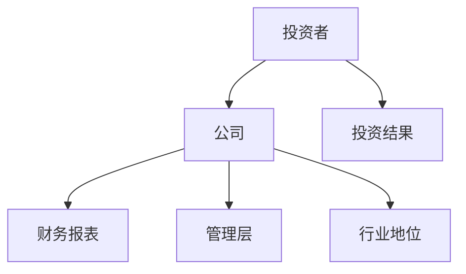
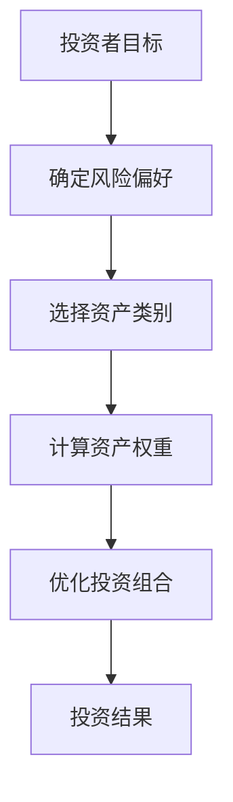
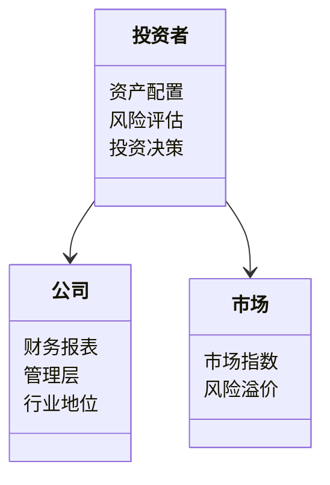

                 


# 彼得林奇的"简单明了"投资哲学

## 关键词：
彼得·林奇，投资哲学，简单明了，价值投资，风险管理，投资策略，投资系统

## 摘要：
本文深入探讨彼得·林奇的“简单明了”投资哲学，分析其核心概念、数学模型和算法实现。通过系统架构设计和项目实战，展示如何将这一哲学应用于实际投资中。文章结合背景介绍、算法原理、系统设计和案例分析，提供全面而深入的解析。

---

## 第1章: 彼得·林奇与简单明了投资哲学概述

### 1.1 彼得·林奇的背景与投资理念

#### 1.1.1 彼得·林奇的生平简介
彼得·林奇（Peter Lynch）是美国著名的职业基金经理，被誉为“股圣”。他在富达投资管理公司管理麦哲伦基金期间，取得了卓越的投资业绩。林奇的投资风格以价值投资和基本面分析著称，强调长期投资和对公司基本面的深入研究。

#### 1.1.2 简单明了投资哲学的核心理念
林奇的投资哲学可以概括为“简单明了”。他认为，投资者应该选择那些容易理解、易于分析的公司，避免复杂的业务模式和难以预测的市场波动。这种哲学强调长期持有优质股票，耐心等待其价值的实现。

#### 1.1.3 投资哲学对企业与个人的影响
简单明了的投资哲学不仅帮助投资者避免了短期市场的波动干扰，还引导投资者关注公司的基本面，选择具有长期增长潜力的企业。这种哲学对企业估值和投资决策具有重要影响，为个人投资者提供了实用的指导。

### 1.2 简单明了投资哲学的基本概念

#### 1.2.1 投资的基本问题与背景
投资的核心问题是如何在不确定的市场中实现资产的保值与增值。简单明了的投资哲学试图通过关注公司的基本面，降低市场的不确定性，从而提高投资的可预测性。

#### 1.2.2 简单明了投资哲学的定义与特点
简单明了投资哲学强调投资标的的可理解性和长期稳定性。它鼓励投资者选择那些业务模式简单、财务状况健康、管理层稳定的公司，避免复杂的业务和高风险的投机行为。

#### 1.2.3 简单明了投资哲学的边界与外延
简单明了投资哲学不仅适用于股票投资，还可以扩展到债券、基金等多种投资工具。其边界在于避免过度复杂的分析和多样化投资，确保投资组合的稳定性和可管理性。

---

## 第2章: 简单明了投资哲学的核心要素

### 2.1 投资的核心概念与联系

#### 2.1.1 核心概念原理
简单明了投资哲学的核心在于对公司基本面的深入分析。这包括对公司财务状况、盈利能力、管理层能力和行业地位的评估。通过这些分析，投资者可以识别出具有长期增长潜力的公司。

#### 2.1.2 核心概念属性特征对比表格
以下是几种核心投资标的对比分析：

| 投资标的 | 优点 | 缺点 | 适用场景 |
|----------|------|------|----------|
| 股票     | 高增长潜力 | 高风险 | 长期增值 |
| 债券     | 稳定收益 | 利息较低 | 保守投资 |
| 指数基金  | 分散风险 | 收益有限 | 长期稳定 |

#### 2.1.3 ER实体关系图架构（使用 Mermaid 流程图）


### 2.2 投资组合管理的算法原理

#### 2.2.1 现代投资组合理论（MPT）的数学模型
现代投资组合理论（MPT）由哈里·马科维茨提出，旨在通过优化投资组合来最小化风险。其数学模型如下：
$$
\text{最小化 } \sigma^2 \text{ 在 } \sum w_i r_i = R \text{ 的约束下}
$$
其中，$\sigma^2$ 是组合的方差，$w_i$ 是投资比例，$r_i$ 是各资产的期望收益，$R$ 是目标收益。

#### 2.2.2 CAPM 模型的公式与应用
CAPM（资本资产定价模型）用于计算资产的预期收益：
$$
E(r_i) = r_f + \beta_i (E(r_m) - r_f)
$$
其中，$E(r_i)$ 是资产的预期收益，$r_f$ 是无风险利率，$\beta_i$ 是资产的贝塔系数，$E(r_m)$ 是市场预期收益。

#### 2.2.3 使用 Mermaid 绘制投资组合优化流程图


---

## 第3章: 简单明了投资哲学的数学模型与算法实现

### 3.1 投资组合优化的数学模型

#### 3.1.1 投资组合优化的数学公式
投资组合优化的目标是在给定的风险水平下最大化收益，或在给定收益下最小化风险。优化公式如下：
$$
\text{最大化 } \mu_p \text{ 在 } \sigma_p^2 \leq \sigma^2 \text{ 的约束下}
$$
其中，$\mu_p$ 是组合的期望收益，$\sigma_p^2$ 是组合的方差。

#### 3.1.2 使用 Python 实现投资组合优化算法
以下是一个简单的投资组合优化代码示例：

```python
import numpy as np
import pandas as pd
from scipy.optimize import minimize

# 示例数据：资产收益和协方差矩阵
n_assets = 3
returns = np.array([0.1, 0.15, 0.08])
cov_matrix = np.array([
    [0.04, 0.02, 0.01],
    [0.02, 0.06, 0.03],
    [0.01, 0.03, 0.05]
])

# 定义优化函数
def portfolio_optimization(weights, returns, cov_matrix):
    mu = np.dot(weights, returns)
    sigma = np.sqrt(np.dot(weights.T, np.dot(cov_matrix, weights)))
    return -mu + sigma**2  # 最小化方差，等价于最大化收益

# 初始权重
initial_weights = [1/3, 1/3, 1/3]

# 使用 scipy.optimize.minimize 进行优化
result = minimize(portfolio_optimization, initial_weights, args=(returns, cov_matrix), 
                  method='SLSQP', constraints=[{'type': 'eq', 'fun': lambda w: sum(w)-1}])

# 输出结果
print("最优权重:", result.x)
print("最优方差:", result.fun)
```

#### 3.1.3 投资组合优化的代码示例与解读
上述代码通过优化算法寻找在给定风险下的最优权重，展示了如何将数学模型应用于实际投资决策。

---

## 第4章: 投资系统架构与设计

### 4.1 投资决策系统的整体架构

#### 4.1.1 系统功能设计（领域模型 Mermaid 类图）


#### 4.1.2 系统架构设计（Mermaid 架构图）


### 4.2 投资系统的核心模块实现

#### 4.2.1 数据收集模块的设计与实现
数据收集模块负责获取公司财务数据和市场指数，是系统的基础。

#### 4.2.2 数据分析模块的算法实现
数据分析模块使用Python和Pandas进行数据处理和建模。

#### 4.2.3 投资决策模块的逻辑流程
投资决策模块基于分析结果生成投资策略。

---

## 第5章: 项目实战——构建简单明了投资系统

### 5.1 环境安装与配置

#### 5.1.1 投资系统开发环境的搭建
安装Python、Pandas、NumPy和Scipy等工具。

#### 5.1.2 数据源的获取与处理
使用Yahoo Finance获取股票数据。

#### 5.1.3 开发工具的安装与配置
安装Jupyter Notebook和相关库。

### 5.2 核心代码实现

#### 5.2.1 数据收集模块的代码实现
```python
import pandas as pd
import yfinance as yf

# 下载数据
data = yf.download(['AAPL', 'MSFT', 'GOOGL'], start='2020-01-01', end='2023-12-31')
data.to_csv('stock_data.csv')
```

#### 5.2.2 数据分析模块的代码实现
```python
df = pd.read_csv('stock_data.csv')
returns = df.pct_change().dropna()
print(returns.head())
```

#### 5.2.3 投资决策模块的代码实现
```python
from scipy.optimize import minimize

def min_variance(weights, returns):
    return (weights.T @ returns.cov() @ weights).item()

initial_weights = [1/3, 1/3, 1/3]
result = minimize(min_variance, initial_weights, method='SLSQP', constraints=[{'type':'eq', 'fun':lambda w: sum(w)-1}])
print("最优权重:", result.x)
```

### 5.3 案例分析与详细讲解

#### 5.3.1 简单明了投资策略的实际应用
选择苹果、微软和谷歌作为投资标的，分析其财务状况和行业地位。

#### 5.3.2 投资组合优化的案例分析
使用上述代码优化权重，展示投资组合的风险和收益。

---

## 总结

彼得·林奇的简单明了投资哲学为我们提供了实用的指导。通过深入分析其核心概念、数学模型和系统架构，我们能够更好地理解这一哲学的实现过程。项目实战部分展示了如何将这一哲学应用于实际投资中，为读者提供了宝贵的实践经验。

---

## 作者：AI天才研究院 & 禅与计算机程序设计艺术

