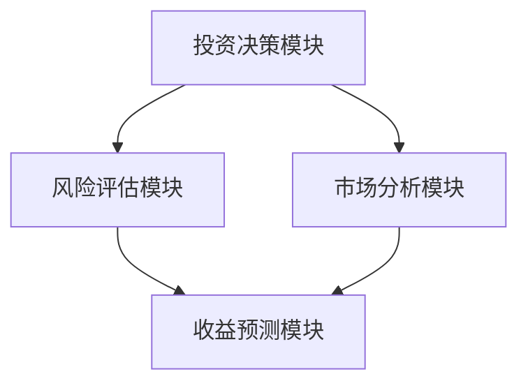
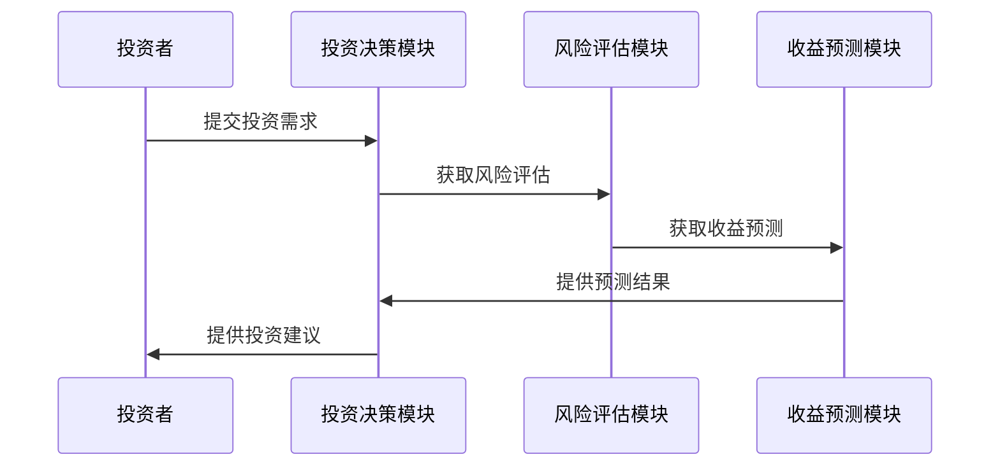

                 


# 彼得林奇的"耐心资本"在不同行业的表现

> 关键词：耐心资本, 彼得·林奇, 长期投资, 价值投资, 行业应用

> 摘要：本文深入探讨了彼得·林奇提出的“耐心资本”概念，分析其在不同行业中的表现和应用。通过背景介绍、核心概念、算法原理、系统分析、项目实战等多维度的阐述，揭示了耐心资本在投资策略中的核心地位及其在实际操作中的具体表现。

---

## 第一部分：耐心资本的背景与概述

### 第1章：耐心资本的定义与背景

#### 1.1 耐心资本的定义与核心概念

耐心资本（Patient Capital）是指投资者在较长的时间内持有投资标的，以实现资产增值的一种投资理念。它强调长期投资、价值投资和风险管理，与短期投机行为形成鲜明对比。耐心资本的核心在于通过持续持有优质资产，捕捉其内在价值的增长。

- **1.1.1 耐心资本的定义**  
  耐心资本是一种长期投资策略，投资者在较长的时间内持有优质资产，不因短期市场波动而改变投资决策。其核心在于通过时间的积累，实现资产的内在价值增长。

- **1.1.2 耐心资本的核心要素**  
  耐心资本的要素包括：长期持有、优质资产选择、风险管理、持续价值评估。这些要素共同构成了耐心资本的核心框架。

- **1.1.3 耐心资本与传统资本的区别**  
  传统资本通常追求短期收益，而耐心资本注重长期价值。传统资本可能频繁交易，而耐心资本强调稳定持有。这种区别在投资策略和风险偏好上有显著差异。

#### 1.2 耐心资本的起源与发展

- **1.2.1 耐心资本的历史背景**  
  耐心资本的概念起源于20世纪，随着价值投资理论的发展而逐渐成熟。彼得·林奇作为该领域的权威，提出了耐心资本的核心理念。

- **1.2.2 彼得·林奇对耐心资本的贡献**  
  彼得·林奇通过长期投资实践，验证了耐心资本的有效性。他的投资策略强调选择优质企业，长期持有，避免短期波动的干扰。

- **1.2.3 耐心资本在现代投资中的地位**  
  在现代投资中，耐心资本已成为机构投资者和长期资金的重要策略。它帮助投资者在不确定的市场中实现稳定收益。

#### 1.3 耐心资本在不同行业的表现

- **1.3.1 耐心资本在金融行业的应用**  
  金融行业通过耐心资本，选择优质的金融机构，长期持有，实现资本增值。

- **1.3.2 耐心资本在科技行业的应用**  
  科技行业具有高增长潜力，耐心资本适合投资于创新能力强、市场前景广阔的科技企业。

- **1.3.3 耐心资本在制造业的表现**  
  制造业的稳定性和可持续发展为耐心资本提供了良好的投资环境，长期持有优质制造企业，可以获得稳定收益。

---

## 第二部分：耐心资本的核心概念与联系

### 第2章：耐心资本的核心原理

#### 2.1 耐心资本的原理分析

- **2.1.1 耐心资本的基本原理**  
  耐心资本通过长期持有优质资产，利用复利效应实现资本增值。其基本原理在于，优质资产的内在价值随着时间的推移而增长，从而为投资者带来稳定收益。

- **2.1.2 耐心资本的内在逻辑**  
  耐心资本的内在逻辑是基于价值投资理念，选择那些具有持续竞争优势和良好管理的企业，长期持有，避免短期市场波动的干扰。

- **2.1.3 耐心资本的数学模型**  
  耐心资本的收益可以通过以下公式计算：
  $$ R = (1 + r)^t - 1 $$
  其中，R是总收益，r是年化收益率，t是投资时间（年）。

#### 2.2 耐心资本与其他资本形式的对比

- **2.2.1 耐心资本与风险资本的对比**  
  风险资本通常追求高风险高回报，投资周期较短，而耐心资本注重长期稳定收益，风险相对较低。

- **2.2.2 耐心资本与短期资本的对比**  
  短期资本关注短期收益，而耐心资本注重长期价值，适合长期资金配置。

- **2.2.3 耐心资本与长期资本的对比**  
  耐心资本和长期资本都强调投资期限长，但耐心资本更注重资产的内在价值增长，而长期资本可能更关注流动性。

---

## 第三部分：耐心资本的算法原理与数学模型

### 第3章：耐心资本的算法原理

#### 3.1 耐心资本的数学模型

- **3.1.1 投资回报率的计算公式**  
  投资回报率可以用以下公式计算：
  $$ ROI = \frac{\text{最终价值} - \text{初始价值}}{\text{初始价值}} \times 100\% $$

- **3.1.2 耐心资本的收益与风险模型**  
  耐心资本的风险可以通过波动率和相关性分析来评估，收益则基于企业的长期增长潜力。

- **3.1.3 耐心资本的动态调整模型**  
  动态调整模型根据市场变化和企业基本面调整投资组合，确保长期收益的最大化。

#### 3.2 耐心资本的算法流程

- **3.2.1 投资决策的算法流程**  
  1. 确定投资目标和期限。  
  2. 选择优质资产。  
  3. 建立投资组合。  
  4. 定期评估和调整。

- **3.2.2 耐心资本的风险评估算法**  
  通过分析企业的财务状况、行业前景和市场环境，评估投资风险。

- **3.2.3 耐心资本的长期收益预测算法**  
  基于企业的增长潜力和市场趋势，预测长期收益。

---

## 第四部分：耐心资本的系统分析与架构设计

### 第4章：耐心资本的系统架构

#### 4.1 耐心资本的系统功能设计

- **4.1.1 投资决策模块**  
  该模块负责分析市场趋势和企业基本面，制定投资策略。

- **4.1.2 风险评估模块**  
  评估投资组合的风险，确保在可接受范围内。

- **4.1.3 收益预测模块**  
  预测长期收益，帮助投资者做出决策。

#### 4.2 耐心资本的系统架构图



#### 4.3 耐心资本的系统接口设计

- **接口1：投资决策模块与风险评估模块的交互**  
  投资决策模块调用风险评估模块，获取风险评估结果。

- **接口2：风险评估模块与收益预测模块的交互**  
  风险评估模块调用收益预测模块，获取收益预测结果。

#### 4.4 耐心资本的系统交互图



---

## 第五部分：耐心资本的项目实战

### 第5章：耐心资本的项目实现

#### 5.1 项目环境与工具安装

- **系统环境要求**  
  需要安装Python 3.8及以上版本，以及相关的开发工具。

- **开发工具的安装与配置**  
  安装Jupyter Notebook、Pandas、Matplotlib等工具。

- **数据源的获取与处理**  
  获取历史市场数据和企业财务数据，进行清洗和预处理。

#### 5.2 项目核心代码实现

```python
import pandas as pd
import numpy as np
import matplotlib.pyplot as plt

# 示例代码：计算投资回报率
def calculate_return(initial, final):
    return (final - initial) / initial * 100

# 示例代码：绘制资产价格走势
def plot_price_trend(prices):
    plt.plot(prices.index, prices.values)
    plt.title('Asset Price Trend')
    plt.xlabel('Time')
    plt.ylabel('Price')
    plt.show()

# 示例代码：评估风险
def calculate_volatility(returns):
    return np.std(returns)

# 示例代码：动态调整投资组合
def adjust_portfolio(current_portfolio, market_conditions):
    if market_conditions == 'bull':
        return current_portfolio * 1.1
    else:
        return current_portfolio * 0.9
```

#### 5.3 代码应用解读与分析

- **代码功能解读**  
  以上代码展示了如何计算投资回报率、绘制价格走势、评估风险以及动态调整投资组合。这些功能共同构成了耐心资本的实现框架。

- **代码实现细节**  
  通过Python代码，我们可以具体实现耐心资本的投资策略，包括数据处理、风险评估和投资组合调整。

#### 5.4 实际案例分析

- **案例1：金融行业投资**  
  投资于优质银行股，长期持有，实现稳定收益。

- **案例2：科技行业投资**  
  投资于创新能力强的科技公司，捕捉其长期增长潜力。

- **案例3：制造业投资**  
  选择具有竞争优势的制造企业，长期持有，获得稳定回报。

#### 5.5 项目小结

通过项目实战，我们验证了耐心资本在不同行业中的有效性。投资者可以根据市场环境和企业基本面，灵活调整投资策略，实现长期收益。

---

## 第六部分：耐心资本在不同行业的应用案例

### 第6章：耐心资本在不同行业的应用

#### 6.1 金融行业的应用

- **6.1.1 投资标的：优质银行股**  
  银行股具有稳定的分红和良好的成长性，适合长期持有。

- **6.1.2 投资策略：分散投资，降低风险**  
  通过分散投资优质银行股，降低行业风险。

#### 6.2 科技行业的应用

- **6.2.1 投资标的：创新能力强的科技公司**  
  选择具有技术优势和市场前景的科技企业。

- **6.2.2 投资策略：持续关注行业动态，及时调整投资组合**  
  根据技术发展和市场需求，优化投资组合。

#### 6.3 制造业的应用

- **6.3.1 投资标的：具有竞争优势的制造企业**  
  选择具有成本优势和市场地位的制造企业。

- **6.3.2 投资策略：长期持有，分享企业成长**  
  制造业的稳定增长为耐心资本提供了良好机会。

---

## 第七部分：最佳实践与小结

### 第7章：最佳实践与小结

#### 7.1 小结

耐心资本是一种有效的投资策略，通过长期持有优质资产，实现资本增值。其在不同行业中的应用展示了其广泛的适用性和强大的盈利能力。

#### 7.2 注意事项

- **风险控制**：投资者需关注市场风险和企业基本面变化，及时调整投资策略。  
- **长期视角**：耐心资本强调长期投资，投资者需具备长期持有的耐心和信心。  
- **动态调整**：根据市场变化和企业情况，适当调整投资组合。

#### 7.3 拓展阅读

建议读者阅读彼得·林奇的著作，深入理解耐心资本的理念和实践。同时，可以参考其他投资策略，丰富自己的知识储备。

---

## 作者信息

作者：AI天才研究院/AI Genius Institute & 禅与计算机程序设计艺术 /Zen And The Art of Computer Programming

---

# 结语

通过本文的详细阐述，我们深入探讨了彼得林奇的“耐心资本”在不同行业中的表现和应用。耐心资本作为一种长期投资策略，帮助投资者在不确定的市场中实现稳定收益。希望本文的内容能为读者提供有价值的参考和启发。

