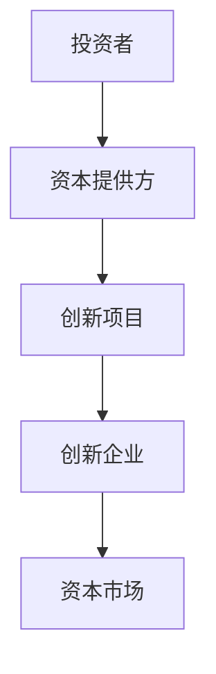
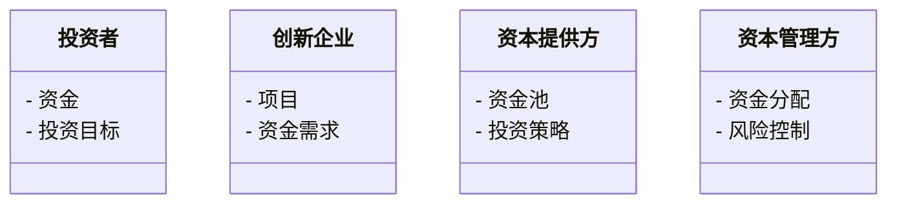

                 


# 彼得林奇的"耐心资本"在颠覆性创新中的角色

## 关键词：耐心资本, 颠覆性创新, 彼得林奇, 投资策略, 创新周期

## 摘要：本文探讨彼得林奇的耐心资本在颠覆性创新中的核心作用。通过分析耐心资本的定义、属性及其在创新周期中的角色，结合彼得林奇的经典投资案例，阐述耐心资本如何支持创新企业成长，预测其回报，并优化投资策略。文章还通过数学模型和系统架构图，深入分析耐心资本在创新中的具体应用和实现。

---

# 第一部分: 背景介绍

## 第1章: 耐心资本与颠覆性创新概述

### 1.1 耐心资本的定义与特点
#### 1.1.1 耐心资本的核心概念
耐心资本（Patient Capital）是一种长期投资策略，强调对创新企业的持续支持，不追求短期收益。其核心在于提供资金和资源，帮助企业度过早期的不确定性阶段，逐步实现增长和成功。

#### 1.1.2 耐心资本与传统资本的对比
| 特性       | 耐心资本                 | 传统资本                  |
|------------|--------------------------|---------------------------|
| 投资期限   | 长期（数年甚至数十年）    | 短期（数月到几年）          |
| 风险承受   | 高                      | 中等                      |
| 投资目标   | 创新企业，追求长期价值   | 成熟企业，追求稳定回报    |
| 退出策略   | 耐心退出（长期持有）    | 快速退出（如IPO或并购）    |

#### 1.1.3 耐心资本在创新中的作用
耐心资本通过提供长期资金支持，帮助企业应对创新过程中的不确定性，降低失败风险，同时为创新企业提供稳定的资源保障。

### 1.2 颠覆性创新的定义与特征
#### 1.2.1 颠覆性创新的定义
颠覆性创新是指通过引入新技术、新商业模式或新市场策略，从根本上改变行业现状，创造新的市场机会。

#### 1.2.2 颠覆性创新的核心要素
- **技术创新**：引入突破性技术，改变行业规则。
- **商业模式创新**：创造新的盈利模式。
- **市场定位**：针对未被满足的需求，开辟新市场。

#### 1.2.3 颠覆性创新与渐进式创新的区别
| 特性       | 颠覆性创新             | 渐进式创新             |
|------------|-------------------------|-------------------------|
| 影响程度   | 根本性改变               | 局部改进               |
| 风险程度   | 高                      | 中等                   |
| 市场反应   | 创新性需求               | 现有需求优化           |

### 1.3 彼得林奇与耐心资本
#### 1.3.1 彼得林奇的投资理念
彼得·林奇（Peter Lynch）是美国著名投资经理人，以其长期投资策略和对创新企业的支持而闻名。他强调选择具有长期增长潜力的企业，而非短期收益。

#### 1.3.2 耐心资本在彼得林奇投资策略中的地位
耐心资本是彼得林奇策略的核心，他通过长期持有股票，支持创新企业度过早期的困难阶段，实现持续增长。

#### 1.3.3 彼得林奇对颠覆性创新的见解
彼得林奇认为，颠覆性创新是投资机会的源泉，耐心资本能够为这些创新企业提供关键支持，帮助它们实现颠覆性变革。

---

## 第2章: 耐心资本在颠覆性创新中的角色

### 2.1 耐心资本在创新周期中的作用
#### 2.1.1 创新周期的阶段划分
创新周期通常分为以下几个阶段：
1. **概念阶段**：创新想法的提出和验证。
2. **开发阶段**：产品开发和测试。
3. **推广阶段**：市场推广和客户获取。
4. **成熟阶段**：实现盈利和持续增长。

#### 2.1.2 耐心资本在不同阶段的角色
- **概念阶段**：提供初始资金，支持创新想法的验证。
- **开发阶段**：提供后续资金，支持产品开发。
- **推广阶段**：提供市场推广资金，帮助创新企业扩大市场份额。
- **成熟阶段**：提供长期支持，帮助企业实现持续增长。

#### 2.1.3 耐心资本对创新成功的长期影响
耐心资本通过长期支持，降低创新企业的财务压力，使其能够专注于技术创新和市场扩展，从而提高创新成功的概率。

### 2.2 颠覆性创新中的耐心资本策略
#### 2.2.1 长期投资在颠覆性创新中的重要性
长期投资能够帮助创新企业应对市场不确定性，逐步实现颠覆性变革。

#### 2.2.2 耐心资本如何支持创新企业成长
耐心资本通过提供长期资金支持，帮助企业应对创新过程中的挑战，实现可持续增长。

#### 2.2.3 耐心资本在风险控制中的作用
耐心资本通过长期持有，降低短期市场波动的影响，帮助企业应对潜在风险。

### 2.3 彼得林奇的耐心资本实践
#### 2.3.1 彼得林奇的经典投资案例
彼得林奇在管理富达麦哲伦基金期间，通过耐心资本支持了许多创新企业，实现了长期的资本增值。

#### 2.3.2 耐心资本在案例中的具体应用
彼得林奇通过长期持有股票，支持创新企业的成长，实现资本增值。

#### 2.3.3 彼得林奇对耐心资本的总结与反思
彼得林奇认为，耐心资本是投资成功的关键，通过长期支持创新企业，能够实现资本的长期增值。

---

# 第二部分: 核心概念与联系

## 第3章: 耐心资本的核心原理

### 3.1 耐心资本的属性特征对比
| 特性       | 耐心资本                 | 传统资本                  |
|------------|--------------------------|---------------------------|
| 投资期限   | 长期（数年甚至数十年）    | 短期（数月到几年）          |
| 风险承受   | 高                      | 中等                      |
| 投资目标   | 创新企业，追求长期价值   | 成熟企业，追求稳定回报    |
| 退出策略   | 耐心退出（长期持有）    | 快速退出（如IPO或并购）    |

### 3.2 耐心资本的ER实体关系图
```mermaid
er
actor: 投资者
plays
participant: 投资目标企业
participant: 创新项目
participant: 资本提供方
participant: 资本管理方
```

### 3.3 耐心资本的流程图


---

## 第4章: 耐心资本的数学模型

### 4.1 耐心资本的风险评估模型
#### 4.1.1 风险评估的数学公式
$$R = \sqrt{\sum_{i=1}^{n} (x_i - \mu)^2}$$

### 4.2 耐心资本的回报预测模型
#### 4.2.1 回报预测的数学公式
$$R^2 = 1 - \frac{SSE}{SST}$$

---

## 第5章: 耐心资本的优化算法

### 5.1 基于线性回归的优化
$$y = \beta_0 + \beta_1x + \e

---

## 第6章: 系统分析与架构设计方案

### 6.1 问题场景介绍
耐心资本支持创新企业的应用场景，包括概念阶段、开发阶段、推广阶段和成熟阶段。

### 6.2 系统功能设计


---

## 第7章: 项目实战

### 7.1 环境安装
安装必要的开发工具和环境，例如Python、数据分析库等。

### 7.2 核心代码实现
```python
import numpy as np
import pandas as pd

def calculate_patience_capital_return(portfolio):
    returns = portfolio['return'].values
    mean_return = np.mean(returns)
    variance = np.var(returns)
    return mean_return, variance

# 示例数据
data = {
    'return': [0.1, 0.2, 0.15, 0.05, 0.3]
}
portfolio = pd.DataFrame(data)
mean_return, variance = calculate_patience_capital_return(portfolio)
print(f"平均回报: {mean_return}")
print(f"回报方差: {variance}")
```

### 7.3 案例分析
分析彼得林奇的经典投资案例，说明耐心资本在实践中的应用。

---

## 第8章: 最佳实践

### 8.1 小结
耐心资本在颠覆性创新中的作用不可忽视，通过长期支持创新企业，实现资本的长期增值。

### 8.2 注意事项
- **风险控制**：耐心资本需要注重风险评估和管理。
- **长期视角**：投资者需要保持长期视角，避免短期波动影响决策。

### 8.3 拓展阅读
推荐相关书籍和论文，深入研究耐心资本和颠覆性创新。

---

作者：AI天才研究院/AI Genius Institute & 禅与计算机程序设计艺术 /Zen And The Art of Computer Programming

