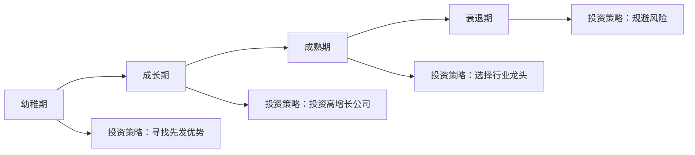
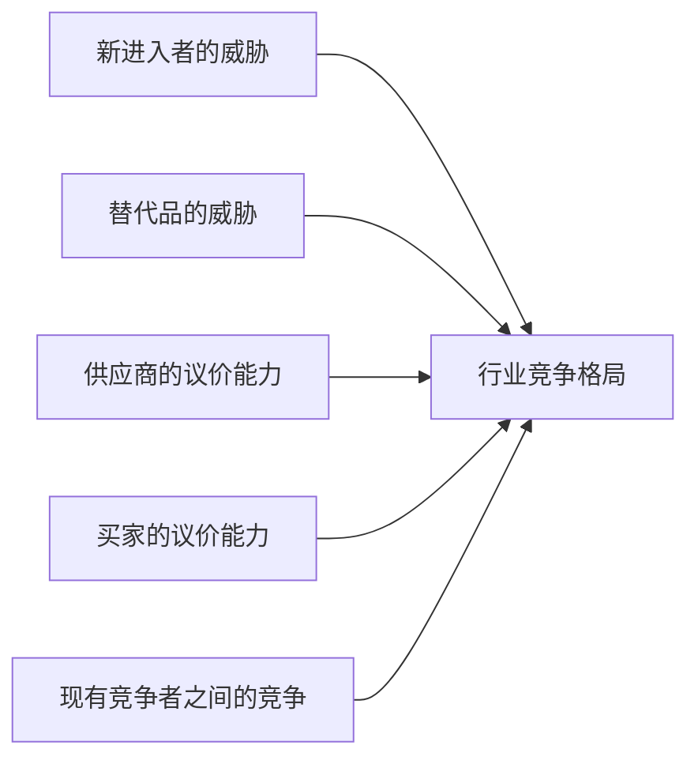

                 

# 彼得林奇的"行业分析"方法论

---

## 关键词：行业分析、彼得林奇、投资策略、财务分析、竞争优势

---

## 摘要：彼得林奇是全球著名投资家，以其独特的行业分析方法论闻名。本文将深入探讨彼得林奇的行业分析方法，涵盖行业生命周期、竞争优势分析、财务指标评估等核心内容，并结合实际案例，系统性地讲解如何运用这些方法进行投资决策。

---

# 第一部分：彼得林奇行业分析方法论概述

## 第1章：行业分析的背景与重要性

### 1.1 行业分析的定义与核心概念

#### 1.1.1 行业分析的定义

行业分析是通过研究特定行业的市场结构、发展趋势、竞争格局和财务状况，评估其投资价值的过程。彼得林奇认为，选择一个具有强大成长潜力的行业是投资成功的关键。

#### 1.1.2 行业分析的核心要素

- **市场容量**：行业的市场规模和增长潜力。
- **竞争结构**：行业内主要竞争对手的数量和市场份额。
- **行业周期**：行业的生命周期阶段（幼稚期、成长期、成熟期、衰退期）。
- **政策环境**：政府政策、法规对行业的影响。

#### 1.1.3 行业分析的重要性

- **降低投资风险**：通过分析行业趋势，避免投资于衰退行业。
- **发现投资机会**：识别具有高增长潜力的行业和公司。
- **制定投资策略**：根据行业特点调整投资组合。

### 1.2 彼得林奇与行业分析方法论

#### 1.2.1 彼得林奇的背景介绍

彼得·林奇是富达投资的传奇经理人，以其长期投资和深入的基本面分析著称。他认为，成功的投资离不开对行业的深入了解。

#### 1.2.2 彼得林奇行业分析的核心思想

- **长期视角**：关注行业的长期发展趋势，而非短期波动。
- **竞争优势**：寻找具有独特竞争优势的公司。
- **财务健康**：通过财务指标评估公司的盈利能力和发展潜力。

#### 1.2.3 彼得林奇方法论的适用场景

- **价值投资**：寻找被市场低估的优质公司。
- **成长投资**：投资于高增长行业的潜力股。
- **风险控制**：通过行业分析降低投资风险。

---

## 第2章：行业分析的核心概念与联系

### 2.1 行业生命周期分析

#### 2.1.1 行业生命周期的阶段划分

- **幼稚期**：行业刚刚起步，市场容量小，竞争者少。
- **成长期**：行业快速发展，市场需求激增。
- **成熟期**：行业增长放缓，竞争格局稳定。
- **衰退期**：行业需求下降，市场份额缩减。

#### 2.1.2 不同阶段的行业特征分析

| 阶段       | 市场需求 | 竞争格局 | 投资策略 |
|------------|----------|-----------|-----------|
| 幼稚期     | 低       | 少         | 寻找先发优势 |
| 成长期     | 高       | 增加       | 投资高增长公司 |
| 成熟期     | 稳定     | 稳定       | 选择行业龙头 |
| 衰退期     | 下降     | 减少       | 规避风险 |

#### 2.1.3 生命周期与投资策略的关系

图 2-1：行业生命周期与投资策略的关系（Mermaid）

---

### 2.2 行业竞争结构分析

#### 2.2.1 五力分析模型（波特模型）

图 2-2：五力分析模型（Mermaid）

#### 2.2.2 行业竞争格局的可视化

表 2-1：行业竞争格局分析

| 竞争要素       | 强度评估 |
|----------------|----------|
| 新进入者的威胁 | 高/中/低 |
| 替代品的威胁   | 高/中/低 |
| 供应商的议价能力 | 高/中/低 |
| 买家的议价能力 | 高/中/低 |
| 竞争者之间的竞争 | 高/中/低 |

---

### 2.3 行业财务指标分析

#### 2.3.1 常用财务指标概述

- **市盈率（P/E）**：股价与每股收益的比率。
- **市净率（P/B）**：股价与每股净资产的比率。
- **净资产收益率（ROE）**：净利润与所有者权益的比率。
- **收入增长率**：公司收入的年增长率。

#### 2.3.2 关键财务指标对比表格

表 2-2：行业财务指标对比

| 公司名称 | 收入增长率 | ROE | P/E | P/B |
|----------|------------|-----|-----|-----|
| 公司A    | 20%        | 15% | 10  | 2   |
| 公司B    | 15%        | 10% | 12  | 1.5 |

---

## 第3章：行业分析的算法与数学模型

### 3.1 行业趋势预测算法

#### 3.1.1 时间序列分析方法

- **简单线性回归**：预测未来趋势。
- **ARIMA模型**：用于时间序列的预测。

#### 3.1.2 机器学习在行业预测中的应用

- **随机森林**：用于分类和回归预测。
- **神经网络**：深度学习模型用于复杂趋势预测。

#### 3.1.3 算法流程图（Mermaid）

---

### 3.2 行业财务分析的数学模型

#### 3.2.1 净资产收益率（ROE）公式

$$ROE = \frac{\text{净利润}}{\text{所有者权益}}$$

---

## 第4章：系统分析与架构设计

### 4.1 问题场景介绍

- **目标**：构建一个行业分析系统，帮助投资者快速评估行业和公司。
- **范围**：涵盖行业生命周期、竞争结构、财务指标分析。

### 4.2 系统功能设计

- **数据收集模块**：收集行业数据和公司财务数据。
- **分析模块**：包括生命周期分析、竞争结构分析和财务指标分析。
- **报告生成模块**：生成行业分析报告。

### 4.3 系统架构设计（Mermaid）

---

## 第5章：项目实战

### 5.1 环境安装

- **工具**：Python、Pandas、Matplotlib、Scikit-learn。

---

## 第6章：最佳实践

### 6.1 小结

彼得林奇的行业分析方法论为我们提供了一个系统性的投资框架。通过深入分析行业生命周期、竞争结构和财务指标，我们可以更好地做出投资决策。

### 6.2 注意事项

- **数据质量**：确保数据的准确性和完整性。
- **模型选择**：根据具体情况选择合适的分析模型。
- **持续学习**：行业分析需要不断更新知识和技能。

### 6.3 拓展阅读

- **书籍**：《彼得林奇的投资智慧》。
- **网站**：行业分析报告和财务数据平台。

---

## 作者：AI天才研究院/AI Genius Institute & 禅与计算机程序设计艺术/Zen And The Art of Computer Programming

---

希望这个大纲能满足您的需求！如果需要进一步调整或补充，请随时告诉我。

