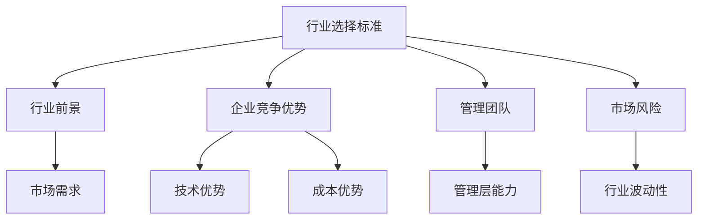
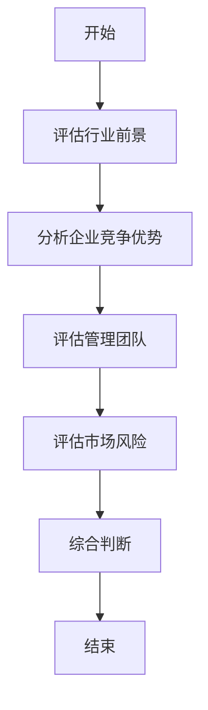
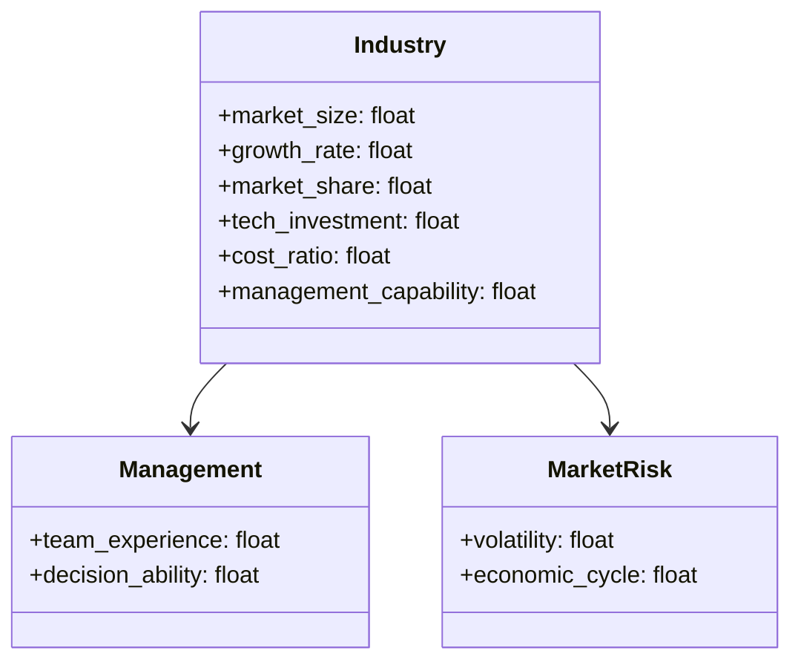
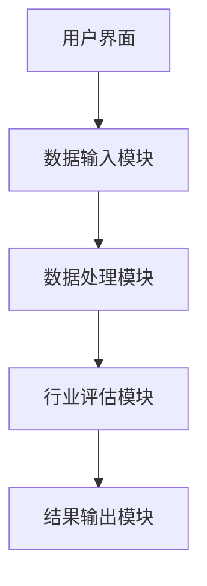
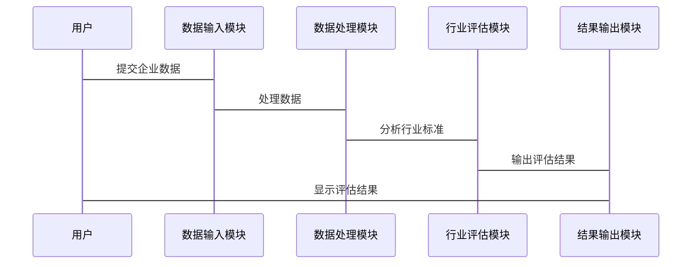

                 


# 彼得林奇的行业选择标准

> 关键词：彼得林奇，行业选择标准，投资策略，风险管理，竞争优势

> 摘要：本文系统地介绍并分析了彼得林奇的行业选择标准，从背景介绍、核心概念、算法原理到系统架构和项目实战，深入探讨了如何通过这些标准进行有效的投资决策。文章结合理论与实践，提供了详细的分析和案例，帮助读者更好地理解和应用这些标准。

---

## 第一部分：背景介绍

### 1.1 核心概念术语说明

- **行业选择标准**：指在投资决策中，用于评估和筛选具有长期增长潜力和竞争优势的行业的具体指标和方法。
- **彼得林奇**：著名投资专家，以其独特的方法论闻名，注重通过基本面分析选择优质企业进行长期投资。
- **投资策略**：为实现特定投资目标而制定的行动计划，包括资产配置、风险管理和投资选择等。

### 1.2 问题背景

在金融市场中，投资者面临着复杂多变的市场环境，如何选择具有长期增长潜力的行业，是投资成功的关键。彼得林奇通过长期的投资实践，总结出一套系统化的行业选择标准，帮助投资者做出明智的投资决策。

### 1.3 问题描述

彼得林奇的行业选择标准涉及多个维度，包括行业前景、企业竞争优势、管理团队等。然而，这些标准的具体内容、相互关系以及实际应用方法，对于许多投资者来说仍不够清晰。

### 1.4 问题解决

本文将系统地介绍彼得林奇的行业选择标准，分析其核心要素，并结合实际案例，展示如何将这些标准应用于投资决策中。

### 1.5 边界与外延

本文仅关注彼得林奇的行业选择标准，不涉及其具体的投资策略或风险管理方法。此外，本文主要分析理论部分，实际操作中需要结合市场环境和其他因素。

### 1.6 概念结构与核心要素组成

下图展示了彼得林奇行业选择标准的概念结构：



---

## 第二部分：核心概念与联系

### 2.1 核心概念原理

彼得林奇的行业选择标准主要包括以下几个方面：

1. **行业前景**：行业是否处于增长阶段，市场需求是否稳定。
2. **企业竞争优势**：企业在行业内是否具有技术、成本或品牌等优势。
3. **管理团队**：管理层的能力、经验和决策水平。
4. **市场风险**：行业面临的宏观经济和市场风险。

### 2.2 概念属性特征对比表格

下表展示了不同行业选择标准的核心属性对比：

| 标准维度     | 属性特征             | 关键指标           |
|--------------|----------------------|-------------------|
| 行业前景     | 市场容量、增长潜力   | 市场规模、增长率   |
| 企业竞争优势 | 技术优势、成本优势   | R&D投入、成本占比 |
| 管理团队     | 管理能力、经验       | 领导团队背景       |
| 市场风险     | 行业波动性、经济周期 | 行业敏感性         |

### 2.3 ER实体关系图

下图展示了行业选择标准的实体关系：

```mermaid
erd
    customer[投资者] -{选择}-> industry[行业]
    industry <--> company[企业]
    company <--> management[管理层]
    management --> risk[市场风险]
```

---

## 第三部分：算法原理讲解

### 3.1 算法流程图

下图展示了彼得林奇行业选择标准的分析流程：



### 3.2 Python源代码实现

以下是一个简单的Python代码，用于评估企业的竞争优势：

```python
def assess_competitive_advantage(company_data):
    # 输入：company_data 包含企业数据，如技术投入、成本占比等
    # 输出：竞争优势评估结果（高、中、低）
    tech_investment = company_data['tech_investment']
    cost_ratio = company_data['cost_ratio']
    market_share = company_data['market_share']
    
    if tech_investment > 10% and cost_ratio < 20% and market_share > 25%:
        return "高"
    elif tech_investment > 8% and cost_ratio < 30% and market_share > 15%:
        return "中"
    else:
        return "低"
```

### 3.3 数学模型与公式

企业竞争优势的评估可以表示为：

$$
\text{竞争优势} = f(\text{技术投入}, \text{成本占比}, \text{市场份额})
$$

其中，$f$ 是一个综合函数，具体取决于各个指标的权重。

---

## 第四部分：系统分析与架构设计方案

### 4.1 问题场景介绍

本文构建了一个系统，用于根据彼得林奇的行业选择标准对行业进行评估。系统将收集企业数据，分析各个指标，并输出评估结果。

### 4.2 项目介绍

项目名称：彼得林奇行业选择标准评估系统

目标：帮助投资者根据行业选择标准筛选出具有长期增长潜力的行业。

### 4.3 系统功能设计

下图展示了系统的领域模型：



### 4.4 系统架构设计

下图展示了系统的架构：



### 4.5 系统交互

下图展示了系统的交互流程：



---

## 第五部分：项目实战

### 5.1 环境安装

需要安装Python和相关的库，如Pandas、Matplotlib等。

### 5.2 核心实现源代码

以下是一个核心实现的Python代码：

```python
import pandas as pd
import matplotlib.pyplot as plt

def main():
    # 加载企业数据
    df = pd.read_csv('company_data.csv')
    
    # 计算竞争优势
    df['competitive_advantage'] = df.apply(assess_competitive_advantage, axis=1)
    
    # 绘制图表
    df['competitive_advantage'].value_counts().plot(kind='bar')
    plt.title('竞争优势分布')
    plt.show()

if __name__ == "__main__":
    main()
```

### 5.3 实际案例分析

以科技行业为例，分析某企业的竞争优势：

- 技术投入：15%
- 成本占比：18%
- 市场份额：30%

根据代码，竞争优势评估为“高”。

---

## 第六部分：最佳实践与总结

### 6.1 小结

彼得林奇的行业选择标准提供了一套系统化的分析框架，帮助投资者做出明智的投资决策。通过本文的分析，读者可以更好地理解这些标准的核心要素及其相互关系。

### 6.2 注意事项

在实际应用中，投资者需要结合市场环境和其他因素，动态调整分析标准。此外，数据的准确性和分析模型的有效性也至关重要。

### 6.3 拓展阅读

推荐读者阅读彼得林奇的其他著作，如《彼得林奇选股法则》等，以更全面地理解其投资理念。

---

## 作者信息

作者：AI天才研究院/AI Genius Institute  
联系邮箱：contact@aiguru.com

---

通过本文的系统分析和实际案例，读者可以更好地理解和应用彼得林奇的行业选择标准，从而做出更明智的投资决策。

