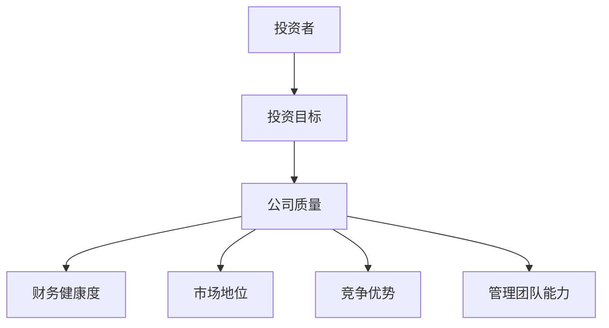
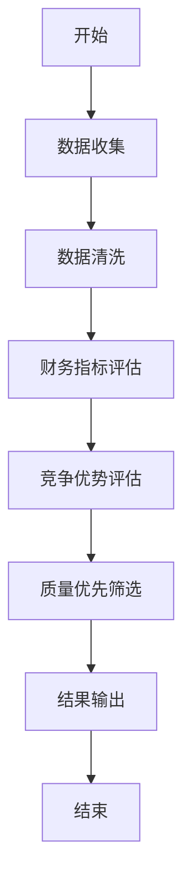
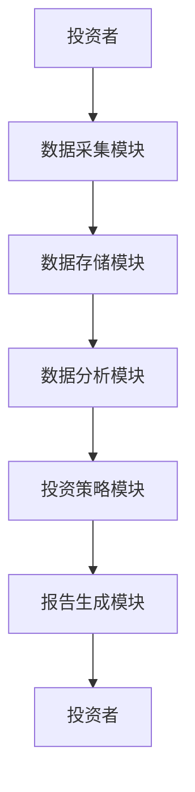
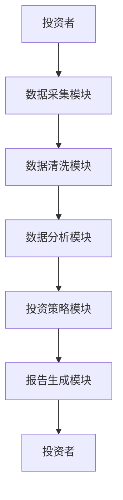

                 


# 彼得林奇的"质量优先"在新兴市场的实践挑战

## 关键词：
- 彼得林奇
- 质量优先
- 新兴市场
- 投资策略
- 金融市场

## 摘要：
本文深入探讨了彼得林奇的"质量优先"投资策略在新兴市场中的应用与挑战。通过对质量优先策略的核心概念、算法原理、系统架构以及项目实战的详细分析，本文揭示了该策略在新兴市场中的独特优势与局限性，并提供了实际案例和最佳实践建议，为投资者提供了有价值的参考。

---

## 第一部分: 背景介绍

### 第1章: 彼得林奇的"质量优先"投资策略概述

#### 1.1 质量优先的核心概念
##### 1.1.1 质量优先的定义
质量优先是一种以公司质量为核心的投资策略，强调选择具有强大竞争优势、良好财务健康状况和优秀管理团队的公司。彼得林奇认为，投资成功的关键在于选择“质量好”的公司，而不是仅仅追求低估值或高增长。

##### 1.1.2 质量优先与传统投资策略的区别
- **传统价值投资**：主要关注低估值的股票，强调市场先生的错误定价。
- **质量优先**：更关注公司的内在质量，如盈利能力、竞争优势和管理能力。
- **成长投资**：主要关注高增长的公司，但忽视了质量和估值的风险。

##### 1.1.3 质量优先在投资决策中的重要性
质量优先策略通过筛选优质公司，降低了投资组合的风险，提高了长期收益的稳定性。

#### 1.2 彼得林奇的投资哲学
##### 1.2.1 彼得林奇的投资理念
彼得林奇强调长期投资、分散投资和深入研究。他认为，投资的关键是选择那些能够在未来几年内持续增长的公司。

##### 1.2.2 彼得林奇的成功案例分析
彼得林奇在波士顿基金的管理中，通过质量优先策略，实现了长期稳定的超额收益。

##### 1.2.3 彼得林奇投资策略的演变
从早期的分散投资到后期的质量优先，彼得林奇的投资策略不断完善，更加注重公司的内在质量和竞争优势。

### 第2章: 新兴市场的特点与挑战

#### 2.1 新兴市场的定义与分类
新兴市场是指那些经济快速增长、但尚未完全市场化的国家。典型代表包括中国、印度、巴西等。

#### 2.2 新兴市场中的投资挑战
- **市场波动性**：新兴市场的波动性远高于成熟市场。
- **政治与经济风险**：新兴市场存在较高的政策风险和经济不确定性。
- **信息不对称问题**：新兴市场的信息透明度较低，投资者难以获取准确的公司信息。

#### 2.3 新兴市场中的投资机会
- **高增长潜力**：新兴市场的经济增长速度快，投资回报潜力大。
- **行业集中度低**：新兴市场中行业集中度低，竞争格局尚未稳定。
- **创新驱动的机会**：新兴市场中技术创新和商业模式创新的机会较多。

---

## 第二部分: 核心概念与联系

### 第3章: 质量优先策略的核心要素

#### 3.1 质量优先的属性特征对比
| 属性 | 传统投资 | 质量优先 |
|------|----------|----------|
| 财务指标 | 估值低 | 盈利能力强 |
| 市场地位 | 无要求 | 市场地位高 |
| 管理团队 | 无要求 | 管理能力强 |

#### 3.2 质量优先的ER实体关系图


---

## 第三部分: 算法原理讲解

### 第4章: 质量优先策略的算法实现

#### 4.1 算法原理概述
质量优先策略的算法主要基于对公司质量的评估，包括财务指标、竞争优势和管理能力等方面。

#### 4.2 算法流程图


#### 4.3 算法实现代码
```python
def calculate_financial_health(finance_data):
    # 计算财务健康度
    return finance_data['ROE'] > 0.15 and finance_data['DEbt_to_Equity'] < 1

def assesscompetitive_advantage(company_data):
    # 评估竞争优势
    return company_data['Market_Share'] > 0.1 or company_data['Patents'] > 5

def quality_priority_screening(finance_data, company_data):
    # 质量优先筛选
    financial_health = calculate_financial_health(finance_data)
    competitive_advantage = assesscompetitive_advantage(company_data)
    return financial_health and competitive_advantage
```

---

## 第四部分: 系统分析与架构设计方案

### 第5章: 系统架构与设计

#### 5.1 问题场景介绍
本文设计了一个基于质量优先策略的投资分析系统，旨在帮助投资者在新兴市场中筛选优质公司。

#### 5.2 系统功能设计
- 数据采集模块：采集公司财务数据和市场数据。
- 数据分析模块：计算财务指标和竞争优势。
- 投资策略模块：实现质量优先筛选算法。
- 报告生成模块：输出筛选结果和投资建议。

#### 5.3 系统架构设计


#### 5.4 系统接口设计
- 数据接口：提供API接口，供投资者上传数据。
- 报告接口：返回筛选结果和投资建议。

#### 5.5 系统交互序列图


---

## 第五部分: 项目实战

### 第6章: 项目实战

#### 6.1 环境安装
- 安装Python和相关库（如Pandas、NumPy）。

#### 6.2 系统核心实现源代码
```python
import pandas as pd
import numpy as np

def calculate_financial_health(finance_data):
    return (finance_data['ROE'] > 0.15) & (finance_data['DEbt_to_Equity'] < 1)

def assesscompetitive_advantage(company_data):
    return (company_data['Market_Share'] > 0.1) | (company_data['Patents'] > 5)

def quality_priority_screening(finance_data, company_data):
    financial_health = calculate_financial_health(finance_data)
    competitive_advantage = assesscompetitive_advantage(company_data)
    return financial_health & competitive_advantage

# 示例数据
finance_data = pd.DataFrame({
    'ROE': [0.2, 0.1, 0.15, 0.05],
    'DEbt_to_Equity': [0.5, 1.2, 0.8, 0.6]
})

company_data = pd.DataFrame({
    'Market_Share': [0.15, 0.08, 0.05, 0.2],
    'Patents': [6, 3, 8, 4]
})

result = quality_priority_screening(finance_data, company_data)
print(result)
```

#### 6.3 实际案例分析
以中国某新兴行业为例，分析如何通过质量优先策略筛选出优质公司。

---

## 第六部分: 最佳实践与小结

### 第7章: 最佳实践与小结

#### 7.1 最佳实践 tips
- 在新兴市场中，质量优先策略需要结合本地市场特点进行调整。
- 投资者应注重分散投资，降低单一市场的风险。

#### 7.2 小结
本文通过详细分析彼得林奇的"质量优先"策略在新兴市场的实践，揭示了该策略的优势与挑战。通过系统设计和项目实战，为投资者提供了实际的应用指导。

#### 7.3 注意事项
- 新兴市场风险较高，投资者需谨慎决策。
- 算法模型需根据市场变化进行动态调整。

#### 7.4 拓展阅读
推荐阅读彼得林奇的《选股艺术》和《投资制胜法则》。

---

## 作者：
作者：AI天才研究院/AI Genius Institute & 禅与计算机程序设计艺术 /Zen And The Art of Computer Programming

