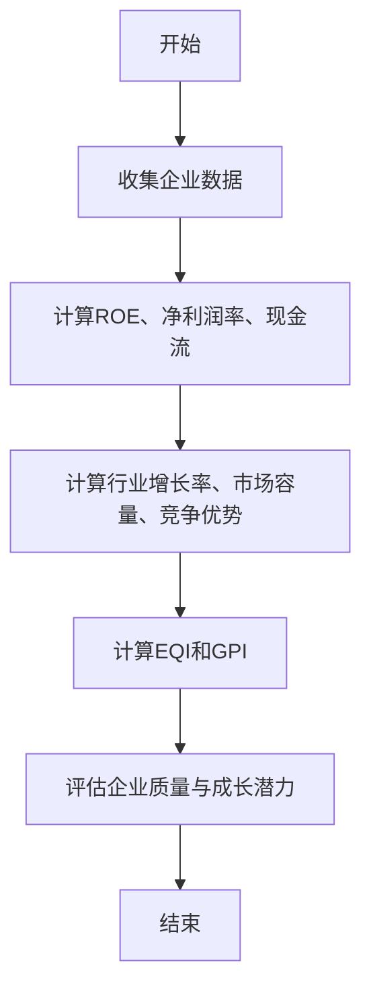
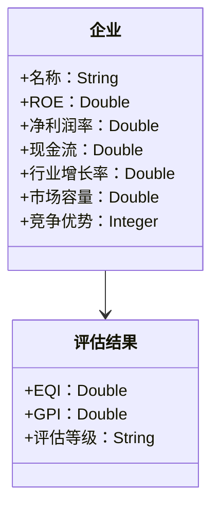
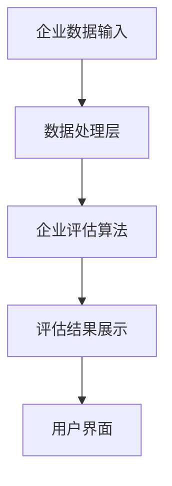

                 


# 彼得林奇的"质量成长"在传统企业转型中的应用

> **关键词**：彼得林奇，质量成长，企业转型，投资策略，可持续发展

> **摘要**：本文探讨了彼得林奇的“质量成长”投资策略在传统企业转型中的应用。通过分析质量成长的核心概念、算法原理、系统架构及项目实战，本文为企业提供了从理论到实践的详细指导，帮助企业在数字化转型中实现可持续发展和竞争力提升。

---

## 第一部分：背景与概述

### 第1章：彼得林奇“质量成长”理论概述

#### 1.1 “质量成长”投资策略的核心概念

彼得林奇是全球著名投资专家，他的“质量成长”策略强调投资那些具有持续增长潜力和高质量的企业。**质量成长**是指选择那些在行业内具有竞争优势、财务健康、管理优秀且具备长期增长潜力的企业进行投资。这种策略不仅关注企业的当前表现，还注重其未来的成长空间。

**质量成长**的核心要素包括：

- **企业质量评估**：评估企业的财务状况、管理团队、行业地位等。
- **成长潜力分析**：分析企业在未来市场中的增长空间和竞争优势。
- **风险控制**：通过分散投资和长期持有降低风险。

#### 1.2 传统企业转型的背景与挑战

传统企业在面临数字化转型时，常常遇到以下挑战：

- **市场变化快**：传统企业难以适应新兴技术和商业模式的变化。
- **竞争优势丧失**：在新技术和新市场的冲击下，传统企业的竞争力逐渐减弱。
- **内部管理问题**：传统企业在组织结构、管理流程和文化上存在惯性，难以快速调整。

彼得林奇的“质量成长”策略为传统企业提供了一种新的思维方式，通过选择具有质量优势和成长潜力的企业，帮助它们在转型中找到方向。

---

### 第2章：质量成长的核心要素与模型

#### 2.1 企业质量评估模型

**企业质量评估模型**是质量成长策略的重要组成部分。该模型通过多维度评估企业的质量，包括财务表现、管理团队、行业地位等。以下是模型的核心要素：

- **财务表现**：包括盈利能力（ROE、净利润率）、资产负债率、现金流等。
- **管理团队**：评估管理团队的经验、能力和战略眼光。
- **行业地位**：企业在行业中的市场份额、竞争优势等。

**企业质量评估模型的属性对比表**如下：

| 属性           | 重要性 | 评估指标示例                  |
|----------------|--------|------------------------------|
| 财务表现       | 高     | 净利润、ROE、现金流           |
| 管理团队       | 高     | CEO经验、团队稳定性           |
| 行业地位       | 中高   | 市场份额、行业排名            |

#### 2.2 成长潜力分析框架

**成长潜力分析框架**用于评估企业在未来市场中的增长空间。以下是框架的核心要素：

- **行业趋势**：行业的发展前景、技术变革等。
- **市场容量**：目标市场的规模和增长潜力。
- **竞争优势**：企业在产品、技术、成本等方面的优势。

**成长潜力分析框架的属性对比表**如下：

| 属性           | 重要性 | 评估指标示例                  |
|----------------|--------|------------------------------|
| 行业趋势       | 高     | 行业增长率、技术发展速度      |
| 市场容量       | 中高   | 市场规模、潜在客户数          |
| 竞争优势       | 高     | 产品差异化、成本优势         |

---

## 第三部分：算法原理

### 第3章：基于“质量成长”的企业评估算法

#### 3.1 算法概述

**企业质量指数（EQI）**和**成长潜力指数（GPI）**是“质量成长”策略的核心算法。通过这两个指数，我们可以量化企业的质量表现和成长潜力。

- **企业质量指数（EQI）**：反映企业的财务健康、管理能力和行业地位。
- **成长潜力指数（GPI）**：评估企业在未来市场的增长潜力。

#### 3.2 数学模型

企业质量指数（EQI）的计算公式如下：

$$ EQI = \frac{ROE \times 3 + 净利润率 \times 2 + 现金流 \times 1}{6} $$

成长潜力指数（GPI）的计算公式如下：

$$ GPI = \frac{行业增长率 \times 4 + 市场容量 \times 3 + 竞争优势 \times 2}{9} $$

其中，各指标的权重根据行业特点和企业实际情况调整。

#### 3.3 算法流程图

以下是算法的执行步骤：



---

## 第四部分：系统分析与架构设计

### 第4章：系统功能设计

#### 4.1 问题场景

传统企业在转型过程中，常常需要评估自身的质量表现和成长潜力。通过构建一个基于“质量成长”策略的企业评估系统，可以帮助企业在转型中找到发展方向。

#### 4.2 领域模型类图

以下是系统的核心领域模型类图：



#### 4.3 系统架构设计

以下是系统的整体架构图：



---

## 第五部分：项目实战

### 第5章：基于“质量成长”的企业转型项目实战

#### 5.1 环境安装与配置

- **工具安装**：安装Python、Pandas、Scikit-learn等工具。
- **数据收集**：收集企业的财务数据、行业趋势等。

#### 5.2 核心代码实现

以下是核心代码实现：

```python
import pandas as pd

def calculate_EQI(roe, net_profit_margin, cash_flow):
    return (roE * 3 + net_profit_margin * 2 + cash_flow * 1) / 6

def calculate_GPI(industry_growth, market_capacity, competitive_edge):
    return (industry_growth * 4 + market_capacity * 3 + competitive_edge * 2) / 9

# 示例数据
data = {
    '企业名称': ['企业A', '企业B'],
    'ROE': [0.15, 0.2],
    '净利润率': [0.1, 0.15],
    '现金流': [0.08, 0.12],
    '行业增长率': [0.1, 0.12],
    '市场容量': [100, 120],
    '竞争优势': [3, 4]
}

df = pd.DataFrame(data)

# 计算EQI和GPI
df['EQI'] = df.apply(lambda x: calculate_EQI(x['ROE'], x['净利润率'], x['现金流']), axis=1)
df['GPI'] = df.apply(lambda x: calculate_GPI(x['行业增长率'], x['市场容量'], x['竞争优势']), axis=1)

print(df)
```

#### 5.3 实际案例分析

以某制造企业为例，通过上述算法计算其EQI和GPI：

```python
企业数据：
- ROE = 0.15
- 净利润率 = 0.1
- 现金流 = 0.08
- 行业增长率 = 0.1
- 市场容量 = 100
- 竞争优势 = 3

计算结果：
- EQI = (0.15*3 + 0.1*2 + 0.08*1) / 6 = 0.143
- GPI = (0.1*4 + 100*3 + 3*2) / 9 = 34.444
```

---

## 第六部分：最佳实践与总结

### 第6章：最佳实践与注意事项

#### 6.1 最佳实践

- **数据准确性**：确保输入数据的准确性和完整性。
- **模型调整**：根据实际情况调整算法中的权重。
- **持续监测**：定期更新数据和重新评估企业的质量指数和成长潜力。

#### 6.2 小结

彼得林奇的“质量成长”策略为传统企业的转型提供了重要的指导。通过构建基于质量指数和成长潜力的评估系统，企业可以更好地识别自身的优势和潜力，制定科学的转型策略。

#### 6.3 注意事项

- **数据隐私**：确保企业数据的安全和隐私。
- **模型局限性**：算法可能无法完全覆盖所有市场情况，需结合实际情况进行调整。

#### 6.4 拓展阅读

- 彼得林奇《投资的智慧》
- 投资学经典教材：《投资学》（书籍名称）

---

## 作者

**作者：AI天才研究院/AI Genius Institute & 禅与计算机程序设计艺术/Zen And The Art of Computer Programming**

---

通过本文的详细讲解，我们探讨了彼得林奇“质量成长”策略在传统企业转型中的应用，从理论到实践，为企业提供了系统的指导和实用的工具。希望本文能为企业的可持续发展和数字化转型提供新的思路和方法。

