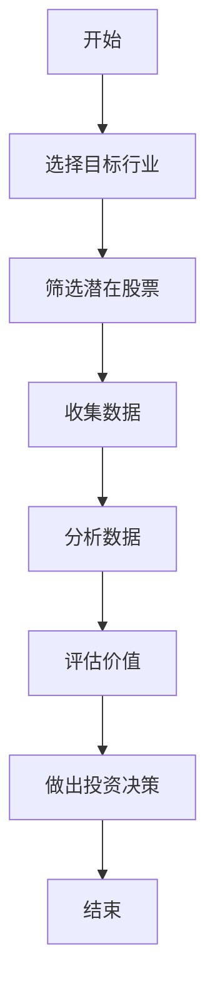
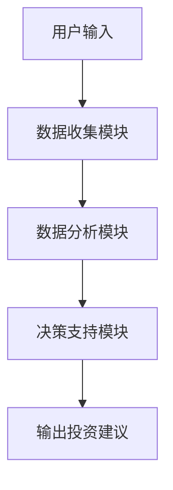

                 


# 彼得林奇的"跟踪记录"投资法

> 关键词：彼得林奇，跟踪记录，投资法，股票分析，风险管理，投资策略

> 摘要：本文深入分析了彼得林奇的"跟踪记录"投资法，探讨其核心原理、算法流程、系统架构以及实际应用案例，旨在帮助投资者理解和应用这一高效的投资方法。

---

# 第一部分：背景介绍

## 第1章：彼得林奇与跟踪记录法概述

### 1.1 彼得林奇的生平与投资理念

彼得·林奇（Peter Lynch）是全球最著名、最成功的投资经理之一。他在富达投资管理公司（Fidelity Management）任职期间，管理着多只基金，创造了辉煌的投资业绩。彼得林奇的投资理念以“普通人也能投资成功”为核心，强调长期持有优质股票，并通过持续的研究和跟踪来捕捉市场机会。

### 1.2 跟踪记录法的背景与重要性

传统的投资方法往往依赖于复杂的数学模型和高频交易策略，但对于普通投资者来说，这些方法难以掌握和应用。彼得林奇提出的“跟踪记录”投资法，是一种更加简单、直观的投资策略，强调通过长期跟踪和记录股票的基本面信息，来发现价值被低估的投资机会。

---

# 第二部分：核心概念与联系

## 第2章：跟踪记录法的核心原理

### 2.1 跟踪记录法的基本概念

跟踪记录法的核心在于“记录”和“跟踪”股票的动态变化。投资者需要定期记录股票的市场价格、公司基本面数据（如收入、利润、负债等）、行业趋势以及宏观经济环境等因素，并通过分析这些数据来评估股票的投资价值。

### 2.2 跟踪记录法的核心要素

1. **数据收集**：记录股票的历史价格、财务数据、行业信息等。
2. **数据分析**：通过分析数据，评估股票的内在价值、成长潜力以及风险。
3. **投资决策**：基于分析结果，决定是否买入、持有或卖出股票。

---

# 第三部分：算法原理讲解

## 第3章：跟踪记录法的算法原理

### 3.1 算法流程图

以下是一个简化的跟踪记录法的流程图：



### 3.2 算法的数学模型与公式

1. **市盈率（P/E比率）**：
   $$ \text{P/E} = \frac{\text{股价}}{\text{每股收益}} $$
   用于评估股票的估值是否合理。

2. **市净率（P/B比率）**：
   $$ \text{P/B} = \frac{\text{股价}}{\text{每股净资产}} $$
   用于评估股票相对于其资产价值的高低。

3. **ROE（净资产收益率）**：
   $$ \text{ROE} = \frac{\text{净利润}}{\text{净资产}} $$
   用于评估公司的盈利能力。

---

# 第四部分：系统分析与架构设计

## 第4章：跟踪记录法的系统架构

### 4.1 系统功能设计

1. **数据收集模块**：
   - 从Yahoo Finance API获取股票数据。
   - 包括历史价格、财务报表数据等。

2. **数据分析模块**：
   - 计算各项指标（如P/E、P/B、ROE等）。
   - 生成趋势图表。

3. **决策支持模块**：
   - 评估股票的投资价值。
   - 生成投资建议。

### 4.2 系统架构图



---

# 第五部分：项目实战

## 第5章：跟踪记录法的实际应用

### 5.1 项目环境安装

- 数据收集工具：Python、Pandas、Yahoo Finance API。
- 数据分析工具：Matplotlib、Seaborn。
- 投资决策工具：Excel、Power BI。

### 5.2 核心代码实现

以下是一个简单的Python代码示例，用于计算股票的市盈率：

```python
import pandas as pd
import yfinance as yf

# 下载数据
data = yf.download('AAPL', start='2020-01-01', end='2023-12-31')

# 计算市盈率
data['PE'] = data['Close'] / data['EPS']
print(data[['Close', 'PE']].head())
```

---

# 第六部分：最佳实践

## 第6章：总结与注意事项

### 6.1 成功案例分析

通过跟踪记录法，彼得林奇成功管理了多只基金，取得了远超市场平均水平的回报率。他的方法强调长期持有优质股票，避免频繁交易，从而降低了交易成本并捕捉到了长期趋势。

### 6.2 投资小技巧

1. **持续学习**：不断更新对行业的认识，了解新趋势。
2. **分散投资**：避免将所有资金投入到单一股票或行业。
3. **长期视角**：耐心持有优质股票，避免短期波动影响决策。

---

作者：AI天才研究院 & 禅与计算机程序设计艺术

