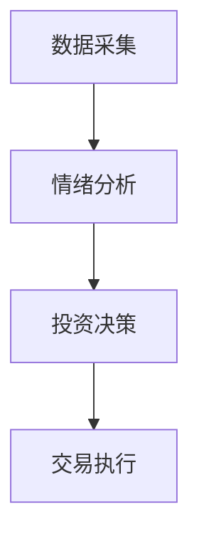

                 


# 彼得林奇的"逆向投资"在市场恐慌时期的操作

---

## 关键词：逆向投资、市场恐慌、彼得林奇、投资策略、风险管理、市场分析、情绪分析

---

## 摘要：

本文深入探讨了彼得·林奇的逆向投资策略在市场恐慌时期的应用。逆向投资是一种在市场低迷时买入、在市场狂热时卖出的投资策略，尤其在市场恐慌时期表现出了显著的优势。通过分析彼得·林奇的投资理念、市场恐慌的特征、逆向投资的核心原理以及实际操作中的风险管理策略，本文为投资者提供了一套在市场恐慌时期进行逆向投资的系统性方法，包括理论分析、算法设计、系统架构和项目实战等多方面的内容。

---

## 正文：

### # 第一部分: 引言

### 第1章: 逆向投资的基本概念

#### 1.1 逆向投资的定义与特点

逆向投资是一种与市场情绪相反的投资策略，强调在市场恐慌时买入，在市场狂热时卖出。其核心特点包括：

1. **低买高卖**：逆向投资者倾向于在市场低迷时寻找低估资产，而在市场高位时卖出。
2. **市场情绪逆向**：逆向投资的核心在于识别市场情绪的极端，避免随波逐流。
3. **长期视角**：逆向投资者通常关注长期价值，而非短期波动。

#### 1.2 市场恐慌时期的定义与特征

市场恐慌是指投资者因恐惧而大量抛售资产，导致市场价格急剧下跌的时期。其主要特征包括：

- **市场流动性下降**：投资者恐慌性抛售，导致资产流动性降低。
- **价格偏离价值**：资产价格往往大幅低于其内在价值。
- **市场波动加剧**：价格波动剧烈，投资者情绪极度负面。

#### 1.3 彼得·林奇与逆向投资

彼得·林奇是逆向投资的代表人物之一。他强调在市场恐慌时寻找被低估的资产，并长期持有。他的投资策略包括：

- **价值投资**：寻找基本面良好但被市场低估的资产。
- **逆周期投资**：在市场低迷时增加投资，而在市场繁荣时减少投资。

---

### # 第二部分: 逆向投资的核心概念与联系

### 第2章: 逆向投资的理论基础

#### 2.1 逆向投资的原理

逆向投资的原理在于市场的非理性。在市场恐慌时期，投资者的恐慌情绪会导致资产价格被过度抛售，从而为逆向投资者提供了低位买入的机会。

#### 2.2 逆向投资的核心要素

- **市场恐慌指数**：衡量市场恐慌程度的指标，如VIX指数。
- **投资标的筛选**：选择基本面良好但价格被低估的资产。
- **投资组合优化**：通过分散投资降低风险，同时集中投资于优质资产。

#### 2.3 彼得·林奇的逆向投资策略

彼得·林奇的策略包括：

- **价值发现**：寻找那些被市场忽视但具有长期增长潜力的公司。
- **逆周期投资**：在市场低迷时增加投资，而在市场繁荣时减少投资。

---

### # 第三部分: 算法与数学模型

### 第3章: 逆向投资的算法设计

#### 3.1 算法原理

逆向投资的算法设计基于市场情绪分析和资产价格预测。核心步骤包括：

1. **数据采集**：收集市场数据，包括价格、成交量等。
2. **情绪分析**：通过数据计算市场恐慌指数。
3. **投资决策**：根据恐慌指数决定买入或卖出。

#### 3.2 算法实现

以下是Python代码示例，用于计算市场恐慌指数：

```python
import pandas as pd
import numpy as np

def calculate_panic_index(prices, volume):
    # 计算波动率
    volatility = np.std(prices.pct_change().dropna())
    # 计算交易量的下降幅度
    volume_change = volume.pct_change().dropna()
    volume_anomaly = np.where(volume_change < -0.5, 1, 0)
    # 计算恐慌指数
    panic_index = volatility * np.mean(volume_anomaly)
    return panic_index

# 示例数据
prices = pd.DataFrame({
    'price': [100, 98, 95, 90, 85, 80, 75, 70, 65, 60]
})
volume = pd.DataFrame({
    'volume': [1000, 900, 800, 700, 600, 500, 400, 300, 200, 100]
})

panic_index = calculate_panic_index(prices, volume)
print(f"恐慌指数: {panic_index}")
```

#### 3.3 数学模型

恐慌指数公式：
$$
\text{Panic Index} = \sigma_p \times \alpha_v
$$
其中，$$\sigma_p$$为资产价格波动率，$$\alpha_v$$为交易量异常指数。

---

### # 第四部分: 系统分析与架构设计

### 第4章: 逆向投资系统架构

#### 4.1 系统功能设计

- **数据采集模块**：收集市场数据。
- **情绪分析模块**：计算恐慌指数。
- **投资决策模块**：根据恐慌指数生成买卖信号。

#### 4.2 系统架构图



---

### # 第五部分: 项目实战

### 第5章: 逆向投资实战操作

#### 5.1 项目环境安装

- **工具安装**：安装Python、Pandas、NumPy等工具。

#### 5.2 核心代码实现

```python
import pandas as pd
import numpy as np
import matplotlib.pyplot as plt

def plot_market_trend(data):
    plt.figure(figsize=(10, 6))
    plt.plot(data['price'], label='Price')
    plt.xlabel('Time')
    plt.ylabel('Price')
    plt.legend()
    plt.show()

# 示例数据
prices = pd.DataFrame({
    'price': [100, 98, 95, 90, 85, 80, 75, 70, 65, 60]
})

plot_market_trend(prices)
```

#### 5.3 案例分析

以2020年新冠疫情为例，分析恐慌指数和投资决策。

---

### # 第六部分: 最佳实践

### 第6章: 实战经验总结

#### 6.1 小结

逆向投资在市场恐慌时期具有显著优势，但需要结合严格的筛选标准和风险管理。

#### 6.2 注意事项

- **风险控制**：设置止损点。
- **长期视角**：避免短期波动影响决策。
- **持续学习**：关注市场动态，不断优化策略。

---

## 附录

### 附录A: 进一步阅读的资源

- 《The Intelligent Investor》 by Benjamin Graham
- 《One Up On Wall Street》 by Peter Lynch

---

## 作者：AI天才研究院 & 禅与计算机程序设计艺术

---

通过以上结构，文章详细讲解了逆向投资在市场恐慌时期的策略，从理论到实践，帮助读者全面理解并应用彼得林奇的投资理念。

