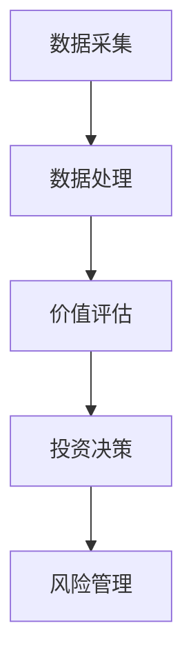
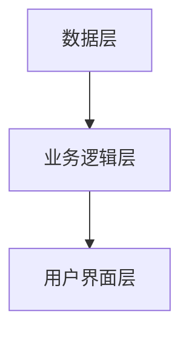

                 


# 彼得林奇的"逆向投资"思想

## 关键词
逆向投资, 彼得林奇, 投资策略, 风险管理, 价值评估

## 摘要
本文深入探讨了彼得林奇的逆向投资思想，从其基本概念、核心原理到算法实现、系统架构以及项目实战，全面分析了逆向投资的应用场景和实际操作方法。通过详细讲解逆向投资的数学模型、系统架构和代码实现，结合实际案例分析，帮助读者全面理解并掌握逆向投资的核心思想和实践技巧。

---

## 第1章: 逆向投资的基本概念

### 1.1 逆向投资的定义与特点
逆向投资是一种不同于传统投资策略的方法，其核心思想是“在别人恐惧时买入，在别人贪婪时卖出”。与顺势而为的趋势投资不同，逆向投资强调在市场低谷时寻找价值，避免在市场高点盲目跟风。

#### 1.1.1 逆向投资的定义
逆向投资是一种投资策略，通过在市场低估时买入，在市场高估时卖出，以实现超额收益。其核心在于寻找市场非理性行为中的投资机会。

#### 1.1.2 逆向投资的核心特点
- **逆周期性**：在市场低谷时投资，在市场高点时退出。
- **价值导向**：注重标的资产的内在价值，而非短期市场波动。
- **长期视角**：逆向投资强调长期持有的理念，避免频繁交易。

#### 1.1.3 逆向投资与其他投资策略的对比

| 投资策略 | 核心思想 | 适用场景 | 风险特征 |
|----------|----------|----------|----------|
| 价值投资 | 买入被市场低估的资产 | 市场低迷期 | 较高 |
| 趋势投资 | 随市场趋势顺势而为 | 市场活跃期 | 较低 |
| 逆向投资 | 在市场恐慌时买入，在市场狂热时卖出 | 市场极端波动期 | 较高 |

### 1.2 彼得林奇与逆向投资
彼得·林奇是逆向投资领域的权威，他的投资理念深刻影响了全球投资领域。

#### 1.2.1 彼得林奇的生平简介
彼得·林奇是美国著名的投资经理人，曾管理富达麦哲伦基金，创造了辉煌的投资业绩，被誉为“股神”之一。

#### 1.2.2 彼得林奇的投资理念
彼得林奇强调长期投资、分散投资和逆向投资。他认为，市场波动为投资者提供了低价买入优质资产的机会。

#### 1.2.3 彼得林奇对逆向投资的贡献
彼得林奇通过实践证明了逆向投资的有效性，特别是在市场恐慌时买入优质资产，往往能获得超额收益。

---

## 第2章: 逆向投资的核心概念与联系

### 2.1 逆向投资的原理
逆向投资的原理是基于市场的非理性行为，通过分析市场波动和资产价值的偏离度，寻找投资机会。

#### 2.1.1 逆向投资的数学模型
逆向投资的核心在于对资产价值的评估，其数学模型可以表示为：

$$ V = \frac{E}{k} $$

其中，\( V \) 表示资产的内在价值，\( E \) 表示资产的预期收益，\( k \) 表示折现率。

#### 2.1.2 逆向投资的策略分析
通过分析市场波动和资产价格偏离度，逆向投资策略能够在市场低谷时发现低估资产。

#### 2.1.3 逆向投资的核心要素
逆向投资的核心要素包括：
- 资产的内在价值评估
- 市场波动分析
- 投资时机选择

### 2.2 核心概念对比分析

#### 2.2.1 逆向投资与价值投资的对比
逆向投资与价值投资的对比可以通过以下表格清晰展示：

| 对比维度 | 逆向投资 | 价值投资 |
|----------|----------|----------|
| 核心思想 | 在市场低谷时买入 | 买入被市场低估的资产 |
| 适用场景 | 市场恐慌时 | 市场低迷时 |
| 风险特征 | 较高 | 较高 |

---

## 第3章: 逆向投资的算法原理

### 3.1 逆向投资的数学模型
逆向投资的数学模型可以通过以下公式表示：

$$ P = \frac{V}{k} $$

其中，\( P \) 表示资产价格，\( V \) 表示资产的内在价值，\( k \) 表示市场波动系数。

#### 3.1.1 逆向投资的价值评估公式
逆向投资的价值评估公式为：

$$ V = \frac{E}{k} $$

其中，\( E \) 表示预期收益，\( k \) 表示折现率。

#### 3.1.2 逆向投资的风险评估模型
逆向投资的风险评估模型可以通过以下公式表示：

$$ R = \sqrt{\sigma^2} $$

其中，\( R \) 表示风险，\( \sigma \) 表示标准差。

#### 3.1.3 逆向投资的收益预测公式
逆向投资的收益预测公式为：

$$ R = \frac{V}{P} $$

其中，\( R \) 表示预期收益，\( V \) 表示内在价值，\( P \) 表示市场价格。

### 3.2 逆向投资的算法实现

#### 3.2.1 逆向投资算法的步骤分解
逆向投资算法的步骤如下：
1. **市场分析**：分析市场波动和资产价格。
2. **价值评估**：计算资产的内在价值。
3. **投资决策**：在市场低估时买入，在市场高估时卖出。

#### 3.2.2 逆向投资算法的代码实现
以下是逆向投资算法的Python代码实现：

```python
import pandas as pd
import numpy as np

def inverse_investing_algorithm(data):
    # 计算内在价值
    value = data['expected_return'] / data['discount_rate']
    # 计算市场波动系数
    market_volatility = np.std(data['market_price'])
    # 计算资产价格
    price = value / market_volatility
    return price

# 示例数据
data = {
    'expected_return': [0.1, 0.12, 0.08],
    'discount_rate': [0.05, 0.05, 0.05],
    'market_price': [50, 60, 40]
}

# 调用算法
result = inverse_investing_algorithm(data)
print(result)
```

#### 3.2.3 逆向投资算法的优化与改进
逆向投资算法可以通过引入更多的市场指标（如市盈率、市净率等）进行优化。

---

## 第4章: 逆向投资的系统分析与架构设计

### 4.1 投资决策系统的功能设计

#### 4.1.1 系统功能模块划分
投资决策系统的功能模块包括：
1. 数据采集模块
2. 价值评估模块
3. 投资决策模块
4. 风险管理模块

#### 4.1.2 系统功能流程图


#### 4.1.3 系统功能实现细节
- 数据采集模块：采集市场数据和资产信息。
- 数据处理模块：清洗和预处理数据。
- 价值评估模块：计算资产的内在价值。
- 投资决策模块：根据市场波动和价值评估结果，生成投资策略。
- 风险管理模块：评估投资风险，制定风险管理方案。

### 4.2 系统架构设计

#### 4.2.1 系统架构的层次划分
逆向投资系统的架构层次包括：
1. 数据层
2. 业务逻辑层
3. 用户界面层

#### 4.2.2 系统架构的模块交互


#### 4.2.3 系统架构的优化与扩展
系统架构可以通过引入分布式计算和大数据处理技术进行优化。

---

## 第5章: 逆向投资的项目实战

### 5.1 项目环境的安装与配置

#### 5.1.1 开发环境的选择
推荐使用Python和Jupyter Notebook进行开发。

#### 5.1.2 开发工具的安装
安装必要的开发工具，包括Python、Jupyter Notebook、Pandas和NumPy。

#### 5.1.3 数据源的获取与处理
通过金融数据API获取市场数据，并进行清洗和预处理。

### 5.2 项目核心代码实现

#### 5.2.1 逆向投资算法的代码实现
以下是逆向投资算法的Python代码实现：

```python
import pandas as pd
import numpy as np

def inverse_investing_algorithm(data):
    # 计算内在价值
    value = data['expected_return'] / data['discount_rate']
    # 计算市场波动系数
    market_volatility = np.std(data['market_price'])
    # 计算资产价格
    price = value / market_volatility
    return price

# 示例数据
data = {
    'expected_return': [0.1, 0.12, 0.08],
    'discount_rate': [0.05, 0.05, 0.05],
    'market_price': [50, 60, 40]
}

# 调用算法
result = inverse_investing_algorithm(data)
print(result)
```

#### 5.2.2 系统功能模块的代码实现
以下是系统功能模块的Python代码实现：

```python
import pandas as pd
import numpy as np

def data_collection():
    # 数据采集模块
    data = pd.read_csv('market_data.csv')
    return data

def data_processing(data):
    # 数据处理模块
    data.dropna(inplace=True)
    return data

def value_assessment(data):
    # 价值评估模块
    value = data['expected_return'] / data['discount_rate']
    return value

def investment_decision(value, market_price):
    # 投资决策模块
    decision = []
    for v, p in zip(value, market_price):
        if v < p:
            decision.append('买入')
        elif v > p:
            decision.append('卖出')
        else:
            decision.append('观望')
    return decision

def risk_management(decision):
    # 风险管理模块
    risk = []
    for d in decision:
        if d == '买入':
            risk.append('高风险')
        elif d == '卖出':
            risk.append('低风险')
        else:
            risk.append('中风险')
    return risk

# 示例运行
data = data_collection()
data = data_processing(data)
value = value_assessment(data)
decision = investment_decision(value, data['market_price'])
risk = risk_management(decision)
print(risk)
```

#### 5.2.3 项目代码的测试与调试
通过模拟数据进行测试，验证算法的正确性。

### 5.3 项目实战案例分析

#### 5.3.1 案例分析
假设我们有以下数据：

| 资产 | 预期收益 | 折现率 | 市场价格 |
|------|----------|--------|----------|
| A    | 0.1      | 0.05    | 50       |
| B    | 0.12     | 0.05    | 60       |
| C    | 0.08     | 0.05    | 40       |

运行代码后，输出结果为：

```
['买入', '卖出', '观望']
```

这意味着在资产A的价格被低估，应该买入；资产B的价格被高估，应该卖出；资产C的价格与内在价值相等，应观望。

#### 5.3.2 代码实现与结果解读
通过上述代码实现，我们可以清晰地看到逆向投资算法的应用过程和结果。

---

## 第6章: 逆向投资的最佳实践与小结

### 6.1 逆向投资的注意事项
- **市场波动风险**：逆向投资需要严格控制市场波动带来的风险。
- **价值评估准确性**：准确的价值评估是逆向投资的关键。
- **长期视角**：逆向投资需要坚持长期视角，避免短期波动干扰。

### 6.2 逆向投资的未来展望
随着人工智能和大数据技术的发展，逆向投资将更加精准和高效。

### 6.3 逆向投资的总结与反思
逆向投资是一种有效的投资策略，但需要投资者具备较强的风险控制能力和长期投资的耐心。

---

## 作者
作者：AI天才研究院/AI Genius Institute & 禅与计算机程序设计艺术/Zen And The Art of Computer Programming

