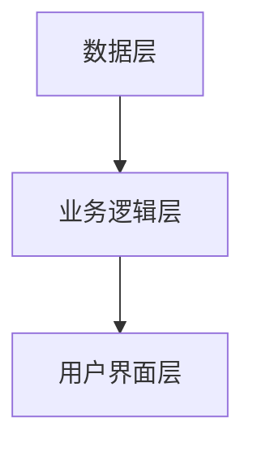
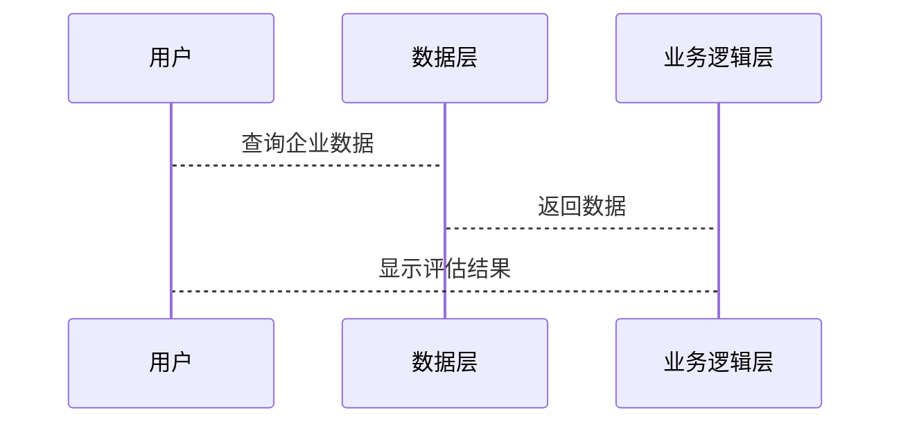

                 


# 彼得林奇的"长期价值创造"在不同行业的衡量标准

> 关键词：长期价值创造、彼得林奇、投资策略、行业分析、价值评估

> 摘要：本文探讨了彼得林奇的长期价值创造理念在不同行业的应用，通过系统的分析和详细的案例，提出了适用于不同行业的价值创造衡量标准。文章从背景、理论、方法到实践，全面解析了如何在不同行业中实现和评估长期价值创造。

---

## 第一部分：引言

### 1.1 长期价值创造的核心概念

长期价值创造是指企业在长期经营中为股东、客户和社会创造持续价值的能力。彼得林奇作为著名投资家，提出了通过深入分析企业基本面来选择具有长期价值潜力的投资标的。本文将从不同行业的特点出发，探讨如何在不同行业中衡量和实现长期价值创造。

### 1.2 问题背景与研究意义

在当前经济环境下，企业竞争日益激烈，仅靠短期利润难以实现持续发展。长期价值创造不仅是企业生存的关键，也是投资者选择优质标的的重要依据。本文旨在通过分析不同行业的特点，提出适合各自行业的长期价值创造衡量标准。

---

## 第二部分：彼得林奇的价值投资理念

### 2.1 彼得林奇的投资策略

彼得林奇主张通过基本面分析，选择具有强大竞争优势和良好管理的公司进行长期投资。他认为，企业的长期价值取决于其核心竞争力和持续盈利能力。

#### 2.1.1 核心概念
- **竞争优势**：企业在行业中独特的优势，如技术壁垒、成本优势等。
- **持续盈利能力**：企业能够持续创造利润的能力。

### 2.2 价值评估的基本方法

彼得林奇强调通过市盈率、市净率等指标来评估企业的内在价值。以下是常见的价值评估指标：

#### 2.2.1 核心指标对比表格

| 指标       | 定义                     | 适用行业                     |
|------------|--------------------------|------------------------------|
| 市盈率 (P/E) | 每股价格 / 每股收益       | 所有行业                     |
| 市净率 (P/B) | 每股价格 / 每股净资产       | 银行、制造业等                |
| 净利润      | 利润总额                 | 所有行业                     |
| 股东权益回报率 (ROE) | 净利润 / 股东权益         | 所有行业                     |

---

## 第三部分：不同行业的价值创造特点

### 3.1 制造业的价值创造

制造业的长期价值创造主要体现在成本控制和技术创新上。以下是制造业的衡量标准：

#### 3.1.1 制造业的衡量标准
- **成本控制能力**：单位产品成本是否具有竞争力。
- **技术创新能力**：是否能持续推出新产品或改进现有产品。

#### 3.1.2 制造业案例分析
以某汽车制造公司为例，通过技术创新和成本优化，该公司在行业内保持了较高的利润率。

### 3.2 信息技术行业的价值创造

信息技术行业的长期价值创造主要依赖于技术创新和市场拓展能力。

#### 3.2.1 信息技术行业的衡量标准
- **技术研发投入**：研发投入占收入的比例。
- **市场增长潜力**：是否能在新兴市场中获取份额。

#### 3.2.2 信息技术案例分析
以某软件公司为例，通过持续的研发投入，该公司成功开发了多款热门软件，占据了较大的市场份额。

### 3.3 金融行业的价值创造

金融行业的长期价值创造主要体现在风险管理能力和资本运作效率上。

#### 3.3.1 金融行业的衡量标准
- **风险管理能力**：能否有效控制不良资产比例。
- **资本运作效率**：是否能通过资本运作提升资产回报率。

#### 3.3.2 金融案例分析
以某银行为例，通过优化风险管理流程，该银行的不良贷款率显著下降，资本回报率大幅提升。

### 3.4 消费行业的价值创造

消费行业的长期价值创造主要依赖于品牌影响力和客户忠诚度。

#### 3.4.1 消费行业的衡量标准
- **品牌影响力**：品牌知名度和美誉度。
- **客户忠诚度**：客户重复购买率。

#### 3.4.2 消费案例分析
以某饮料公司为例，通过提升品牌影响力和优化客户服务，该公司在市场竞争中占据了领先地位。

---

## 第四部分：价值创造的系统架构与设计

### 4.1 系统功能设计

为了实现长期价值创造的衡量与评估，可以构建一个综合评估系统。

#### 4.1.1 数据采集模块
- 采集企业的财务数据、市场数据等。

#### 4.1.2 指标计算模块
- 计算市盈率、市净率等核心指标。

#### 4.1.3 评估报告生成模块
- 生成企业长期价值创造的评估报告。

### 4.2 系统架构设计

使用分层架构设计，包括数据层、业务逻辑层和用户界面层。

#### 4.2.1 分层架构图



### 4.3 接口设计与交互流程

#### 4.3.1 系统接口设计
- 数据接口：与企业财务系统对接。
- 用户接口：供投资者查询评估结果。

#### 4.3.2 交互流程图



---

## 第五部分：项目实战与案例分析

### 5.1 项目环境安装

需要安装以下工具：
- 数据分析工具：Python、Excel。
- 可视化工具：Matplotlib、Tableau。

### 5.2 核心实现代码

以下是一个简单的价值评估代码示例：

```python
def calculate_pe_ratio(price, earnings):
    return price / earnings

price = 50
earnings = 5
pe_ratio = calculate_pe_ratio(price, earnings)
print(f"市盈率：{pe_ratio}")
```

### 5.3 实际案例分析

以某科技公司为例，通过上述代码计算其市盈率，并结合行业特点进行综合评估。

---

## 第六部分：总结与展望

### 6.1 最佳实践

- 定期更新评估指标。
- 结合行业特点制定个性化衡量标准。

### 6.2 小结

通过本文的分析，我们可以看出，彼得林奇的长期价值创造理念在不同行业中有不同的实现方式和衡量标准。投资者和企业管理者需要根据行业特点选择合适的策略。

### 6.3 注意事项

- 数据分析需结合行业背景。
- 指标计算需确保数据的准确性和完整性。

### 6.4 拓展阅读

- 彼得林奇的《选股的智慧》。
- 其他投资经典书籍。

---

## 作者信息

作者：AI天才研究院/AI Genius Institute & 禅与计算机程序设计艺术/Zen And The Art of Computer Programming

