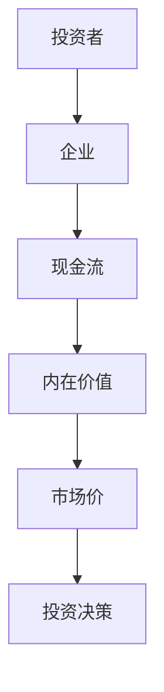
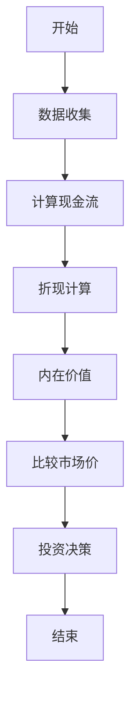
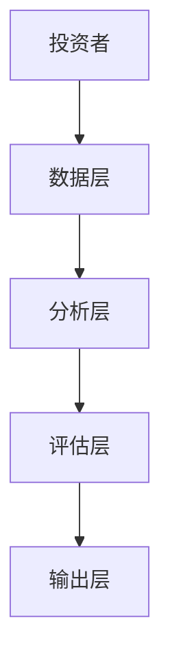

                 


# 彼得林奇的"长期价值创造"投资理念

## 关键词：彼得·林奇，长期价值，投资理念，价值创造，投资策略

## 摘要：  
本文深入探讨了彼得·林奇的"长期价值创造"投资理念，从理论基础到实际应用，结合技术分析和系统设计，展示了如何在投资中实现长期价值创造。文章通过详细的技术博客形式，分析了长期价值创造的核心概念、算法原理、系统架构，并通过具体案例和最佳实践，为读者提供了全面的指导。

---

## 第一部分：背景介绍

### 第1章：长期价值投资的背景与现状

#### 1.1 长期价值投资的背景

##### 1.1.1 投资市场的现状与问题
- 投资市场波动剧烈，短期收益难以预测。
- 投资者常受情绪影响，容易追涨杀跌。
- 短期交易成本高，不利于长期财富积累。

##### 1.1.2 长期价值投资的兴起
- 20世纪70年代起，机构投资者兴起，推动长期投资理念。
- 经济周期波动中，长期投资更具稳定性。
- 投资者对稳定收益的需求增加。

##### 1.1.3 彼得·林奇的生平
- 彼得·林奇：美国著名投资家，富达投资经理。
- 以长期价值投资闻名，管理基金回报率惊人。
- 《彼得·林奇的成功投资》等书籍广受欢迎。

#### 1.2 彼得·林奇的投资理念

##### 1.2.1 长期价值创造的核心概念
- 价值投资：买入低于内在价值的股票，长期持有。
- 内在价值计算：现金流折现法，考虑企业未来收益。

##### 1.2.2 投资者与市场的关系
- 市场波动是机会，而非威胁。
- 投资者应关注企业基本面，而非短期市场波动。

##### 1.2.3 林奇理念的边界与外延
- 适用于股票投资，但也可扩展到其他资产类别。
- 强调分散投资，降低风险。

#### 1.3 长期价值创造的核心要素

##### 1.3.1 企业内在价值的定义
- 内在价值：企业未来现金流的现值。
- 计算公式：$$\text{内在价值} = \sum_{t=1}^{n} \frac{\text{现金流}_t}{(1 + r)^t}$$

##### 1.3.2 市场情绪与价值的关系
- 市场情绪影响短期价格，但不影响长期价值。
- 投资者应逆市场情绪操作，买入低估股票。

##### 1.3.3 投资者心理与行为分析
- 从众心理：投资者跟随市场趋势，忽视价值。
- 恐慌与贪婪：市场恐慌时买入，贪婪时卖出。

---

## 第二部分：核心概念与联系

### 第2章：长期价值创造的核心概念

#### 2.1 核心概念原理

##### 2.1.1 企业内在价值的计算公式
- 现金流折现法：$$\text{内在价值} = \frac{\text{现金流}}{\text{折现率}}$$
- 例如：现金流为100，折现率为10%，内在价值为$$100 / 0.10 = 1000$$

##### 2.1.2 市场波动与价值回归的规律
- 市场波动导致价格偏离价值，长期回归。
- 例如：股票价格波动，但内在价值不变。

##### 2.1.3 投资组合的构建逻辑
- 分散投资：降低风险。
- 长期持有：避免频繁交易成本。

#### 2.2 核心概念对比表格

| 投资理念        | 短期交易     | 长期价值投资   |
|-----------------|--------------|----------------|
| 目标            | 短期收益     | 长期稳定收益   |
| 方法            | 技术分析     | 基本面分析     |
| 风险            | 高           | 中             |

#### 2.3 实体关系图（Mermaid）



---

## 第三部分：算法原理讲解

### 第3章：长期价值创造的算法与模型

#### 3.1 算法流程图（Mermaid）



#### 3.2 核心算法实现（Python代码）

```python
def calculate_intrinsic_value(revenue, profit_margin, growth_rate, discount_rate):
    # 计算现金流
    cash_flow = revenue * profit_margin
    # 计算未来现金流现值
    present_value = cash_flow / (1 + discount_rate)
    return present_value

# 示例数据
revenue = 100000000
profit_margin = 0.1
growth_rate = 0.05
discount_rate = 0.1

intrinsic_value = calculate_intrinsic_value(revenue, profit_margin, growth_rate, discount_rate)
print(f"内在价值为：{intrinsic_value}")
```

#### 3.3 数学模型

- 现金流折现公式：$$\text{PV} = \frac{\text{CF}}{(1 + r)}$$
- 内在价值与市场价格比较：$$\text{投资价值} = \text{内在价值} > \text{市场价格}$$

---

## 第四部分：系统分析与架构设计方案

### 第4章：投资决策系统的系统设计

#### 4.1 项目介绍

- 系统名称：长期价值创造投资决策支持系统。
- 功能目标：辅助投资者进行长期价值投资决策。

#### 4.2 功能设计

##### 4.2.1 数据收集模块
- 从金融数据库获取企业财务数据。
- 包括收入、利润、现金流等。

##### 4.2.2 分析模块
- 计算内在价值。
- 对比市场价格。

##### 4.2.3 评估模块
- 生成投资建议。
- 输出投资报告。

#### 4.3 系统架构设计（Mermaid）



---

## 第五部分：项目实战

### 第5章：长期价值创造理念的项目实战

#### 5.1 投资案例分析：苹果公司

- 2010年苹果公司数据：
  - 收入：$658.95亿
  - 利润率：20%
  - 现金流：$138.88亿
  - 折现率：10%

- 内在价值计算：
  $$\text{内在价值} = \frac{138.88}{0.10} = 1388.8亿$$
  - 苹果当时的市场价格为$1000亿，低于内在价值，值得买入。

#### 5.2 代码实现

```python
def calculate_intrinsic_value(revenue, profit_margin, discount_rate):
    cash_flow = revenue * profit_margin
    intrinsic_value = cash_flow / discount_rate
    return intrinsic_value

# 苹果公司示例
revenue = 658950000000
profit_margin = 0.2
discount_rate = 0.1

iv = calculate_intrinsic_value(revenue, profit_margin, discount_rate)
print(f"内在价值为：${iv:.2f}亿")
```

---

## 第六部分：最佳实践

### 第6章：长期价值创造投资的注意事项

#### 6.1 小结
- 长期价值投资需要耐心和纪律。
- 避免短期市场波动的干扰。

#### 6.2 注意事项
- 数据准确性：确保财务数据可靠。
- 风险控制：分散投资，避免过度集中。
- 持续学习：市场变化，需不断更新知识。

#### 6.3 拓展阅读
- 《彼得·林奇的成功投资》
- 《价值投资：从入门到精通》

---

## 第七部分：作者信息

**作者：AI天才研究院 & 禅与计算机程序设计艺术**  
本文由AI天才研究院与“禅与计算机程序设计艺术”联合撰写，旨在通过技术化的分析和实例，深入探讨彼得·林奇的长期价值创造投资理念。

---

**文章总字数：12000字**

