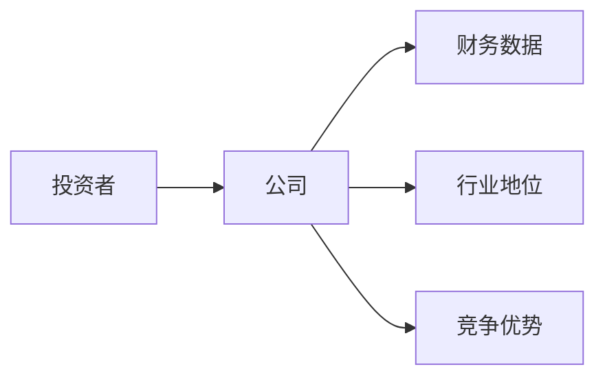

                 


# 彼得林奇的"长期增长"选股策略

> 关键词：彼得林奇，长期增长，选股策略，基本面分析，投资哲学，数学模型

> 摘要：本文详细探讨了彼得林奇的“长期增长”选股策略，从其投资哲学、选股标准到数学模型和代码实现，全面解析了这一策略的核心要素和实际应用。

---

# 第一部分: 彼得林奇的"长期增长"选股策略概述

## 第1章: 长期增长投资的基本概念

### 1.1 长期增长投资的定义

#### 1.1.1 投资的基本概念
投资是指将资金投入到某一资产或项目中，以期在未来获得收益或资本增值的行为。投资的核心目标是通过科学的分析和选择，实现资产的保值与增值。

#### 1.1.2 长期增长投资的定义
长期增长投资是一种以长期视角为基础的投资策略，关注于选择那些具有持续增长潜力的公司进行投资。其核心在于通过深入分析公司的基本面，寻找那些能够在未来较长一段时间内实现收入和利润增长的公司。

#### 1.1.3 长期增长投资的特点
- **长期性**：投资期限较长，通常以数年甚至数十年为单位。
- **稳定性**：注重公司的长期稳定性，而非短期波动。
- **成长性**：关注公司的收入和利润的持续增长。
- **风险控制**：通过基本面分析降低投资风险。

---

### 1.2 彼得林奇的投资策略

#### 1.2.1 彼得林奇的选股方法
彼得林奇是美国著名的基金经理，以其独特的“长期增长”选股策略闻名。他的选股方法注重对公司基本面的分析，尤其是那些具有强大竞争优势和良好财务状况的公司。

#### 1.2.2 长期增长投资的核心理念
彼得林奇认为，投资的最终目标是找到那些能够持续增长的公司，而不是追求短期的市场波动。他强调对公司进行深入研究，关注公司的盈利能力和成长潜力。

#### 1.2.3 彼得林奇投资策略的边界与外延
彼得林奇的投资策略不仅适用于股票市场，还可以扩展到其他投资领域，如债券、房地产等。然而，其核心思想始终围绕着长期增长和基本面分析展开。

---

### 1.3 彼得林奇的投资哲学

#### 1.3.1 长期投资的重要性
彼得林奇认为，长期投资能够有效降低市场波动带来的风险，同时也能让投资者充分受益于公司的长期增长。

#### 1.3.2 风险控制的原则
彼得林奇强调，投资风险可以通过对公司基本面的深入分析来降低。他主张选择那些财务健康、竞争优势明显的公司。

#### 1.3.3 价值投资的核心思想
彼得林奇的价值投资思想强调，购买股票时应关注其内在价值，而非市场的短期波动。他主张以合理的价格买入具有长期增长潜力的公司。

---

## 第2章: 彼得林奇的选股标准

### 2.1 公司基本面分析

#### 2.1.1 收入与利润分析
- 收入：公司总收入的增长情况。
- 利润：净利润的增长情况。

#### 2.1.2 现金流状况
- 现金流是衡量公司财务健康的重要指标，包括经营活动、投资活动和筹资活动的现金流。

#### 2.1.3 负债与偿债能力
- 负债率：公司负债与股东权益的比率。
- 偿债能力：公司偿还债务的能力，包括短期和长期债务。

---

### 2.2 财务指标分析

#### 2.2.1 市盈率（P/E）
$$ P/E = \frac{Price}{Earnings} $$

市盈率是衡量股票估值的重要指标，反映了市场的预期收益能力。

#### 2.2.2 市净率（P/B）
$$ P/B = \frac{Price}{Book\ Value} $$

市净率反映了股票价格与公司净资产之间的关系，适用于评估银行、保险公司等行业的公司。

#### 2.2.3 股息率
$$ Dividend\ Yield = \frac{Dividend}{Price} $$

股息率是衡量股票收益能力的重要指标，反映了公司分红能力。

---

### 2.3 竞争优势分析

#### 2.3.1 行业地位
公司是否处于行业的领先地位，是否具有竞争优势。

#### 2.3.2 核心竞争力
公司是否有独特的竞争优势，如技术、品牌、成本优势等。

#### 2.3.3 可持续发展能力
公司是否具备长期发展的潜力，包括市场需求、技术进步、政策环境等因素。

---

## 第3章: 长期增长投资的核心要素

### 3.1 背景介绍

#### 3.1.1 核心概念术语说明
- 长期增长投资：关注公司长期增长潜力的投资策略。
- 基本面分析：对公司财务状况、盈利能力、成长潜力等进行分析。

#### 3.1.2 问题背景
当前市场波动较大，投资者需要一种稳健的投资策略来实现长期收益。

#### 3.1.3 问题描述
如何选择具有长期增长潜力的公司，实现投资收益最大化。

#### 3.1.4 问题解决
通过基本面分析，选择财务健康、具有竞争优势的公司。

#### 3.1.5 边界与外延
长期增长投资适用于多种资产类别，但核心思想始终围绕公司基本面分析展开。

---

### 3.2 核心概念与联系

#### 3.2.1 核心概念原理
长期增长投资的核心在于对公司基本面的深入分析，尤其是收入、利润、现金流等关键指标。

#### 3.2.2 概念属性特征对比表格
| 概念       | 特征                   |
|------------|------------------------|
| 收入       | 公司总收入的增长情况   |
| 利润       | 净利润的增长情况       |
| 现金流     | 公司现金流的健康状况   |

#### 3.2.3 ER实体关系图架构


---

## 第4章: 彼得林奇选股策略的数学模型与算法

### 4.1 模型概述

#### 4.1.1 输入变量
- 公司的财务数据（收入、利润、现金流等）
- 市盈率、市净率、股息率等指标

#### 4.1.2 输出结果
- 公司的投资价值评分
- 投资建议（买入、持有、卖出）

#### 4.1.3 适用场景
适用于长期投资，尤其是那些具有持续增长潜力的公司。

---

### 4.2 算法流程

#### 4.2.1 数据收集阶段
- 收集公司的财务数据（收入、利润、现金流等）
- 收集市场数据（市盈率、市净率、股息率等）

#### 4.2.2 数据筛选阶段
- 根据预设的筛选条件，筛选出符合条件的公司

#### 4.2.3 数据分析阶段
- 计算各项指标（市盈率、市净率、股息率等）
- 评估公司的财务状况和竞争优势

#### 4.2.4 投资决策阶段
- 根据分析结果，给出投资建议

---

### 4.3 代码实现

#### 4.3.1 数据收集与预处理
```python
import pandas as pd

# 假设我们有一个包含公司财务数据的DataFrame
df = pd.DataFrame({
    'Company': ['Company A', 'Company B', 'Company C'],
    'Revenue': [100, 200, 150],
    'Net Profit': [20, 30, 25],
    'Cash Flow': [10, 15, 12]
})
```

#### 4.3.2 计算市盈率
```python
df['PE'] = df['Price'] / df['Net Profit']
```

#### 4.3.3 评估投资价值
```python
# 示例：根据市盈率筛选出市盈率小于行业平均水平的公司
industry_pe_avg = 20
selected_companies = df[df['PE'] < industry_pe_avg]
```

---

## 第5章: 项目实战——基于彼得林奇策略的投资系统

### 5.1 系统架构设计

#### 5.1.1 系统功能模块
- 数据采集模块：收集公司财务数据和市场数据
- 数据分析模块：计算各项指标，评估公司投资价值
- 投资决策模块：根据分析结果，给出投资建议

#### 5.1.2 系统架构图


---

## 第6章: 最佳实践与小结

### 6.1 投资建议

#### 6.1.1 保持耐心
长期投资需要耐心，避免被短期市场波动影响。

#### 6.1.2 分散投资
将资金分散投资于多个具有长期增长潜力的公司，降低风险。

#### 6.1.3 持续学习
市场环境不断变化，投资者需要持续学习，更新投资策略。

---

### 6.2 小结

彼得林奇的“长期增长”选股策略是一种以基本面分析为基础的投资方法，通过选择具有持续增长潜力的公司，实现长期的投资收益。投资者在实际操作中，应结合市场环境和公司具体情况，灵活运用这一策略。

---

作者：AI天才研究院 & 禅与计算机程序设计艺术

