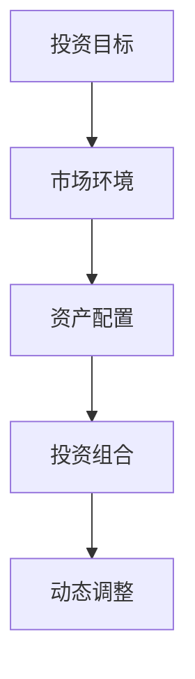
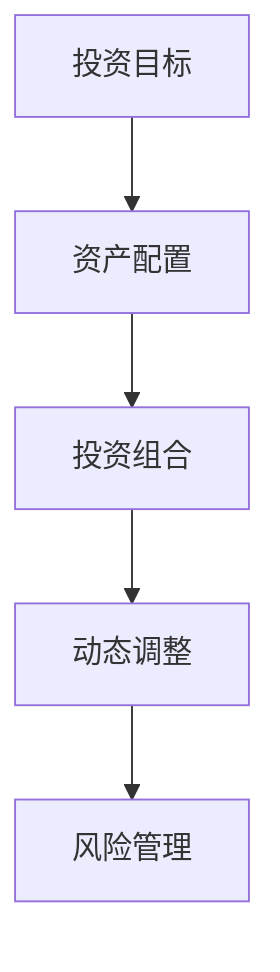
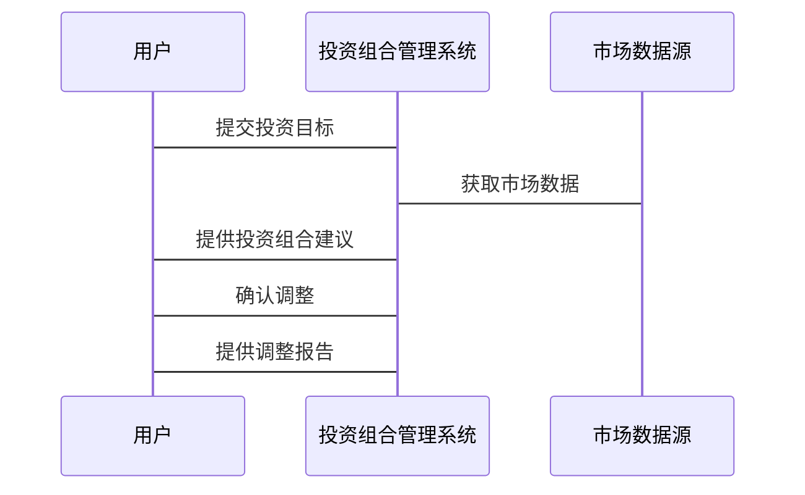

                 

# 彼得林奇的"长期持有"vs"动态再平衡"

## 关键词：彼得林奇，长期持有，动态再平衡，投资策略，风险管理

## 摘要：本文深入探讨了彼得林奇提出的两种投资策略——长期持有与动态再平衡，分析了它们的核心原理、优劣势、适用场景以及如何在实际投资中进行选择和应用。文章从背景介绍、策略对比、数学模型、系统架构到项目实战，全面解析了这两种策略的特点和应用场景，为投资者提供了实用的决策参考。

---

## 第一部分：彼得林奇投资理念概述

### 第1章：彼得林奇投资理念的核心思想

#### 1.1 彼得林奇的长期持有策略
##### 1.1.1 长期持有的定义与核心理念
长期持有策略是彼得林奇提倡的核心投资理念之一。其核心在于选择优质企业进行长期投资，避免频繁交易。优质企业通常具有稳定的收益增长、强大的竞争优势和良好的管理团队。长期持有的核心理念是通过时间的积累，让优质企业的内在价值逐步体现，从而获得超额收益。

**核心概念对比表：**

| 策略 | 核心理念 | 适用场景 | 优点 | 缺点 |
|------|----------|----------|------|------|
| 长期持有 | 买入优质企业，长期持有 | 稳定增长型市场 | 收益稳定，成本低 | 风险较大，需承担市场波动 |

##### 1.1.2 长期持有策略的优势与劣势
- **优势**：长期持有的优势在于能够避免频繁交易带来的交易成本和情绪干扰，同时充分利用复利效应，实现资产的长期增值。
- **劣势**：在市场波动较大或企业基本面变化时，长期持有可能面临较大的短期亏损风险。

##### 1.1.3 长期持有策略的经典案例分析
彼得林奇最著名的案例是投资于露华浓（Revlon）公司。他通过长期持有露华浓的股票，最终获得了丰厚的回报。这一案例展示了长期持有策略在优质企业上的成功应用。

#### 1.2 彼得林奇的动态再平衡策略
##### 1.2.1 动态再平衡的定义与核心理念
动态再平衡策略是彼得林奇提出的另一种投资方法，强调根据市场环境的变化，定期调整投资组合的资产配置。动态再平衡的核心在于通过及时调整，降低市场波动对投资组合的影响，保持资产配置的合理性。

**实体关系图：**

##### 1.2.2 动态再平衡策略的优势与劣势
- **优势**：动态再平衡的优势在于能够及时适应市场变化，降低投资组合的风险，同时抓住新的投资机会。
- **劣势**：频繁调整可能增加交易成本和税务负担，同时需要较高的市场预测能力。

##### 1.2.3 动态再平衡策略的经典案例分析
彼得林奇在20世纪80年代初通过动态再平衡策略成功应对了石油危机和经济衰退，展示了该策略在波动性市场中的有效性。

---

### 第2章：长期持有策略的深入分析

#### 2.1 长期持有的实施方法
##### 2.1.1 选择优质企业的标准
优质企业具有稳定的收益、强大的竞争优势和良好的管理团队。彼得林奇特别强调企业的财务健康状况和行业地位。

**选择优质企业的标准：**

- **财务健康**：低负债率、高利润率、稳定的现金流。
- **行业地位**：市场领导者、较高的进入壁垒。
- **管理团队**：优秀的管理层和明确的战略规划。

##### 2.1.2 长期持有的风险管理
长期持有策略的风险管理主要体现在定期审视投资组合，评估企业的基本面变化，并在必要时进行调整。

##### 2.1.3 长期持有的组合优化
通过分散投资、定期审视和动态调整，优化投资组合的风险和收益比。

#### 2.2 长期持有策略的适用场景
- **稳定增长型市场**：适合长期持有的环境，市场波动较小，企业基本面稳定。
- **周期性行业**：需要谨慎选择，避免在周期性低谷时持有过多相关股票。

---

### 第3章：动态再平衡策略的深入分析

#### 3.1 动态再平衡的实施方法
##### 3.1.1 定期调整的时间间隔
动态再平衡的调整频率通常为季度或半年，具体取决于市场波动和投资目标的变化。

##### 3.1.2 调整幅度的确定
调整幅度应根据市场变化和投资目标的偏离程度来确定，通常在资产配置偏离5%以上时进行调整。

##### 3.1.3 调整过程中的风险管理
通过设定止损点和止盈点，控制投资组合的风险，避免过度调整带来的损失。

#### 3.2 动态再平衡策略的适用场景
- **波动性市场**：适合动态再平衡的环境，市场波动较大，需要及时调整资产配置。
- **不同资产类别间的平衡**：通过动态再平衡实现资产类别之间的合理配置，分散风险。

---

## 第二部分：长期持有与动态再平衡的对比分析

### 第4章：长期持有与动态再平衡的优劣势对比

#### 4.1 两种策略的核心区别
- **长期持有**：强调长期投资，避免频繁交易。
- **动态再平衡**：强调根据市场变化，定期调整投资组合。

#### 4.2 不同市场环境下的适用性
- **稳定市场**：长期持有策略更优。
- **波动性市场**：动态再平衡策略更优。

#### 4.3 个人风险偏好的影响
- **风险厌恶型投资者**：更适合动态再平衡策略。
- **风险偏好型投资者**：更适合长期持有策略。

---

## 第三部分：数学模型与系统架构

### 第5章：长期持有与动态再平衡的数学模型

#### 5.1 长期持有的数学模型
长期持有的数学模型基于复利计算，公式如下：

$$
FV = PV \times (1 + r)^t
$$

其中，FV为终值，PV为现值，r为年化收益率，t为时间。

#### 5.2 动态再平衡的数学模型
动态再平衡的数学模型基于现代投资组合理论，通过优化模型确定最优资产配置。

$$
\text{目标函数：} \quad \min_w \quad \frac{1}{2}w^T \Sigma w
$$

$$
\text{约束条件：} \quad \sum_{i=1}^n w_i = 1
$$

其中，\( w \) 为资产权重向量，\( \Sigma \) 为资产间的协方差矩阵。

---

## 第四部分：项目实战与系统架构

### 第6章：投资组合管理系统架构

#### 6.1 项目介绍
构建一个基于彼得林奇策略的投资组合管理系统，实现长期持有和动态再平衡的策略。

#### 6.2 系统功能设计
- **资产配置模块**：根据市场环境和投资目标，确定资产配置比例。
- **动态调整模块**：定期调整投资组合，实现动态再平衡。
- **风险管理模块**：监控投资组合的风险，设定止损和止盈点。

#### 6.3 系统架构图

#### 6.4 系统接口设计
- **输入接口**：市场数据、投资目标。
- **输出接口**：投资组合建议、调整报告。

#### 6.5 系统交互图

---

## 第五部分：总结与最佳实践

### 第7章：总结与投资建议

#### 7.1 总结
长期持有与动态再平衡各有优劣，适用于不同的市场环境和投资者风险偏好。投资者应根据自身情况选择合适的策略。

#### 7.2 投资建议
- **风险厌恶型投资者**：采用动态再平衡策略，降低投资组合的风险。
- **风险偏好型投资者**：采用长期持有策略，追求长期收益。
- **混合型投资者**：将两种策略结合使用，根据市场环境灵活调整。

#### 7.3 最佳实践 tips
- 定期审视投资组合，评估市场环境和投资目标的变化。
- 保持合理的资产配置，分散风险。
- 避免频繁交易，降低交易成本和税务负担。

---

## 作者：AI天才研究院/AI Genius Institute & 禅与计算机程序设计艺术 /Zen And The Art of Computer Programming

---

**摘要**：本文通过详细分析彼得林奇的长期持有和动态再平衡策略，探讨了它们的核心原理、优劣势、适用场景以及在投资组合管理中的应用。文章结合数学模型、系统架构和项目实战，为投资者提供了实用的决策参考。

