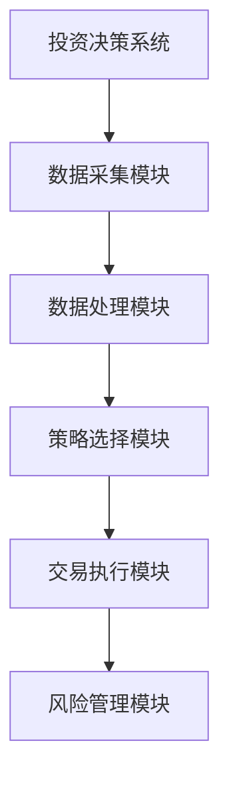
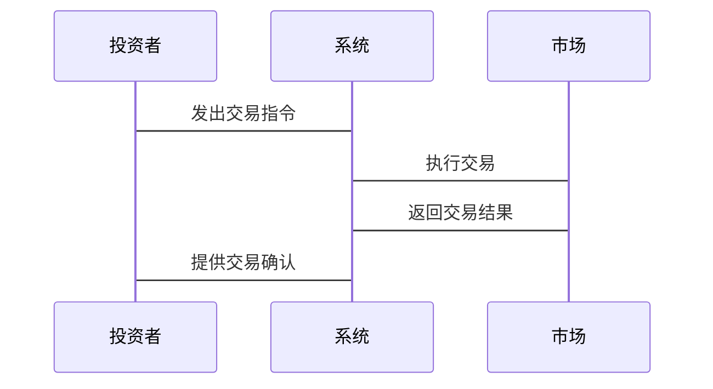

                 


# 彼得林奇的"长期持有"vs"择时交易"

> 关键词：长期持有，择时交易，彼得林奇，投资策略，收益与风险

> 摘要：本文通过对比分析彼得林奇的长期持有投资策略与择时交易策略，探讨两种策略的核心原理、优缺点及其在实际投资中的应用。通过数学模型和实际案例，帮助读者理解不同投资策略的特点，从而做出更明智的投资决策。

---

## 第一章: 投资策略的背景与基本概念

### 1.1 投资的基本概念

投资是将资金投入到能够产生收益的资产或项目中，以实现财富增值的过程。投资的核心要素包括本金、收益、风险和时间。投资者需要在风险与收益之间找到平衡点，以实现长期的财务目标。

### 1.2 长期持有与择时交易的定义

#### 1.2.1 长期持有
长期持有是一种投资策略，强调长期持有优质资产，不频繁买卖。其核心理念是通过复利效应实现财富的稳步增长。投资者选择具有持续增长潜力的资产，如优质股票或房地产，并长期持有，以避免短期市场波动的影响。

#### 1.2.2 拆解交易
拆解交易是一种基于市场时机的选择策略，强调通过技术分析或市场预测来选择最佳的买卖时机。投资者根据市场走势、技术指标或基本面分析，买入低估资产并卖出高估资产，以实现超额收益。

### 1.3 两种策略的核心区别与联系

长期持有与择时交易的核心区别在于投资时间跨度和操作频率。长期持有注重资产的长期增值，而择时交易则关注短期市场波动。两者都旨在实现收益最大化，但实现路径不同。

---

## 第二章: 长期持有策略的核心原理

### 2.1 长期持有的核心概念

长期持有策略的核心在于选择优质资产，并长期持有。投资者相信优质资产的价值会长期增长，市场波动不会影响其长期趋势。彼得林奇在其职业生涯中，通过长期持有优质股票，实现了卓越的投资回报。

### 2.2 长期持有策略的数学模型

#### 2.2.1 复利计算公式
复利是长期持有的核心驱动力。复利公式为：
$$ FV = PV \times (1 + r)^n $$
其中，$FV$ 是未来价值，$PV$ 是现值，$r$ 是年化收益率，$n$ 是投资年数。

#### 2.2.2 长期持有收益的计算方法
长期持有收益不仅包括资本增值，还包括股息再投资的收益。通过复利效应，投资者可以实现财富的指数增长。

### 2.3 长期持有策略的优缺点分析

#### 2.3.1 优点
- **稳定性**：长期持有可以避免频繁交易带来的交易成本和税务负担。
- **复利效应**：长期持有能够最大化复利效应，实现财富的稳步增长。
- **心理优势**：长期持有能够减少投资者因短期波动而做出的非理性决策。

#### 2.3.2 缺点
- **流动性限制**：长期持有可能导致资金流动性不足。
- **市场风险**：如果长期持有的资产价值大幅下跌，投资者可能面临较大损失。
- **选择优质资产的难度**：长期持有要求投资者具备较高的资产筛选能力。

---

## 第三章: 拆解交易策略的核心原理

### 3.1 拆解交易的核心概念

拆解交易策略强调通过技术分析或基本面分析来选择最佳的买卖时机。投资者通过预测市场走势，买入低估资产，卖出高估资产，以实现超额收益。

### 3.2 拆解交易策略的数学模型

#### 3.2.1 移动平均线的计算公式
移动平均线是一种常用的技术分析工具，用于判断市场趋势。计算公式为：
$$ MA_n = \frac{1}{n} \sum_{i=1}^{n} P_i $$
其中，$P_i$ 是第 $i$ 天的价格，$n$ 是窗口大小。

#### 3.2.2 拆解交易中的收益计算
拆解交易的收益取决于买卖时机的选择。通过准确预测市场波动，投资者可以在价格高点卖出，在低点买入，从而实现超额收益。

### 3.3 拆解交易策略的优缺点分析

#### 3.3.1 优点
- **灵活性**：拆解交易可以根据市场变化及时调整投资策略。
- **超额收益潜力**：通过准确预测市场走势，投资者可以获得超额收益。
- **风险管理**：拆解交易可以通过止损机制降低投资风险。

#### 3.3.2 缺点
- **复杂性**：拆解交易需要较高的市场分析能力和交易技巧。
- **交易成本**：频繁交易可能导致较高的交易成本和税务负担。
- **市场预测的不确定性**：拆解交易的成功高度依赖于市场预测的准确性，而市场走势往往难以预测。

---

## 第四章: 长期持有与拆解交易的对比分析

### 4.1 核心概念对比

| 核心概念         | 长期持有                          | 拆解交易                          |
|------------------|-----------------------------------|------------------------------------|
| 投资理念         | 买入并长期持有优质资产            | 根据市场走势进行买卖               |
| 操作频率         | 低频                             | 高频                             |
| 风险承受能力     | 较低                             | 较高                             |
| 适用场景         | 长期稳健增长                      | 短期超额收益                      |

### 4.2 理论基础对比

| 理论基础         | 长期持有                          | 拆解交易                          |
|------------------|-----------------------------------|------------------------------------|
| 基础假设         | 资产长期增值                     | 市场波动可预测                    |
| 核心工具         | 价值分析                        | 技术分析                        |
| 投资目标         | 稳定增长                         | 超额收益                         |

### 4.3 实际应用对比

| 应用场景         | 长期持有                          | 拆解交易                          |
|------------------|-----------------------------------|------------------------------------|
| 适用投资者类型     | 风险承受能力较低，追求稳定收益    | 风险承受能力较高，追求超额收益    |
| 适合市场环境     | 稳定增长的市场环境                | 波动性较大的市场环境              |

---

## 第五章: 投资策略的选择与实际案例

### 5.1 投资策略的选择

投资者在选择投资策略时，需要考虑自身风险承受能力、投资目标、市场环境以及投资期限。长期持有适合追求稳定收益的投资者，而拆解交易适合具备较高市场分析能力的投资者。

### 5.2 实际案例分析

#### 5.2.1 长期持有案例
假设投资者投资于彼得林奇的经典案例——可口可乐公司。从1981年到2000年，可口可乐的股价从每股10美元增长到每股40美元。通过长期持有，投资者实现了年化12%的收益率。

#### 5.2.2 拆解交易案例
假设投资者在2020年3月预测市场即将反弹，买入标普500指数基金，并在2020年8月卖出，实现收益率20%。通过拆解交易，投资者在短期内获得了超额收益。

---

## 第六章: 投资策略的系统分析与架构设计

### 6.1 投资决策系统的功能设计

| 功能模块         | 描述                               |
|------------------|------------------------------------|
| 数据采集         | 收集市场数据，包括价格、成交量等    |
| 策略选择         | 根据市场情况选择长期持有或拆解交易 |
| 交易执行         | 执行买卖指令                       |
| 风险管理         | 设置止损和止盈机制                |

### 6.2 系统架构设计



### 6.3 交易执行模块的交互设计



---

## 第七章: 项目实战——投资策略的代码实现

### 7.1 环境安装

安装Python和相关库：
```bash
pip install numpy pandas matplotlib
```

### 7.2 长期持有策略的代码实现

```python
import numpy as np

def compound_interest(pv, r, n):
    return pv * (1 + r) ** n

# 示例计算
pv = 10000  # 初始投资
r = 0.07    # 年化收益率
n = 10      # 投资年数
fv = compound_interest(pv, r, n)
print(f"未来价值: {fv:.2f}")
```

### 7.3 拆解交易策略的代码实现

```python
import pandas as pd
import matplotlib.pyplot as plt

def moving_average(prices, window):
    return prices.rolling(window).mean()

# 示例计算
data = pd.read_csv('stock_data.csv')
window = 10
ma = moving_average(data['Price'], window)
plt.plot(data['Date'], data['Price'], label='Price')
plt.plot(data['Date'], ma, label='MA_10')
plt.legend()
plt.show()
```

---

## 第八章: 总结与展望

### 8.1 总结

长期持有和拆解交易是两种截然不同的投资策略，各有优缺点。长期持有适合追求稳定收益的投资者，而拆解交易适合具备较高市场分析能力的投资者。投资者需要根据自身情况选择适合的策略。

### 8.2 投资策略的选择建议

- **长期持有**：适合风险承受能力较低、投资期限较长的投资者。
- **拆解交易**：适合风险承受能力较高、具备市场分析能力的投资者。

### 8.3 未来研究方向

- 混合策略的研究：结合长期持有和拆解交易的优点，制定更灵活的投资策略。
- 人工智能在投资策略中的应用：利用机器学习算法进行市场预测和策略优化。

---

## 作者：AI天才研究院/AI Genius Institute & 禅与计算机程序设计艺术 /Zen And The Art of Computer Programming

---

本文通过详细分析彼得林奇的长期持有策略与拆解交易策略，帮助读者理解两种策略的核心原理、优缺点及其在实际投资中的应用。通过数学模型和实际案例，读者可以更好地选择适合自己的投资策略，并在投资过程中做出明智的决策。

