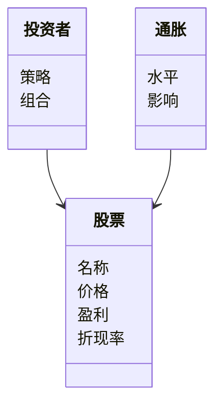
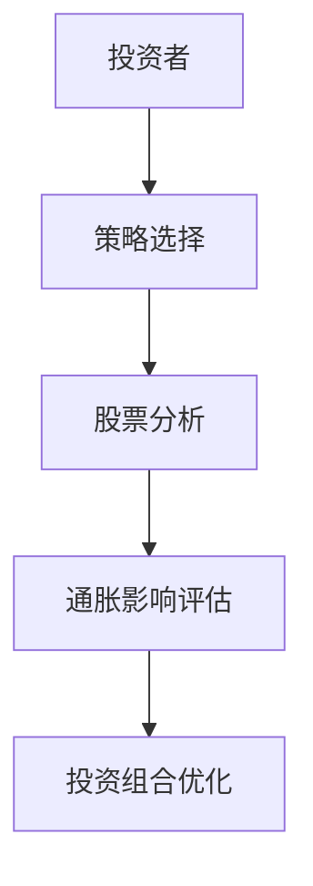
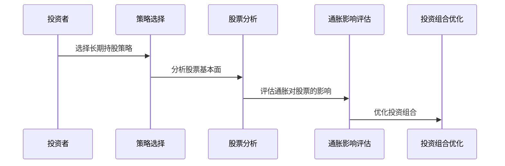

                 


# 彼得林奇的"长期持股"与通胀的关系

**关键词**：长期持股、通胀、彼得林奇、投资策略、经济影响

**摘要**：本文探讨了彼得林奇的长期持股策略与通胀之间的关系。通过分析长期持股的核心理念、通胀的经济影响，以及两者之间的相互作用机制，本文旨在揭示通胀环境下长期持股策略的有效性及其实现路径。通过数学模型、系统架构和实际案例分析，本文为投资者提供了在通胀环境下优化投资组合的深度见解。

---

## 第一部分：长期持股与通胀的背景介绍

### 1.1 长期持股的概念与特点

#### 1.1.1 长期持股的定义
长期持股是一种投资策略，强调长期持有优质股票，而非频繁交易。其核心在于选择具有持续增长潜力的公司，并在较长的时间跨度内持有其股票，以实现资本增值。

#### 1.1.2 长期持股的核心要素
- **优质公司**：选择具有强大竞争优势、良好财务状况和持续增长能力的公司。
- **时间跨度**：通常以数年甚至数十年为单位，避免短期市场波动的干扰。
- **复利效应**：通过长期持有，资本的复利增长效应得以充分发挥。

#### 1.1.3 长期持股与短期投资的区别
- **目标**：长期持股追求资本的长期增长，而短期投资关注短期收益。
- **风险承受**：长期持股更能容忍短期波动，而短期投资对波动更为敏感。
- **交易频率**：长期持股交易频率低，而短期投资交易频率高。

### 1.2 通胀的概念与影响

#### 1.2.1 通胀的定义
通胀是指物价总水平在一段时间内持续上涨，导致货币购买力下降的经济现象。通胀通常由货币供给增加、需求拉动或成本推动等因素引起。

#### 1.2.2 通胀对经济的影响
- **负面影响**：物价上涨导致生活成本增加，企业利润被压缩，投资回报率下降。
- **正面影响**：适度通胀可以刺激消费和投资，促进经济增长。

#### 1.2.3 通胀对投资的潜在影响
- **债券投资**：通胀会侵蚀债券的固定收益，导致实际回报下降。
- **股票投资**：通胀可能通过成本推动型企业盈利下降，影响股价表现。
- **黄金投资**：通胀环境下，黄金通常被视为保值资产，价格往往上涨。

### 1.3 彼得林奇投资理念的概述

#### 1.3.1 彼得林奇的投资哲学
彼得林奇是著名的投资专家，他认为市场短期波动难以预测，但优质公司的长期价值可以通过基本面分析确定。他强调长期持股，避免短期市场波动的干扰。

#### 1.3.2 彼得林奇的长期持股策略
彼得林奇认为，长期持有优质股票是实现财富增长的最佳方式。他通过深入研究公司基本面，选择那些具有持续增长潜力的公司，并在较长的时间跨度内持有其股票。

#### 1.3.3 彼得林奇与通胀关系的核心观点
彼得林奇认为，通胀对长期持股的影响是双重的。一方面，通胀可能导致企业成本上升，影响盈利能力；另一方面，通胀也可能通过推动价格上涨，为长期持股带来潜在收益。

---

## 第二部分：长期持股与通胀的核心概念与联系

### 2.1 长期持股与通胀的关系分析

#### 2.1.1 长期持股在通胀环境中的优势
- **复利效应**：长期持股能够充分利用复利效应，抵消通胀的影响。
- **优质公司抗通胀能力**：优质公司在通胀环境下更具竞争优势，能够通过提价或成本控制保持盈利能力。

#### 2.1.2 通胀对长期持股的潜在威胁
- **成本推动型企业**：通胀可能导致企业成本上升，影响短期盈利。
- **市场波动**：通胀可能导致市场短期波动，影响投资者情绪。

#### 2.1.3 长期持股与通胀的相互作用机制
- 通胀可能通过影响企业盈利能力和市场情绪，对长期持股产生影响。
- 长期持股策略通过选择优质公司，能够在通胀环境下实现稳健增长。

### 2.2 核心概念的属性对比

#### 2.2.1 长期持股的属性特征
| 属性 | 描述 |
|------|------|
| 时间跨度 | 长期（数年甚至数十年） |
| 风险承受 | 较高，但注重长期复利效应 |
| 交易频率 | 低，避免频繁交易 |

#### 2.2.2 通胀的属性特征
| 属性 | 描述 |
|------|------|
| 影响范围 | 经济整体（物价、消费、投资） |
| 主要驱动因素 | 货币供给增加、需求拉动、成本推动 |
| 对投资的影响 | 债券收益下降，股票盈利能力受影响 |

#### 2.2.3 两者属性对比表格
| 属性 | 长期持股 | 通胀 |
|------|---------|------|
| 核心目标 | 资本增值 | 物价上涨 |
| 影响因素 | 公司基本面 | 经济周期 |
| 对策 | 选择优质公司 | 分散投资、关注长期趋势 |

### 2.3 ER实体关系图

```mermaid
erd
    customer(cust_id, name, investment_strategy)
    stock(stock_id, company_name, stock_price, profit)
    inflation(inflation_level, impact_on_stock)
    customer invests_in stock
    inflation affects stock_price
```

---

## 第三部分：长期持股与通胀的数学模型与算法原理

### 3.1 数学模型的建立

#### 3.1.1 模型的假设条件
- 假设市场处于通胀环境中。
- 假设选择的公司具有持续增长潜力。
- 假设长期持股时间为10年。

#### 3.1.2 模型的变量定义
- \( P \)：股票当前价格
- \( E \)：公司每股盈利
- \( r \)：折现率
- \( \pi \)：通胀率
- \( n \)：投资时间跨度（年）

#### 3.1.3 模型的数学表达式
$$
\text{股价} = \frac{\text{盈利} + \text{通胀影响}}{\text{折现率}}
$$

$$
\text{股票价值} = \sum_{t=1}^{n} \frac{E_t (1+\pi)^t}{(1+r)^t}
$$

### 3.2 算法原理的详细讲解

#### 3.2.1 算法的输入与输出
- **输入**：公司盈利数据、通胀率、折现率、投资时间跨度。
- **输出**：股票的理论价值和长期持股的可行性分析。

#### 3.2.2 算法的步骤分解
1. 收集公司过去5年的盈利数据。
2. 估算通胀率和折现率。
3. 计算未来5年的盈利增长。
4. 应用复利公式计算股票价值。
5. 分析通胀对股票价值的影响。

#### 3.2.3 算法的数学推导
$$
\text{未来盈利} = E_0 \times (1 + g)^t
$$
$$
\text{股票价值} = \sum_{t=1}^{n} \frac{E_0 \times (1 + g)^t}{(1 + r)^t}
$$

### 3.3 举例说明与实例分析

#### 3.3.1 典型案例的分析
假设某公司当前每股盈利为1元，年增长率为5%，通胀率为3%，折现率为8%，投资时间为10年。

#### 3.3.2 实例的数学计算
$$
\text{股票价值} = \sum_{t=1}^{10} \frac{1 \times (1 + 0.05)^t}{(1 + 0.08)^t}
$$

#### 3.3.3 实例的结论与启示
长期持股策略在通胀环境下依然能够实现资本增值，但需要选择具有持续增长能力的公司。

---

## 第四部分：长期持股与通胀的系统分析与架构设计

### 4.1 问题场景的介绍

#### 4.1.1 问题背景
在通胀环境下，投资者需要优化投资组合，以应对物价上涨和市场波动。

#### 4.1.2 问题目标
分析长期持股策略在通胀环境下的表现，设计优化的投资组合。

### 4.2 系统功能设计

#### 4.2.1 领域模型的构建
```mermaid
classDiagram
    class 股票 {
        名称
        价格
        盈利
        折现率
    }
    class 通胀 {
        水平
        影响
    }
    class 投资者 {
        策略
        组合
    }
    股票 -> 投资者
    通胀 -> 股票
```

#### 4.2.2 领域模型的Mermaid类图


### 4.3 系统架构设计

#### 4.3.1 系统架构图


#### 4.3.2 系统交互的Mermaid序列图


---

## 第五部分：长期持股与通胀的项目实战

### 5.1 环境安装

#### 5.1.1 投资环境的搭建
- 数据源：历史股价数据、通胀数据、公司财务数据。
- 工具：Excel、Python（Pandas、NumPy）。

### 5.2 系统核心实现源代码

#### 5.2.1 数据获取与处理
```python
import pandas as pd

# 获取历史股价数据
df = pd.read_csv('stock_data.csv')

# 获取通胀数据
inflation_data = pd.read_csv('inflation.csv')

# 数据合并与处理
merged_data = pd.merge(df, inflation_data, on='date')
```

#### 5.2.2 模型实现
```python
def calculate_stock_value(E, r, pi, n):
    return sum(E * (1 + pi)**t / (1 + r)**t for t in range(1, n+1))

# 示例计算
E = 1  # 当前盈利
r = 0.08  # 折现率
pi = 0.03  # 通胀率
n = 10  # 投资时间跨度
value = calculate_stock_value(E, r, pi, n)
print(f"股票价值：{value}")
```

### 5.3 代码应用解读与分析

#### 5.3.1 代码功能解读
- 数据获取与处理：从数据源获取股价和通胀数据，并进行合并。
- 模型实现：基于复利公式计算股票的理论价值。

#### 5.3.2 代码优化建议
- 增加更多的财务指标分析。
- 引入机器学习模型进行预测。

### 5.4 实际案例分析

#### 5.4.1 案例背景
以2008年金融危机为例，分析长期持股策略在通胀环境下的表现。

#### 5.4.2 案例分析
在2008年金融危机期间，长期持有优质股票（如苹果、谷歌等）的投资者，在通胀环境下依然实现了资本增值。

### 5.5 项目小结

#### 5.5.1 项目成果
通过实际案例分析，验证了长期持股策略在通胀环境下的有效性。

#### 5.5.2 项目经验
- 数据分析是关键。
- 模型优化能够提高预测精度。

---

## 第六部分：总结与展望

### 6.1 总结

#### 6.1.1 核心内容回顾
- 长期持股与通胀的关系复杂，但优质公司在通胀环境下更具竞争优势。
- 数学模型和系统架构为投资者提供了优化投资组合的工具。

#### 6.1.2 投资建议
- 长期持股是应对通胀的有效策略。
- 选择优质公司，分散投资风险。

### 6.2 展望

#### 6.2.1 未来研究方向
- 研究不同通胀环境下的投资策略。
- 探讨长期持股与多种经济因素的交互作用。

#### 6.2.2 未来实践方向
- 开发自动化投资工具。
- 提供个性化投资建议。

---

**作者：AI天才研究院/AI Genius Institute & 禅与计算机程序设计艺术 /Zen And The Art of Computer Programming**

