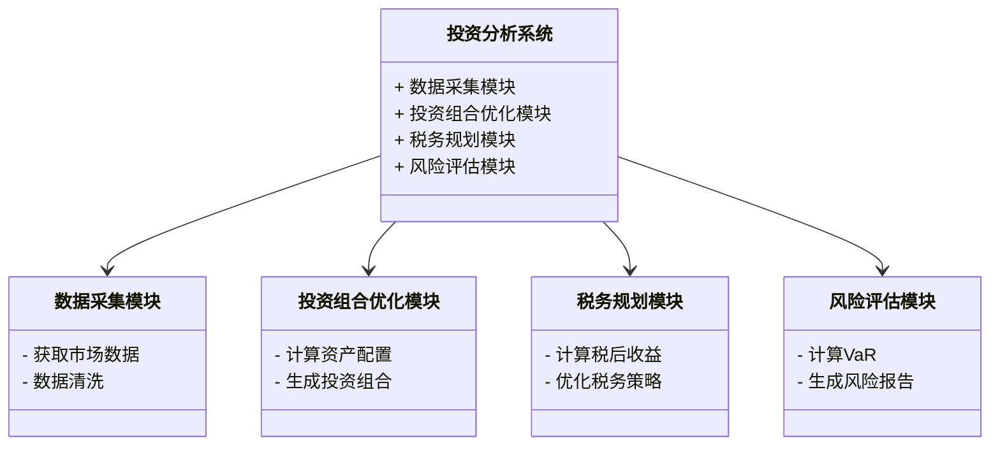
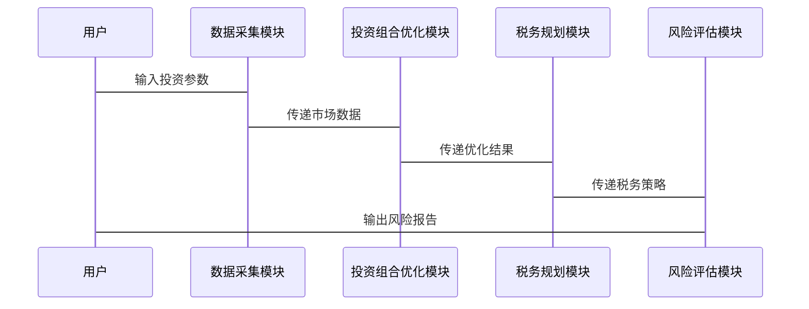

                 


# 彼得林奇的"长期持股"税收优化策略

## 关键词：长期持股，税收优化，资本利得税，投资策略，彼得·林奇，投资组合，税务规划

## 摘要：本文深入探讨了彼得·林奇的长期持股策略及其在税收优化中的应用。通过分析长期资本利得税的优惠政策，结合投资组合的构建与税务规划，本文提出了优化投资收益的具体方法。文章从理论到实践，详细阐述了如何通过长期持股实现税收优化，并通过实际案例和系统设计提供可操作的指导。

---

# 第一部分: 引言

## 1.1 长期持股策略的背景与重要性
### 1.1.1 投资环境的复杂性与不确定性
现代投资市场充满不确定性，投资者面临复杂的市场波动和经济周期变化。长期持股策略通过减少交易频率，降低了市场短期波动对投资组合的冲击。

### 1.1.2 长期持股策略的核心优势
- **稳定性**：长期持股减少了频繁交易的交易成本和心理压力。
- **复利效应**：通过长期持有优质股票，投资者可以最大化复利效应，实现财富的长期增长。
- **税务优化**：长期资本利得税的优惠政策降低了税收负担，提升了投资收益。

### 1.1.3 税收对投资收益的影响
税收是影响投资回报的重要因素。通过优化税务规划，投资者可以最大化税后收益，实现财富的可持续增长。

## 1.2 税收优化的基本概念
### 1.2.1 税收对投资收益的影响
税收直接从投资收益中扣除，影响最终的净收益。合理的税务规划可以降低税收负担，提升投资回报率。

### 1.2.2 美国税法中的投资相关条款
- **长期资本利得税**：持有超过一年的资本利得享受较低税率。
- **股息税**：美国税法规定，符合条件的股息收入享受较低税率或免税。

### 1.2.3 长期资本利得税的优惠政策
- **税率档次**：长期资本利得税分为0%、15%和20%三档，具体税率取决于投资者的收入水平和 filing status。
- **税收递减效应**：通过合理配置资产，投资者可以享受更低的税率。

## 1.3 彼得·林奇投资理念的概述
### 1.3.1 彼得·林奇的投资哲学
彼得·林奇强调长期投资和价值投资，认为市场波动是投资机会的来源。

### 1.3.2 长期持股策略的核心要素
- **优质股票选择**：投资于具有强大竞争优势和良好管理的公司。
- **长期持有**：避免频繁交易，减少交易成本和税务负担。

### 1.3.3 税收优化与投资回报的关系
通过合理规划税务，投资者可以最大化投资收益，实现财富的长期增长。

## 1.4 本书的结构与目标
### 1.4.1 本书的主要内容
本书将从理论到实践，系统地分析长期持股策略及其在税收优化中的应用。

### 1.4.2 读者对象与预期收获
本书适合个人投资者、金融从业者以及对投资策略感兴趣的读者。

### 1.4.3 本书的逻辑框架
- 第一部分：引言
- 第二部分：长期持股策略的理论基础
- 第三部分：税收优化的系统分析
- 第四部分：实战指导与案例分析
- 第五部分：总结与展望

---

# 第二部分: 长期持股策略的理论基础

## 2.1 税收优化的基本原理
### 2.1.1 税前与税后收益的计算
- **税前收益**：资本利得 = 卖出价 - 买入价
- **税后收益**：税后收益 = 资本利得 × (1 - 税率)

### 2.1.2 美国税法中的长期资本利得税计算公式
$$ \text{税后收益} = \text{资本利得} \times (1 - \text{税率}) $$

### 2.1.3 税收递减的数学模型
$$ \text{净收益} = \text{毛收益} \times (1 - \text{税率}) $$

## 2.2 长期资本利得税的优惠政策
### 2.2.1 长期资本利得税的税率档次
- 0%：适用于收入低于特定 thresholds 的纳税人
- 15%：适用于大多数中高收入的纳税人
- 20%：适用于高收入的纳税人

### 2.2.2 股息税的优惠政策
- **合格股息**：符合条件的股息收入享受较低税率或免税
- **非合格股息**：按普通收入税率征税

### 2.2.3 税务亏损的利用
- **资本亏损抵扣**：投资者可以通过资本亏损抵扣部分资本收益
- **年度亏损限额**：每人每年最多抵扣$1,500的资本亏损

## 2.3 彼得·林奇投资策略的数学模型
### 2.3.1 投资组合的构建模型
$$ \text{投资组合收益} = \sum_{i=1}^{n} w_i \times r_i $$
其中，\( w_i \) 是第 \( i \) 只股票的权重，\( r_i \) 是第 \( i \) 只股票的收益率。

### 2.3.2 长期持股的收益预测公式
$$ \text{长期收益} = \text{股息收益率} + \text{资本增值收益率} $$

### 2.3.3 税收对投资组合收益的影响分析
- 税收降低了投资的净收益
- 长期资本利得税的优惠政策减少了税收负担

---

# 第三部分: 税收优化策略的系统分析

## 3.1 系统分析与架构设计
### 3.1.1 投资分析系统的功能需求
- 数据采集与处理
- 投资组合优化
- 税务规划
- 风险评估

### 3.1.2 系统架构的模块划分
- 数据采集模块
- 投资组合优化模块
- 税务规划模块
- 风险评估模块

### 3.1.3 系统功能的 Mermaid 类图


### 3.1.4 系统接口设计
- 数据接口：从市场数据源获取股票价格和财务数据
- 用户接口：提供投资参数输入和结果输出

### 3.1.5 系统交互的 Mermaid 序列图


## 3.2 投资组合优化算法
### 3.2.1 算法原理
通过优化资产配置和投资期限，最大化税后收益。

### 3.2.2 算法实现
```python
def calculate_tax_optimized_portfolio(stocks, holding_period):
    tax_rates = determine_tax_rate(holding_period)
    returns = compute_returns(stocks)
    tax_adjusted_returns = returns * (1 - tax_rates)
    return select_stocks(tax_adjusted_returns)
```

### 3.2.3 算法优化
- 使用动态规划优化投资组合
- 结合税务规划，最大化净收益

---

# 第四部分: 实战指导与案例分析

## 4.1 环境安装与配置
### 4.1.1 安装Python环境
```bash
pip install numpy pandas matplotlib
```

### 4.1.2 安装金融分析库
```bash
pip install pandas_datareader yfinance
```

## 4.2 核心代码实现
### 4.2.1 数据采集
```python
import pandas_datareader as pdr
import numpy as np

def get_stock_data(tickers, start_date, end_date):
    data = pdr.get_data_yahoo(tickers, start=start_date, end=end_date)
    return data
```

### 4.2.2 税后收益计算
```python
def calculate_tax_adjusted_returns(capital_gains, tax_rate):
    tax_adjusted_returns = capital_gains * (1 - tax_rate)
    return tax_adjusted_returns
```

### 4.2.3 投资组合优化
```python
def optimize_portfolio(tickers, weights, returns):
    covariance_matrix = returns.cov()
    portfolio_variance = np.dot(weights.T, covariance_matrix.dot(weights))
    return portfolio_variance
```

## 4.3 案例分析
### 4.3.1 案例背景
假设投资者持有以下股票组合：
- 股票A：买入价$100，卖出价$150，持有期2年
- 股票B：买入价$50，卖出价$80，持有期1年

### 4.3.2 税务计算
- 股票A的资本利得税率为15%
- 股票B的资本利得税率为20%

### 4.3.3 净收益计算
- 股票A：税后收益 = $50 × (1 - 0.15) = $42.5
- 股票B：税后收益 = $30 × (1 - 0.20) = $24

### 4.3.4 投资组合优化
通过优化资产配置，投资者可以最大化税后收益。

---

# 第五部分: 总结与展望

## 5.1 总结
本文系统地分析了彼得·林奇的长期持股策略及其在税收优化中的应用。通过理论分析和案例研究，本文提出了优化投资收益的具体方法。

## 5.2 未来展望
随着税收政策的变化和市场环境的复杂化，投资者需要不断优化税务规划，提升投资收益。

---

# 作者：AI天才研究院/AI Genius Institute & 禅与计算机程序设计艺术 /Zen And The Art of Computer Programming

