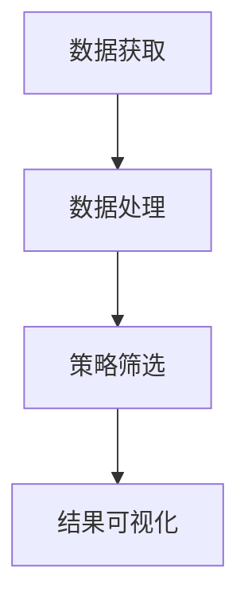

                 


---

# 彼得林奇的"高增长低估值"选股策略

> **关键词**：彼得林奇，高增长低估值，选股策略，投资，成长型投资，股票筛选

> **摘要**：本文详细解析了彼得林奇的“高增长低估值”选股策略，从理论背景、核心概念、算法原理、系统架构到项目实战，全面探讨了该策略的实施方法和实际应用。通过分析高增长与低估值的定义、量化指标，结合数学模型和系统设计，展示了如何在实际投资中应用这一策略，并通过Python代码实现选股逻辑。

---

## 第一部分：彼得林奇投资理念与“高增长低估值”策略背景

### 第1章：彼得林奇的投资哲学与方法论

#### 1.1 彼得林奇的投资哲学

彼得林奇作为历史上最成功的股票基金经理之一，其投资哲学以成长型投资为核心，强调寻找那些具有持续增长潜力的公司。他的投资理念基于以下几个核心原则：

1. **长期投资**：彼得林奇主张长期持有优质股票，避免频繁交易。
2. **基本面分析**：他强调对公司基本面的深入研究，包括财务状况、行业地位和管理团队。
3. **成长与估值的平衡**：寻找那些具有高增长潜力但估值合理的公司。

#### 1.2 “高增长低估值”选股策略的定义与特点

彼得林奇提出的“高增长低估值”策略，旨在通过筛选出具有高增长潜力但市场价格尚未充分反映其价值的公司，从而实现超额收益。其特点包括：

- **高增长**：公司收入和利润持续增长。
- **低估值**：市盈率、市净率等估值指标低于行业平均水平。
- **成长与估值的结合**：在成长性和估值之间找到平衡点。

#### 1.3 本章小结

本章介绍了彼得林奇的投资哲学，详细阐述了“高增长低估值”策略的定义和特点，为后续分析奠定了基础。

---

## 第二部分：高增长与低估值的核心概念分析

### 第2章：高增长公司的识别与量化

#### 2.1 高增长公司的核心指标

高增长公司的识别主要通过以下指标进行量化：

1. **收入增长率**：计算公式为 $收入增长率 = \frac{本期收入 - 上期收入}{上期收入} \times 100\%$。
2. **净利润增长率**：计算公式为 $净利润增长率 = \frac{本期净利润 - 上期净利润}{上期净利润} \times 100\%$。
3. **营业利润率**：衡量公司每单位收入的盈利能力。

#### 2.2 高增长公司的行业特征

高增长公司通常出现在快速发展的行业，如科技、医疗等。这些行业的公司具有创新能力强、市场扩展快的特点。

#### 2.3 高增长与低估值的结合逻辑

高增长公司通常估值较高，但通过寻找那些估值尚未被市场充分反映的高增长公司，可以在早期介入，获得超额收益。

---

### 第3章：低估值的定义与量化

#### 3.1 低估值的定义

低估值指公司股票价格低于其内在价值，通常通过市盈率（P/E）、市净率（P/B）等指标衡量。

#### 3.2 低估值的量化指标

1. **市盈率**：计算公式为 $P/E = \frac{股价}{每股收益}$。
2. **市净率**：计算公式为 $P/B = \frac{股价}{每股净资产}$。

#### 3.3 高增长与低估值的结合

通过筛选高增长但低估值的公司，可以在成长阶段介入，获得成长和估值修复的双重收益。

---

## 第三部分：高增长低估值策略的算法原理

### 第4章：数据处理与特征工程

#### 4.1 数据获取

从可靠的数据源获取公司财务数据和市场数据，包括收入、利润、市盈率等。

#### 4.2 数据清洗

处理缺失值、异常值，确保数据质量。

#### 4.3 特征提取

从财务数据中提取高增长和低估值的相关特征。

---

### 第5章：策略算法实现

#### 5.1 筛选标准

1. 收入增长率 > 行业平均值。
2. 净利润增长率 > 行业平均值。
3. 市盈率 < 行业平均值。
4. 市净率 < 行业平均值。

#### 5.2 筛选流程

1. 筛选高增长公司。
2. 筛选低估值公司。
3. 结合高增长和低估值条件，筛选出目标股票。

---

## 第四部分：系统架构设计

### 第6章：系统功能设计

#### 6.1 功能模块

1. 数据获取模块：从数据库获取公司数据。
2. 数据处理模块：清洗和特征提取。
3. 策略筛选模块：根据条件筛选股票。
4. 可视化模块：展示筛选结果。

#### 6.2 系统架构图



---

## 第五部分：项目实战

### 第7章：环境安装与代码实现

#### 7.1 环境安装

安装Python、Pandas、NumPy、Matplotlib。

#### 7.2 代码实现

```python
import pandas as pd
import numpy as np

def calculate_growth(revenue, profit):
    revenue_growth = ((revenue['current'] - revenue['previous']) / revenue['previous']) * 100
    profit_growth = ((profit['current'] - profit['previous']) / profit['previous']) * 100
    return revenue_growth, profit_growth

def calculate_valuation(pe, pb):
    pe_ratio = pe['current'] / pe['industry_avg']
    pb_ratio = pb['current'] / pb['industry_avg']
    return pe_ratio, pb_ratio

# 示例数据
revenue = {'previous': 100, 'current': 150}
profit = {'previous': 50, 'current': 75}
pe = {'current': 15, 'industry_avg': 20}
pb = {'current': 2, 'industry_avg': 3}

growth = calculate_growth(revenue, profit)
valuation = calculate_valuation(pe, pb)
print(growth, valuation)
```

---

## 第六部分：总结与展望

### 第8章：策略的应用与总结

#### 8.1 本章总结

彼得林奇的“高增长低估值”策略通过筛选高增长但估值合理的公司，实现超额收益。其关键在于对企业基本面的深入分析和对估值的准确判断。

#### 8.2 注意事项

1. 定期更新数据。
2. 结合行业趋势分析。
3. 风险控制。

#### 8.3 拓展阅读

推荐阅读彼得林奇的《战胜市场的人》和《投资的智慧》。

---

**作者：AI天才研究院 & 禅与计算机程序设计艺术**

