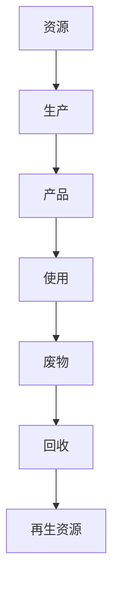

                 

# 循环经济在不同行业的应用前景比较

> 关键词：循环经济，可持续发展，资源利用，环境保护，行业应用，经济效益

> 摘要：本文探讨循环经济在不同行业的应用前景，分析其在制造业、农业、能源和服务业中的具体实施方式和潜在效益，结合实际案例，总结循环经济在这些领域的优势与挑战，为实现可持续发展目标提供参考。

---

## 第一章：循环经济的定义与背景

### 1.1 循环经济的基本概念
循环经济是一种以资源高效利用和循环利用为核心经济模式，通过延长产品生命周期和优化资源流动，实现经济与环境的协调发展。

### 1.2 循环经济的起源与发展
循环经济起源于20世纪60年代的环境运动，随着全球资源枯竭和环境问题的加剧，循环经济逐渐成为全球关注的焦点。

### 1.3 循环经济的核心原则
- 资源最大化利用
- 废物最小化产生
- 系统整体优化

---

## 第二章：循环经济的核心概念与联系

### 2.1 循环经济的核心概念
循环经济通过设计、制造、使用和回收等环节，实现资源的循环利用，减少对环境的依赖。

### 2.2 循环经济与其他经济模式的对比
- 线性经济：资源-产品-废物
- 循环经济：资源-产品-再生资源

### 2.3 循环经济与可持续发展的关系
循环经济是实现可持续发展的重要途径，通过减少资源消耗和环境污染，促进经济与生态的平衡。

---

## 第三章：循环经济的数学模型与算法原理

### 3.1 资源循环利用的数学模型
通过线性规划模型优化资源分配，最大化资源利用率。

### 3.2 废物资源化利用的优化模型
使用博弈论模型分析不同利益相关者的最优策略。

---

## 第四章：循环经济的系统分析与架构设计

### 4.1 循环经济系统的组成与功能
- 资源输入模块
- 产品生产模块
- 废物处理模块

### 4.2 循环经济系统的流程图

---

## 第五章：循环经济在不同行业的应用

### 5.1 制造业中的应用
通过产品再制造和废弃物再利用，减少资源消耗和环境污染。

### 5.2 农业中的应用
采用有机废弃物堆肥和循环农业模式，提高资源利用效率。

### 5.3 能源行业的应用
通过可再生能源的回收利用和能源梯级利用，实现资源的高效利用。

### 5.4 服务业中的应用
通过共享经济和循环经济的理念，减少资源浪费。

---

## 第六章：循环经济的挑战与解决方案

### 6.1 制造业中的挑战
- 技术门槛高
- 初始投资大

### 6.2 农业中的挑战
- 技术支持不足
- 政策引导不足

### 6.3 解决方案
- 政府政策支持
- 技术创新与合作

---

## 第七章：总结与展望

循环经济在不同行业的应用前景广阔，通过技术创新和政策支持，可以实现资源的高效利用和环境保护，为可持续发展目标提供有力支持。

---

作者：AI天才研究院/AI Genius Institute & 禅与计算机程序设计艺术 /Zen And The Art of Computer Programming

