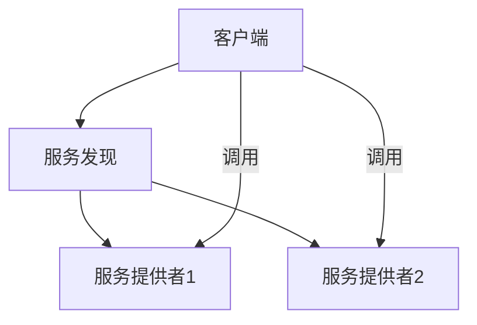
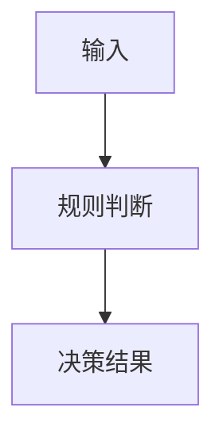
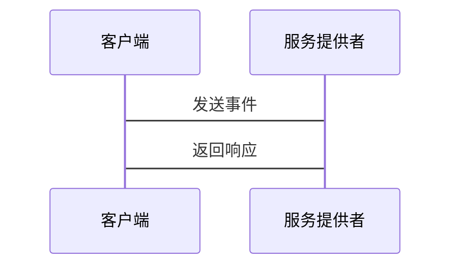
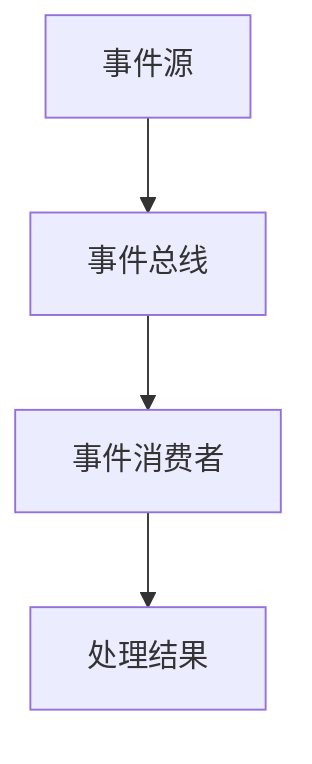
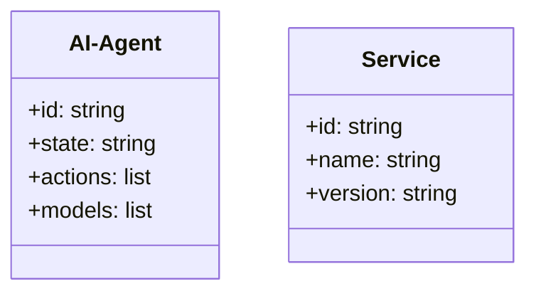
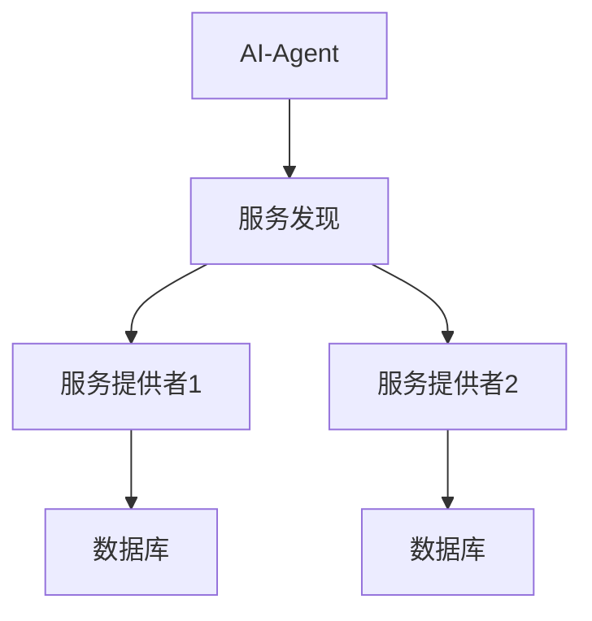
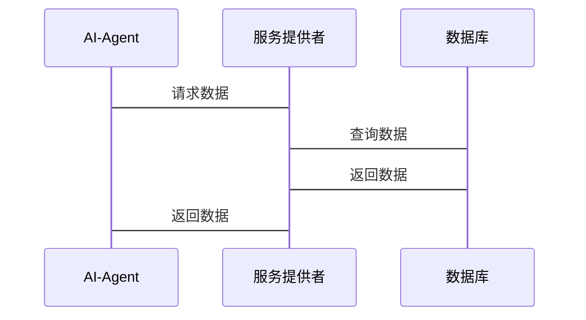

                 


# 微服务架构：构建模块化的AI Agent系统

> 关键词：微服务架构, AI Agent, 模块化设计, 服务发现, 负载均衡, 事件驱动

> 摘要：本文探讨了如何利用微服务架构构建模块化的AI Agent系统。首先介绍了微服务架构和AI Agent的基本概念及其结合的重要性。然后深入分析了微服务架构的核心原理，包括组件交互、治理策略和开发部署流程。接着，详细讲解了AI Agent的核心算法和通信协议，展示了如何在微服务架构下实现模块化设计。通过实际案例分析，本文还展示了如何设计和实现一个模块化的AI Agent系统，并给出了最佳实践和小结。

---

# 第一部分: 微服务架构与AI Agent系统概述

## 第1章: 微服务架构与AI Agent概述

### 1.1 微服务架构的核心概念

#### 1.1.1 微服务架构的定义与特点
微服务架构是一种将应用程序分解为多个小型、独立服务的开发方法。每个服务都是一个独立的进程，围绕业务功能进行构建和部署。其特点包括：
- **独立性**：每个服务独立开发和部署。
- **松耦合**：服务之间通过API进行通信，避免紧耦合。
- **可扩展性**：每个服务可以根据需求独立扩展。

#### 1.1.2 微服务架构与传统单体架构的区别
| 属性       | 微服务架构               | 单体架构               |
|------------|--------------------------|------------------------|
| 开发方式     | 分布式开发               | 集中式开发             |
| 部署方式     | 独立部署                 | 整体部署               |
| 可扩展性     | 高                      | 低                    |

#### 1.1.3 微服务架构的优缺点分析
- **优点**：
  - 提高开发效率。
  - 服务独立性高。
  - 支持持续集成和持续交付。
- **缺点**：
  - 复杂性增加。
  - 服务间通信开销大。
  - 运维成本高。

### 1.2 AI Agent的基本概念

#### 1.2.1 AI Agent的定义与分类
AI Agent是一种能够感知环境并采取行动以实现目标的智能实体。它可以分为：
- **简单反射Agent**：基于当前输入做出反应。
- **基于模型的反射Agent**：维护环境状态并基于模型做出决策。

#### 1.2.2 AI Agent的核心功能与应用场景
- **核心功能**：感知、推理、决策、执行。
- **应用场景**：智能助手、自动驾驶、推荐系统。

#### 1.2.3 AI Agent与传统软件开发的区别
| 属性       | AI Agent                 | 传统软件               |
|------------|--------------------------|------------------------|
| 决策方式     | 基于数据和模型           | 基于规则和逻辑         |
| 学习能力     | 可以通过数据训练         | 无法学习               |

### 1.3 微服务架构与AI Agent的结合

#### 1.3.1 微服务架构在AI Agent中的优势
- **模块化**：AI Agent的不同功能模块可以独立开发和部署。
- **可扩展性**：根据需求扩展特定服务。

#### 1.3.2 AI Agent如何实现模块化
通过将AI Agent的功能分解为多个微服务，每个服务负责特定任务，如数据采集、模型训练、决策推理等。

#### 1.3.3 微服务架构与AI Agent的协同工作原理
- **服务发现**：AI Agent通过服务发现机制找到所需服务。
- **事件驱动**：AI Agent通过事件驱动机制与其他服务进行交互。

## 1.4 本章小结
本章介绍了微服务架构和AI Agent的基本概念，分析了它们的优缺点，并探讨了它们的结合方式。通过模块化设计，AI Agent可以在微服务架构下实现高效、灵活的功能扩展。

---

## 第2章: 微服务架构的核心原理

### 2.1 微服务架构的组件与交互

#### 2.1.1 微服务架构的主要组件
- **服务提供者**：提供特定功能的服务。
- **服务消费者**：调用服务的客户端或服务。
- **服务发现**：用于服务注册和发现的组件。

#### 2.1.2 微服务之间的通信机制
- **HTTP REST API**：基于HTTP协议的RESTful API。
- **RPC**：远程过程调用协议。
- **gRPC**：高性能的RPC框架。

#### 2.1.3 微服务的发现与调用流程


### 2.2 微服务架构的治理策略

#### 2.2.1 服务发现与负载均衡
- **服务发现**：通过注册中心发现可用服务。
- **负载均衡**：将请求分发到不同的服务实例。

#### 2.2.2 服务容错与故障恢复
- **容错机制**：通过熔断和重试实现服务容错。
- **故障恢复**：自动恢复失败的服务调用。

#### 2.2.3 服务版本管理与兼容性
- **版本控制**：通过API版本号管理服务版本。
- **兼容性**：确保新旧版本服务能够协同工作。

### 2.3 微服务架构的开发与部署

#### 2.3.1 微服务的开发流程
- **独立开发**：每个服务独立开发和测试。
- **持续集成**：通过CI/CD工具实现持续集成和交付。

#### 2.3.2 微服务的部署与容器化技术
- **容器化**：使用Docker容器部署服务。
- **编排**：通过Kubernetes进行容器编排。

#### 2.3.3 微服务的监控与日志管理
- **监控**：通过Prometheus监控服务状态。
- **日志管理**：使用ELK栈集中化日志管理。

## 2.4 本章小结
本章详细讲解了微服务架构的核心原理，包括组件与交互、治理策略和开发部署流程。通过服务发现、负载均衡和容错机制，确保系统的高效和稳定。

---

## 第3章: AI Agent的核心算法原理

### 3.1 AI Agent的决策算法

#### 3.1.1 基于规则的决策算法


#### 3.1.2 基于机器学习的决策算法
- **监督学习**：基于标记数据训练模型。
- **无监督学习**：基于未标记数据发现模式。

#### 3.1.3 基于强化学习的决策算法
- **策略网络**：通过策略梯度优化决策。
- **价值函数**：通过Q-learning学习最优动作。

### 3.2 AI Agent的通信协议

#### 3.2.1 HTTP协议的使用
- **RESTful API**：常用HTTP方法（GET、POST、PUT、DELETE）。

#### 3.2.2 RPC协议的使用
- **gRPC**：基于HTTP/2的高性能RPC框架。

#### 3.2.3 事件驱动的通信机制


### 3.3 AI Agent的事件处理机制

#### 3.3.1 事件驱动的处理流程


#### 3.3.2 事件的订阅与发布
- **发布者**：发布事件。
- **订阅者**：接收并处理事件。

#### 3.3.3 事件的优先级与处理顺序
- **优先级**：根据事件的重要性排序。
- **顺序处理**：按事件发生的顺序处理。

## 3.4 本章小结
本章详细讲解了AI Agent的核心算法和通信协议，包括基于规则、机器学习和强化学习的决策算法，以及事件驱动的通信机制。

---

## 第4章: 微服务架构下的AI Agent系统设计

### 4.1 系统功能设计

#### 4.1.1 领域模型设计


#### 4.1.2 系统架构设计


#### 4.1.3 系统接口设计
- **API接口**：定义RESTful API接口。
- **事件接口**：定义事件发布和订阅接口。

#### 4.1.4 系统交互流程


### 4.2 项目实战

#### 4.2.1 环境安装
- **安装Docker**：用于容器化部署。
- **安装Kubernetes**：用于容器编排。
- **安装Prometheus**：用于监控。

#### 4.2.2 核心代码实现
```python
# 示例代码：AI-Agent的决策模块
class DecisionService:
    def __init__(self):
        self.models = []

    def make_decision(self, input_data):
        # 调用不同的模型进行决策
        for model in self.models:
            if model.is_applicable(input_data):
                return model.predict(input_data)
        return default_decision(input_data)
```

#### 4.2.3 代码解读与分析
- **决策模块**：负责根据输入数据调用相应的模型进行决策。
- **模型管理**：管理AI Agent使用的各种模型。

#### 4.2.4 案例分析
- **场景**：智能推荐系统。
- **实现**：AI Agent通过分析用户行为，调用推荐服务生成推荐列表。

### 4.3 最佳实践

#### 4.3.1 小结
- **模块化设计**：将AI Agent的功能分解为多个微服务。
- **服务发现与负载均衡**：确保系统的高效和稳定。
- **事件驱动**：实现服务之间的高效交互。

#### 4.3.2 注意事项
- **服务容错**：确保系统能够容忍部分服务的故障。
- **日志管理**：方便故障排查和性能优化。
- **安全**：确保服务之间的通信安全。

#### 4.3.3 拓展阅读
- **微服务架构**：Eric Evans的《微服务架构》。
- **AI Agent**：Russell和Norvig的《人工智能：一种现代Approach》。

## 4.4 本章小结
本章详细讲解了如何在微服务架构下设计和实现模块化的AI Agent系统，包括系统功能设计、项目实战和最佳实践。

---

# 作者信息

作者：AI天才研究院/AI Genius Institute & 禅与计算机程序设计艺术 /Zen And The Art of Computer Programming

---

通过以上内容，我详细地介绍了微服务架构和AI Agent的基本概念、核心原理、系统设计和项目实战。希望对读者有所帮助。

