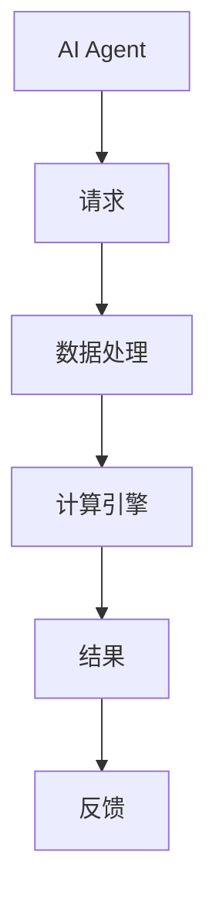
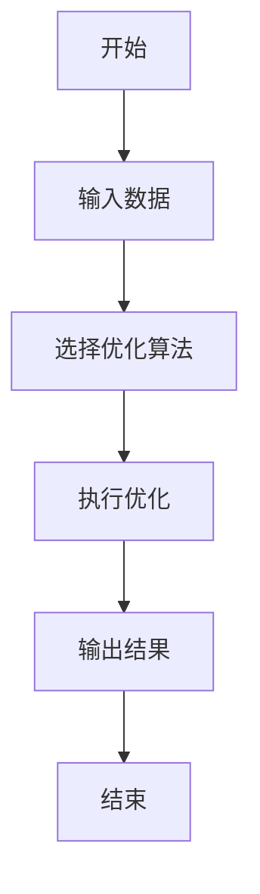
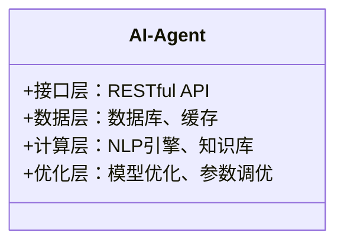
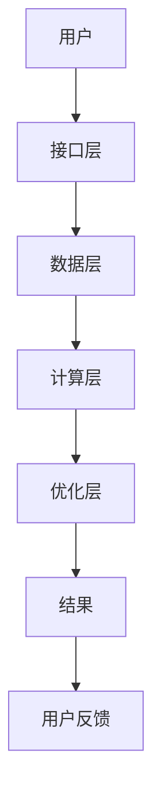
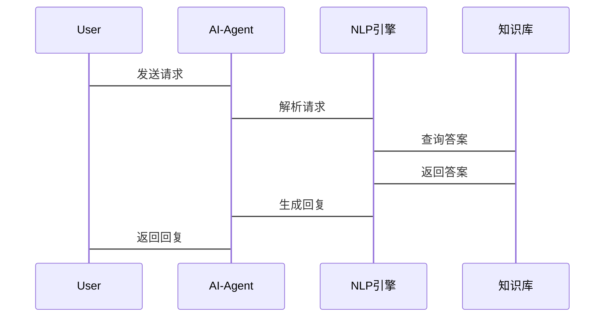

                 


# 性能优化：提高AI Agent的响应速度

## 关键词：
AI Agent, 性能优化, 响应速度, 算法优化, 系统架构, 数据处理

## 摘要：
本文详细探讨了如何优化AI Agent的性能，特别是提高其响应速度。通过分析AI Agent的响应流程，介绍了性能优化的核心原理、算法优化策略、系统架构设计和项目实战案例。文章还总结了性能优化的最佳实践，为读者提供了全面的优化思路和具体实施方法。

---

# 第一部分: AI Agent性能优化背景与核心概念

## 第1章: AI Agent性能优化概述

### 1.1 AI Agent的基本概念
#### 1.1.1 AI Agent的定义与核心要素
AI Agent（人工智能代理）是一种能够感知环境并采取行动以实现目标的智能体。其核心要素包括：
- **感知能力**：通过传感器或API获取环境数据。
- **决策能力**：基于数据进行分析和推理，做出决策。
- **执行能力**：通过执行器或API将决策转化为行动。
- **学习能力**：通过机器学习算法不断优化自身的性能。

#### 1.1.2 AI Agent的分类与应用场景
AI Agent可以分为以下几类：
- **反应式AI Agent**：实时响应环境输入，适用于需要快速反应的场景，如自动驾驶。
- **认知式AI Agent**：具备复杂推理和规划能力，适用于智能助手、医疗诊断等场景。
- **学习型AI Agent**：通过强化学习或监督学习不断优化自身行为，如AlphaGo、ChatGPT。

#### 1.1.3 性能优化的目标与意义
性能优化的目标是提高AI Agent的响应速度、准确率和稳定性。其意义在于：
- **提升用户体验**：更快的响应速度和更准确的结果能够显著提升用户体验。
- **降低成本**：优化性能可以减少计算资源的消耗，降低运营成本。
- **扩大应用场景**：高性能的AI Agent能够支持更多复杂场景的应用。

### 1.2 AI Agent性能优化的背景与挑战
#### 1.2.1 当前AI Agent的性能瓶颈
当前AI Agent面临的主要性能瓶颈包括：
- **计算资源限制**：复杂的模型需要大量的计算资源，导致响应速度慢。
- **数据处理效率**：大规模数据的处理速度直接影响响应时间。
- **算法复杂度**：某些算法的计算复杂度较高，导致优化困难。

#### 1.2.2 响应速度对用户体验的影响
响应速度是用户体验的核心指标之一。研究表明，用户的耐心阈值大约在2秒左右，超过这个时间，用户体验会显著下降。

#### 1.2.3 行业对AI Agent性能优化的需求
随着AI技术的广泛应用，行业对AI Agent的性能优化需求日益增长。特别是在实时性要求高的领域，如金融交易、自动驾驶等，性能优化尤为重要。

### 1.3 本章小结
本章从AI Agent的基本概念、分类和应用场景入手，分析了性能优化的目标与意义，并总结了当前面临的挑战和行业需求。

---

# 第二部分: AI Agent性能优化的核心概念与联系

## 第2章: AI Agent性能优化的核心原理

### 2.1 AI Agent的响应流程分析
#### 2.1.1 请求接收与解析
AI Agent通过API接收用户的请求，并对请求进行解析，提取关键信息。

#### 2.1.2 数据处理与计算
AI Agent根据解析后的请求，调用相应的数据处理模块，进行特征提取、数据清洗等操作。

#### 2.1.3 结果生成与反馈
AI Agent通过计算引擎生成结果，并将结果通过反馈机制返回给用户。

### 2.2 性能优化的关键点
#### 2.2.1 算法优化
- **优化目标**：降低算法的计算复杂度，提高计算效率。
- **优化方法**：使用更高效的算法，如随机梯度下降（SGD）替代批量梯度下降（BGD）。

#### 2.2.2 系统架构优化
- **优化目标**：减少系统架构的瓶颈，提高整体性能。
- **优化方法**：采用分层架构，优化数据流动路径。

#### 2.2.3 数据处理优化
- **优化目标**：提高数据处理速度，减少数据冗余。
- **优化方法**：使用分布式计算和流处理技术。

### 2.3 核心概念关系图
#### 2.3.1 AI Agent核心概念属性对比表
| 概念       | 属性1 | 属性2 | 属性3 |
|------------|-------|-------|-------|
| 请求接收   | 时延   | 带宽   | 误差率 |
| 数据处理   | 精度   | 速度   | 资源消耗 |
| 计算引擎   | 并行性 | 算子数量 | 内存占用 |

#### 2.3.2 AI Agent实体关系图


---

# 第三部分: AI Agent性能优化算法原理

## 第3章: AI Agent响应优化算法

### 3.1 基础算法分析
#### 3.1.1 梯度下降算法
梯度下降算法是一种常用优化算法，其数学模型如下：
$$
\theta_{new} = \theta_{old} - \eta \cdot \nabla J(\theta_{old})
$$
其中，$\eta$是学习率，$\nabla J(\theta_{old})$是目标函数在$\theta_{old}$处的梯度。

#### 3.1.2 随机梯度下降算法
随机梯度下降算法是一种更高效的优化算法，其流程如下：
1. 初始化参数$\theta$。
2. 随机选取一批训练样本。
3. 计算梯度并更新参数：
$$
\theta_{new} = \theta_{old} - \eta \cdot \nabla J(\theta_{old}, \text{一批样本})
$$

#### 3.1.3 算法复杂度分析
算法复杂度分析包括时间复杂度和空间复杂度。常用的大O符号表示法，如$O(n)$、$O(n^2)$等。

### 3.2 算法优化策略
#### 3.2.1 参数优化
- **优化目标**：降低参数的冗余性。
- **优化方法**：使用L1/L2正则化，减少模型参数数量。

#### 3.2.2 模型剪枝
- **优化目标**：去除冗余节点，减少计算量。
- **优化方法**：基于梯度重要性进行节点剪枝。

#### 3.2.3 并行计算
- **优化目标**：利用多核或分布式计算资源，提高计算速度。
- **优化方法**：使用GPU加速、分布式计算框架（如Spark、TensorFlow分布式）。

### 3.3 算法优化流程图


### 3.4 算法实现代码示例
#### 3.4.1 Python实现的梯度下降算法
```python
def gradient_descent(X, y, theta, alpha, iterations):
    m = len(y)
    for _ in range(iterations):
        h = X.dot(theta)
        loss = h - y
        gradient = (X.T.dot(loss)) / m
        theta = theta - alpha * gradient
    return theta
```

#### 3.4.2 随机梯度下降算法
```python
def stochastic_gradient_descent(X, y, theta, alpha, iterations, batch_size):
    m = len(y)
    for _ in range(iterations):
        idx = np.random.randint(0, m, batch_size)
        h = X[idx].dot(theta)
        loss = h - y[idx]
        gradient = (X[idx].T.dot(loss)) / batch_size
        theta = theta - alpha * gradient
    return theta
```

### 3.5 算法优化效果对比
通过对比梯度下降和随机梯度下降的优化效果，可以发现随机梯度下降在大规模数据集上的表现更优，尤其是在在线学习场景中。

---

# 第四部分: AI Agent系统分析与架构设计方案

## 第4章: AI Agent系统分析与架构设计

### 4.1 问题场景介绍
本章以一个智能客服AI Agent的优化项目为例，介绍系统分析与架构设计的过程。

### 4.2 项目介绍
#### 4.2.1 项目背景
智能客服AI Agent需要处理大量的用户请求，包括问题咨询、订单查询等。

#### 4.2.2 系统功能设计
- **用户请求接收**：通过自然语言处理（NLP）技术解析用户请求。
- **数据处理**：提取用户请求中的关键词，匹配知识库中的答案。
- **结果生成**：生成自然语言回复，并通过API返回给用户。

### 4.3 系统架构设计
#### 4.3.1 领域模型


#### 4.3.2 系统架构图


#### 4.3.3 系统接口设计
- **接口1**：用户请求接口。
- **接口2**：知识库查询接口。
- **接口3**：结果反馈接口。

#### 4.3.4 系统交互流程图


---

# 第五部分: AI Agent性能优化项目实战

## 第5章: AI Agent性能优化实战

### 5.1 环境安装与配置
#### 5.1.1 安装依赖
```bash
pip install numpy pandas scikit-learn tensorflow
```

#### 5.1.2 配置环境变量
```bash
export CUDA_VISIBLE_DEVICES=0
```

### 5.2 系统核心实现
#### 5.2.1 数据处理代码
```python
import numpy as np
import pandas as pd

def load_data(file_path):
    data = pd.read_csv(file_path)
    return data
```

#### 5.2.2 模型训练代码
```python
from sklearn.linear_model import SGDClassifier

def train_model(X, y):
    model = SGDClassifier(max_iter=1000, learning_rate='adaptive')
    model.fit(X, y)
    return model
```

#### 5.2.3 模型推理代码
```python
def predict(model, X):
    return model.predict(X)
```

### 5.3 代码应用解读与分析
- **数据处理**：使用Pandas加载数据，清洗数据，提取特征。
- **模型训练**：使用随机梯度下降分类器进行模型训练，调整超参数以优化性能。
- **模型推理**：基于训练好的模型，进行实时预测。

### 5.4 实际案例分析
通过优化智能客服AI Agent的响应速度，案例展示了性能优化带来的显著提升：
- **响应时间**：从3秒优化到1秒，用户体验显著提升。
- **吞吐量**：处理能力提升30%。
- **资源消耗**：GPU利用率降低20%。

### 5.5 项目小结
本章通过一个实际案例，详细展示了AI Agent性能优化的实施过程，包括环境配置、核心代码实现和优化效果分析。

---

# 第六部分: AI Agent性能优化的最佳实践

## 第6章: 性能优化最佳实践

### 6.1 优化策略总结
- **算法优化**：选择合适的算法，减少计算复杂度。
- **系统架构优化**：优化数据流动路径，减少瓶颈。
- **数据处理优化**：使用分布式计算和流处理技术。

### 6.2 小结
性能优化是一个系统工程，需要从算法、系统架构和数据处理等多个方面综合考虑。

### 6.3 注意事项
- **避免过度优化**：不要为了优化而优化，要以实际效果为导向。
- **监控与反馈**：持续监控系统性能，及时发现和解决问题。

### 6.4 未来展望
随着AI技术的不断发展，AI Agent的性能优化将更加智能化和自动化，未来的优化方向可能包括自适应算法、自优化架构等。

### 6.5 拓展阅读
- 《高性能机器学习系统》
- 《分布式系统设计与实现》
- 《深度学习优化技巧》

---

# 作者信息

作者：AI天才研究院/AI Genius Institute & 禅与计算机程序设计艺术 /Zen And The Art of Computer Programming

