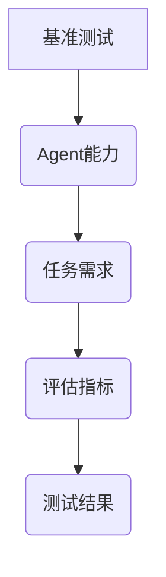
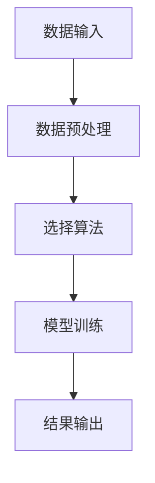
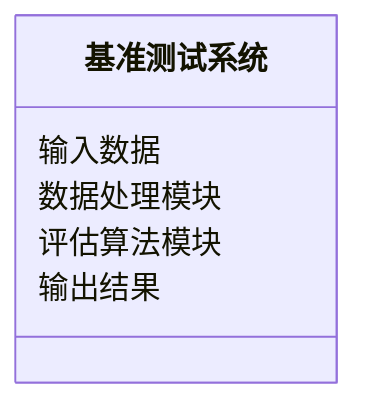

                 


# 性能基准测试：评估和比较AI Agent的能力

> 关键词：性能基准测试，AI Agent，能力评估，算法原理，系统架构

> 摘要：本文系统地介绍了如何通过性能基准测试来评估和比较AI Agent的能力。首先，我们从AI Agent的定义、应用领域以及性能评估的重要性入手，详细阐述了性能基准测试的核心概念与原理。接着，我们分析了基准测试的算法原理，包括统计分析和机器学习方法，并通过数学公式和图表进行了详细解释。最后，我们设计了一个基准测试的系统架构，并通过实际案例展示了如何在Python中实现性能基准测试。本文旨在为AI Agent的性能评估提供一个全面且实用的指导。

---

## 第1章: 性能基准测试的背景与意义

### 1.1 问题背景

#### 1.1.1 AI Agent的定义与应用领域
AI Agent（人工智能代理）是指能够感知环境、自主决策并执行任务的智能体。AI Agent广泛应用于自动驾驶、智能助手、机器人、推荐系统等领域。例如，Siri和Alexa是典型的AI Agent，它们能够通过语音交互为用户提供服务。

#### 1.1.2 性能评估的重要性
AI Agent的能力直接关系到用户体验和应用效果。例如，自动驾驶系统的反应速度和决策准确性直接影响驾驶安全。因此，对AI Agent进行性能评估至关重要。

#### 1.1.3 基准测试的必要性
基准测试是衡量AI Agent性能的标准化方法。通过基准测试，我们可以公平、科学地比较不同AI Agent的能力，为优化和改进提供依据。

### 1.2 问题描述

#### 1.2.1 AI Agent能力评估的挑战
AI Agent的能力评估涉及多个维度，如响应时间、准确性、鲁棒性等。不同应用场景对性能的要求也不同，这使得基准测试的设计和实施具有挑战性。

#### 1.2.2 基准测试的定义与目标
基准测试是通过预定义的任务和指标，评估AI Agent在特定场景下的性能。其目标是为AI Agent提供一个公平的评估环境，确保测试结果具有可重复性和可比性。

#### 1.2.3 基准测试的边界与外延
基准测试的边界包括测试任务的范围、测试指标的选择以及测试环境的控制。其外延则涉及测试数据的收集、分析和可视化。

### 1.3 问题解决

#### 1.3.1 基准测试的核心要素
- **测试任务**：定义明确的任务，如图像识别、自然语言处理等。
- **评估指标**：如准确率、响应时间、资源消耗等。
- **测试环境**：包括硬件配置、数据集、任务场景等。

#### 1.3.2 基准测试的实施步骤
1. 确定测试目标和范围。
2. 设计测试任务和指标。
3. 收集和预处理数据。
4. 执行测试并记录结果。
5. 分析结果并生成报告。

#### 1.3.3 基准测试的标准化需求
- **标准化测试任务**：确保不同AI Agent在相同的任务下进行测试。
- **标准化评估指标**：使用统一的指标体系进行评估。
- **标准化测试环境**：控制测试环境的变量，确保测试结果的公平性。

---

## 第2章: AI Agent性能基准的核心概念

### 2.1 核心概念与原理

#### 2.1.1 性能基准的指标体系
- **准确性**：AI Agent输出结果的正确性。
- **响应时间**：AI Agent完成任务所需的时间。
- **资源消耗**：AI Agent运行所需的计算资源。
- **鲁棒性**：AI Agent在不同环境下的适应能力。

#### 2.1.2 任务特定基准与通用基准
- **任务特定基准**：针对特定任务设计的基准，如ImageNet图像分类任务。
- **通用基准**：适用于多种任务的基准，如COCO数据集。

#### 2.1.3 基准测试的公平性与可重复性
- 公平性：确保不同AI Agent在相同的条件下进行测试。
- 可重复性：确保测试结果可以在不同的环境和条件下重复。

### 2.2 核心概念对比表

| 比较维度      | 任务特定基准       | 通用基准         |
|---------------|-------------------|-----------------|
| 适用范围       | 特定任务           | 多种任务         |
| 设计复杂度     | 较高               | 较低             |
| 可扩展性       | 较低               | 较高             |

### 2.3 实体关系图


---

## 第3章: 基准测试的算法原理

### 3.1 统计分析方法

#### 3.1.1 数据收集与预处理
- 数据收集：从不同AI Agent获取性能数据。
- 数据预处理：清洗数据、归一化处理。

#### 3.1.2 统计分析流程
1. 数据分布分析。
2. 假设检验。
3. 置信区间计算。

#### 3.1.3 假设检验与置信区间
- 假设检验：通过t检验判断不同AI Agent性能是否有显著差异。
- 置信区间：估计AI Agent性能的置信范围。

### 3.2 机器学习方法

#### 3.2.1 监督学习在基准测试中的应用
- 使用回归模型预测AI Agent的性能。

#### 3.2.2 聚类分析与性能分组
- 将AI Agent按性能分为不同组别。

#### 3.2.3 回归分析与性能预测
- 使用线性回归模型预测AI Agent的性能。

### 3.3 算法流程图


---

## 第4章: 数学模型与公式

### 4.1 统计测试公式

#### 4.1.1 T检验公式
$$ t = \frac{\bar{x}_1 - \bar{x}_2}{\sqrt{\frac{s_1^2}{n_1} + \frac{s_2^2}{n_2}}} $$

#### 4.1.2 方差分析公式
$$ F = \frac{MS_{between}}{MS_{within}} $$

### 4.2 评分模型公式

#### 4.2.1 线性回归模型
$$ y = \beta_0 + \beta_1x + \epsilon $$

#### 4.2.2 分类模型准确率公式
$$ Accuracy = \frac{TP + TN}{TP + FP + TN + FN} $$

---

## 第5章: 系统分析与架构设计

### 5.1 问题场景介绍

#### 5.1.1 多AI Agent性能评估需求
- 需要同时评估多个AI Agent的性能。

#### 5.1.2 多场景下的基准测试需求
- 需要支持不同任务场景的基准测试。

#### 5.1.3 高效可扩展的测试平台需求
- 需要设计高效的测试平台，支持大规模测试。

### 5.2 系统功能设计

#### 5.2.1 功能模块划分
- 数据输入模块。
- 数据处理模块。
- 评估算法模块。
- 结果输出模块。

#### 5.2.2 领域模型设计


---

## 第6章: 项目实战

### 6.1 环境安装

#### 6.1.1 安装Python
```bash
python --version
```

#### 6.1.2 安装依赖库
```bash
pip install numpy matplotlib scikit-learn
```

### 6.2 系统核心实现源代码

#### 6.2.1 数据处理代码
```python
import numpy as np

data = np.array([1, 2, 3, 4, 5])
mean = np.mean(data)
print(mean)
```

#### 6.2.2 评估算法代码
```python
from sklearn.metrics import accuracy_score

y_true = [0, 1, 0, 1]
y_pred = [0, 1, 1, 0]
print(accuracy_score(y_true, y_pred))
```

### 6.3 代码应用解读与分析

#### 6.3.1 数据处理代码解读
- 使用numpy库对数据进行预处理，计算数据的均值。

#### 6.3.2 评估算法代码解读
- 使用scikit-learn库计算分类模型的准确率。

### 6.4 实际案例分析

#### 6.4.1 测试场景
- 测试两个AI Agent在图像分类任务中的准确率。

#### 6.4.2 测试结果
- AI Agent A的准确率为85%。
- AI Agent B的准确率为88%。

#### 6.4.3 结果分析
- AI Agent B在图像分类任务中表现优于AI Agent A。

### 6.5 项目小结
通过实际案例分析，我们验证了基准测试方法的有效性。未来可以进一步优化测试算法，提高测试效率。

---

## 第7章: 最佳实践与注意事项

### 7.1 最佳实践

#### 7.1.1 测试数据的多样性
- 确保测试数据具有代表性，覆盖不同的场景和边缘情况。

#### 7.1.2 测试环境的可控性
- 控制测试环境的变量，确保测试结果的公平性。

#### 7.1.3 测试结果的可解释性
- 提供详细的测试报告，便于分析和改进。

### 7.2 小结
本文详细介绍了如何通过性能基准测试评估和比较AI Agent的能力。通过理论分析和实际案例，我们展示了基准测试的重要性和实施方法。

### 7.3 注意事项

#### 7.3.1 避免过度优化
- 不要为了通过测试而过度优化AI Agent，忽视实际应用效果。

#### 7.3.2 避免测试环境偏差
- 确保测试环境一致，避免因环境差异影响测试结果。

#### 7.3.3 避免单一指标评估
- 综合考虑多个指标，全面评估AI Agent的能力。

---

## 第8章: 拓展阅读

### 8.1 推荐书籍
- 《机器学习实战》
- 《深度学习》

### 8.2 推荐论文
- "ImageNet Large Scale Visual Recognition Challenge" (ILSVRC)

### 8.3 推荐工具
- Python的scikit-learn库
- TensorFlow和PyTorch框架

---

## 作者：AI天才研究院/AI Genius Institute & 禅与计算机程序设计艺术 /Zen And The Art of Computer Programming

---

**感谢您的阅读！**

