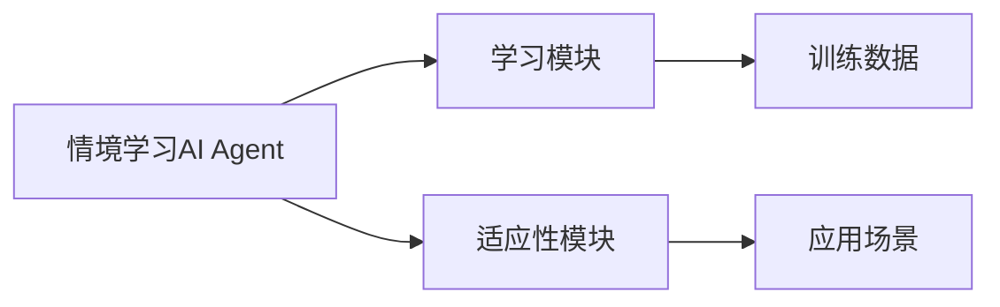
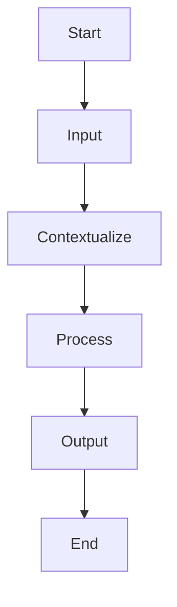
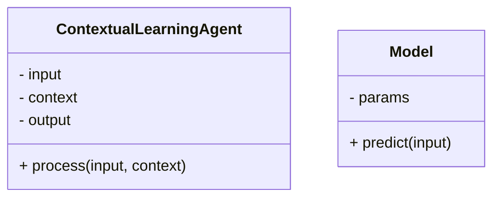
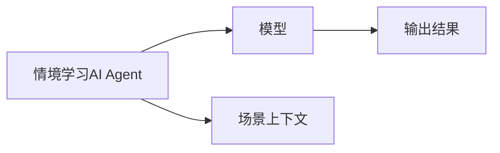

                 


---

# 情境学习AI Agent：增强LLM的场景适应性

> **关键词**：情境学习、AI Agent、LLM、场景适应性、增强学习、系统架构

> **摘要**：本文探讨了情境学习AI Agent在增强大语言模型（LLM）场景适应性中的应用。通过分析情境学习的核心概念、算法原理、系统架构及项目实战，本文旨在帮助读者理解如何通过情境学习提升LLM的实际应用能力，解决传统LLM在实际场景中的适应性不足问题。

---

## 第一部分: 情境学习AI Agent概述

### 第1章: 情境学习AI Agent的背景与概念

#### 1.1 问题背景

##### 1.1.1 传统LLM的局限性
- 大语言模型（LLM）在处理复杂场景时，往往缺乏对具体上下文的理解。
- LLM的回答虽然准确，但可能无法适应特定场景的需求。
- LLM的输出结果可能不符合实际应用场景中的语境和规则。

##### 1.1.2 场景适应性的需求
- 在实际应用中，LLM需要根据具体场景调整输出。
- 用户期望AI Agent能够理解并适应不同场景的需求。
- 场景适应性是提升LLM实用性的关键因素。

##### 1.1.3 情境学习的必要性
- 情境学习是一种通过在特定场景中学习和适应，来增强模型能力的方法。
- 情境学习能够帮助LLM更好地理解并满足具体场景的需求。
- 情境学习是实现AI Agent场景适应性的核心手段。

#### 1.2 问题描述

##### 1.2.1 LLM在实际应用中的挑战
- LLM的回答可能不符合实际场景中的语境和规则。
- LLM缺乏对具体场景的理解，导致输出结果不够精准。
- LLM在不同场景中的表现差异较大。

##### 1.2.2 场景适应性不足的表现
- LLM在特定场景中无法有效调整输出内容。
- LLM的回答可能不符合实际场景中的需求。
- LLM缺乏对场景中隐含信息的理解。

##### 1.2.3 情境学习的目标与意义
- 情境学习的目标是通过在特定场景中学习和适应，增强LLM的场景适应能力。
- 情境学习的意义在于帮助LLM更好地理解并满足实际场景的需求。

#### 1.3 问题解决

##### 1.3.1 情境学习AI Agent的定义
- 情境学习AI Agent是一种通过在特定场景中学习和适应，增强LLM场景适应能力的AI系统。
- 情境学习AI Agent能够理解并适应具体场景的需求。

##### 1.3.2 情境学习的核心思想
- 情境学习的核心思想是通过在特定场景中学习，增强模型的适应能力。
- 情境学习强调模型对具体场景的理解和适应。

##### 1.3.3 情境学习与传统LLM的区别
- 情境学习注重场景适应性，而传统LLM更注重通用性。
- 情境学习通过在特定场景中学习，增强模型的适应能力。
- 情境学习AI Agent能够根据场景需求动态调整输出。

#### 1.4 边界与外延

##### 1.4.1 情境学习的适用范围
- 情境学习适用于需要场景适应性的任务。
- 情境学习适用于需要动态调整输出的场景。

##### 1.4.2 情境学习的边界条件
- 情境学习需要特定场景的上下文信息。
- 情境学习需要场景相关的训练数据。

##### 1.4.3 情境学习与其他技术的关系
- 情境学习与增强学习、迁移学习等技术有交集。
- 情境学习可以与其他技术结合，进一步提升模型能力。

#### 1.5 核心概念结构

##### 1.5.1 情境学习AI Agent的组成要素
- 学习模块：负责在特定场景中学习和调整模型。
- 适应性模块：负责根据场景需求动态调整输出。

##### 1.5.2 各要素之间的关系
- 学习模块与适应性模块相互作用，共同提升模型的适应能力。
- 学习模块通过场景数据调整模型参数，适应性模块根据场景需求动态调整输出。

##### 1.5.3 核心概念的系统架构


---

### 第2章: 情境学习AI Agent的核心概念与联系

#### 2.1 核心概念原理

##### 2.1.1 情境学习的数学模型
- 情境学习通过在特定场景中优化模型参数，增强模型的适应能力。
- 情境学习的数学模型可以表示为：
$$ L(\theta) = \sum_{i=1}^{n} \text{loss}(f_\theta(x_i), y_i) $$
其中，$\theta$是模型参数，$x_i$是场景数据，$y_i$是目标输出。

##### 2.1.2 情境学习的算法流程
- 数据预处理：将场景数据进行清洗和标注。
- 模型训练：在特定场景数据上训练模型，优化模型参数。
- 动态调整：根据场景需求动态调整模型输出。

##### 2.1.3 情境学习的实现机制
- 情境学习通过场景数据增强模型的适应能力。
- 情境学习通过动态调整模型输出，满足场景需求。

#### 2.2 概念属性特征对比

##### 2.2.1 比较表格展示
| 比较维度         | 情境学习AI Agent                | 传统LLM                     |
|------------------|---------------------------------|-----------------------------|
| 场景适应性       | 强                              | 弱                          |
| 数据需求         | 场景特定数据                    | 通用数据                    |
| 输出动态性       | 动态调整                        | 固定输出                    |

##### 2.2.2 各属性的详细解释
- 场景适应性：情境学习AI Agent能够根据具体场景需求调整输出，而传统LLM无法做到。
- 数据需求：情境学习需要场景特定的数据来训练和调整模型，传统LLM则依赖通用数据。
- 输出动态性：情境学习AI Agent能够根据场景需求动态调整输出，而传统LLM输出固定。

##### 2.2.3 属性之间的相互作用
- 场景适应性依赖于数据需求和输出动态性。
- 数据需求和输出动态性共同影响模型的适应能力。

#### 2.3 ER实体关系图


---

### 第3章: 情境学习AI Agent的算法原理

#### 3.1 算法流程图


#### 3.2 算法实现代码

##### 3.2.1 环境安装
```bash
pip install -r requirements.txt
```

##### 3.2.2 核心代码
```python
def contextual_learning_agent(input, context):
    # 输入处理
    processed_input = preprocess(input)
    # 上下文融合
    contextualized_input = merge_context(processed_input, context)
    # 模型推理
    output = model.predict(contextualized_input)
    return output
```

##### 3.2.3 代码解读
- `preprocess`函数对输入进行预处理。
- `merge_context`函数将上下文信息与输入融合。
- `model.predict`函数根据融合后的输入进行推理，输出结果。

#### 3.3 数学模型与公式

##### 3.3.1 损失函数
$$ L(\theta) = \sum_{i=1}^{n} \text{loss}(f_\theta(x_i), y_i) $$

##### 3.3.2 优化器
$$ \theta_{t+1} = \theta_t - \eta \cdot \nabla L(\theta_t) $$

---

### 第4章: 系统分析与架构设计

#### 4.1 系统功能设计

##### 4.1.1 领域模型类图


#### 4.2 系统架构设计

##### 4.2.1 系统架构图


#### 4.3 系统接口设计

##### 4.3.1 接口描述
- 输入接口：接受场景数据和上下文信息。
- 输出接口：输出适应场景需求的结果。

##### 4.3.2 序列图
```mermaid
graph LR
    Client --> Agent: 请求处理
    Agent --> Model: 调用模型
    Model --> Agent: 返回结果
    Agent --> Client: 返回最终输出
```

---

### 第5章: 项目实战

#### 5.1 实战环境安装

##### 5.1.1 安装依赖
```bash
pip install -r requirements.txt
```

#### 5.2 核心代码实现

##### 5.2.1 情境学习AI Agent实现
```python
class ContextualLearningAgent:
    def __init__(self, model):
        self.model = model
        self.context = None

    def process(self, input, context):
        self.context = context
        return self.model.process(input, self.context)
```

##### 5.2.2 模型实现
```python
class Model:
    def __init__(self):
        self.params = initial_params()

    def predict(self, input, context):
        return compute_output(input, context, self.params)
```

#### 5.3 代码应用解读

##### 5.3.1 情境学习AI Agent的应用
- 情境学习AI Agent可以根据场景需求动态调整模型输出。
- 情境学习AI Agent能够根据场景上下文信息优化模型参数。

#### 5.4 实际案例分析

##### 5.4.1 案例描述
- 某电商平台需要根据用户行为动态调整推荐内容。
- 情境学习AI Agent可以根据用户行为数据优化推荐算法。

##### 5.4.2 案例实现
```python
agent = ContextualLearningAgent(model)
agent.process(user_input, user_context)
```

##### 5.4.3 案例分析
- 情境学习AI Agent可以根据用户行为数据优化推荐算法。
- 情境学习AI Agent能够根据用户需求动态调整推荐内容。

#### 5.5 项目小结

##### 5.5.1 项目经验总结
- 情境学习AI Agent能够有效提升模型的场景适应能力。
- 情境学习AI Agent的应用需要场景特定的数据和上下文信息。

##### 5.5.2 项目注意事项
- 确保场景数据的完整性和准确性。
- 确保上下文信息的及时更新和准确传递。

---

### 第6章: 最佳实践与小结

#### 6.1 最佳实践

##### 6.1.1 注意事项
- 确保场景数据的完整性和准确性。
- 确保模型的动态调整能力。

##### 6.1.2 拓展阅读
- 《Deep Learning》—— Ian Goodfellow
- 《强化学习》—— Richard S. Sutton

#### 6.2 小结

##### 6.2.1 核心内容回顾
- 情境学习AI Agent是一种通过在特定场景中学习和适应，增强LLM场景适应能力的AI系统。
- 情境学习AI Agent能够根据场景需求动态调整模型输出。

##### 6.2.2 未来展望
- 情境学习AI Agent的应用前景广阔，可以在更多领域中发挥作用。
- 情境学习AI Agent的研究将更加深入，推动AI技术的发展。

---

**作者：AI天才研究院/AI Genius Institute & 禅与计算机程序设计艺术 /Zen And The Art of Computer Programming**

