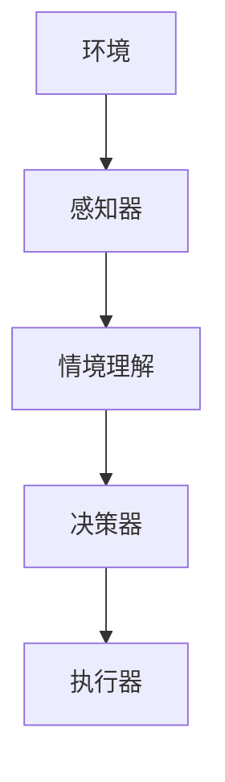
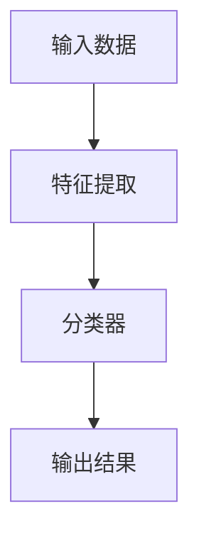
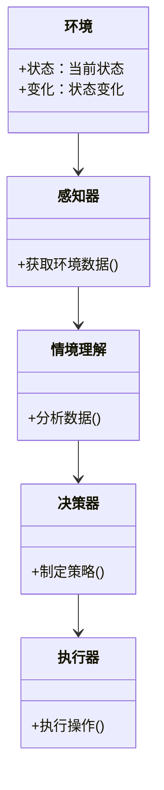
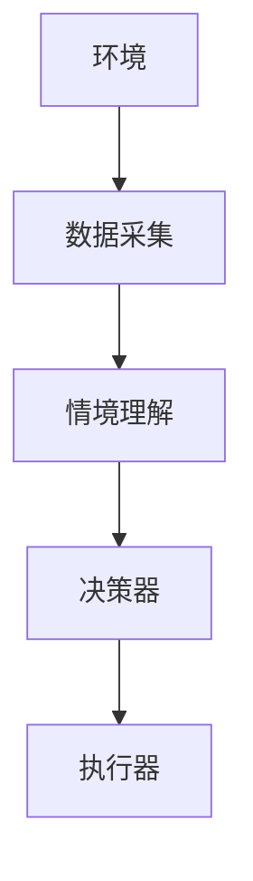
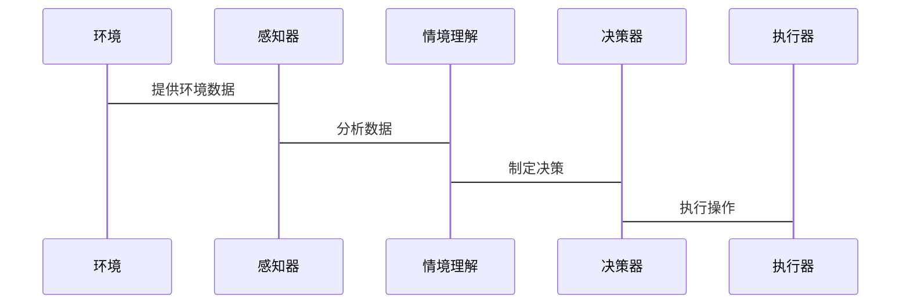

                 


# 情境感知AI Agent：适应动态环境

## 关键词：
情境感知，AI Agent，动态环境，机器学习，深度学习，算法原理

## 摘要：
情境感知AI Agent是一种能够根据环境动态变化做出适应性反应的智能系统。本文从情境感知的基本概念出发，详细探讨了其核心原理、算法实现、系统架构以及实际应用案例，旨在为读者提供全面的理解和深入的技术分析。

---

## 第一部分: 情境感知AI Agent基础

### 第1章: 情境感知与AI Agent概述

#### 1.1 情境感知的基本概念
- **情境感知的定义**：情境感知是指系统能够感知和理解当前环境的状态，并基于此做出相应的决策或行动。
- **AI Agent的基本原理**：AI Agent是一种智能体，能够通过感知环境、推理和学习来实现目标。
- **情境感知与AI Agent的关系**：情境感知是AI Agent在动态环境中实现智能决策的核心能力。

#### 1.2 动态环境的挑战
- **动态环境的定义**：动态环境是指环境状态会随着时间推移而不断变化的环境。
- **动态环境中的不确定性**：环境的不确定性可能导致AI Agent需要频繁调整策略。
- **动态环境对AI Agent的影响**：AI Agent必须能够快速适应环境变化，以确保任务的完成。

#### 1.3 情境感知AI Agent的重要性
- **情境感知在AI Agent中的作用**：通过情境感知，AI Agent能够更好地理解环境，从而做出更准确的决策。
- **情境感知AI Agent的优势**：能够适应动态环境，提高系统的灵活性和 robustness。
- **情境感知AI Agent的应用场景**：广泛应用于自动驾驶、智能助手、机器人等领域。

### 第2章: 情境感知的核心概念与联系

#### 2.1 情境感知的原理
- **感知环境**：通过传感器或数据源获取环境信息。
- **理解情境**：基于感知到的信息，理解环境的当前状态。
- **做出决策**：根据理解的环境状态，制定相应的决策或行动。

#### 2.2 情境感知方法对比
| 方法类型       | 优点                           | 缺点                           |
|----------------|--------------------------------|--------------------------------|
| 基于规则的方法 | 实现简单，易于解释               | 需要手动定义规则，灵活性差       |
| 基于统计的方法 | 能够处理大量数据，适应性强       | 需要大量数据支持，解释性差       |
| 基于深度学习的方法 | 能够学习复杂的模式，适应性强     | 训练时间长，需要大量计算资源     |

#### 2.3 情境感知的ER实体关系图


### 第3章: 情境感知AI Agent的算法原理

#### 3.1 算法原理概述
- **情境分类算法**：通过分类算法将环境状态分为不同的类别。
- **情境预测算法**：基于历史数据预测未来环境状态。
- **情境响应算法**：根据预测结果制定相应的响应策略。

#### 3.2 情境分类算法实现


#### 3.3 情境分类算法代码实现
```python
import numpy as np
from sklearn import datasets

# 加载数据集
X, y = datasets.load_iris(return_X_y=True)

# 特征提取
features = X

# 分类器训练
from sklearn.ensemble import RandomForestClassifier
clf = RandomForestClassifier(n_estimators=100)
clf.fit(features, y)

# 预测
new_sample = np.array([[5.0, 3.6, 1.3, 0.2]])
predicted = clf.predict(new_sample)
print(predicted)
```

#### 3.4 算法的数学模型
- **条件随机场（CRF）**：用于情境分类的一种概率图模型。
  $$ P(y|x) = \frac{1}{Z} \exp(\sum_{i=1}^n \theta y_i x_i) $$
  其中，$Z$ 是归一化因子。

---

## 第二部分: 系统分析与架构设计

### 第4章: 系统分析与架构设计方案

#### 4.1 问题场景介绍
- **问题描述**：在一个动态环境中，AI Agent需要实时感知环境变化，并根据变化调整其行为。

#### 4.2 系统功能设计
- **数据采集模块**：负责收集环境数据。
- **情境理解模块**：对数据进行分析，理解环境状态。
- **决策执行模块**：根据情境理解结果，制定并执行决策。

#### 4.3 领域模型类图


#### 4.4 系统架构设计


#### 4.5 系统接口设计
- **输入接口**：接收环境数据。
- **输出接口**：发送决策指令。

#### 4.6 系统交互流程图


---

## 第三部分: 项目实战

### 第5章: 项目实战与分析

#### 5.1 环境安装
- **安装Python环境**：使用Anaconda或virtualenv。
- **安装依赖库**：如scikit-learn、numpy、mermaid等。

#### 5.2 系统核心实现源代码
```python
import numpy as np
from sklearn.ensemble import RandomForestClassifier

# 数据预处理
X = np.array([[5.1, 3.5, 1.4, 0.2],
              [4.9, 3.0, 1.4, 0.2],
              [4.6, 3.4, 1.3, 0.2],
              [4.3, 3.0, 1.1, 0.2]])

y = np.array([0, 0, 1, 1])

# 训练模型
model = RandomForestClassifier(n_estimators=100)
model.fit(X, y)

# 预测
test_sample = np.array([[4.5, 3.2, 1.3, 0.2]])
predicted = model.predict(test_sample)
print(predicted)
```

#### 5.3 代码应用解读与分析
- **数据预处理**：将数据转换为适合模型输入的形式。
- **模型训练**：使用随机森林算法训练分类器。
- **模型预测**：对新的样本进行分类预测。

#### 5.4 实际案例分析
- **案例描述**：在自动驾驶中，AI Agent需要根据环境变化实时调整驾驶策略。
- **分析**：通过情境感知，AI Agent能够识别前方障碍物并及时做出避让决策。

#### 5.5 项目小结
- **项目总结**：情境感知AI Agent能够有效应对动态环境中的挑战。
- **经验分享**：数据质量和算法选择对系统性能有重要影响。

---

## 第四部分: 最佳实践

### 第6章: 最佳实践与小结

#### 6.1 小结
- **总结**：情境感知AI Agent是动态环境中实现智能决策的核心技术。
- **关键点**：数据采集、情境理解、决策执行是系统设计的关键环节。

#### 6.2 注意事项
- **数据质量**：确保数据的准确性和完整性。
- **算法选择**：根据具体场景选择合适的算法。
- **系统设计**：注重模块化和可扩展性。

#### 6.3 拓展阅读
- **推荐书籍**：《机器学习实战》、《深度学习》。
- **推荐博客**：关注AI领域的前沿技术博客。

---

## 作者：AI天才研究院/AI Genius Institute & 禅与计算机程序设计艺术/Zen And The Art of Computer Programming

