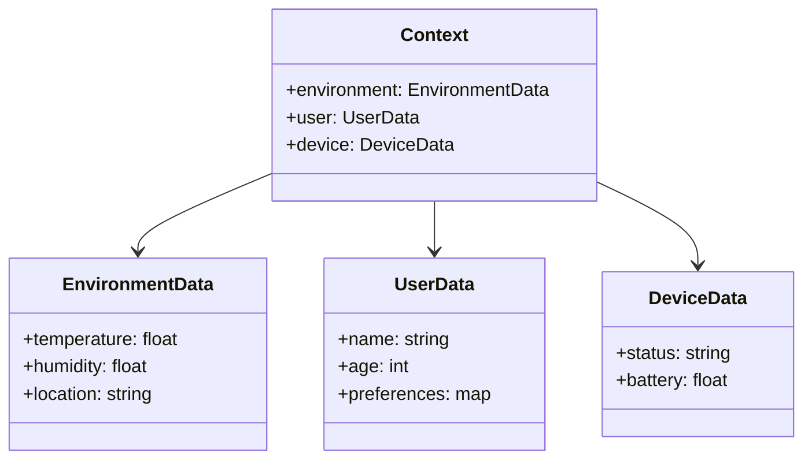
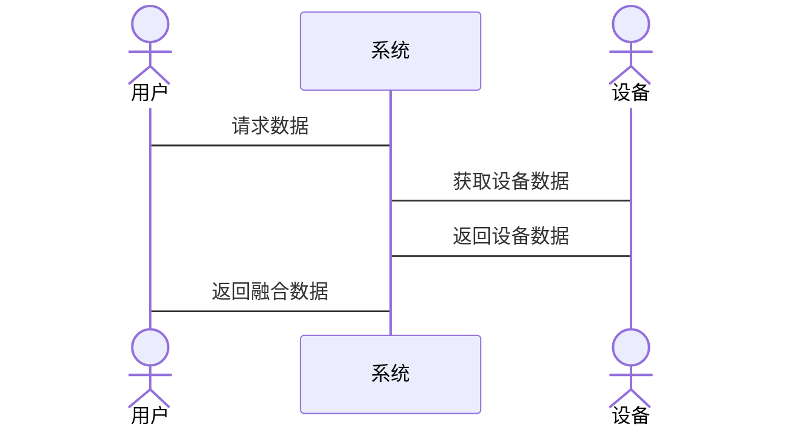

                 


# 情境感知技术的应用

## 关键词：情境感知、多源数据融合、动态环境适应、语义理解、算法实现、系统架构、项目实战

## 摘要：情境感知技术通过融合多源数据，结合动态环境适应和语义理解，实现对复杂场景的智能感知与决策支持。本文从技术背景、核心原理、算法实现、系统架构到项目实战，全面解析情境感知技术的应用与实践。

---

## 第1章: 情境感知技术的背景与概念

### 1.1 情境感知的定义与背景

#### 1.1.1 情境感知的定义

情境感知（Context Awareness）是指系统能够理解当前环境、用户状态及相关情境信息的能力，从而做出更智能的决策和反馈。

#### 1.1.2 情境感知的技术背景

随着物联网、人工智能和大数据技术的快速发展，情境感知技术在智能设备、智能家居、智慧城市等领域得到了广泛应用。

#### 1.1.3 情境感知的应用领域

- 智能设备：手机、可穿戴设备等通过传感器数据感知用户状态。
- 智能家居：通过环境数据优化家居设备的运行。
- 智慧交通：实时感知交通状况，优化交通流量。

### 1.2 情境感知的核心概念

#### 1.2.1 多源数据融合

情境感知需要整合来自不同传感器和数据源的信息，例如位置数据、环境数据、用户行为数据等。

#### 1.2.2 动态环境适应

情境感知系统需要能够实时感知环境变化，并做出相应的调整。

#### 1.2.3 语义理解与推理

通过自然语言处理和知识图谱技术，情境感知系统能够理解数据背后的语义信息。

### 1.3 情境感知的演进历程

#### 1.3.1 从单一传感器到多源数据融合

早期的情境感知技术主要依赖单一传感器的数据，随着技术的发展，逐渐实现了多源数据的融合。

#### 1.3.2 从静态环境到动态场景适应

早期的情境感知系统主要处理静态环境数据，现代系统能够实时适应动态环境变化。

#### 1.3.3 从简单识别到语义理解的提升

从简单的数据识别到复杂的语义理解，情境感知技术在语义分析能力上有了显著提升。

### 1.4 情境感知的关键技术

#### 1.4.1 数据采集与处理技术

数据采集技术包括传感器数据采集、网络数据采集等，数据处理技术包括数据清洗、数据转换等。

#### 1.4.2 传感器融合技术

传感器融合技术通过整合多个传感器的数据，提高感知系统的准确性和可靠性。

#### 1.4.3 语义理解与推理技术

通过自然语言处理和知识图谱技术，实现对数据的语义理解和推理。

---

## 第2章: 情境感知技术的核心原理

### 2.1 多源数据融合原理

#### 2.1.1 数据融合的定义与分类

数据融合是指将多个数据源的数据进行整合，以提高信息的准确性和全面性。

#### 2.1.2 加权融合算法的原理

加权融合算法通过给不同的数据源分配不同的权重，综合考虑各数据源的信息。

#### 2.1.3 数据融合的优缺点对比

| 数据融合方法 | 优点 | 缺点 |
|----------------|------|------|
| 加权融合 | 结合多个数据源的信息 | 权重选择复杂 |
| 基于规则的融合 | 简单易实现 | 适应性差 |
| 基于模型的融合 | 准确性高 | 实现复杂 |

### 2.2 动态环境适应机制

#### 2.2.1 动态环境的定义与特征

动态环境是指环境状态不断变化，需要系统实时感知和调整。

#### 2.2.2 基于时间序列的动态适应算法

通过时间序列分析，预测环境的变化趋势，实现动态适应。

#### 2.2.3 动态环境适应的挑战与解决方案

- **挑战**：环境变化速度快，数据量大。
- **解决方案**：采用高效的算法和分布式计算技术。

### 2.3 语义理解与推理模型

#### 2.3.1 语义理解的定义与实现方法

语义理解是指系统能够理解文本或数据的语义信息，通常通过自然语言处理技术实现。

#### 2.3.2 基于知识图谱的推理模型

通过构建知识图谱，实现对数据的语义理解和推理。

#### 2.3.3 语义理解的优化策略

- **策略**：结合上下文信息，优化语义理解的准确性。

### 2.4 情境感知的核心算法对比

#### 2.4.1 基于位置的加权融合算法

- **优点**：考虑了位置信息，提高感知准确性。
- **缺点**：计算复杂度较高。

#### 2.4.2 基于时间序列的动态适应算法

- **优点**：能够实时适应环境变化。
- **缺点**：对计算资源要求较高。

#### 2.4.3 基于知识图谱的语义理解算法

- **优点**：语义理解能力强。
- **缺点**：构建知识图谱需要大量资源。

### 2.5 本章小结

---

## 第3章: 情境感知技术的算法原理与实现

### 3.1 加权融合算法的数学模型与公式

#### 3.1.1 加权融合公式

$$ 

w_i = \frac{1}{1 + e^{-x_i}} $$

#### 3.1.2 加权融合的实现步骤

1. 数据预处理：清洗和转换数据。
2. 权重计算：根据数据的重要性计算权重。
3. 数据融合：加权融合各数据源的信息。
4. 结果输出：输出融合后的结果。

#### 3.1.3 加权融合的优缺点分析

- **优点**：考虑了各数据源的重要性。
- **缺点**：权重的选择可能影响结果准确性。

### 3.2 时间序列预测算法的数学模型

#### 3.2.1 时间序列预测公式

$$ 

y_t = a \cdot y_{t-1} + b \cdot x_t + c $$

#### 3.2.2 时间序列预测算法的实现步骤

1. 数据预处理：去除异常值，进行数据平滑。
2. 模型训练：训练时间序列预测模型。
3. 预测与评估：预测未来值，评估模型性能。

### 3.3 语义理解算法的实现

#### 3.3.1 语义理解的实现步骤

1. 数据清洗：去除噪声数据。
2. 分词与词性标注：对文本进行分词和词性标注。
3. 语义分析：通过自然语言处理技术理解文本语义。
4. 知识图谱构建：构建领域知识图谱。
5. 语义推理：基于知识图谱进行推理。

#### 3.3.2 语义理解算法的优缺点分析

- **优点**：能够理解文本的深层语义。
- **缺点**：对计算资源要求较高。

### 3.4 本章小结

---

## 第4章: 情境感知技术的系统分析与架构设计

### 4.1 系统分析与需求分析

#### 4.1.1 问题场景介绍

情境感知系统需要实时感知环境、用户状态和设备信息，实现智能决策。

#### 4.1.2 系统功能需求

- 数据采集：采集多源数据。
- 数据处理：清洗和转换数据。
- 数据融合：融合多源数据。
- 语义理解：理解数据语义。
- 决策反馈：输出决策结果。

### 4.2 系统架构设计

#### 4.2.1 领域模型设计



#### 4.2.2 系统架构设计


#### 4.2.3 系统接口设计

- 数据采集接口：采集传感器数据。
- 数据处理接口：清洗和转换数据。
- 数据融合接口：融合多源数据。
- 语义理解接口：理解数据语义。
- 决策反馈接口：输出决策结果。

### 4.3 系统交互设计



### 4.4 本章小结

---

## 第5章: 情境感知技术的项目实战

### 5.1 项目环境安装与配置

#### 5.1.1 安装Python环境

```bash
pip install python
pip install numpy
pip install pandas
pip install scikit-learn
pip install spacy
pip install py2neo
```

#### 5.1.2 安装自然语言处理库

```bash
pip install spacy
python -m spacy download en
```

### 5.2 项目核心代码实现

#### 5.2.1 数据采集与处理代码

```python
import pandas as pd

# 数据采集
data = pd.read_csv('data.csv')

# 数据清洗
data_clean = data.dropna()
```

#### 5.2.2 数据融合代码

```python
import numpy as np

# 加权融合
weights = np.array([0.5, 0.3, 0.2])
data_fused = np.dot(data_clean, weights)
```

#### 5.2.3 语义理解代码

```python
import spacy

# 分词与词性标注
nlp = spacy.load('en')
doc = nlp('This is a test sentence.')
for token in doc:
    print(token.text, token.pos_)
```

### 5.3 项目实战案例分析

#### 5.3.1 案例背景介绍

某智能家居系统需要通过情境感知技术实现设备的智能控制。

#### 5.3.2 数据分析与处理

分析设备数据、环境数据和用户数据，实现数据融合。

#### 5.3.3 系统实现与优化

通过不断优化算法，提高系统的感知准确性和响应速度。

### 5.4 项目小结

---

## 第6章: 情境感知技术的最佳实践

### 6.1 小结

情境感知技术通过融合多源数据，实现对复杂场景的智能感知与决策支持。

### 6.2 注意事项

- 数据隐私保护：确保数据的安全性和隐私性。
- 系统优化：不断优化算法，提高系统的性能和准确性。

### 6.3 拓展阅读

- 推荐书籍：《模式识别与机器学习》
- 推荐论文：《Context-Aware Systems: Challenges and Opportunities》

---

## 作者：AI天才研究院/AI Genius Institute & 禅与计算机程序设计艺术 /Zen And The Art of Computer Programming

---

本文通过详细分析情境感知技术的背景、核心原理、算法实现、系统架构和项目实战，全面解析了情境感知技术的应用与实践。希望对读者在理解和应用情境感知技术方面有所帮助。

