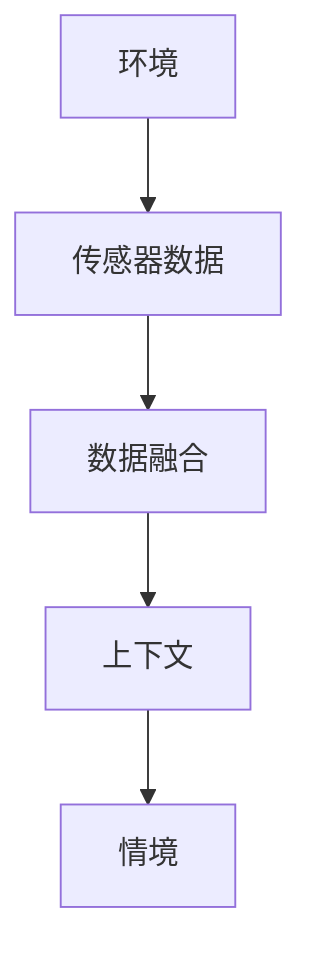
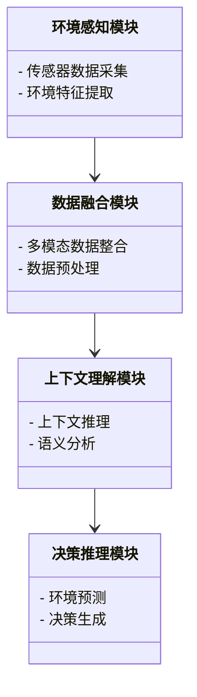
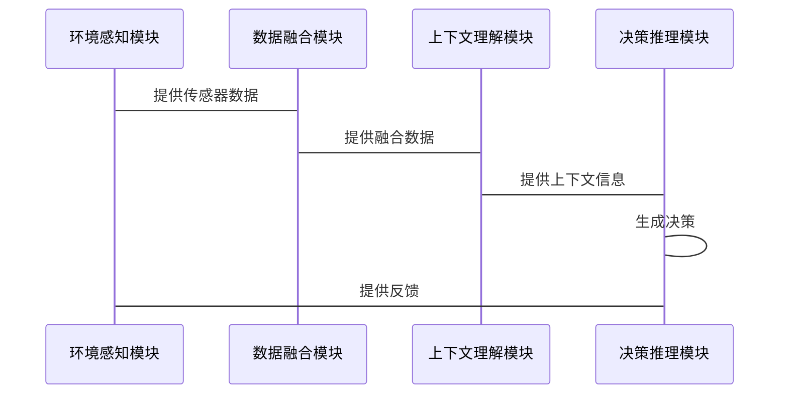

                 


# 情境感知：增强AI Agent的环境理解能力

> 关键词：情境感知，AI Agent，环境理解，多模态数据融合，上下文理解，动态环境预测

> 摘要：情境感知是增强AI Agent环境理解能力的关键技术，本文从核心概念、算法原理、系统设计到项目实战，全面剖析情境感知的实现方法，通过具体案例展示其应用，帮助读者掌握如何构建具备环境理解能力的AI Agent。

---

## 第1章: 情境感知的基本概念与问题背景

### 1.1 什么是情境感知
情境感知是指AI Agent能够理解和感知其所处环境的能力，是通过多模态数据融合和上下文理解来实现的。它不仅仅是对环境的简单感知，还包括对环境动态变化的预测和应对。

### 1.2 情境感知的问题背景
AI Agent在实际应用中需要处理复杂的动态环境，情境感知技术能够帮助AI Agent更好地理解环境，从而做出更准确的决策。例如，在自动驾驶中，AI Agent需要理解道路环境、车辆状态和驾驶员意图，以实现安全驾驶。

### 1.3 情境感知的核心问题
情境感知的核心问题包括环境建模、多模态数据融合、动态环境预测等。这些问题是实现高精度环境理解的关键。

---

## 第2章: 情境感知的核心概念与联系

### 2.1 情境感知的核心原理
情境感知的核心原理包括环境建模、多模态数据融合和上下文理解。环境建模是将环境信息转化为可计算的模型；多模态数据融合是将来自不同传感器的数据进行整合；上下文理解是通过分析环境信息，推断出更高层次的意义。

### 2.2 情境感知的核心要素对比
情境感知与其他相关技术（如环境建模、上下文理解）之间存在一定的区别和联系。例如，环境建模侧重于环境信息的表示，而上下文理解侧重于信息的语义分析。

### 2.3 情境感知的ER实体关系图
以下是情境感知的ER实体关系图：



---

## 第3章: 情境感知的核心算法

### 3.1 环境建模算法
环境建模是情境感知的基础，常用的算法包括概率模型和马尔可夫模型。概率模型通过计算环境中的概率分布，帮助AI Agent理解环境的不确定性。马尔可夫模型则用于动态环境的预测。

### 3.2 多模态数据融合算法
多模态数据融合是将来自不同传感器的数据进行整合的过程。常用的算法包括基于图模型的多模态数据融合和深度神经网络（DNN）的特征融合。这些算法能够有效处理不同数据源的异构性和冗余性。

### 3.3 上下文理解算法
上下文理解是情境感知的关键，常用的算法包括基于贝叶斯网络的上下文推理和基于注意力机制的多模态融合。这些算法能够帮助AI Agent理解环境中的语义信息。

---

## 第4章: 系统分析与架构设计

### 4.1 系统功能设计
系统功能设计包括环境感知、数据融合、上下文理解和决策推理四个模块。每个模块负责不同的功能，例如环境感知模块负责采集环境数据，数据融合模块负责整合多模态数据。

### 4.2 系统架构设计
以下是系统架构设计的类图：



### 4.3 系统接口设计
系统接口设计包括传感器接口、数据融合接口、上下文理解接口和决策推理接口。每个接口负责不同的数据传输和处理任务。

### 4.4 系统交互流程
以下是系统交互流程的序列图：



---

## 第5章: 项目实战

### 5.1 环境搭建
项目实战以智能助手为例，首先需要搭建环境，包括安装必要的库和工具，如Python、TensorFlow、NumPy等。

### 5.2 核心代码实现
以下是核心代码实现：

```python
import numpy as np
from tensorflow import keras

class ContextualUnderstanding:
    def __init__(self):
        self.model = self.build_model()

    def build_model(self):
        inputs = keras.Input(shape=(input_dim,))
        x = keras.layers.Dense(64, activation='relu')(inputs)
        x = keras.layers.Dense(32, activation='relu')(x)
        outputs = keras.layers.Dense(1, activation='sigmoid')(x)
        return keras.Model(inputs=inputs, outputs=outputs)

    def train(self, x_train, y_train):
        self.model.compile(optimizer='adam', loss='binary_crossentropy')
        self.model.fit(x_train, y_train, epochs=10, batch_size=32)

    def predict(self, x_test):
        return self.model.predict(x_test)
```

### 5.3 案例分析与经验总结
通过实际案例分析，总结情境感知在智能助手中的应用，讨论实现过程中的挑战和解决方案，以及经验总结。

---

## 第6章: 最佳实践与小结

### 6.1 最佳实践
情境感知的实现需要结合具体应用场景，选择合适的算法和模型。同时，需要注重数据的质量和多样性，以及模型的可解释性和实时性。

### 6.2 小结
情境感知是增强AI Agent环境理解能力的关键技术，本文从核心概念、算法原理、系统设计到项目实战，全面剖析了情境感知的实现方法，帮助读者掌握如何构建具备环境理解能力的AI Agent。

---

## 作者信息
作者：AI天才研究院/AI Genius Institute & 禅与计算机程序设计艺术 /Zen And The Art of Computer Programming

