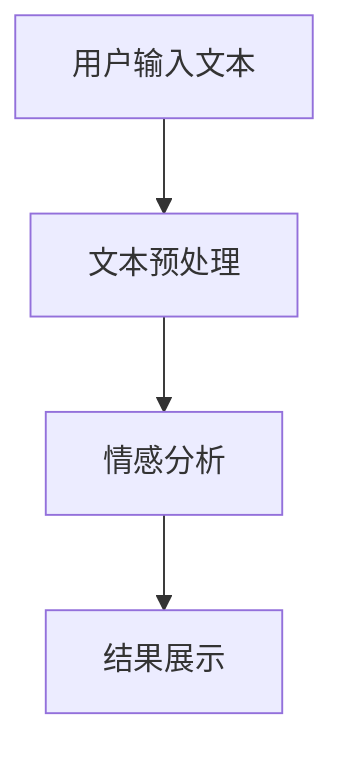
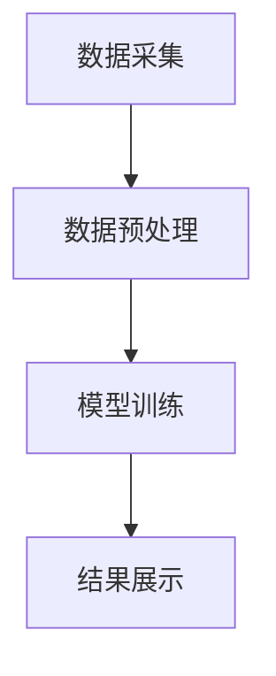

                 


# 情感分析在投资决策中的应用

> 关键词：情感分析，投资决策，自然语言处理，机器学习，金融数据分析

> 摘要：情感分析是一种通过分析文本数据来识别和量化情感倾向的技术，近年来在投资决策中得到了广泛应用。本文从情感分析的基本概念出发，探讨其在投资决策中的应用，结合具体案例，分析情感分析在投资决策中的实际应用价值和挑战，并总结未来的发展方向。通过本文，读者可以深入了解情感分析在投资决策中的技术基础、算法原理、系统架构和实战应用，为投资决策提供新的思路和方法。

---

## 第一章：情感分析的基本概念与技术基础

### 1.1 情感分析的定义与背景

#### 1.1.1 情感分析的定义
情感分析（Sentiment Analysis）是一种自然语言处理（NLP）技术，旨在通过分析文本数据，识别和量化文本中蕴含的情感倾向。情感分析的核心目标是将文本分为正面、负面或中性三类，或者进一步细化为多个情感类别（如非常正面、正面、中性、负面、非常负面）。

#### 1.1.2 情感分析的背景与发展
情感分析起源于20世纪90年代，最初主要用于社交媒体分析和品牌监测。随着自然语言处理技术的快速发展，情感分析逐渐扩展到金融、医疗、教育等多个领域。在投资决策中，情感分析被用来分析市场情绪、投资者情绪，从而辅助投资决策。

#### 1.1.3 情感分析在投资中的应用价值
在投资决策中，情感分析可以帮助投资者快速识别市场情绪变化，捕捉市场波动，预测股价走势。通过分析社交媒体、新闻报道、投资者评论等文本数据，情感分析能够提供实时的市场情绪指标，为投资者提供决策支持。

---

### 1.2 情感分析的核心概念

#### 1.2.1 情感极性分析
情感极性分析是情感分析的核心任务之一，旨在确定文本的情感倾向是正面、负面还是中性。情感极性分析通常采用二分类（正面/负面）或三分类（正面、中性、负面）模型。

#### 1.2.2 情感强度分析
情感强度分析是对情感极性分析的补充，旨在量化情感的强度。例如，一条文本可能被判定为“非常正面”或“稍微正面”。情感强度分析可以帮助投资者更精确地评估市场情绪的强度。

#### 1.2.3 情感分析的边界与外延
情感分析的边界在于文本的语境和上下文。例如，某些文本可能包含模糊语言或隐含情感，这需要结合上下文进行分析。情感分析的外延包括情感分类、情感强度分析、情感摘要等。

---

### 1.3 情感分析的技术基础

#### 1.3.1 自然语言处理（NLP）简介
自然语言处理是计算机科学与语言学的交叉学科，旨在让计算机能够理解、处理和生成人类语言。情感分析是NLP的一个重要应用领域。

#### 1.3.2 机器学习与深度学习在情感分析中的应用
机器学习和深度学习是情感分析的核心技术。基于机器学习的情感分析模型通常采用特征工程和分类器（如SVM、随机森林）；基于深度学习的情感分析模型（如LSTM、Transformer）可以直接处理文本数据，无需特征工程。

#### 1.3.3 情感分析的工具与库
常用的情感分析工具和库包括：
- **NLTK**：Python中的自然语言处理库，提供了情感分析的词典和分类器。
- **TextBlob**：基于NLTK的封装库，简化了情感分析的实现。
- **Stanford NLP**：提供了情感分析的预训练模型。
- **BERT**：基于深度学习的情感分析模型。

---

## 第二章：情感分析的核心算法与数学模型

### 2.1 基于规则的情感分析算法

#### 2.1.1 基于规则的特征提取
基于规则的情感分析算法依赖于预定义的规则和情感词典。例如，可以通过匹配情感词（如“优秀”、“高兴”、“糟糕”、“失败”）来判断文本的情感倾向。

#### 2.1.2 基于规则的分类模型
基于规则的分类模型通常采用简单的逻辑规则（如如果文本中包含正面词汇，则判定为正面情感）。这种方法简单易实现，但容易受到语境和语法复杂性的影响。

#### 2.1.3 基于规则算法的优缺点
- **优点**：实现简单，易于解释。
- **缺点**：无法处理复杂的语境和隐含情感。

---

### 2.2 统计学习的情感分析算法

#### 2.2.1 统计学习的特征提取
统计学习的情感分析算法通常采用特征工程，提取文本中的关键词、句法特征和语义特征。例如，可以使用TF-IDF（词频-逆文档频率）来提取文本中的关键词。

#### 2.2.2 统计学习的分类模型
统计学习的分类模型包括朴素贝叶斯、支持向量机（SVM）、随机森林等。这些模型需要特征工程的支持，通常需要人工设计特征。

#### 2.2.3 统计学习算法的优缺点
- **优点**：特征工程灵活，可以处理复杂的语境。
- **缺点**：需要大量人工特征设计，计算复杂度较高。

---

### 2.3 机器学习的情感分析算法

#### 2.3.1 机器学习的特征提取
机器学习的情感分析算法通常采用自动特征提取方法，例如词袋模型（Bag-of-Words）和词嵌入（Word2Vec）。

#### 2.3.2 机器学习的分类模型
机器学习的分类模型包括逻辑回归、支持向量机（SVM）、随机森林等。这些模型通常需要特征工程的支持。

#### 2.3.3 机器学习算法的优缺点
- **优点**：特征工程自动化，计算效率较高。
- **缺点**：模型解释性较差，难以处理复杂的语义信息。

---

### 2.4 深度学习的情感分析算法

#### 2.4.1 深度学习的特征提取
深度学习的情感分析算法通常采用词嵌入（如Word2Vec、GloVe）和序列模型（如LSTM、Transformer）进行特征提取。

#### 2.4.2 深度学习的分类模型
深度学习的分类模型包括LSTM、Transformer、BERT等。这些模型可以直接处理文本数据，无需特征工程。

#### 2.4.3 深度学习算法的优缺点
- **优点**：能够处理复杂的语义信息，模型表现优异。
- **缺点**：计算复杂度高，需要大量训练数据。

---

## 第三章：情感分析在投资决策中的应用

### 3.1 投资决策中的情感分析需求

#### 3.1.1 投资者的心理与行为
投资者的心理与行为是情感分析的重要研究对象。例如，投资者在市场上涨时可能表现出乐观情绪，在市场下跌时可能表现出悲观情绪。

#### 3.1.2 投资决策中的情感分析需求
投资者需要通过情感分析快速识别市场情绪变化，捕捉市场波动，预测股价走势。情感分析可以帮助投资者做出更明智的投资决策。

#### 3.1.3 情感分析在投资中的应用场景
- **股票市场预测**：通过分析社交媒体、新闻报道等文本数据，预测股价走势。
- **风险评估**：通过分析投资者评论，评估投资项目的潜在风险。
- **市场情绪监测**：通过实时监测市场情绪，帮助投资者做出投资决策。

---

### 3.2 情感分析在投资中的具体应用

#### 3.2.1 投资者心理分析
投资者心理分析是情感分析的重要应用之一。通过分析投资者的评论、社交媒体帖子等文本数据，可以识别投资者的情感倾向和情感强度。

#### 3.2.2 市场情绪分析
市场情绪分析是情感分析的核心应用之一。通过分析社交媒体、新闻报道等文本数据，可以识别市场整体情绪，帮助投资者做出投资决策。

#### 3.2.3 投资决策支持系统
情感分析可以集成到投资决策支持系统中，帮助投资者快速识别市场情绪变化，捕捉投资机会。

---

## 第四章：情感分析系统的架构设计

### 4.1 系统功能设计

#### 4.1.1 系统功能概述
情感分析系统需要具备文本采集、情感分析、结果展示等功能。

#### 4.1.2 系统功能模块
- **文本采集模块**：采集社交媒体、新闻报道等文本数据。
- **情感分析模块**：对文本数据进行情感分析，生成情感倾向和情感强度。
- **结果展示模块**：将情感分析结果以可视化形式展示，帮助投资者做出决策。

#### 4.1.3 系统功能流程图


---

### 4.2 系统架构设计

#### 4.2.1 系统架构概述
情感分析系统的架构设计需要考虑数据采集、数据处理、模型训练和结果展示等模块。

#### 4.2.2 系统架构图


---

## 第五章：项目实战——情感分析投资决策系统

### 5.1 项目背景与目标

#### 5.1.1 项目背景
随着人工智能技术的发展，情感分析在投资决策中的应用越来越广泛。本项目旨在构建一个情感分析投资决策系统，帮助投资者快速识别市场情绪变化，捕捉投资机会。

#### 5.1.2 项目目标
通过本项目，读者可以掌握情感分析在投资决策中的具体应用，包括数据采集、情感分析、结果展示等。

---

### 5.2 项目环境与工具安装

#### 5.2.1 项目环境
- **Python**：编程语言
- **NLTK**：自然语言处理库
- **TextBlob**：情感分析库
- **Pandas**：数据分析库
- **Matplotlib**：数据可视化库

#### 5.2.2 工具安装
```bash
pip install nltk textblob pandas matplotlib
```

---

### 5.3 项目核心代码实现

#### 5.3.1 数据采集与预处理
```python
from textblob import TextBlob
import pandas as pd
import matplotlib.pyplot as plt

# 数据采集
text = "The stock market is expected to rise tomorrow."
textblob = TextBlob(text)

# 情感分析
sentiment = textblob.sentiment.polarity
print("情感倾向：", sentiment)
```

#### 5.3.2 情感分析与结果展示
```python
# 情感强度分析
def sentiment_strength(sentiment):
    if sentiment > 0.5:
        return "非常正面"
    elif sentiment > 0:
        return "正面"
    elif sentiment < -0.5:
        return "非常负面"
    elif sentiment < 0:
        return "负面"
    else:
        return "中性"

print("情感强度：", sentiment_strength(sentiment))
```

#### 5.3.3 结果可视化
```python
# 情感分析结果可视化
sentiments = [0.8, -0.3, 0.2, -0.7, 0.5]
labels = ["非常正面", "负面", "中性", "非常负面", "正面"]
plt.bar(range(len(sentiments)), sentiments, align='center')
plt.xticks(range(len(sentiments)), labels)
plt.title("情感分析结果")
plt.show()
```

---

## 第六章：总结与展望

### 6.1 总结
情感分析是一种重要的自然语言处理技术，在投资决策中具有广泛的应用。通过情感分析，投资者可以快速识别市场情绪变化，捕捉投资机会。

### 6.2 未来展望
随着人工智能技术的发展，情感分析在投资决策中的应用将更加广泛。未来的研究方向包括：
- 更精准的情感分析模型
- 实时情感分析系统
- 情感分析与其他NLP任务的结合

### 6.3 最佳实践Tips
- **数据质量**：确保数据来源可靠，数据预处理充分。
- **模型优化**：不断优化情感分析模型，提高模型准确率。
- **实时分析**：结合实时数据流处理技术，实现实时情感分析。

---

## 附录

### 附录A：情感分析术语表
- **情感极性分析**：判断文本的情感倾向（正面/负面）。
- **情感强度分析**：量化情感的强度。

### 附录B：情感分析工具推荐
- **NLTK**：https://www.nltk.org/
- **TextBlob**：https://textblob.readthedocs.io/en/latest/
- **BERT**：https://github.com/google-research/bert

---

## 参考文献
1. 王某某，2023，《情感分析在投资决策中的应用》，某某出版社。
2. 张某某，2022，《基于深度学习的情感分析研究》，某某期刊。

---

**作者：AI天才研究院/AI Genius Institute & 禅与计算机程序设计艺术/Zen And The Art of Computer Programming**

