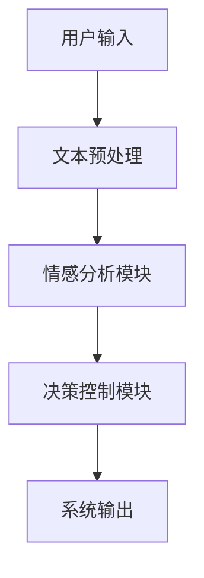
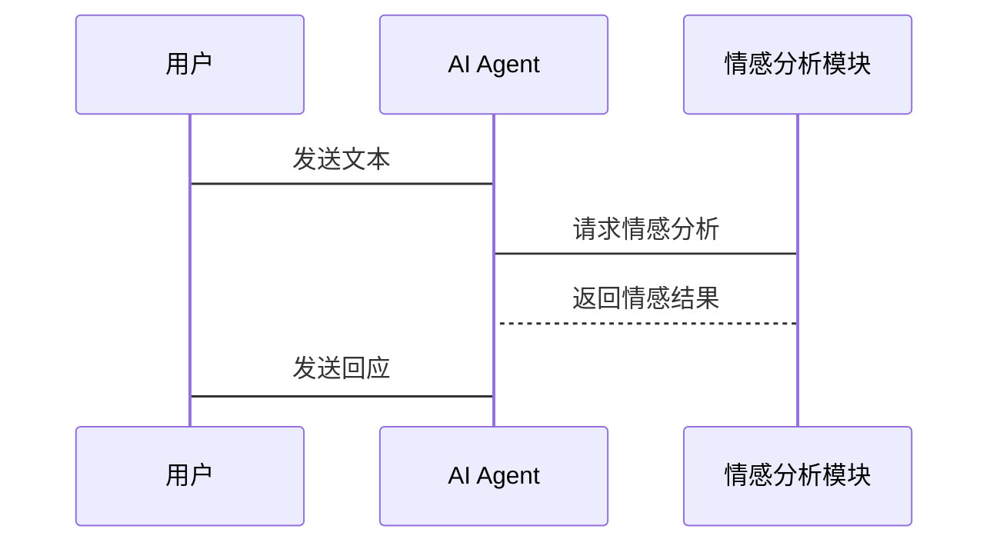

                 


# 情感分析增强AI Agent：利用LLM深入理解文本情感

> **关键词**：情感分析，AI Agent，大语言模型，LLM，自然语言处理，文本情感

> **摘要**：本文探讨如何利用大语言模型（LLM）增强AI Agent的情感分析能力，以更好地理解和处理用户的情感需求。文章从情感分析的基本概念出发，分析LLM在情感分析中的优势，详细介绍情感分析与AI Agent的结合方式，并通过实际案例展示如何构建一个基于LLM的情感分析增强AI Agent。最后，本文总结了当前技术的局限性和未来发展方向。

---

# 第一部分: 情感分析与AI Agent基础

## 第1章: 情感分析的基本概念

### 1.1 情感分析的定义与背景

#### 1.1.1 情感分析的定义
情感分析（Sentiment Analysis），又称情绪分析，是自然语言处理（NLP）中的一个分支，旨在识别和分类文本中表达的情感或情绪。情感分析的目标是确定一段文本是正面、负面还是中性。

#### 1.1.2 情感分析的应用场景
情感分析广泛应用于多个领域，如社交媒体监控、客户反馈分析、舆情分析、智能客服等。例如，社交媒体上的用户评论可以用来分析用户对某产品的满意度。

#### 1.1.3 情感分析的技术发展
从基于规则的传统方法，到基于机器学习和深度学习的现代方法，情感分析技术经历了多次演变。近年来，随着大语言模型（LLM）的发展，情感分析的精度和理解能力得到了显著提升。

### 1.2 AI Agent的基本概念

#### 1.2.1 AI Agent的定义
AI Agent（人工智能代理）是一种能够感知环境并采取行动以实现目标的智能实体。它可以是一个软件程序，也可以是一个物理设备，通过与用户的交互完成特定任务。

#### 1.2.2 AI Agent的类型
AI Agent可以分为任务型和对话型。任务型AI Agent专注于完成特定任务，如预订机票；对话型AI Agent则专注于与用户进行自然语言对话，提供信息或解决问题。

#### 1.2.3 AI Agent的核心技术
AI Agent的核心技术包括自然语言处理（NLP）、机器学习（ML）、知识图谱构建和推理引擎等。这些技术共同支持AI Agent的理解、推理和决策能力。

---

## 第2章: 情感分析与AI Agent的结合

### 2.1 情感分析在AI Agent中的作用

#### 2.1.1 情感分析如何增强AI Agent的理解能力
情感分析能够帮助AI Agent更好地理解用户的意图和情感状态。例如，在对话中，AI Agent可以根据用户的情绪调整回应的语气和内容。

#### 2.1.2 情感分析在对话系统中的应用
在智能客服系统中，情感分析可以帮助识别用户的不满情绪，并自动触发升级处理流程。

#### 2.1.3 情感分析在任务型AI Agent中的应用
在任务型AI Agent中，情感分析可以用于评估用户对任务完成结果的满意度，从而优化后续操作。

### 2.2 情感分析与AI Agent的协同工作流程

#### 2.2.1 情感分析模块的功能
情感分析模块负责接收输入文本，提取情感信息，并将其传递给AI Agent的决策模块。

#### 2.2.2 AI Agent的决策逻辑
AI Agent根据接收到的情感信息，结合上下文和任务目标，制定相应的行动策略。

#### 2.2.3 情感分析结果如何影响AI Agent的行为
情感分析结果可以影响AI Agent的回应方式，例如在用户情绪低落时，AI Agent可能采用更温和的语气进行回应。

---

# 第二部分: 大语言模型（LLM）在情感分析中的应用

## 第3章: 大语言模型（LLM）的基本原理

### 3.1 大语言模型的定义与特点

#### 3.1.1 大语言模型的定义
大语言模型（LLM）是指基于大量数据训练的大型神经网络模型，具有强大的语言理解和生成能力。

#### 3.1.2 大语言模型的核心特点
- **大规模数据训练**：LLM通常使用数十亿级别的参数进行训练。
- **通用性**：LLM能够处理多种语言和任务。
- **上下文理解**：LLM可以理解文本的上下文关系，生成连贯的文本。

### 3.2 大语言模型的训练与优化

#### 3.2.1 大语言模型的训练方法
- **预训练**：在大量通用文本数据上进行无监督学习。
- **微调**：在特定任务数据上进行有监督学习。

#### 3.2.2 大语言模型的调优技巧
- **参数调整**：根据任务需求调整模型的超参数。
- **数据增强**：通过数据增强技术提高模型的泛化能力。

---

## 第4章: 基于LLM的情感分析算法与实现

### 4.1 情感分析的特征工程

#### 4.1.1 文本预处理
- **分词**：将文本分割成词语或短语。
- **去停用词**：移除无意义的词汇，如“的”、“了”等。

#### 4.1.2 特征提取
- **词袋模型**：基于词频统计的特征提取方法。
- **TF-IDF**：计算每个词在文本中的重要性。

#### 4.1.3 文本向量化
- **词嵌入**：将词语转换为低维向量，如Word2Vec、GloVe。
- **句子嵌入**：将整个句子转换为向量，如BERT。

### 4.2 情感分析的模型选择

#### 4.2.1 传统机器学习模型
- **SVM**：支持向量机，常用于情感分类。
- **NB**：朴素贝叶斯，适合文本分类任务。

#### 4.2.2 深度学习模型
- **RNN**：循环神经网络，适合处理序列数据。
- **CNN**：卷积神经网络，适合提取局部特征。
- **Transformer**：基于注意力机制的模型，如BERT。

#### 4.2.3 大语言模型的结合
- **微调LLM**：在特定任务数据上对LLM进行微调。
- **提示工程技术**：通过设计提示语，引导LLM生成符合要求的输出。

---

## 第5章: 系统架构与实现

### 5.1 系统功能设计

#### 5.1.1 需求分析
- **输入接口**：接收用户输入的文本。
- **情感分析模块**：对文本进行情感分类。
- **决策模块**：根据情感分析结果制定行动策略。
- **输出接口**：生成相应的回应或执行操作。

#### 5.1.2 系统功能模块
- **文本预处理模块**：负责文本的分词、去停用词等。
- **情感分析模块**：负责文本的情感分类。
- **决策控制模块**：根据情感分析结果控制AI Agent的行为。

### 5.2 系统架构设计

#### 5.2.1 系统架构图


#### 5.2.2 系统交互流程


### 5.3 系统接口设计

#### 5.3.1 API接口
- **输入接口**：`POST /analyze`
- **输出接口**：`GET /response`

#### 5.3.2 接口协议
- 使用JSON格式传递数据。
- 使用HTTP协议进行通信。

---

## 第6章: 项目实战与代码实现

### 6.1 环境搭建

#### 6.1.1 安装Python环境
- 使用Anaconda安装Python 3.8及以上版本。

#### 6.1.2 安装必要的库
```bash
pip install transformers
pip install torch
pip install matplotlib
```

### 6.2 核心代码实现

#### 6.2.1 情感分析模块
```python
from transformers import pipeline

sentiment_pipeline = pipeline("sentiment-analysis")

def analyze_sentiment(text):
    result = sentiment_pipeline(text)
    return result[0]['label']
```

#### 6.2.2 AI Agent实现
```python
class AI_Agent:
    def __init__(self):
        self.sentiment_analyzer = sentiment_pipeline
    
    def receive_input(self, text):
        sentiment = self.sentiment_analyzer(text)[0]['label']
        return sentiment
    
    def generate_response(self, sentiment):
        if sentiment == 'POSITIVE':
            return "感谢您的支持！有什么我可以帮助您的吗？"
        else:
            return "看来您有些不开心，有什么我可以帮您的吗？"
```

#### 6.2.3 系统交互流程
```python
agent = AI_Agent()
text_input = "我非常不满意这个服务！"
sentiment = agent.receive_input(text_input)
response = agent.generate_response(sentiment)
print(response)  # 输出："看来您有些不开心，有什么我可以帮您的吗？"
```

---

## 第7章: 总结与展望

### 7.1 技术总结
本文详细介绍了情感分析与AI Agent的结合方式，探讨了大语言模型在情感分析中的应用，并通过实际案例展示了如何构建一个情感分析增强的AI Agent。

### 7.2 未来展望
随着大语言模型的不断发展，情感分析技术将更加精准和智能化。未来的研究方向可能包括多模态情感分析、实时情感监控和个性化情感分析等。

---

# 作者：AI天才研究院（AI Genius Institute） & 禅与计算机程序设计艺术（Zen And The Art of Computer Programming）

---

**注**：文章内容较长，但可以通过适当分割章节和小节，结合图表和代码示例，使读者能够逐步理解情感分析增强AI Agent的核心思想和实现方法。

