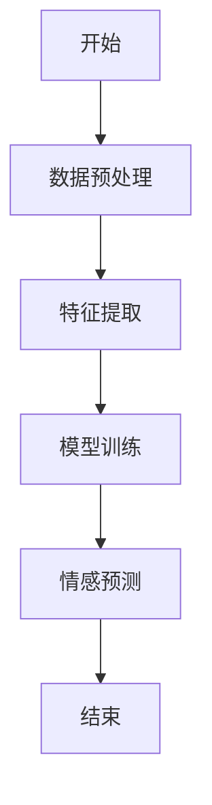
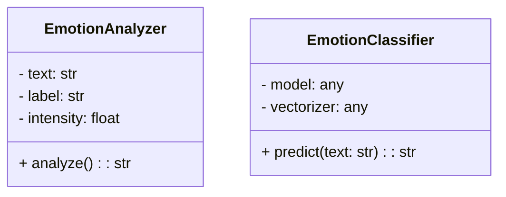

                 


# 情感分析：让AI Agent具备情商

## 关键词：情感分析、AI Agent、自然语言处理、机器学习、深度学习

## 摘要：情感分析是自然语言处理中的一个重要分支，旨在让计算机能够理解并识别文本中的情感信息。本文将从情感分析的基本概念出发，深入探讨其算法原理、数学模型、系统架构设计以及实际应用案例。通过本文的学习，读者将能够理解情感分析的核心技术，并将其应用于实际的AI Agent开发中，从而让AI Agent具备情商，更好地服务于人类。

---

## 第1章：情感分析概述

### 1.1 情感分析的基本概念

#### 1.1.1 情感分析的定义与核心要素
情感分析（Sentiment Analysis），又称情绪分析，是一种自然语言处理技术，旨在识别和分类文本中的情感倾向。其核心目标是将文本（如评论、社交媒体帖子、邮件等）分类为正面、负面或中性情绪。

**核心要素：**
- 文本输入：通常是文本数据，如评论、句子或段落。
- 情感标签：输出结果，如正面、负面或中性。
- 情感强度：一些高级情感分析任务还包括对情感强度的评估。

#### 1.1.2 情感分析的背景与问题背景
随着互联网的快速发展，每天产生的海量文本数据（如社交媒体评论、产品 reviews 等）为情感分析提供了丰富的数据来源。企业可以通过情感分析技术了解用户对其产品或服务的满意度，从而做出相应的改进策略。

**问题背景：**
- 如何从海量文本中提取情感信息？
- 如何提高情感分析的准确性和鲁棒性？
- 如何将情感分析技术应用于实际场景中的AI Agent？

#### 1.1.3 情感分析在AI Agent中的应用价值
AI Agent（智能代理）需要具备理解人类情感的能力，才能更好地与人类交互。情感分析技术使得AI Agent能够理解用户的意图和情感倾向，从而提供更智能、更人性化的服务。

---

### 1.2 情感分析的核心概念

#### 1.2.1 情感分析的分类与问题描述
情感分析可以按照多个维度进行分类：

- **二元分类**：将文本分为正面或负面。
- **多分类**：将文本分为正面、负面或中性。
- **情感强度分析**：评估情感的强度，如“非常喜欢” vs. “有点喜欢”。

**问题描述：**
如何根据给定的文本，准确识别其情感倾向并分类？

#### 1.2.2 情感分析的边界与外延
- **边界**：情感分析主要关注文本中的情感信息，不涉及其他语义信息（如事实性信息）。
- **外延**：情感分析技术可以扩展到其他领域，如方面级情感分析（针对特定方面的情感）、多语言情感分析等。

#### 1.2.3 情感分析的核心要素组成
- **输入数据**：文本数据。
- **特征提取**：从文本中提取有用的特征（如词袋模型、词嵌入）。
- **分类模型**：基于特征的分类算法（如SVM、随机森林、深度学习模型）。
- **输出结果**：情感标签或情感强度。

---

## 第2章：情感分析的核心概念与联系

### 2.1 情感分析的核心概念原理

#### 2.1.1 情感分析的分类方法
情感分析的分类方法可以分为以下几类：

- **基于词袋模型的方法**：使用词频（TF）或词袋模型（TF-IDF）提取特征。
- **基于词嵌入的方法**：如Word2Vec、GloVe，将词转化为向量表示。
- **基于深度学习的方法**：如CNN、RNN、LSTM等。

#### 2.1.2 情感分析的主要特征
情感分析的关键特征包括：
- 词语的情感倾向（如“喜欢”是正面，“讨厌”是负面）。
- 语法结构（如疑问句可能表示不确定）。
- 上下文信息（如讽刺语气）。

---

### 2.2 情感分析的概念属性特征对比表格

| 情感分析类型 | 特征描述 | 示例 |
|--------------|----------|------|
| 二元分类      | 正面/负面 | "我非常喜欢这本书"（正面） |
| 多分类        | 正面/负面/中性 | "这部电影一般般"（中性） |
| 情感强度分析  | 强度级别（如1到5分） | "我非常喜欢这本书"（强度5分） |

---

### 2.3 情感分析的ER实体关系图

```mermaid
er
actor Emotion_Analysis {
  id: int
  emotion_label: string
  emotion_intensity: float
}
```

---

## 第3章：情感分析的算法原理

### 3.1 情感分析的算法原理

#### 3.1.1 常见的情感分析算法
- **传统机器学习算法**：如支持向量机（SVM）、随机森林（Random Forest）。
- **深度学习算法**：如卷积神经网络（CNN）、长短期记忆网络（LSTM）。

#### 3.1.2 情感分析的算法流程
1. 数据预处理：分词、去停用词、特征提取。
2. 模型训练：基于特征的分类或深度学习模型训练。
3. 情感预测：输入文本，输出情感标签。

---

### 3.2 情感分析的算法流程图



---

### 3.3 情感分析的Python实现代码

```python
from sklearn.feature_extraction.text import TfidfVectorizer
from sklearn.svm import SVC
from sklearn.metrics import accuracy_score

# 数据预处理
text_train = ["这是一个好算法", "这个算法不太好"]
y_train = [1, 0]

# 特征提取
vectorizer = TfidfVectorizer()
X_train = vectorizer.fit_transform(text_train)

# 模型训练
model = SVC()
model.fit(X_train, y_train)

# 情感预测
text_test = ["这个算法很优秀"]
X_test = vectorizer.transform(text_test)
y_pred = model.predict(X_test)
print("预测结果:", y_pred)
print("预测准确率:", accuracy_score(y_train, model.predict(X_train)))
```

---

## 第4章：情感分析的数学模型与公式

### 4.1 情感分析的数学模型

#### 4.1.1 情感分析的向量空间模型
文本可以表示为向量空间中的点，情感分析的目标是将这些点分类到不同的类别中。

---

#### 4.1.2 情感分析的概率模型
基于概率的分类模型（如Naive Bayes）假设特征之间条件独立，计算每个类别的概率。

---

### 4.2 情感分析的数学公式

#### 情感分析的概率公式（Naive Bayes）
$$ P(y|X) = \frac{P(X|y)P(y)}{P(X)} $$

其中：
- $P(y)$：先验概率。
- $P(X|y)$：似然概率。
- $P(X)$：边缘概率。

---

## 第5章：情感分析的系统分析与架构设计方案

### 5.1 系统功能设计

#### 5.1.1 领域模型（Mermaid类图）



---

#### 5.1.2 系统架构设计（Mermaid架构图）


---

## 第6章：情感分析的项目实战

### 6.1 环境安装

```bash
pip install scikit-learn
pip install nltk
pip install transformers
```

---

### 6.2 系统核心实现源代码

```python
from sklearn.pipeline import Pipeline
from sklearn.feature_extraction.text import TfidfVectorizer
from sklearn.svm import LinearSVC

# 训练数据
text_train = [
    "这是一个好算法",
    "这个算法不太好",
    "这个算法很好",
    "这个算法一般",
]

y_train = [1, 0, 1, 0]

# 创建管道
pipeline = Pipeline([
    ('tfidf', TfidfVectorizer()),
    ('clf', LinearSVC())
])

# 模型训练
pipeline.fit(text_train, y_train)

# 预测
text_test = ["这个算法很优秀"]
print("预测结果:", pipeline.predict(text_test))
```

---

### 6.3 代码应用解读与分析

1. **数据预处理**：使用TfidfVectorizer提取文本特征。
2. **模型训练**：使用LinearSVC进行二元分类。
3. **结果分析**：输出预测结果。

---

## 第7章：情感分析的最佳实践

### 7.1 小结

情感分析是一项重要的自然语言处理任务，能够帮助AI Agent具备理解人类情感的能力。

---

### 7.2 注意事项

1. 数据质量：确保训练数据的多样性和代表性。
2. 模型选择：根据任务需求选择合适的算法。
3. 性能优化：通过调参和特征工程提高模型准确率。

---

### 7.3 未来发展方向

1. 多语言情感分析。
2. 高精度情感分析模型。
3. 实时情感分析系统。

---

## 作者：AI天才研究院/AI Genius Institute & 禅与计算机程序设计艺术 /Zen And The Art of Computer Programming

---

通过本文的学习，读者将能够理解情感分析的核心技术，并将其应用于实际的AI Agent开发中，从而让AI Agent具备情商，更好地服务于人类。

