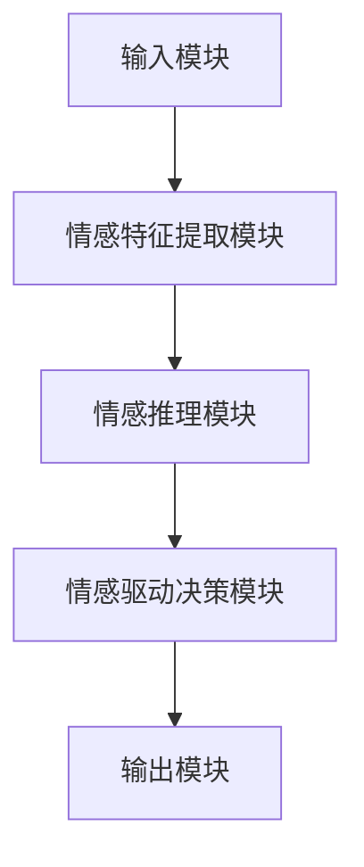
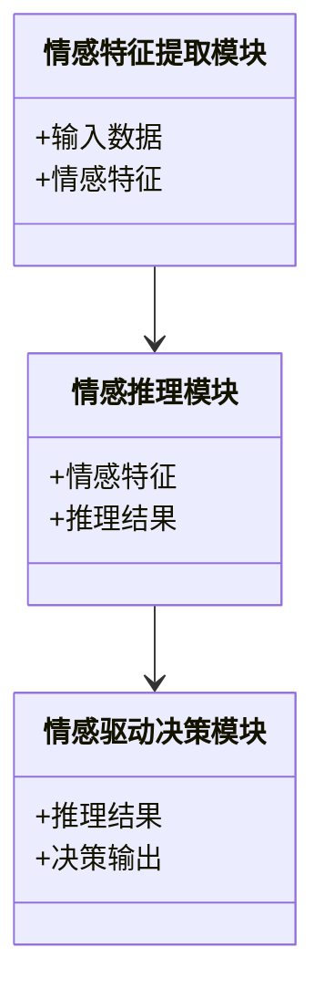

                 


# 情感智能 AI Agent：在 LLM 中植入 EQ

## 关键词：情感智能, AI Agent, 大语言模型, EQ, 人工智能, 人机交互, 机器学习

## 摘要：本文探讨了在大语言模型（LLM）中植入情感智能（EQ）的关键技术与实现方法。文章从情感智能的基本概念出发，分析了其在AI Agent中的应用价值，详细介绍了情感智能与自然语言处理（NLP）的结合方式，提出了情感智能AI Agent的系统架构与算法实现方案，并通过实际案例展示了其在人机交互中的应用场景。本文旨在为AI开发者和研究人员提供理论指导与实践参考，推动情感智能AI Agent的发展与应用。

---

## 第一部分：情感智能 AI Agent 的背景与核心概念

### 第1章：情感智能与 AI Agent 的概述

#### 1.1 情感智能（EQ）的核心概念
##### 1.1.1 情感智能的定义与特点
情感智能（Emotional Intelligence, EQ）是指个体识别、理解、管理和影响自身及他人情感的能力。它包括以下四个核心维度：
- **情感识别**：准确感知自身和他人的情感状态。
- **情感理解**：理解情感背后的意义和潜在需求。
- **情感管理**：有效调节自身情感，避免负面情绪的影响。
- **情感运用**：利用情感信息做出更合适的行为决策。

##### 1.1.2 情感智能与传统 AI 的区别
传统的AI主要依赖逻辑推理和数据处理，而情感智能则强调情感感知和情感驱动的决策。两者的区别如下：
| 方面 | 传统AI | 情感智能AI |
|------|--------|------------|
| 核心目标 | 解决逻辑问题 | 理解与处理情感信息 |
| 数据来源 | 结构化数据 | 非结构化情感数据 |
| 输出特征 | 理性化结果 | 情感化输出 |

##### 1.1.3 情感智能在人机交互中的重要性
随着AI技术的普及，用户对AI的期望不再局限于功能实现，而是更注重交互体验。情感智能的引入使得AI能够更好地理解用户需求，提供更贴心的服务，从而提升用户满意度和忠诚度。

#### 1.2 AI Agent 的基本概念
##### 1.2.1 AI Agent 的定义与分类
AI Agent（智能体）是指在计算机系统中，能够感知环境并采取行动以实现目标的实体。根据功能和应用场景的不同，AI Agent可以分为以下几类：
- **简单反射型Agent**：基于规则的简单响应。
- **基于模型的反射型Agent**：基于内部模型进行决策。
- **目标驱动型Agent**：以明确目标为导向。
- **实用驱动型Agent**：以效用函数为驱动。

##### 1.2.2 AI Agent 的核心功能与应用场景
AI Agent的核心功能包括感知、决策、执行和反馈。其应用场景广泛，如智能客服、智能家居、自动驾驶等。

##### 1.2.3 AI Agent 与传统程序的区别
AI Agent与传统程序的主要区别在于其具备自主决策和学习能力，能够根据环境变化动态调整行为。

#### 1.3 情感智能 AI Agent 的背景与意义
##### 1.3.1 当前 AI 技术的局限性
传统AI在处理复杂情感问题时显得力不从心，难以满足用户的情感需求。

##### 1.3.2 情感智能在 AI 中的应用需求
随着人机交互的深入发展，用户对情感化服务的需求日益增加。

##### 1.3.3 情感智能 AI Agent 的潜在价值与社会影响
情感智能AI Agent能够提升用户体验，促进人机协作，具有重要的社会价值。

#### 1.4 本章小结
本章从情感智能和AI Agent的基本概念出发，分析了情感智能在人机交互中的重要性，为后续内容奠定了基础。

---

## 第2章：情感智能 AI Agent 的核心概念与联系

#### 2.1 情感智能的核心原理
##### 2.1.1 情感特征的提取与分析
情感特征提取是情感智能的关键步骤，常用的提取方法包括词袋模型、TF-IDF和情感词典等。

##### 2.1.2 情感智能的计算模型
情感智能的计算模型主要包括基于规则的模型和基于深度学习的模型。

##### 2.1.3 情感智能与人类情感认知的对比
情感智能的计算模型与人类情感认知的差异主要体现在复杂性和灵活性方面。

#### 2.2 情感智能与 AI Agent 的结合
##### 2.2.1 情感智能在 AI Agent 中的角色
情感智能在AI Agent中主要负责情感感知、情感推理和情感驱动决策。

##### 2.2.2 情感智能与自然语言处理（NLP）的联系
情感智能与NLP的结合主要体现在情感分析、情感生成和情感对话等方面。

##### 2.2.3 情感智能与机器学习的融合
情感智能与机器学习的融合主要体现在特征提取、模型训练和效果优化等方面。

#### 2.3 情感智能 AI Agent 的系统架构
##### 2.3.1 情感智能 AI Agent 的基本架构
情感智能AI Agent的系统架构主要包括情感特征提取模块、情感推理模块和情感驱动决策模块。

##### 2.3.2 情感特征提取模块
情感特征提取模块负责从输入数据中提取情感特征，常用的提取方法包括词袋模型、TF-IDF和情感词典等。

##### 2.3.3 情感推理与决策模块
情感推理模块负责根据提取的情感特征进行推理，情感决策模块根据推理结果做出决策。

#### 2.4 本章小结
本章分析了情感智能的核心原理及其与AI Agent的结合方式，为后续章节的算法实现奠定了基础。

---

## 第3章：情感智能 AI Agent 的算法原理

#### 3.1 情感分析算法
##### 3.1.1 基于词袋模型的情感分析
词袋模型是一种简单的情感分析方法，通过统计关键词的出现频率来判断情感倾向。

##### 3.1.2 基于深度学习的情感分析
深度学习情感分析模型主要包括卷积神经网络（CNN）、循环神经网络（RNN）和变换器（Transformer）等。

##### 3.1.3 情感分析的评估指标与方法
常用的情感分析评估指标包括准确率、精确率、召回率和F1值等。

#### 3.2 情感生成算法
##### 3.2.1 基于规则的情感生成
基于规则的情感生成方法通过预定义的规则生成情感化文本。

##### 3.2.2 基于生成对抗网络的情感生成
生成对抗网络（GAN）是一种常用的情感生成方法，通过生成器和判别器的对抗训练生成高质量的情感化文本。

##### 3.2.3 情感生成的优化策略
情感生成的优化策略主要包括情感一致性优化和情感多样性优化。

#### 3.3 情感推理算法
##### 3.3.1 基于逻辑推理的情感推理
基于逻辑推理的情感推理方法通过逻辑规则进行情感推理。

##### 3.3.2 基于图神经网络的情感推理
图神经网络是一种常用的情感推理方法，通过构建情感知识图谱进行推理。

##### 3.3.3 情感推理的复杂性与挑战
情感推理的复杂性主要体现在情感信息的模糊性和多义性方面。

#### 3.4 本章小结
本章详细介绍了情感智能AI Agent的算法原理，包括情感分析、情感生成和情感推理等方面。

---

## 第4章：情感智能 AI Agent 的系统架构与设计

#### 4.1 情感智能 AI Agent 的系统架构
##### 4.1.1 系统功能模块划分
情感智能AI Agent的系统架构主要包括情感特征提取模块、情感推理模块和情感驱动决策模块。

##### 4.1.2 数据流与模块交互
数据流主要从输入模块流向特征提取模块，再流向推理模块和决策模块。

##### 4.1.3 系统架构图（Mermaid）


#### 4.2 情感智能 AI Agent 的系统设计
##### 4.2.1 系统功能设计
系统功能设计主要包括情感特征提取、情感推理和情感驱动决策等功能。

##### 4.2.2 系统架构设计（Mermaid）


#### 4.3 本章小结
本章详细介绍了情感智能AI Agent的系统架构与设计，为后续的实现提供了理论基础。

---

## 第5章：情感智能 AI Agent 的项目实战

#### 5.1 项目背景与目标
本项目旨在实现一个基于情感智能的AI Agent，能够理解用户情感并做出相应决策。

#### 5.2 项目环境与工具
##### 5.2.1 环境安装
需要安装Python、TensorFlow、Keras等工具。

##### 5.2.2 数据集准备
需要准备情感标注数据集，如IMDB情感分析数据集。

#### 5.3 项目实现
##### 5.3.1 情感特征提取模块的实现
```python
def extract_emotion_features(text):
    # 实现情感特征提取的代码
    pass
```

##### 5.3.2 情感推理模块的实现
```python
def emotional_reasoning(features):
    # 实现情感推理的代码
    pass
```

##### 5.3.3 情感驱动决策模块的实现
```python
def emotional_decision-making(features, reasoning_result):
    # 实现情感驱动决策的代码
    pass
```

#### 5.4 项目分析与总结
##### 5.4.1 实际案例分析
通过具体案例分析，验证系统的有效性。

##### 5.4.2 项目小结
总结项目的实现过程，分析存在的问题与改进方向。

#### 5.5 本章小结
本章通过一个具体的项目实战，详细介绍了情感智能AI Agent的实现过程。

---

## 第6章：情感智能 AI Agent 的总结与展望

#### 6.1 本章总结
本文详细介绍了情感智能AI Agent的理论基础、系统架构与实现方法。

#### 6.2 未来展望
未来的研究方向包括情感智能的深度学习、多模态情感计算和情感智能的跨领域应用等。

#### 6.3 注意事项
在实际应用中，需要注意情感数据的隐私保护和情感模型的可解释性问题。

#### 6.4 拓展阅读
推荐读者阅读相关领域的经典文献，进一步深入了解情感智能和AI Agent的研究进展。

---

## 作者：AI天才研究院 & 禅与计算机程序设计艺术

---

以上是《情感智能 AI Agent：在 LLM 中植入 EQ》的技术博客文章的完整目录大纲和详细内容。

