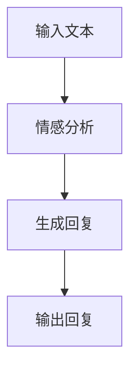
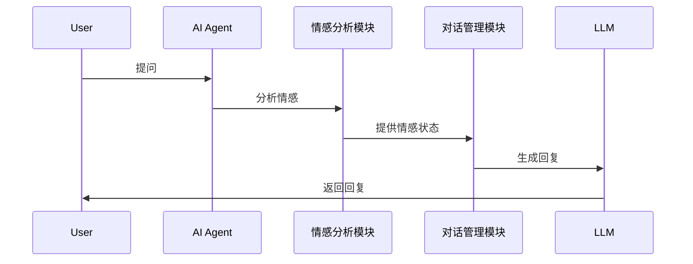

                 


```markdown
# 情感智能对话AI Agent：LLM驱动的心理健康助手

> 关键词：人工智能，心理健康，LLM，对话系统，情感分析

> 摘要：本文探讨了如何利用大语言模型（LLM）构建情感智能对话AI Agent，作为心理健康支持工具。文章从背景、核心概念、算法原理到系统架构，全面解析其技术实现，并通过实战案例展示其应用价值。

---

## 第一部分: 情感智能对话AI Agent的背景与概念

### 第1章: 情感智能对话AI Agent的背景与概念

#### 1.1 问题背景与描述
现代社会心理健康问题日益突出，传统心理咨询资源有限，AI技术为解决这一问题提供了新思路。情感智能对话AI Agent通过LLM技术，能够提供实时、个性化的心理健康支持。

#### 1.2 问题解决与边界
情感智能对话AI Agent的目标是通过自然语言处理技术，帮助用户缓解焦虑、抑郁等情绪问题。其边界包括不处理严重心理疾病，不替代专业医疗建议。

#### 1.3 核心要素与组成
系统由LLM模型、情感分析模块、对话管理模块和用户反馈模块组成。各模块协同工作，实现情感支持功能。

---

## 第二部分: 核心概念与联系

### 第2章: 情感智能对话AI Agent的核心原理

#### 2.1 情感理解与生成的原理
LLM通过预训练理解用户情感，并生成符合情境的回复。情感分析模块识别用户情绪，对话管理模块根据情感状态调整回复策略。

#### 2.2 对话管理机制
基于用户情感状态，系统采用规则或机器学习方法生成回复。规则方法适用于简单场景，机器学习方法则能处理复杂情况。

#### 2.3 用户情感状态的实时分析
系统实时分析用户文本，识别情感倾向。使用词袋模型或情感词典进行初步分析，再结合上下文优化结果。

---

## 第三部分: 算法原理与实现

### 第3章: 算法原理与实现

#### 3.1 大语言模型（LLM）的工作原理
LLM通过大规模数据预训练，理解上下文并生成回复。其核心是Transformer架构，包括编码器和解码器。

#### 3.2 情感分析算法
使用文本分类算法，如BERT，对用户输入进行情感分类。算法步骤包括数据预处理、模型训练和结果预测。

#### 3.3 对话管理算法
基于状态的对话管理，结合情感分析结果生成回复。采用深度强化学习优化对话策略。

#### 3.4 算法流程图


---

## 第四部分: 系统分析与架构设计方案

### 第4章: 系统分析与架构设计方案

#### 4.1 问题场景介绍
用户与AI Agent进行对话，系统实时分析情感并生成回复。支持多种交互方式，如文本和语音。

#### 4.2 系统功能设计
- 情感分析模块：识别用户情绪。
- 对话管理模块：生成个性化回复。
- 用户反馈模块：收集反馈优化系统。

#### 4.3 系统架构设计
```mermaid
graph LR
    Client --> API Gateway
    API Gateway --> NLP Module
    NLP Module --> LLM
    LLM --> Response
```

#### 4.4 系统接口设计
- 输入接口：接收用户文本或语音。
- 输出接口：返回生成回复或建议。

#### 4.5 系统交互流程


---

## 第五部分: 项目实战

### 第5章: 项目实战

#### 5.1 环境安装
安装Python和相关库，如TensorFlow、Keras和Hugging Face库。

#### 5.2 核心代码实现
实现情感分析模块和对话管理模块，使用预训练模型进行推理。

#### 5.3 代码应用解读与分析
通过具体代码示例，展示如何实现情感分析和对话生成功能。

#### 5.4 实际案例分析
分析一个用户案例，展示系统如何处理情感问题并生成回复。

---

## 第六部分: 最佳实践、小结、注意事项和拓展阅读

### 第6章: 最佳实践与注意事项

#### 6.1 最佳实践
- 使用高质量的情感词典优化分析结果。
- 定期更新模型应对新词汇和表达方式。
- 采用多模态输入提升用户体验。

#### 6.2 小结
本文详细介绍了情感智能对话AI Agent的技术实现，从背景到实战，为开发者提供了完整的技术路线。

#### 6.3 注意事项
- 数据隐私保护至关重要。
- 情感分析可能存在误判，需提示用户。
- 系统不具备专业医疗建议能力。

#### 6.4 拓展阅读
推荐阅读相关论文和书籍，深入理解LLM和情感计算技术。

---

## 作者信息

作者：AI天才研究院/AI Genius Institute & 禅与计算机程序设计艺术 /Zen And The Art of Computer Programming
```

