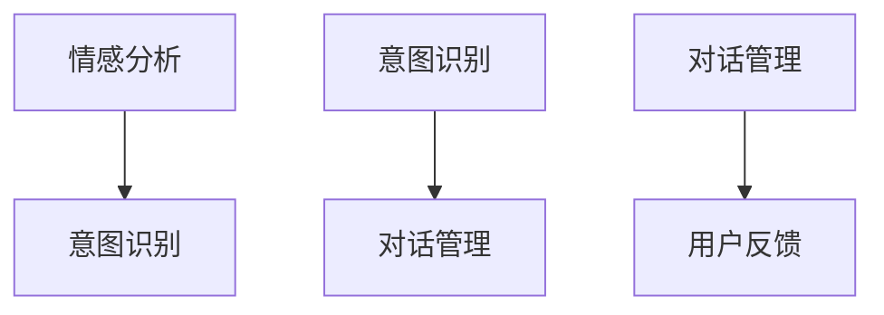
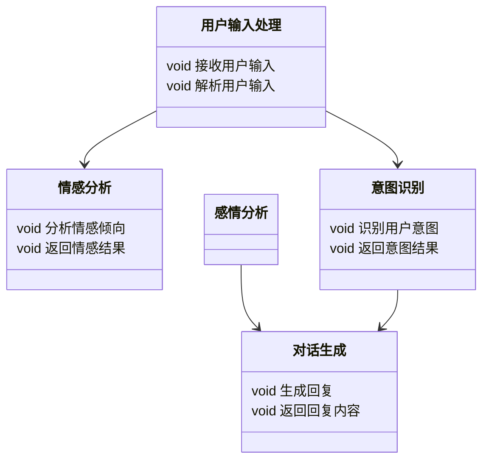
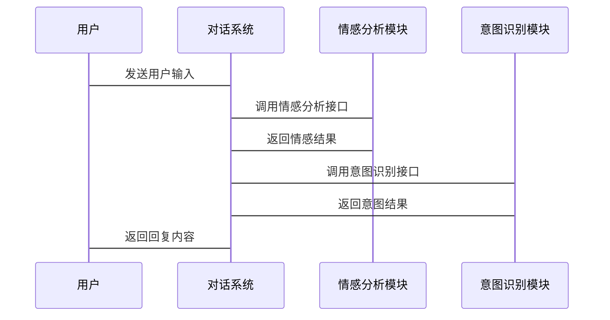

                 


# 情感智能对话系统AI Agent：LLM驱动的深度交互

> 关键词：情感智能对话系统，LLM，深度交互，大语言模型，自然语言处理，对话生成

> 摘要：本文深入探讨了情感智能对话系统中基于大语言模型（LLM）的深度交互技术。通过分析情感分析、意图识别和对话管理的核心概念，结合实际项目案例，详细阐述了LLM在情感智能对话系统中的算法原理、系统架构设计以及项目实现的全过程，最后总结了最佳实践和未来发展方向。

---

## 第一部分：情感智能对话系统的背景与概念

### 第1章：情感智能对话系统概述

#### 1.1 情感智能对话系统的定义与背景
情感智能对话系统是一种能够理解和回应用户情感需求的智能对话系统，通过自然语言处理技术，结合情感分析和意图识别，实现与用户的深度交互。随着大语言模型（LLM）的兴起，情感智能对话系统在客服、教育、医疗等领域展现出广泛的应用潜力。

- **问题背景**：传统对话系统往往依赖于规则或简单的关键词匹配，难以准确捕捉用户的情感需求，导致用户体验不佳。
- **问题解决**：通过引入情感分析和意图识别技术，结合深度学习模型，提升对话系统的智能化水平。
- **边界与外延**：情感智能对话系统的边界在于其情感理解和对话生成能力，外延则包括基于上下文理解和多轮对话的能力。

#### 1.2 情感智能对话系统的核心要素
情感智能对话系统由情感分析、意图识别和对话管理三个核心要素组成，每个要素都有其独特的功能和实现方式。

| 核心要素 | 定义 | 功能 | 示例 |
|----------|------|------|------|
| 情感分析 | 对文本进行情感倾向分析 | 判断用户情感状态 | 分析用户评论“我感到很失望”为负面情感 |
| 意图识别 | 识别用户的意图 | 理解用户的深层需求 | 用户输入“我需要帮助”，系统识别出请求帮助的意图 |
| 对话管理 | 管理对话流程 | 维护对话上下文 | 根据用户意图选择合适的回复 |

#### 1.3 情感智能对话系统的应用场景
- **客服领域**：通过情感分析识别客户情绪，提供更贴心的服务。
- **教育领域**：根据学生情绪调整教学策略。
- **医疗领域**：帮助医生理解患者情感，提供更好的诊断建议。

---

## 第二部分：情感智能对话系统的核心概念与联系

### 第2章：核心概念与联系

#### 2.1 情感分析的核心原理
情感分析是通过自然语言处理技术对文本的情感倾向进行分析的过程，通常分为词袋模型、基于RNN的情感分析和基于Transformer的情感分析。

- **词袋模型**：将文本表示为词的集合，不考虑词序。
- **RNN模型**：通过循环神经网络捕捉文本序列信息。
- **Transformer模型**：基于自注意力机制，提升文本理解能力。

#### 2.2 意图识别的核心原理
意图识别通过分析用户输入，识别其背后的意图，常用基于规则和基于机器学习的方法。

- **基于规则的方法**：通过预设规则匹配用户输入。
- **基于机器学习的方法**：利用分类模型学习意图特征。

#### 2.3 对话管理的核心原理
对话管理负责维护对话上下文，确保对话流畅，常用基于规则和基于深度学习的方法。

- **基于规则的方法**：通过预设规则控制对话流程。
- **基于深度学习的方法**：利用强化学习优化对话策略。

#### 2.4 核心概念对比与联系
情感分析、意图识别和对话管理之间存在密切联系，共同构成了情感智能对话系统的核心能力。



---

## 第三部分：情感智能对话系统的算法原理

### 第3章：情感分析算法原理

#### 3.1 情感分析的算法选择
情感分析的算法选择主要基于数据特征和任务需求，常用模型包括词袋模型、TF-IDF、RNN和Transformer。

- **词袋模型**：简单但无法捕捉语义信息。
- **TF-IDF**：基于词频-逆文档频率，适用于文本特征提取。
- **RNN**：适合处理长文本序列。
- **Transformer**：在长文本处理中表现更优。

#### 3.2 情感分析的实现流程
实现情感分析需要经过数据预处理、模型训练和评估三个阶段。

1. **数据预处理**：
   - 分词：将文本分割为词语或短语。
   - 去停用词：去除无意义词汇。
   - 向量化：将文本转换为向量表示。

2. **模型训练**：
   - 选择合适的情感分析模型（如Bert）。
   - 设定损失函数（交叉熵损失）和优化器（Adam）。
   - 进行模型训练并保存最优模型。

3. **模型评估**：
   - 使用验证集评估模型性能。
   - 计算准确率、召回率和F1值。

#### 3.3 情感分析的数学模型
情感分析的核心是计算文本的向量表示，常用词嵌入技术如Word2Vec或GloVe。

- **词嵌入示例**：
  ```python
  import numpy as np
  word_embeddings = np.random.rand(vocabulary_size, embedding_dim)
  ```

- **损失函数示例**：
  ```latex
  $$\text{Loss} = -\sum_{i=1}^{n} y_i \log(p_i) + (1 - y_i) \log(1 - p_i)$$
  $$\text{其中} p_i \text{是模型预测的概率，} y_i \text{是真实标签}$$
  ```

---

## 第四章：意图识别算法原理

### 第4.1 意图识别的算法选择
意图识别的算法选择基于任务需求和数据特征，常用基于规则和基于机器学习的方法。

- **基于规则的方法**：通过正则表达式匹配用户输入。
- **基于机器学习的方法**：使用SVM或随机森林模型进行分类。

#### 4.2 意图识别的实现流程
实现意图识别通常包括数据预处理、模型训练和评估三个阶段。

1. **数据预处理**：
   - 分词和去停用词。
   - 文本向量化。

2. **模型训练**：
   - 选择合适的分类模型。
   - 设定损失函数和优化器。
   - 进行模型训练并保存最优模型。

3. **模型评估**：
   - 使用验证集评估模型性能。
   - 计算准确率、召回率和F1值。

#### 4.3 意图识别的数学模型
意图识别通常使用文本分类模型，常见的损失函数包括交叉熵损失。

- **损失函数示例**：
  ```latex
  $$\text{Loss} = -\sum_{i=1}^{n} y_i \log(p_i) + (1 - y_i) \log(1 - p_i)$$
  $$\text{其中} p_i \text{是模型预测的概率，} y_i \text{是真实标签}$$
  ```

---

## 第五章：对话管理算法原理

### 第5.1 对话管理的算法选择
对话管理的算法选择基于任务需求和数据特征，常用基于规则和基于强化学习的方法。

- **基于规则的方法**：通过预设规则控制对话流程。
- **基于强化学习的方法**：通过奖励机制优化对话策略。

#### 5.2 对话管理的实现流程
实现对话管理通常包括状态管理、动作选择和对话历史记录三个阶段。

1. **状态管理**：
   - 维护对话上下文。
   - 根据当前状态选择下一步动作。

2. **动作选择**：
   - 基于当前状态和用户输入选择合适的回复。
   - 使用预设规则或机器学习模型生成回复。

3. **对话历史记录**：
   - 记录对话历史。
   - 根据历史信息调整对话策略。

#### 5.3 对话管理的数学模型
对话管理通常使用马尔可夫决策过程模型，定义状态、动作和奖励函数。

- **状态表示示例**：
  ```python
  state = {
      'intent': 'request_help',
      'context': '用户提到需要帮助'
  }
  ```

- **动作选择示例**：
  ```python
  def choose_action(state):
      if state['intent'] == 'request_help':
          return '提供帮助'
      else:
          return '继续对话'
  ```

---

## 第六章：系统分析与架构设计

### 第6.1 系统功能设计
系统功能设计包括用户输入处理、情感分析、意图识别和对话生成四个模块。



### 第6.2 系统架构设计
系统架构设计采用分层架构，包括前端、后端和数据库三个部分。


### 第6.3 系统接口设计
系统接口设计包括用户输入接口、情感分析接口和意图识别接口。



---

## 第七章：项目实战

### 第7.1 环境安装
安装必要的Python库，如TensorFlow、Keras和Numpy。

```bash
pip install tensorflow==2.10.0
pip install numpy==1.21.2
pip install scikit-learn==0.24.1
```

### 第7.2 核心代码实现
实现情感分析、意图识别和对话生成的核心代码。

#### 7.2.1 情感分析代码
```python
import numpy as np
from tensorflow.keras.models import Model
from tensorflow.keras.layers import Input, Dense, LSTM, Bidirectional

# 定义模型输入
input_layer = Input(shape=(max_length,))

# 定义双向LSTM层
lstm_layer = Bidirectional(LSTM(units=64))(input_layer)

# 定义全连接层并输出
output_layer = Dense(units=2, activation='softmax')(lstm_layer)

# 编译模型
model = Model(inputs=input_layer, outputs=output_layer)
model.compile(loss='sparse_categorical_crossentropy', optimizer='Adam', metrics=['accuracy'])
```

#### 7.2.2 意图识别代码
```python
from sklearn.feature_extraction.text import TfidfVectorizer
from sklearn.svm import SVC

# 初始化向量化工具
vectorizer = TfidfVectorizer()

# 训练模型
model = SVC()
model.fit(vectorizer.fit_transform(corpus), labels)
```

#### 7.2.3 对话生成代码
```python
from tensorflow.keras.models import load_model

# 加载预训练模型
model = load_model('dialog_generator.h5')

# 生成回复
def generate_response(input_text):
    # 预处理输入文本
    processed_input = preprocess(input_text)
    # 预测回复
    prediction = model.predict(processed_input)
    return decode_prediction(prediction)
```

### 第7.3 代码应用解读与分析
详细解读核心代码的功能和实现逻辑，分析代码的优缺点。

### 第7.4 实际案例分析
通过实际案例分析，展示情感智能对话系统的实际应用效果和优化方向。

---

## 第八章：最佳实践

### 第8.1 小结
总结全文的主要内容和关键点，强调情感智能对话系统的重要性和应用潜力。

### 第8.2 注意事项
- 数据质量：确保训练数据的多样性和代表性。
- 模型优化：通过调参和模型融合提升性能。
- 安全性：确保用户数据的安全和隐私保护。

### 第8.3 拓展阅读
推荐相关书籍和资源，供读者进一步学习和研究。

---

## 作者：AI天才研究院 & 禅与计算机程序设计艺术

---

通过以上步骤，您可以撰写一篇详细且结构清晰的情感智能对话系统AI Agent的技术博客文章。

