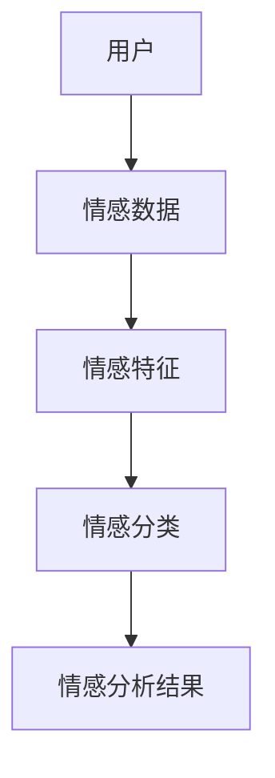

                 


# 情感计算：构建具有情商的AI Agent

> 关键词：情感计算、AI Agent、情感分析、机器学习、深度学习

> 摘要：情感计算是一种新兴的人工智能技术，旨在赋予AI Agent理解和处理人类情感的能力，从而实现更自然、更智能的人机交互。本文将深入探讨情感计算的核心概念、算法原理、系统架构以及实际应用，为读者提供全面的视角，理解如何构建具有情商的AI Agent。

---

## 第一部分: 情感计算的背景与核心概念

### 第1章: 情感计算的背景与问题背景

#### 1.1 情感计算的基本概念

- **什么是情感计算**  
  情感计算（Affective Computing）是人工智能领域的一个分支，旨在通过计算机技术来识别、理解、分析和处理人类的情感。它研究如何赋予机器识别和模拟人类情感的能力，从而实现更自然、更智能的人机交互。

- **情感计算的研究背景**  
  随着人工智能技术的快速发展，传统的计算方式主要基于逻辑和数据，难以处理人类的情感和情绪。情感计算的研究为AI系统赋予了“情感智商”（EQ），使其能够理解用户的情感状态，并在交互过程中提供更贴心的服务。

- **情感计算的应用领域**  
  情感计算在多个领域都有广泛的应用，包括自然语言处理、人机交互、教育技术、医疗健康、游戏开发等。例如，在智能客服中，情感计算可以帮助系统理解用户的情绪，提供更合适的回应；在医疗领域，情感计算可以辅助医生分析患者的情绪状态，提供更个性化的治疗方案。

- **情感计算与传统计算的区别**  
  传统的计算主要基于逻辑和数据，而情感计算则关注人类情感的识别和处理。传统计算注重结果的准确性，而情感计算更注重用户体验和情感反馈。

---

#### 1.2 情感计算的核心问题

- **情感数据的获取与处理**  
  情感数据的获取是情感计算的第一步，主要包括文本、语音、面部表情和生理数据等多种形式。这些数据需要经过预处理、特征提取和情感分类等步骤，才能被用于后续的分析和应用。

- **情感分析的挑战与难点**  
  情感分析是一个复杂的过程，涉及多个方面的挑战。例如，如何准确地识别和分类情感，如何处理情感的模糊性和多义性，如何在不同语言和文化背景下保持一致性等。

- **情感计算的核心要素**  
  情感计算的核心要素包括情感数据、情感特征、情感分类和情感推理。这些要素相互关联，共同构成了情感计算的整体框架。

---

### 第2章: 情感计算的核心概念与联系

#### 2.1 情感计算的原理与方法

- **情感特征提取**  
  情感特征提取是情感计算的关键步骤之一，旨在从原始数据中提取出能够反映情感状态的特征。例如，在文本情感分析中，可以提取关键词、句法结构和语义信息等特征。

- **情感分类算法**  
  情感分类算法是情感计算的核心技术，旨在将情感数据分类为特定的情感类别，如正面、负面和中性。常见的算法包括基于规则的分类、机器学习模型和深度学习模型。

- **情感推理模型**  
  情感推理模型是一种高级的情感计算技术，旨在通过推理和分析，理解情感之间的关系和复杂性。例如，情感推理可以用于情感对话系统中，帮助AI Agent理解用户的情感状态，并生成相应的回应。

---

#### 2.2 情感计算的核心要素对比

| **核心要素** | **情感计算** | **自然语言处理** | **机器学习** | **深度学习** |
|--------------|--------------|------------------|--------------|--------------|
| **目标**     | 理解和处理情感 | 处理和理解语言   | 数据分类与预测 | 学习数据的复杂模式 |
| **输入**     | 文本、语音、面部表情等 | 文本数据       | 各种数据类型 | 大型数据集 |
| **输出**     | 情感类别或情感强度 | 语言理解和生成 | 数据分类结果 | 高阶特征表示 |
| **技术特点** | 结合情感特征和分类技术 | 依赖语言学规则 | 基于统计和模式识别 | 基于神经网络和深度模型 |

---

#### 2.3 情感计算的ER实体关系图



---

## 第二部分: 情感计算的算法原理

### 第3章: 情感计算的核心算法

#### 3.1 基于规则的情感分类算法

- **规则的定义与实现**  
  基于规则的情感分类算法依赖于预定义的规则和关键词，例如，正面情感的关键词可能包括“喜欢”、“满意”等，负面情感的关键词可能包括“不满”、“失望”等。

- **情感分类流程**  
  基于规则的情感分类算法的流程如下：
  1. 数据预处理：提取文本中的关键词。
  2. 关键词匹配：将关键词与预定义的规则进行匹配。
  3. 情感分类：根据匹配结果进行情感分类。

- **优缺点分析**  
  优点：简单易实现，适用于规则明确的情感分类任务。缺点：难以处理复杂的语义和情感的模糊性。

---

#### 3.2 基于机器学习的情感分类算法

- **机器学习算法的数学模型**  
  机器学习模型通常使用逻辑回归、支持向量机（SVM）和随机森林等算法。以逻辑回归为例，其数学模型如下：

  $$ P(y=1|x) = \frac{e^{\beta x}}{1 + e^{\beta x}} $$

  其中，$\beta$ 是模型的参数，$x$ 是输入特征。

- **情感分类的训练与测试**  
  情感分类的训练过程包括特征提取、模型训练和模型评估。测试过程包括数据预处理、模型预测和结果分析。

- **情感分类的评估指标**  
  常见的评估指标包括准确率、精确率、召回率和F1分数。

---

#### 3.3 基于深度学习的情感分类算法

- **深度学习模型的结构**  
  深度学习模型通常使用卷积神经网络（CNN）、循环神经网络（RNN）和变压器（Transformer）等结构。以Transformer为例，其结构包括编码器和解码器两个部分。

- **情感分类的神经网络实现**  
  情感分类的神经网络实现流程如下：
  1. 数据预处理：将文本数据转换为数值表示。
  2. 模型训练：使用训练数据训练情感分类模型。
  3. 模型预测：使用训练好的模型对测试数据进行预测。

- **深度学习模型的优缺点**  
  优点：能够处理复杂的语义和情感信息，具有较高的准确率。缺点：需要大量的训练数据和计算资源。

---

### 第4章: 情感计算的数学模型与公式

#### 4.1 情感计算的数学模型

- **情感计算的数学模型**  
  情感计算的数学模型通常基于概率论和统计学。例如，情感分类的贝叶斯模型如下：

  $$ P(y|x) = \frac{P(x|y)P(y)}{P(x)} $$

  其中，$P(y|x)$ 是在给定特征 $x$ 的情况下，情感类别 $y$ 的概率。

---

## 第三部分: 系统分析与架构设计方案

### 第5章: 情感计算的系统架构设计

#### 5.1 问题场景介绍

- **问题场景**  
  本章将通过一个具体的案例——社交媒体情感分析，介绍情感计算的系统架构设计。

#### 5.2 系统功能设计

- **领域模型设计**  
  系统的功能模块包括数据采集、特征提取、情感分类和结果展示。

  ```mermaid
  graph TD
      A[数据采集] --> B[特征提取]
      B --> C[情感分类]
      C --> D[结果展示]
  ```

---

## 第六部分: 项目实战

### 第6章: 情感计算的项目实战

#### 6.1 环境安装与配置

- **环境要求**  
  需要安装Python、TensorFlow、Keras和scikit-learn等库。

#### 6.2 核心代码实现

```python
import numpy as np
from sklearn.feature_extraction.text import TfidfVectorizer
from sklearn.linear_model import LogisticRegression

# 数据预处理
X = ["这是一个好用的产品", "这个功能非常不方便"]
y = [1, 0]  # 1表示正面情感，0表示负面情感

# 特征提取
vectorizer = TfidfVectorizer()
X_vec = vectorizer.fit_transform(X)

# 模型训练
model = LogisticRegression()
model.fit(X_vec, y)

# 模型预测
test_sentence = ["这个产品还不错"]
test_vec = vectorizer.transform(test_sentence)
predicted = model.predict(test_vec)
print(predicted)
```

#### 6.3 代码解读与分析

- **代码功能解读**  
  该代码实现了基于TF-IDF和逻辑回归的情感分类模型。首先，使用TF-IDF进行特征提取，然后使用逻辑回归进行模型训练和预测。

---

## 第七部分: 最佳实践与总结

### 第7章: 情感计算的总结与展望

#### 7.1 小结

- **小结**  
  情感计算是一种新兴的人工智能技术，旨在赋予机器理解和处理人类情感的能力。本文从情感计算的基本概念、算法原理、系统架构到实际应用进行了全面的探讨。

#### 7.2 注意事项

- **注意事项**  
  在情感计算的实际应用中，需要注意数据的多样性和情感的复杂性，避免模型的过拟合和欠拟合问题。

#### 7.3 拓展阅读

- **拓展阅读**  
  对于感兴趣的研究者，可以进一步阅读相关的学术论文和技术报告，了解情感计算的最新研究进展。

---

# 作者：AI天才研究院/AI Genius Institute & 禅与计算机程序设计艺术 /Zen And The Art of Computer Programming

---

### 总结

通过本文的详细探讨，我们了解了情感计算的核心概念、算法原理、系统架构和实际应用。情感计算作为人工智能领域的重要分支，将在未来的智能交互中发挥越来越重要的作用。希望本文能为读者提供有价值的参考和启发，帮助他们在情感计算领域取得更大的突破。

