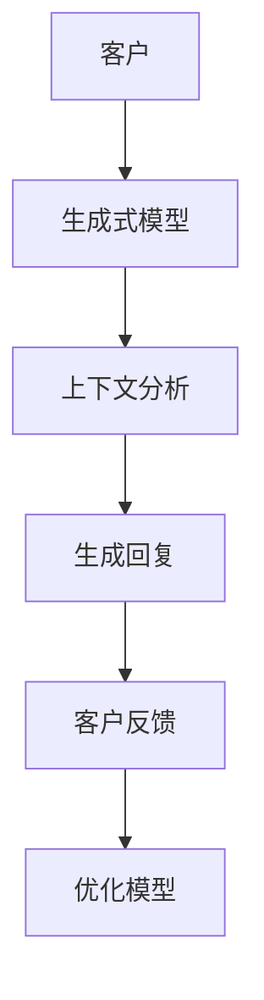
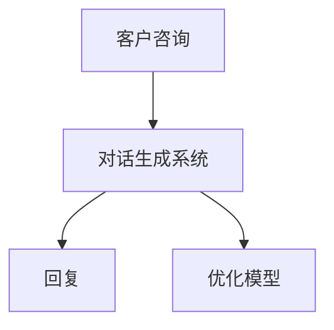
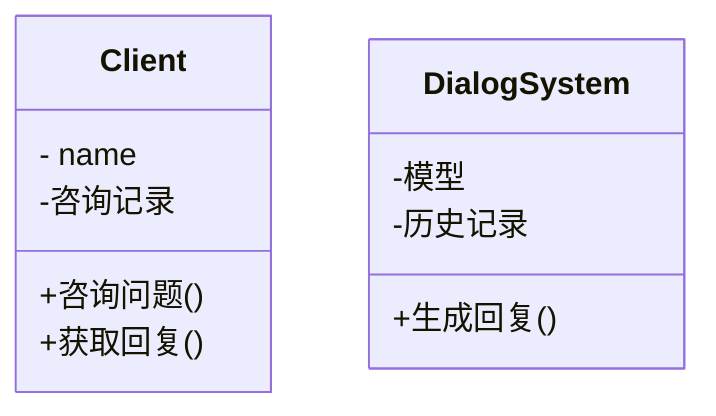
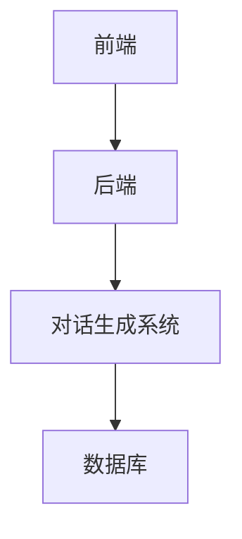
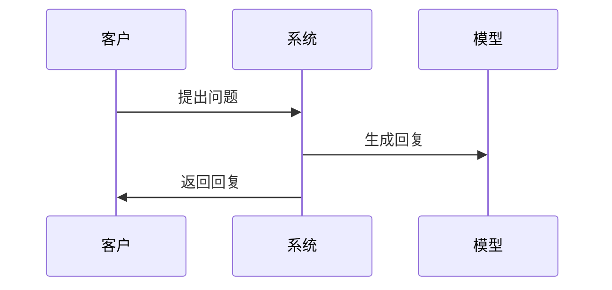

                 


# 情景对话生成技术在金融咨询中的应用实践

## 关键词：情景对话生成技术、金融咨询、自然语言处理、生成式AI、对话系统

## 摘要：情景对话生成技术在金融咨询中的应用实践，探讨了如何利用生成式AI技术解决金融咨询中的对话问题。通过分析对话生成技术的原理、系统架构设计、项目实战，展示了该技术在金融领域的实际应用和效果。文章详细讲解了模型训练流程、算法实现细节、数学公式推导以及系统设计，为读者提供了全面的技术视角。

---

# 第一章 情景对话生成技术概述

## 1.1 问题背景与描述

### 1.1.1 金融咨询中的对话需求

在金融咨询领域，客户通常需要与顾问进行复杂的对话，涉及投资建议、风险管理、资产配置等多个方面。传统的对话系统往往依赖于预设的规则或检索式对话，难以应对复杂的场景和多样化的客户需求。生成式对话技术的引入，为金融咨询带来了更灵活和个性化的解决方案。

### 1.1.2 情景对话生成技术的定义

情景对话生成技术是指利用自然语言处理技术，通过生成式模型（如GPT、Transformer等）来模拟人类对话的能力。该技术能够根据上下文生成符合情境的回复，帮助用户解决问题或提供信息。

### 1.1.3 技术在金融咨询中的重要性

在金融咨询中，情景对话生成技术可以提升用户体验，提高咨询效率，并降低人工成本。它能够处理复杂的问题，提供个性化的建议，增强客户信任。

## 1.2 问题解决与边界

### 1.2.1 情景对话生成技术的解决方案

通过生成式模型，情景对话生成技术可以实时生成自然流畅的对话回复，满足客户的多样化需求。

### 1.2.2 技术的边界与限制

目前的技术在处理非常复杂或模糊的问题时，可能会出现错误或不准确的回复。此外，模型的训练数据质量和规模直接影响生成效果。

### 1.2.3 应用场景的外延

情景对话生成技术不仅适用于金融咨询，还可应用于客服、教育、医疗等领域。

## 1.3 概念结构与核心要素

### 1.3.1 核心概念的组成

情景对话生成技术由数据输入、模型训练、对话生成和反馈优化四个部分组成。

### 1.3.2 对比分析表格

| 技术类型   | 基于规则的对话系统 | 检索式对话系统 | 生成式对话系统 |
|------------|---------------------|-----------------|----------------|
| 实现方式   | 预设规则            | 检索预存回复     | 自动生成回复    |
| 优点       | 实现简单             | 响应速度快       | 回复多样化       |
| 缺点       | 灵活性差             | 内容受限         | 可能不准确       |

### 1.3.3 案例分析与结构图



---

# 第二章 核心概念与技术联系

## 2.1 情景对话生成技术的原理

### 2.1.1 生成模型的工作机制

生成式模型通过编码器-解码器结构，将输入的对话历史编码为一个向量，然后解码生成回复。例如，使用Transformer模型进行编码和解码。

### 2.1.2 与检索式对话系统的区别

生成式对话系统能够根据输入生成新的回复，而检索式系统只能从预存的数据库中选择回复。

### 2.1.3 技术的核心要素

- **编码器**：将输入对话历史编码为向量。
- **解码器**：根据编码向量生成回复。
- **注意力机制**：帮助模型关注重要的对话内容。

## 2.2 核心概念的属性特征

### 2.2.1 实体关系图



---

# 第三章 算法原理与流程

## 3.1 模型训练流程

### 3.1.1 数据预处理

- 数据清洗：去除无效数据，如空字符串。
- 分词：将文本分割成词语或短语。
- 标注：标注对话角色（客户、顾问）。

### 3.1.2 模型结构

使用Transformer模型，包含编码器和解码器。

### 3.1.3 训练目标

使用交叉熵损失函数进行优化。

## 3.2 算法实现细节

### 3.2.1 模型结构代码

```python
import torch
import torch.nn as nn

class Transformer(nn.Module):
    def __init__(self, d_model, nhead, dpff_size):
        super(Transformer, self).__init__()
        self.encoder = nn.TransformerEncoder(...)
        self.decoder = nn.TransformerDecoder(...)
```

### 3.2.2 训练过程代码

```python
def train_step(model, optimizer, criterion, batch):
    optimizer.zero_grad()
    outputs = model(batch)
    loss = criterion(outputs, batch_labels)
    loss.backward()
    optimizer.step()
    return loss.item()
```

### 3.2.3 模型评估代码

```python
def evaluate(model, dataset):
    model.eval()
    total_loss = 0
    for batch in dataset:
        with torch.no_grad():
            outputs = model(batch)
            total_loss += criterion(outputs, batch_labels)
    avg_loss = total_loss / len(dataset)
    return avg_loss
```

## 3.3 数学模型与公式

### 3.3.1 注意力机制公式

$$\text{Attention}(Q,K,V) = \text{softmax}(\frac{QK^T}{\sqrt{d}})V$$

### 3.3.2 损失函数计算

$$\text{Loss} = -\sum_{i=1}^{n} \text{log}p(x_i)$$

---

# 第四章 系统分析与架构设计

## 4.1 项目背景

金融咨询系统需要处理大量的客户咨询，提升用户体验。

## 4.2 系统功能设计

### 4.2.1 领域模型类图



### 4.2.2 系统架构设计



### 4.2.3 系统接口设计

定义API接口，如`POST /api/generate`。

### 4.2.4 系统交互流程



---

# 第五章 项目实战

## 5.1 环境安装

安装必要的库，如PyTorch、 transformers。

## 5.2 核心代码实现

### 5.2.1 对话生成代码

```python
from transformers import AutoTokenizer, AutoModelForCausalLM

tokenizer = AutoTokenizer.from_pretrained('gpt2')
model = AutoModelForCausalLM.from_pretrained('gpt2')

def generate_response(input_text):
    inputs = tokenizer(input_text, return_tensors='pt')
    outputs = model.generate(inputs.input_ids, max_length=50)
    return tokenizer.decode(outputs[0], skip_special_tokens=True)
```

### 5.2.2 代码解读

使用预训练模型进行对话生成，处理输入文本并生成回复。

## 5.3 实际案例分析

在金融咨询中，客户询问投资建议，系统生成个性化的回复。

---

# 第六章 最佳实践与小结

## 6.1 总结

情景对话生成技术在金融咨询中的应用显著提升了用户体验和效率。

## 6.2 注意事项

- 数据隐私保护
- 模型优化
- 人机协同

## 6.3 未来展望

探索更先进的生成模型，如GPT-4，提升对话质量。

---

# 附录

## 附录A 扩展阅读

推荐论文和工具包，如《Attention Is All You Need》。

---

作者：AI天才研究院 & 禅与计算机程序设计艺术

