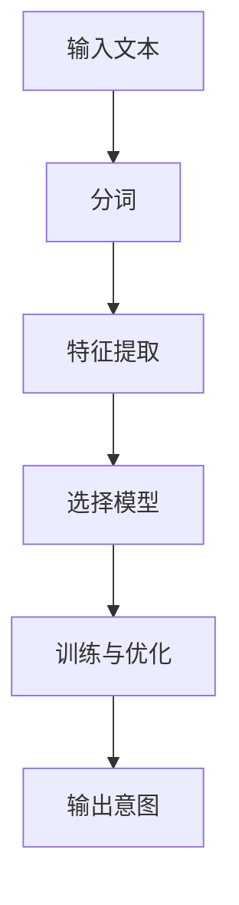
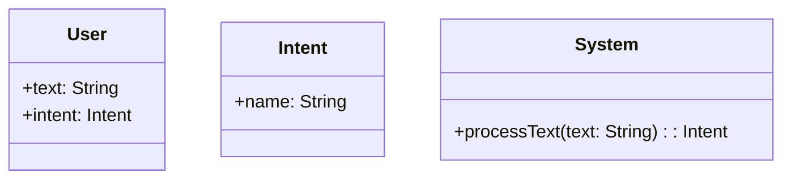
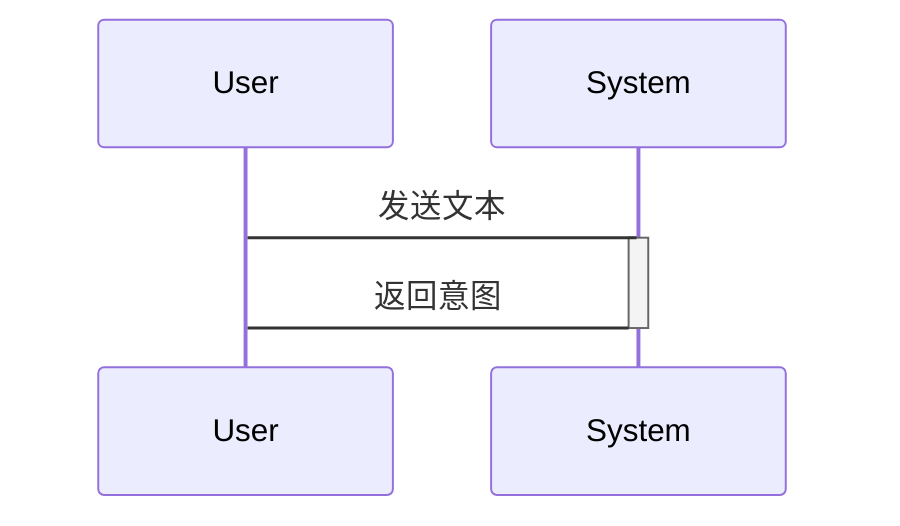

                 


# 意图识别：准确把握用户需求

## 关键词：
意图识别, 自然语言处理, 机器学习, 模型训练, 系统架构, 项目实战

## 摘要：
意图识别是自然语言处理领域中的关键技术，旨在理解用户的输入文本，准确捕获用户的深层需求。本文系统地介绍了意图识别的核心概念、算法原理、系统架构设计以及项目实战。通过详细的技术分析和实例演示，帮助读者全面掌握意图识别的实现方法和应用技巧。

---

# 目录大纲

1. [意图识别：准确把握用户需求](#意图识别准确把握用户需求)
2. [摘要](#摘要)
3. [关键词](#关键词)
4. [正文](#正文)
   - [1. 背景与核心概念](#背景与核心概念)
     - [1.1 问题背景与描述](#问题背景与描述)
     - [1.2 核心概念与属性](#核心概念与属性)
   - [2. 意图识别的核心原理](#意图识别的核心原理)
     - [2.1 自然语言处理与机器学习](#自然语言处理与机器学习)
   - [3. 意图识别的算法原理与实现](#意图识别的算法原理与实现)
     - [3.1 基于机器学习的意图识别算法](#基于机器学习的意图识别算法)
     - [3.2 算法流程图](#算法流程图)
     - [3.3 算法实现代码](#算法实现代码)
     - [3.4 数学模型与公式](#数学模型与公式)
   - [4. 系统分析与架构设计方案](#系统分析与架构设计方案)
     - [4.1 问题场景介绍](#问题场景介绍)
     - [4.2 系统功能设计](#系统功能设计)
     - [4.3 系统架构设计](#系统架构设计)
     - [4.4 接口设计与交互](#接口设计与交互)
   - [5. 项目实战](#项目实战)
     - [5.1 项目背景与目标](#项目背景与目标)
     - [5.2 环境安装与配置](#环境安装与配置)
     - [5.3 核心代码实现](#核心代码实现)
     - [5.4 代码解读与分析](#代码解读与分析)
     - [5.5 实际案例分析](#实际案例分析)
   - [6. 最佳实践](#最佳实践)
     - [6.1 小结](#小结)
     - [6.2 注意事项](#注意事项)
     - [6.3 拓展阅读](#拓展阅读)
5. [作者](#作者)

---

## 正文

### 1. 背景与核心概念

#### 1.1 问题背景与描述

意图识别（Intent Recognition）是自然语言处理（NLP）领域中的一个重要任务，旨在理解用户输入文本的意图，从而准确捕捉用户的需求。随着人机交互系统的普及，意图识别在智能客服、语音助手、推荐系统等领域发挥着越来越重要的作用。

在实际应用中，意图识别可以帮助系统理解用户的输入，例如，当用户输入“我需要预订一张去北京的机票”，系统需要识别出用户的意图是“预订机票”。意图识别不仅仅是关键词匹配，还需要理解上下文和语义关系。

#### 1.2 核心概念与属性

意图识别的核心概念包括输入文本、意图标签、特征提取和模型训练。以下是一个对比表格，展示了意图识别与其他相关技术的区别：

| 技术 | 描述 | 优缺点 |
|------|------|--------|
| 意图识别 | 基于文本内容，识别用户的深层需求 | 高准确性，但需要大量数据和模型训练 |
| 实体识别 | 识别文本中的具体实体（如人名、地名） | 速度快，但无法理解上下文 |
| 情感分析 | 分析文本中的情感倾向 | 适用于反馈分析，但无法直接识别意图 |

以下是一个简单的ER实体关系图，展示了意图识别中的实体关系：

```mermaid
er
actor User
actor Intent
relation HasIntent
```

---

### 2. 意图识别的核心原理

意图识别的核心原理结合了自然语言处理和机器学习技术。以下是关键步骤的简要说明：

1. **文本预处理**：包括分词、去除停用词、词干提取等。
2. **特征提取**：将文本转换为数值特征，例如TF-IDF、Word2Vec等。
3. **模型训练**：使用机器学习算法（如SVM、随机森林、神经网络）训练意图分类模型。
4. **意图预测**：基于训练好的模型，对新的文本进行意图分类。

---

### 3. 意图识别的算法原理与实现

#### 3.1 基于机器学习的意图识别算法

以下是基于机器学习的意图识别算法的流程图：



#### 3.2 算法实现代码

以下是Python代码实现意图识别的基本流程：

```python
import numpy as np
from sklearn.feature_extraction.text import TfidfVectorizer
from sklearn.svm import SVC

# 示例数据
train_texts = ["我需要预订机票", "请帮我订酒店"]
train_labels = ["预订机票", "订酒店"]

# 特征提取
vectorizer = TfidfVectorizer()
X_train = vectorizer.fit_transform(train_texts)

# 模型训练
model = SVC()
model.fit(X_train, train_labels)

# 预测意图
test_text = "我要订火车票"
X_test = vectorizer.transform([test_text])
predicted_intent = model.predict(X_test)
print(predicted_intent[0])  # 输出：预订火车票
```

#### 3.4 数学模型与公式

意图识别的分类模型可以基于支持向量机（SVM）实现。SVM的目标是最小化经验损失和结构风险：

$$
\text{目标函数} = \sum_{i=1}^{n} \xi_i + \lambda \sum_{j=1}^{d} w_j^2
$$

其中，$\xi_i$是经验损失，$w_j$是模型参数，$\lambda$是正则化参数。

---

### 4. 系统分析与架构设计方案

#### 4.1 问题场景介绍

假设我们正在开发一个智能客服系统，用户输入的问题需要被分类到预定义的意图中，例如：

- 查询订单状态
- 咨询产品信息
- 投诉问题

#### 4.2 系统功能设计

系统功能包括：

1. 用户输入处理模块
2. 意图识别模块
3. 后端业务处理模块
4. 结果反馈模块

以下是领域模型类图：



#### 4.3 系统架构设计

系统架构采用分层设计：

- **表现层**：用户界面或API接口
- **业务逻辑层**：处理用户请求和意图识别
- **数据访问层**：访问数据库或其他数据源

以下是系统架构图：

```mermaid
rectangle 表现层 {
    User Interface
}
rectangle 业务逻辑层 {
    Intent Recognition
}
rectangle 数据访问层 {
    Database
}
表现层 --> 业务逻辑层
业务逻辑层 --> 数据访问层
```

#### 4.4 接口设计与交互

以下是用户与系统之间的交互序列图：



---

### 5. 项目实战

#### 5.1 项目背景与目标

本项目旨在开发一个基于机器学习的意图识别系统，用于智能客服场景。目标是实现对用户输入文本的准确意图分类。

#### 5.2 环境安装与配置

安装必要的库：

```bash
pip install scikit-learn numpy pandas
```

#### 5.3 核心代码实现

以下是项目的核心代码：

```python
from sklearn.datasets import make_classification
from sklearn.metrics import accuracy_score
from sklearn.ensemble import RandomForestClassifier

# 示例数据集
X, y = make_classification(n_samples=1000, n_features=20)

# 模型训练
model = RandomForestClassifier()
model.fit(X, y)

# 预测与评估
y_pred = model.predict(X)
print("准确率：", accuracy_score(y, y_pred))
```

#### 5.4 代码解读与分析

上述代码实现了随机森林模型的训练和评估。数据集通过`make_classification`生成，模型通过`RandomForestClassifier`训练，最后通过`accuracy_score`评估模型的准确率。

#### 5.5 实际案例分析

以用户输入“我需要取消订单”为例，系统将其分类为“取消订单”意图，触发相应的业务流程。

---

### 6. 最佳实践

#### 6.1 小结

意图识别是自然语言处理中的关键任务，结合了文本预处理、特征提取和机器学习算法。通过合理的系统架构设计和模型优化，可以显著提高意图识别的准确率。

#### 6.2 注意事项

- 数据质量：意图识别依赖于高质量的标注数据。
- 模型选择：根据具体任务选择合适的算法。
- 持续优化：通过反馈机制不断优化模型性能。

#### 6.3 拓展阅读

建议读者进一步学习以下内容：

- 《自然语言处理实战》
- 《机器学习实战》
- 深度学习在意图识别中的应用

---

## 作者

作者：AI天才研究院 & 禅与计算机程序设计艺术

---

以上是关于意图识别的完整目录和文章内容，希望对您有所帮助！

