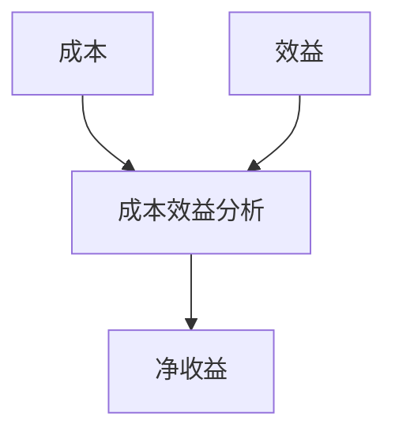
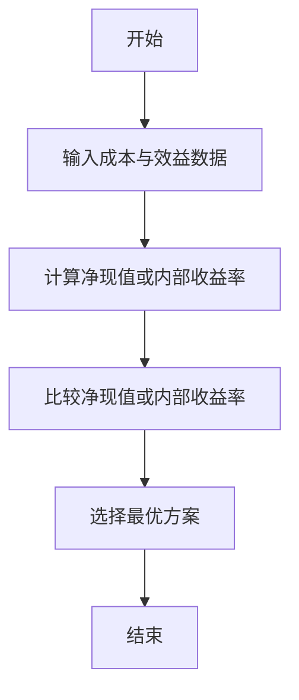
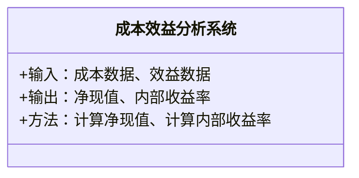
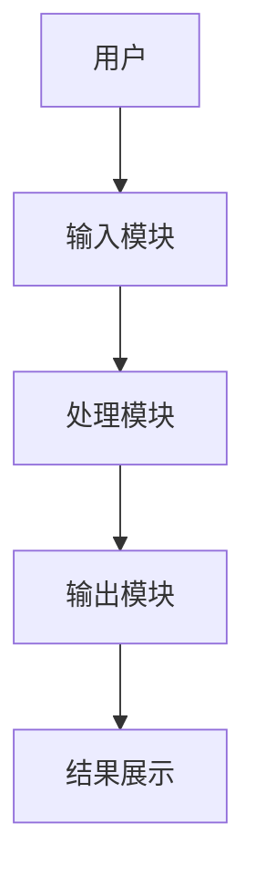
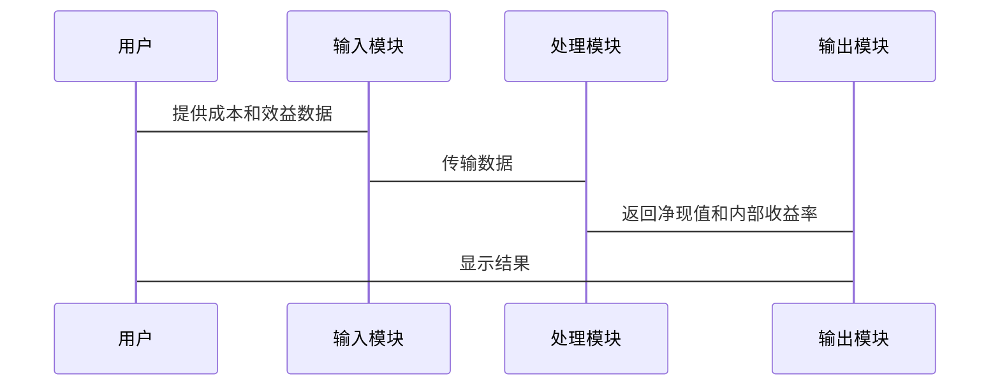

                 


# 成本效益分析

> 关键词：成本效益分析、净现值、内部收益率、成本-效益模型、系统分析

> 摘要：本文将从成本效益分析的基本概念出发，逐步深入探讨其核心原理、算法实现、系统架构设计以及实际项目中的应用。通过详细的理论分析与代码实现，帮助读者全面理解成本效益分析的原理与应用，掌握如何通过成本效益分析来优化决策过程。

---

## 第1章 成本效益分析的背景与概念

### 1.1 成本效益分析的基本概念

#### 1.1.1 问题背景与问题描述

在现代企业或项目管理中，资源的有限性与目标的多样性使得成本效益分析成为一种不可或缺的决策工具。企业或项目管理者需要在有限的资源条件下，选择能够带来最大效益的方案。如何量化“成本”与“效益”，并找到最优的平衡点，是成本效益分析的核心问题。

#### 1.1.2 成本效益分析的解决方法

成本效益分析（Cost-Benefit Analysis，简称CBA）是一种用于评估不同方案的成本与效益的方法。通过比较不同方案的总成本与总效益，选择能够带来最大净收益的方案。这种方法在项目投资决策、资源分配、政策评估等领域具有广泛的应用。

#### 1.1.3 成本效益分析的边界与外延

成本效益分析的边界包括：
- **时间范围**：分析的时间跨度，例如项目周期、政策实施周期等。
- **成本范围**：需要考虑的费用范围，包括直接成本、间接成本等。
- **效益范围**：需要衡量的效益类型，例如经济效益、社会效益等。
- **外部性**：是否考虑外部性，例如环境影响、社会影响等。

成本效益分析的外延包括：
- **动态分析**：考虑时间价值的动态分析，例如使用净现值（NPV）方法。
- **风险分析**：考虑方案的不确定性，例如概率分析。
- **多目标优化**：在多个目标之间寻找最优平衡。

#### 1.1.4 核心概念与组成要素

成本效益分析的核心概念包括：
- **成本（Cost）**：资源的投入，包括人力、物力、财力等。
- **效益（Benefit）**：资源投入后产生的成果，可以是经济效益、社会效益等。
- **净收益（Net Benefit）**：效益减去成本后的收益。

成本效益分析的组成要素包括：
1. 明确目标：确定分析的目标是什么，例如选择最优方案。
2. 界定范围：明确分析的范围，包括时间、空间和内容。
3. 收集数据：收集成本和效益的相关数据。
4. 计算净收益：计算每个方案的净收益。
5. 比较与选择：比较不同方案的净收益，选择最优方案。

---

### 1.2 成本效益分析的核心原理

#### 1.2.1 成本与效益的定义与特征对比

| 特性 | 成本（Cost） | 效益（Benefit） |
|------|--------------|-----------------|
| 定义 | 资源的投入 | 资源投入后产生的成果 |
| 特征 | 通常为负值（支出） | 通常为正值（收益） |
| 计量 | 货币计量或其他资源单位 | 货币计量或其他资源单位 |
| 时间性 | 可能需要考虑时间价值 | 可能需要考虑时间价值 |

#### 1.2.2 成本效益分析的数学模型与公式

成本效益分析的核心公式是 **净现值（Net Present Value，NPV）**：

$$ NPV = \sum_{t=0}^{n} \frac{C_t}{(1+r)^t} - \sum_{t=0}^{n} \frac{B_t}{(1+r)^t} $$

其中：
- \( C_t \)：第 \( t \) 年的成本
- \( B_t \)：第 \( t \) 年的效益
- \( r \)：贴现率
- \( n \)：项目周期

另一种常用的指标是 **内部收益率（Internal Rate of Return，IRR）**，定义为使 NPV 等于零的贴现率：

$$ NPV = \sum_{t=0}^{n} \frac{C_t}{(1+IRR)^t} - \sum_{t=0}^{n} \frac{B_t}{(1+IRR)^t} = 0 $$

#### 1.2.3 成本效益分析的ER实体关系图



---

## 第2章 成本效益分析的核心概念与联系

### 2.1 成本与效益的核心原理

#### 2.1.1 成本的构成与分类

成本可以分为以下几类：
- **直接成本**：可以直接追溯到具体项目或产品的成本。
- **间接成本**：无法直接追溯到具体项目或产品的成本，例如管理费用。
- **固定成本**：在一定范围内不变的成本。
- **可变成本**：随产量变化的成本。

#### 2.1.2 效益的构成与分类

效益可以分为以下几类：
- **经济效益**：直接的经济收益。
- **社会效益**：对社会的整体效益，例如环保效益。
- **私人效益**：个体或组织的私人收益。

#### 2.1.3 成本与效益的关系分析

成本与效益的关系可以用以下公式表示：

$$ 效益 = 成本 + 利润 $$

在成本效益分析中，目标是找到能够最大化净收益的平衡点：

$$ 净收益 = 总效益 - 总成本 $$

---

### 2.2 成本效益分析的数学模型

#### 2.2.1 成本-效益分析的数学公式

成本-效益分析的核心公式是净现值（NPV）和内部收益率（IRR）。

#### 2.2.2 净现值（NPV）计算公式

$$ NPV = \sum_{t=0}^{n} \frac{C_t - B_t}{(1+r)^t} $$

其中：
- \( C_t \)：第 \( t \) 年的成本
- \( B_t \)：第 \( t \) 年的效益
- \( r \)：贴现率
- \( n \)：项目周期

#### 2.2.3 内部收益率（IRR）计算公式

$$ NPV = \sum_{t=0}^{n} \frac{C_t - B_t}{(1+IRR)^t} = 0 $$

---

## 第3章 成本效益分析的算法原理

### 3.1 成本效益分析的算法流程



#### 3.1.1 数据输入与处理

成本效益分析的数据输入包括：
- 时间序列的成本和效益数据。
- 贴现率或其他参数。

#### 3.1.2 成本与效益的计算

计算每个方案的净现值（NPV）或内部收益率（IRR）。

#### 3.1.3 分析结果的输出

输出每个方案的净现值或内部收益率，并选择最优方案。

---

### 3.2 成本效益分析的代码实现

#### 3.2.1 环境安装与配置

- 安装 Python 和必要的库（如 numpy 和 pandas）。

#### 3.2.2 核心算法的Python代码实现

```python
import numpy as np

def calculate_npv(costs, benefits, discount_rate):
    cash_flows = [ -cost + benefit for cost, benefit in zip(costs, benefits)]
    npv = np.npv(discount_rate, cash_flows)
    return npv

def calculate_irr(costs, benefits):
    cash_flows = [ -cost + benefit for cost, benefit in zip(costs, benefits)]
    try:
        irr = np.irr(cash_flows)
    except:
        irr = 0
    return irr
```

#### 3.2.3 代码的功能解读与分析

上述代码实现了以下功能：
- `calculate_npv` 函数：计算净现值（NPV）。
- `calculate_irr` 函数：计算内部收益率（IRR）。

---

## 第4章 成本效益分析的系统分析与架构设计

### 4.1 系统分析与设计

#### 4.1.1 问题场景介绍

假设我们需要评估一个项目的可行性，目标是选择最优的实施方案。

#### 4.1.2 系统功能设计（领域模型）



#### 4.1.3 系统架构设计（架构图）



#### 4.1.4 系统接口设计

- 输入接口：接收成本和效益数据。
- 输出接口：输出净现值和内部收益率。

#### 4.1.5 系统交互流程（序列图）



---

## 第5章 成本效益分析的项目实战

### 5.1 项目环境与工具安装

- 安装 Python 和必要的库（如 numpy 和 pandas）。

### 5.2 核心算法实现

#### 5.2.1 成本效益分析的代码实现

```python
import numpy as np

def calculate_npv(costs, benefits, discount_rate):
    cash_flows = [ -cost + benefit for cost, benefit in zip(costs, benefits)]
    npv = np.npv(discount_rate, cash_flows)
    return npv

def calculate_irr(costs, benefits):
    cash_flows = [ -cost + benefit for cost, benefit in zip(costs, benefits)]
    try:
        irr = np.irr(cash_flows)
    except:
        irr = 0
    return irr
```

#### 5.2.2 代码的功能解读与分析

上述代码实现了以下功能：
- `calculate_npv` 函数：计算净现值（NPV）。
- `calculate_irr` 函数：计算内部收益率（IRR）。

### 5.3 项目案例分析

#### 5.3.1 案例背景与问题描述

假设我们有一个项目，需要选择两种方案中的一种。方案1的成本为100万元，效益为150万元；方案2的成本为120万元，效益为180万元。贴现率为10%。

#### 5.3.2 方案分析与选择

- 方案1的 NPV：
  $$ NPV_1 = \frac{150 - 100}{1 + 0.1} = \frac{50}{1.1} \approx 45.45 \text{万元} $$
- 方案2的 NPV：
  $$ NPV_2 = \frac{180 - 120}{1 + 0.1} = \frac{60}{1.1} \approx 54.55 \text{万元} $$

因此，方案2的 NPV 更高，应该选择方案2。

---

## 第6章 成本效益分析的扩展阅读与最佳实践

### 6.1 扩展阅读

- 更多关于成本效益分析的内容，可以参考相关书籍和文献。

### 6.2 最佳实践 tips

- 在实际应用中，建议结合多种方法（如概率分析）来提高决策的准确性。
- 考虑外部性，例如环境影响、社会影响等。
- 定期更新成本和效益数据，以反映实际情况的变化。

---

## 作者

作者：AI天才研究院/AI Genius Institute & 禅与计算机程序设计艺术 /Zen And The Art of Computer Programming

