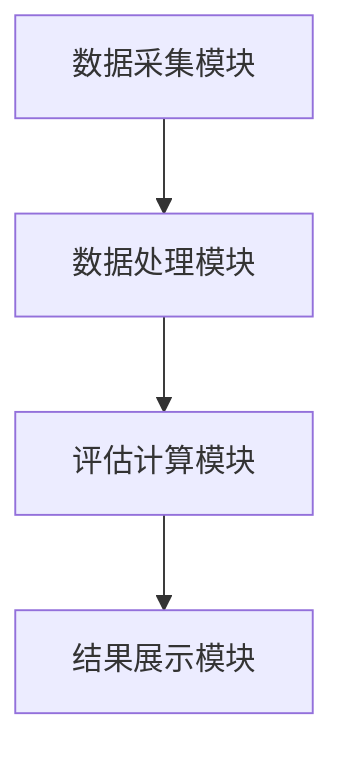

                 


# 戴维·多德的护城河评估体系

## 关键词：护城河评估，戴维·多德，企业竞争力，核心要素，创新评估

## 摘要：  
护城河评估体系是戴维·多德提出的一种用于评估企业核心竞争力的方法。本文将详细探讨护城河的核心概念、评估方法、算法原理以及系统架构设计，通过实际案例分析和项目实战，帮助读者全面理解和应用护城河评估体系。文章内容丰富，结构紧凑，语言简洁，旨在为企业战略规划和投资决策提供有力支持。

---

## 第一部分：护城河评估体系的背景与核心概念

### 1.1 戴维·多德与护城河理论的提出

#### 1.1.1 戴维·多德的生平简介  
戴维·多德（David Dodd）是投资学领域的先驱，以其在价值投资和护城河理论方面的贡献而闻名。他提出的护城河概念帮助企业识别核心竞争力，从而在竞争中建立可持续的优势。

#### 1.1.2 护城河理论的提出背景  
护城河理论源于戴维·多德对企业的深入研究，旨在解决企业在竞争中如何保持长期优势的问题。通过对企业的市场地位、资源、运营效率和创新能力的分析，护城河评估体系为企业提供了一种系统化的评估方法。

#### 1.1.3 护城河理论的核心思想  
护城河理论的核心在于，企业通过构建强大的核心竞争力，能够在市场上形成壁垒，抵御竞争对手的侵蚀。这种竞争力可以通过市场地位、资源、运营效率和创新能力等多个维度进行评估。

---

### 1.2 护城河的定义与特征

#### 1.2.1 护城河的定义  
护城河是指企业在市场中形成的独特优势，使其能够抵御竞争对手的进攻并保持长期的竞争优势。

#### 1.2.2 护城河的核心特征  
- **独特性**：企业的核心竞争力必须是独一无二的，具有不可复制性。  
- **可持续性**：护城河必须能够在较长的时间内为企业提供保护，不受市场变化的影响。  
- **防御性**：护城河能够有效抵御竞争对手的进攻，增强企业的市场地位。

#### 1.2.3 护城河的分类与边界  
护城河可以分为市场地位型、资源型、运营效率型和创新型四种类型。市场地位型依赖于企业在市场中的份额和品牌影响力；资源型依赖于企业的资源储备；运营效率型依赖于企业的生产效率和成本控制；创新型依赖于企业的创新能力。

---

## 第二部分：护城河评估体系的理论基础

### 2.1 护城河评估的核心模型

#### 2.1.1 护城河五力分析模型  
护城河五力分析模型是戴维·多德提出的一种分析企业竞争优势的方法，包括市场地位、资源、运营效率、创新能力和客户忠诚度五个维度。

#### 2.1.2 护城河价值链分析模型  
该模型将企业的价值创造过程分解为多个环节，分析每个环节对护城河的贡献。

### 2.2 护城河评估的基本方法

#### 2.2.1 定性分析法  
定性分析法通过对企业核心竞争力的描述和评价，识别其护城河的强弱。

#### 2.2.2 定量分析法  
定量分析法通过数学模型和指标量化企业的核心竞争力，提供更客观的评估结果。

#### 2.2.3 综合评估法  
综合评估法结合定性和定量分析，全面评估企业的护城河。

### 2.3 护城河评估的数学模型

#### 2.3.1 护城河强度指数公式  
$$ \text{护城河强度指数} = \frac{\text{市场地位} + \text{资源} + \text{运营效率} + \text{创新能力}}{4} $$

#### 2.3.2 市场竞争力评估公式  
$$ \text{市场竞争力} = \text{市场地位} \times \text{客户忠诚度} $$

#### 2.3.3 创新能力评估公式  
$$ \text{创新能力} = \text{研发投入} + \text{技术专利数} $$

---

## 第三部分：护城河评估的算法原理

### 3.1 护城河评估的核心算法

#### 3.1.1 基于层次分析法（AHP）的评估算法  
层次分析法是一种常用的决策分析方法，通过构建层次结构，计算各指标的权重，最终得出综合评分。

#### 3.1.2 基于因子分析法（FA）的评估算法  
因子分析法通过提取影响企业竞争力的关键因子，评估企业的护城河强度。

#### 3.1.3 基于聚类分析法（CA）的评估算法  
聚类分析法将企业分为不同的竞争类别，识别其在市场中的定位。

### 3.2 护城河评估的数学模型

#### 3.2.1 层次分析法的权重计算公式  
$$ \text{权重} = \frac{\text{特征向量}}{\text{特征值}} $$

#### 3.2.2 因子分析法的因子载荷矩阵公式  
$$ \text{因子载荷矩阵} = \text{数据矩阵} \times \text{因子载荷系数} $$

#### 3.2.3 聚类分析法的相似性度量公式  
$$ \text{相似性} = \frac{\text{相同特征数}}{\text{总特征数}} $$

### 3.3 护城河评估算法的实现

#### 3.3.1 Python代码实现  
```python
import numpy as np
from sklearn.cluster import KMeans

# 示例数据
data = np.array([[1, 2], [3, 4], [5, 6]])

# 聚类分析
kmeans = KMeans(n_clusters=2)
kmeans.fit(data)

print("聚类结果:", kmeans.labels_)
```

---

## 第四部分：护城河评估的系统架构设计

### 4.1 系统功能设计

#### 4.1.1 数据采集模块  
数据采集模块负责收集企业的市场地位、资源、运营效率和创新能力等数据。

#### 4.1.2 数据处理模块  
数据处理模块对收集到的数据进行清洗和预处理，确保数据的准确性和完整性。

#### 4.1.3 评估计算模块  
评估计算模块基于数学模型和算法，计算企业的护城河强度指数。

#### 4.1.4 结果展示模块  
结果展示模块以图表和报告的形式，展示企业的护城河评估结果。

### 4.2 系统架构设计

#### 4.2.1 模块化架构  
系统采用模块化设计，各模块之间相互独立，便于维护和扩展。

#### 4.2.2 数据流图  


---

## 第五部分：护城河评估的项目实战

### 5.1 环境安装

#### 5.1.1 安装Python  
确保系统安装了Python 3.x版本。

#### 5.1.2 安装相关库  
安装numpy和scikit-learn库：
```bash
pip install numpy scikit-learn
```

### 5.2 核心代码实现

#### 5.2.1 层次分析法实现  
```python
import numpy as np

# 示例数据
matrix = np.array([[1, 2, 3], [4, 5, 6], [7, 8, 9]])

# 计算特征向量
eigenvalues, eigenvectors = np.linalg.eig(matrix)

# 计算权重
weights = eigenvectors[:, 0] / np.sum(eigenvectors[:, 0])

print("权重:", weights)
```

#### 5.2.2 聚类分析法实现  
```python
from sklearn.cluster import KMeans

# 示例数据
data = np.array([[1, 2], [3, 4], [5, 6]])

# 聚类分析
kmeans = KMeans(n_clusters=2)
kmeans.fit(data)

print("聚类结果:", kmeans.labels_)
```

### 5.3 案例分析与解读  
以某科技公司为例，分析其市场地位、资源、运营效率和创新能力，评估其护城河强度。

---

## 第六部分：最佳实践与总结

### 6.1 小结  
护城河评估体系为企业提供了系统化的评估方法，帮助企业识别核心竞争力，建立竞争优势。

### 6.2 注意事项  
在实际应用中，需注意数据的准确性和模型的适用性，避免片面评估。

### 6.3 拓展阅读  
推荐阅读戴维·多德的《投资学基础》及相关文献，深入了解护城河理论的细节。

---

## 作者：AI天才研究院 & 禅与计算机程序设计艺术

--- 

**[完]**

