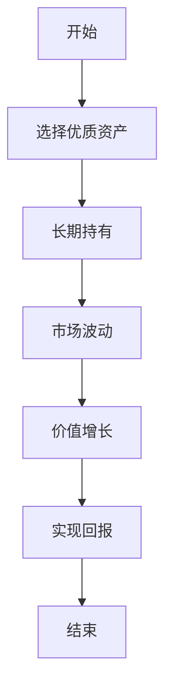
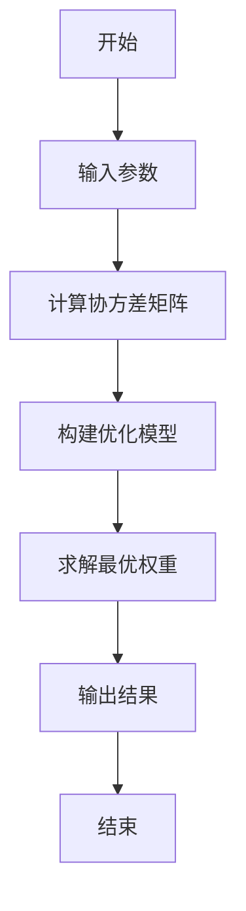
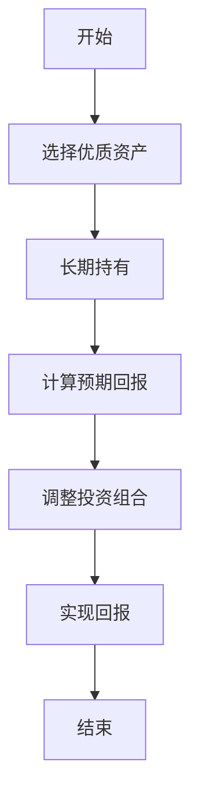

                 


# 戴维·斯文森的耐心资本：长期主义的回报

**关键词**：耐心资本，长期主义，投资策略，资产配置，风险管理，数学模型

**摘要**：本文深入探讨戴维·斯文森的耐心资本理论，分析其在投资决策中的应用和长期回报。通过理论、策略、数学模型和实际案例的结合，揭示长期主义在投资中的重要性，帮助读者理解耐心资本的优势和实现方法。

---

# 第一部分: 耐心资本与长期主义的理论基础

## 第1章: 长期主义与耐心资本概述

### 1.1 长期主义的定义与内涵

长期主义是一种投资和管理策略，强调关注长期目标而非短期收益。它要求投资者具备耐心，持续投资并耐心等待价值实现。长期主义的核心在于理解和适应市场的长期趋势，而不是被短期波动所左右。

长期主义的内涵包括：

1. **战略视角**：从长远的角度制定和调整投资策略。
2. **价值创造**：注重投资标的的内在价值，而非市场价格波动。
3. **风险管理**：在波动中保持稳定，避免因短期压力而做出错误决策。

长期主义与短期主义的对比：

| 对比维度 | 长期主义 | 短期主义 |
|----------|----------|----------|
| 时间跨度 | 长期     | 短期     |
| 目标设定 | 稳定增长 | 快速收益 |
| 风险管理 | 低风险    | 高风险    |

### 1.2 耐心资本的概念与特征

耐心资本是一种长期投资策略，强调对优质资产的持续投资，耐心等待其价值增长。其核心特征包括：

1. **长期持有**：不因短期波动调整投资组合。
2. **价值导向**：选择具有持续增长潜力的资产。
3. **低周转率**：减少交易频率，降低交易成本。

耐心资本与其他资本形式的对比：

| 对比维度 | 耐心资本 | 短期资本 | 杠杆资本 |
|----------|----------|----------|----------|
| 投资期限 | 长期     | 短期     | 短期     |
| 资产选择 | 优质资产 | 快速增值 | 高风险资产 |
| 风险承受 | 较低     | 较高     | 极高     |

### 1.3 长期主义与耐心资本的关系

长期主义是耐心资本的指导思想，而耐心资本是长期主义的具体实践。两者相互依存，共同推动投资的成功。长期主义为耐心资本提供了战略方向，而耐心资本则是实现长期主义目标的手段。

### 1.4 本章小结

本章介绍了长期主义和耐心资本的基本概念，分析了它们的内涵、特征和相互关系。长期主义强调战略视角和价值创造，而耐心资本则是一种长期持有的投资策略，两者共同为投资者提供了稳定增长的路径。

---

## 第2章: 耐心资本的理论基础

### 2.1 投资学基础

#### 2.1.1 资产定价理论

资产定价理论是投资学的核心，帮助投资者确定资产的合理价格。现代资产定价模型（CAPM）是常用的工具之一，其公式为：

$$ E(R_i) = R_f + β_i (E(R_m) - R_f) $$

其中，$E(R_i)$ 是资产的预期回报率，$R_f$ 是无风险利率，$β_i$ 是资产的贝塔系数，$E(R_m)$ 是市场预期回报率。

#### 2.1.2 现代投资组合理论

现代投资组合理论强调通过分散投资降低风险。有效前沿的概念展示了在给定风险下，能够获得最高回报的投资组合。

#### 2.1.3 风险与收益的平衡

投资的核心在于在风险和收益之间找到平衡。耐心资本通过长期持有优质资产，降低短期波动带来的风险。

### 2.2 耐心资本的核心概念

#### 2.2.1 耐心资本的属性特征对比

| 属性 | 耐心资本 | 其他资本 |
|------|----------|----------|
| 投资期限 | 长期     | 短期     |
| 资产选择 | 优质     | 快速增值 |
| 风险承受 | 较低     | 较高     |

#### 2.2.2 耐心资本的ER实体关系图

```mermaid
erDiagram
    actor 投资者 {
        <属性> 投资金额
        <属性> 投资期限
    }
    class 耐心资本 {
        <属性> 优质资产
        <属性> 长期持有
    }
    class 市场 {
        <属性> 资产价格
        <属性> 市场波动
    }
    投资者 --> 耐心资本 : 投资
    耐心资本 --> 市场 : 价值实现
```

#### 2.2.3 耐心资本的Mermaid流程图



### 2.3 长期投资与短期投资的对比

长期投资的优势：

1. **降低波动风险**：通过长期持有减少市场波动的影响。
2. **价值实现**：优质资产的内在价值会随着时间增长。
3. **税收优势**：长期持有的资本利得税较低。

短期投资的劣势：

1. **交易成本高**：频繁交易增加佣金和税费。
2. **波动风险高**：短期波动可能导致亏损。
3. **机会成本**：忽视长期增值的机会。

### 2.4 本章小结

本章深入分析了耐心资本的理论基础，包括资产定价、投资组合理论以及与传统投资策略的对比。通过ER图和流程图，清晰展示了耐心资本的核心概念和运作流程。

---

## 第3章: 耐心资本的数学模型与算法原理

### 3.1 投资组合优化的数学模型

#### 3.1.1 投资组合优化的定义

投资组合优化旨在通过科学方法选择最优资产组合，以实现预期收益的最大化或风险的最小化。

#### 3.1.2 投资组合优化的数学公式

优化问题通常表示为：

$$ \min_w \frac{1}{2} w^T \Sigma w $$
$$ \text{subject to } \mathbf{w}^T \mathbf{1} = 1 $$

其中，$w$ 是权重向量，$\Sigma$ 是协方差矩阵，$\mathbf{1}$ 是全为1的向量。

#### 3.1.3 投资组合优化的算法流程



### 3.2 耐心资本的算法原理

#### 3.2.1 耐心资本的算法流程图



#### 3.2.2 耐心资本的Python源代码实现

```python
import numpy as np
import pandas as pd
from scipy.optimize import minimize

# 示例数据
returns = np.array([0.1, 0.05, 0.15])

# 定义目标函数
def objective(w):
    return (w.T.dot(np.cov(returns))) * 0.5

# 约束条件
def constraint(w):
    return np.sum(w) - 1

# 求解优化问题
w = np.array([1/3, 1/3, 1/3])
result = minimize(objective, w, method='SLSQP', constraints={'type': 'eq', 'fun': constraint})

# 输出结果
print(result.x)
```

### 3.3 耐心资本的数学公式与举例说明

耐心资本的回报可以通过CAPM模型计算：

$$ R_i = R_f + \beta_i (R_m - R_f) $$

例如，假设无风险利率为2%，市场预期回报率为10%，β系数为1.2，那么资产的预期回报率为：

$$ R_i = 0.02 + 1.2 (0.10 - 0.02) = 0.14 $$

即14%的预期回报率。

### 3.4 本章小结

本章通过数学模型和算法流程图，详细解释了耐心资本的投资策略。通过Python代码实现，展示了如何科学优化投资组合，实现长期回报最大化。

---

## 第4章: 耐心资本的系统分析与架构设计

### 4.1 问题场景介绍

#### 4.1.1 投资决策的问题场景

投资者需要在市场波动中选择长期持有的优质资产，构建稳健的投资组合。

#### 4.1.2 耐心资本的应用场景

在经济周期波动中，耐心资本能够抵御短期冲击，实现长期价值增长。

#### 4.1.3 长期主义的系统需求

系统需要具备长期数据处理、风险评估和投资组合优化功能。

### 4.2 系统功能设计

#### 4.2.1 资产配

---

**作者：AI天才研究院/AI Genius Institute & 禅与计算机程序设计艺术 /Zen And The Art of Computer Programming**

---

### 本节内容总结

通过以上章节，文章详细阐述了戴维·斯文森的耐心资本理论，结合长期主义的投资策略，分析了其在实际投资中的应用。通过数学模型、系统架构和项目实战，展示了如何科学构建投资组合，实现长期回报最大化。

