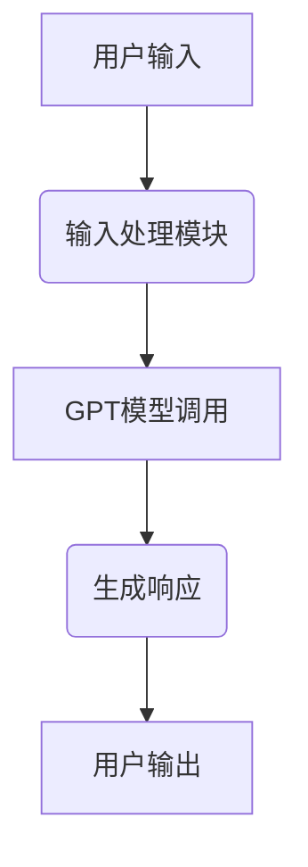

                 


# 打造个人助理 AI Agent：GPT 模型应用实战

## 关键词：AI Agent, GPT 模型, 个人助理, 自然语言处理, 人工智能, 机器学习, 系统设计

## 摘要：本文将详细探讨如何利用GPT模型打造个人助理AI Agent。从GPT模型的核心原理到系统设计，再到实战实现，全面解析打造个人AI助手的关键步骤和最佳实践。通过本文，读者将掌握从需求分析到系统部署的完整流程，最终实现一个功能强大的个人助理AI Agent。

---

## 第一部分：个人助理 AI Agent 的背景与概述

### 第1章：个人助理 AI Agent 的基本概念

#### 1.1 什么是个人助理 AI Agent

##### 1.1.1 AI Agent 的定义与特点
- **AI Agent**（智能体）是指能够感知环境并采取行动以实现目标的实体。
- **特点**：
  - **自主性**：能够在没有外部干预的情况下运作。
  - **反应性**：能够实时感知环境并做出响应。
  - **目标导向**：通过行动实现特定目标。
  - **社交能力**：能够与人类或其他系统进行交互。

##### 1.1.2 个人助理 AI Agent 的核心功能
- **信息检索**：帮助用户查找所需信息。
- **日程管理**：协助用户管理时间表和任务。
- **对话交互**：通过自然语言与用户进行交流。
- **任务执行**：自动完成用户指定的任务，如发送邮件、预订机票等。

##### 1.1.3 个人助理 AI Agent 的应用场景
- **日常生活**：提醒日程、查询天气、管理备忘录。
- **工作效率**：协助处理邮件、安排会议、翻译文档。
- **学习辅助**：提供学习建议、解答问题、整理笔记。

#### 1.2 GPT 模型的基本概念

##### 1.2.1 GPT 模型的定义与特点
- **GPT**（Generative Pre-trained Transformer）是由OpenAI开发的基于Transformer架构的大型语言模型。
- **特点**：
  - **生成能力**：能够生成连贯的文本。
  - **预训练**：在大量文本数据上进行预训练，具备强大的语义理解能力。
  - **可微调**：可以根据具体任务进行微调，适应不同场景。

##### 1.2.2 GPT 模型的演进历程
- **GPT-1**：初步提出，基于RNN结构，适用于简单的文本生成。
- **GPT-2**：改进版本，引入更大的模型规模，生成能力显著提升。
- **GPT-3**：采用Transformer架构，参数量大幅增加，生成能力更加接近人类水平。
- **GPT-4**：最新版本，具备多模态理解和生成能力。

##### 1.2.3 GPT 模型在个人助理中的应用潜力
- **对话生成**：通过自然语言生成，实现流畅的对话交互。
- **意图识别**：理解用户的意图并提供相应的服务。
- **信息提取**：从复杂文本中提取关键信息，辅助用户决策。

#### 1.3 个人助理 AI Agent 的问题背景与目标

##### 1.3.1 传统个人助理工具的局限性
- **功能有限**：传统工具功能单一，难以应对复杂任务。
- **交互方式**：主要依赖按钮和菜单，用户体验不够友好。
- **智能化不足**：缺乏深度学习能力，难以理解上下文。

##### 1.3.2 GPT 模型如何解决这些问题
- **自然语言交互**：通过GPT模型实现自然语言理解，提升用户体验。
- **智能决策**：利用GPT的生成能力，帮助用户做出更智能的决策。
- **多任务处理**：GPT模型可以同时处理多种任务，提升效率。

##### 1.3.3 个人助理 AI Agent 的目标与边界
- **目标**：打造一个能够理解用户需求、提供智能服务的AI助手。
- **边界**：专注于个人用户的日常和工作效率提升，不涉及隐私侵犯或不道德行为。

---

## 第二部分：GPT 模型的核心原理与技术

### 第2章：GPT 模型的原理与实现

#### 2.1 GPT 模型的核心原理

##### 2.1.1 语言模型的基本概念
- **语言模型**：用于预测文本序列的概率分布模型。
- **训练目标**：最大化给定上下文的条件概率，即$P(w_{n}|w_{1},...,w_{n-1})$。

##### 2.1.2 GPT 模型的训练目标
- **目标函数**：最小化损失函数，通常使用交叉熵损失。
  $$ \text{Loss} = -\sum_{i=1}^{n} \log P(w_i|w_1,...,w_{i-1}) $$
- **优化方法**：使用梯度下降算法，如Adam优化器。

##### 2.1.3 GPT 模型的生成机制
- **解码过程**：通过解码器生成下一个词的概率分布。
- **贪心策略**：选择概率最高的词生成文本。
- **蒙特卡洛方法**：通过随机采样生成多样化文本。

#### 2.2 GPT 模型的数学基础

##### 2.2.1 Transformer 架构
- **编码器**：将输入序列转换为固定长度的向量。
- **解码器**：基于编码器输出生成目标序列。
- **注意力机制**：计算输入序列中每个词的重要性，公式如下：
  $$ \text{Attention}(Q,K,V) = \text{softmax}\left(\frac{QK^T}{\sqrt{d_k}}\right)V $$

##### 2.2.2 梯度下降与优化
- **梯度下降**：通过计算损失函数的梯度，更新模型参数。
- **Adam优化器**：结合动量和自适应学习率的优化方法。
  $$ \text{M} = \beta_1 M + (1-\beta_1)g $$
  $$ \text{V} = \beta_2 V + (1-\beta_2)g^2 $$
  $$ \theta = \theta - \eta \frac{M}{\sqrt{V} + \epsilon} $$

---

## 第三部分：系统设计与实现

### 第3章：系统设计与实现

#### 3.1 需求分析与系统架构

##### 3.1.1 需求分析
- **用户需求**：明确用户需要AI Agent完成的任务，如信息检索、任务执行等。
- **功能需求**：列出系统需要实现的核心功能模块。
- **性能需求**：确定系统响应时间、处理能力等性能指标。

##### 3.1.2 系统架构设计
- **分层架构**：将系统划分为数据层、业务逻辑层和用户交互层。
- **组件设计**：
  - **输入处理模块**：接收用户的输入并进行预处理。
  - **模型调用模块**：调用GPT模型生成响应。
  - **输出模块**：将生成的响应返回给用户。

##### 3.1.3 系统流程图（Mermaid）


#### 3.2 系统实现

##### 3.2.1 环境配置
- **安装Python**：确保安装了Python 3.8及以上版本。
- **安装依赖**：使用pip安装必要的库，如`transformers`、`torch`等。

##### 3.2.2 核心代码实现
```python
from transformers import GPT2LMHeadModel, GPT2Tokenizer

# 加载预训练模型
model_name = "gpt2"
tokenizer = GPT2Tokenizer.from_pretrained(model_name)
model = GPT2LMHeadModel.from_pretrained(model_name)

# 定义生成函数
def generate_response(prompt):
    inputs = tokenizer.encode(prompt, return_tensors='pt')
    outputs = model.generate(inputs, max_length=50, do_sample=True)
    response = tokenizer.decode(outputs[0], skip_special_tokens=True)
    return response

# 示例调用
prompt = "今天天气怎么样？"
print(generate_response(prompt))
```

##### 3.2.3 系统测试
- **单元测试**：测试每个功能模块的正确性。
- **集成测试**：测试系统各模块的协同工作。
- **性能测试**：评估系统在高负载下的表现。

#### 3.3 系统优化

##### 3.3.1 性能优化
- **模型调优**：通过微调模型参数，提升生成效果。
- **缓存机制**：缓存频繁访问的数据，减少重复计算。

##### 3.3.2 可扩展性优化
- **模块化设计**：便于后续功能的扩展和升级。
- **接口设计**：设计良好的API接口，方便与其他系统集成。

---

## 第四部分：项目实战与部署

### 第4章：项目实战

#### 4.1 环境安装与配置
- **安装Python与必要的库**：
  ```bash
  pip install torch transformers
  ```

#### 4.2 核心代码实现
```python
import torch
from transformers import GPT2LMHeadModel, GPT2Tokenizer

# 加载预训练模型
tokenizer = GPT2Tokenizer.from_pretrained('gpt2')
model = GPT2LMHeadModel.from_pretrained('gpt2')

# 定义生成函数
def generate_response(prompt):
    inputs = tokenizer.encode(prompt, return_tensors='pt')
    outputs = model.generate(inputs, max_length=100, do_sample=True)
    response = tokenizer.decode(outputs[0], skip_special_tokens=True)
    return response

# 测试生成
print(generate_response("写一首诗吧。"))
```

#### 4.3 系统测试与部署
- **本地测试**：确保系统在本地环境运行无误。
- **服务器部署**：部署到云服务器，确保服务稳定运行。

---

## 第五部分：总结与展望

### 第5章：总结与展望

#### 5.1 总结
- **核心内容回顾**：从需求分析到系统实现，全面解析打造个人AI Agent的过程。
- **关键点总结**：GPT模型的原理、系统设计、项目实战等关键内容。

#### 5.2 未来展望
- **技术发展**：随着AI技术的进步，个人AI Agent将具备更强的智能和更广泛的应用场景。
- **发展方向**：多模态交互、实时响应、个性化服务等方向值得进一步探索。

---

## 作者信息

**作者：AI天才研究院/AI Genius Institute & 禅与计算机程序设计艺术 /Zen And The Art of Computer Programming**

---

通过本文的详细讲解，读者将能够从零开始，利用GPT模型打造一个功能强大的个人AI Agent。从理论到实践，从系统设计到代码实现，全面掌握打造个人AI助手的关键技术和最佳实践。

