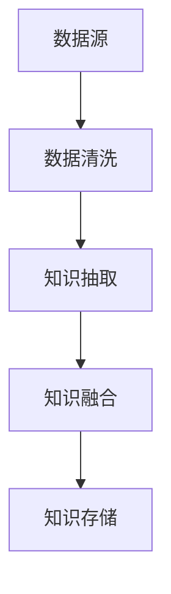

                 


# 打造全面的投资理财知识图谱：方法与工具

> 关键词：投资理财、知识图谱、机器学习、数据挖掘、系统架构、Python编程、技术博客

> 摘要：本文将详细介绍如何构建一个全面的投资理财知识图谱，涵盖从数据收集、知识抽取、图谱构建到可视化与应用的完整流程。通过结合投资理财的核心概念与现代技术手段，本文将深入分析知识图谱的构建方法与工具，并通过实际案例展示其在投资理财中的应用场景。

---

# 第1章: 投资理财知识图谱的背景与核心概念

## 1.1 投资理财的基本概念

### 1.1.1 投资与理财的定义
投资是指将资金投入到某种资产或项目中，以期获得收益的过程。理财则是指通过科学的财务规划和管理，实现财富保值与增值的活动。投资理财的核心目标是帮助个人或机构在风险可控的前提下，实现资产的最优配置与收益最大化。

### 1.1.2 投资理财的核心目标
- **财富保值**：通过合理的资产配置，降低投资风险，确保财富不会大幅缩水。
- **财富增值**：通过投资优质资产，实现资产的长期增值。
- **风险控制**：通过分散投资和风险管理，降低投资组合的整体风险。

### 1.1.3 投资理财的分类与特点
投资理财可以分为以下几类：
- **股票投资**：高风险、高收益。
- **债券投资**：低风险、稳定收益。
- **基金投资**：分散风险，适合中小投资者。
- **房地产投资**：高杠杆、高流动性风险。
- **贵金属投资**：避险资产，适合对冲通货膨胀。

---

## 1.2 知识图谱的构建背景

### 1.2.1 知识图谱的定义与特点
知识图谱是一种将知识以图结构形式表示的数据模型，其中节点表示实体或概念，边表示实体之间的关系。知识图谱具有以下特点：
- **结构化**：通过节点和边的形式，将知识以图结构化。
- **可扩展性**：支持大规模数据的扩展和更新。
- **语义丰富性**：通过实体关系和属性，提供丰富的语义信息。

### 1.2.2 投资理财领域知识图谱的必要性
在投资理财领域，知识图谱可以帮助我们：
- **知识整合**：将分散的投资知识整合到一个统一的图谱中。
- **决策支持**：通过图谱分析，提供投资决策的支持。
- **风险管理**：通过图谱分析，识别潜在风险并进行预警。

### 1.2.3 知识图谱在投资理财中的应用场景
- **投资决策支持**：通过分析图谱中的实体关系，辅助投资者做出更明智的投资决策。
- **风险预警与管理**：通过图谱分析，识别潜在风险并进行预警。
- **投资教育与普及**：通过图谱可视化，帮助投资者更好地理解投资知识。

---

## 1.3 本章小结

本章从投资理财的基本概念出发，介绍了投资理财的核心目标和分类，接着详细讲解了知识图谱的定义与特点，并分析了知识图谱在投资理财领域的必要性和应用场景。通过本章的学习，读者可以对投资理财知识图谱的构建背景有一个清晰的认识。

---

# 第2章: 投资理财知识图谱的核心概念与联系

## 2.1 投资理财的核心概念

### 2.1.1 资产配置
资产配置是指将资金分配到不同资产类别（如股票、债券、房地产等）中，以实现风险与收益的最佳平衡。资产配置的核心在于分散风险，避免过度依赖某一类资产。

### 2.1.2 风险管理
风险管理是指通过识别、评估和控制投资中的各种风险，以降低投资组合的潜在损失。常见的风险管理方法包括止损策略、分散投资等。

### 2.1.3 投资组合优化
投资组合优化是指通过数学模型和算法，寻找最优的投资组合，以实现收益最大化或风险最小化的目标。常见的投资组合优化方法包括均值-方差优化和风险中性优化。

---

## 2.2 知识图谱的核心概念

### 2.2.1 实体与关系
在知识图谱中，实体是指具体的对象或概念，例如“股票”、“债券”、“投资者”等。关系是指实体之间的关联，例如“投资”、“持有”、“影响”等。

### 2.2.2 知识图谱的构建流程
知识图谱的构建流程通常包括以下几个步骤：
1. **数据收集**：从各种数据源收集投资理财相关的数据。
2. **数据清洗与预处理**：对数据进行去重、补全等处理，确保数据的准确性。
3. **知识抽取**：从数据中提取实体和关系。
4. **知识融合**：将提取的知识进行整合，消除冗余和矛盾。
5. **知识存储与表示**：将知识存储到图数据库中，并用特定的格式表示。

### 2.2.3 知识图谱的表示方法
知识图谱的表示方法主要有以下几种：
- **三元组表示法**：用（头实体，关系，尾实体）的形式表示知识。
- **属性表示法**：用（实体，属性，值）的形式表示实体的属性信息。
- **混合表示法**：结合三元组和属性表示法，综合表示实体和关系。

---

## 2.3 投资理财核心概念与知识图谱的关系

### 2.3.1 投资理财实体的ER实体关系图
以下是投资理财实体的ER实体关系图：
```mermaid
er
  投资者 -[投资]-> 投资产品
  投资产品 -[属于]-> 资产类别
  资产类别 -[影响]-> 市场风险
  投资者 -[关联]-> 风险等级
```

### 2.3.2 知识图谱的构建流程图
以下是知识图谱的构建流程图：


---

## 2.4 本章小结

本章详细讲解了投资理财知识图谱的核心概念，包括资产配置、风险管理、投资组合优化等投资理财的核心概念，以及实体、关系、知识图谱构建流程等知识图谱的核心概念。通过ER实体关系图和流程图的展示，读者可以清晰地理解投资理财知识图谱的核心要素及其之间的关系。

---

# 第3章: 投资理财知识图谱的构建方法

## 3.1 数据收集与处理

### 3.1.1 数据来源
投资理财知识图谱的数据来源包括：
- **公开数据**：如股票价格、债券收益率等。
- **金融数据库**：如Wind、Bloomberg等金融数据服务。
- **网络爬取**：从新闻、论坛等非结构化数据中提取信息。

### 3.1.2 数据清洗与预处理
数据清洗的目的是消除数据中的噪声，确保数据的准确性和一致性。常见的数据清洗方法包括：
- **去重**：去除重复的数据记录。
- **补全**：对缺失数据进行插值或删除。
- **格式转换**：将数据格式统一化。

### 3.1.3 数据标注与标注工具
数据标注是指对数据进行分类、打标签等操作，以便后续的知识抽取。常用的标注工具包括：
- **标注平台**：如Label Studio。
- **自动化标注工具**：如spaCy的NER（Named Entity Recognition）模型。

---

## 3.2 知识抽取与表示

### 3.2.1 实体识别
实体识别是指从文本中识别出具体的实体，例如“苹果公司”、“美元”等。常用的实体识别工具包括：
- **spaCy**：支持多种语言的实体识别。
- **HanLP**：中文自然语言处理工具。

### 3.2.2 关系抽取
关系抽取是指从文本中识别出实体之间的关系，例如“苹果公司生产iPhone”。常用的

