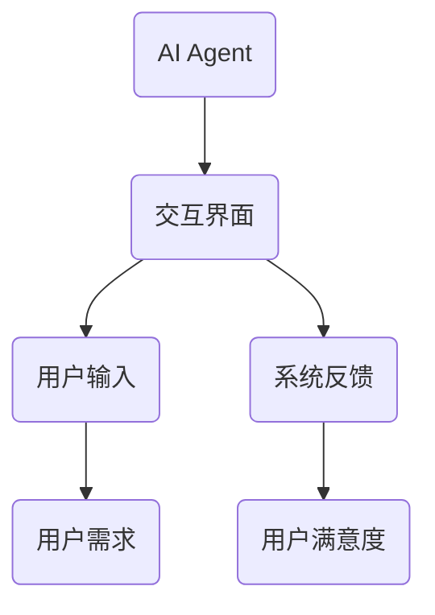
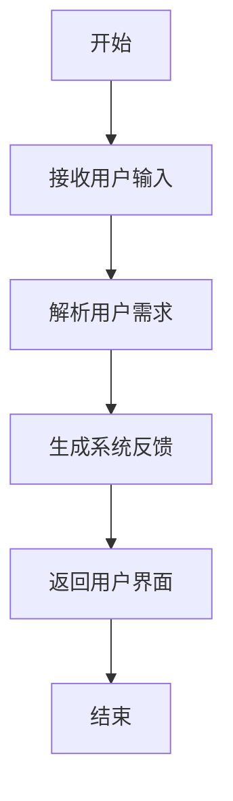
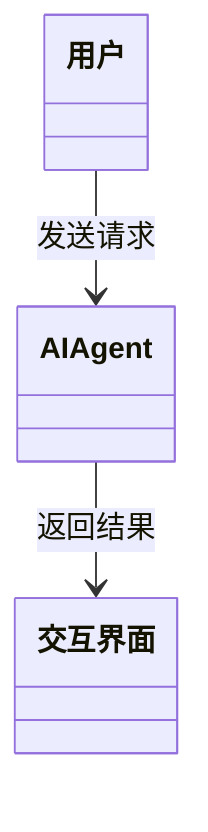
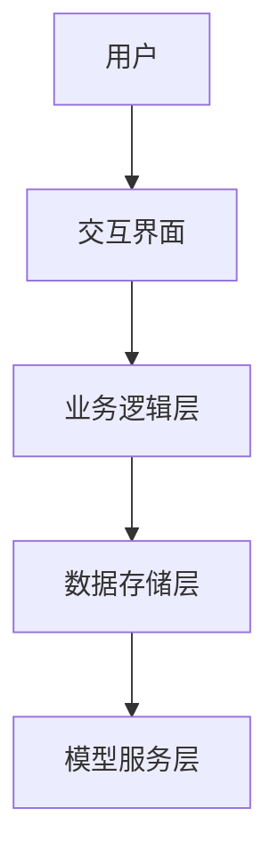

                 


# 打造直观易用的AI Agent交互界面

## 关键词：AI Agent，交互界面，用户体验，系统架构，算法原理

## 摘要：  
在人工智能快速发展的今天，AI Agent（智能体）的应用越来越广泛。然而，如何设计一个直观易用的交互界面，使其能够更好地满足用户需求，是当前AI技术落地面临的重要挑战。本文从AI Agent的基本概念出发，深入分析交互界面的设计原则，结合实际案例，探讨如何通过系统架构设计和算法优化，打造一个高效、直观且易用的AI Agent交互界面。

---

# 第1章: AI Agent交互界面的背景与概念

## 1.1 问题背景与描述

### 1.1.1 AI Agent的定义与核心要素  
AI Agent是一种能够感知环境、自主决策并执行任务的智能体。它通常具备以下核心要素：  
1. **感知能力**：通过传感器或数据输入获取环境信息。  
2. **决策能力**：基于感知信息做出决策。  
3. **执行能力**：通过执行机构或输出接口完成任务。  
4. **学习能力**：通过反馈优化自身行为。  

### 1.1.2 交互界面在AI Agent中的作用  
交互界面是用户与AI Agent之间沟通的桥梁。一个直观易用的交互界面能够显著提升用户体验，降低用户的学习成本，同时也能帮助开发者更高效地收集反馈，优化系统性能。

### 1.1.3 当前AI Agent交互界面的挑战与痛点  
1. **信息过载**：复杂的系统功能往往导致界面过于臃肿。  
2. **反馈延迟**：用户操作后得不到及时反馈，影响使用体验。  
3. **语义理解不足**：自然语言处理能力有限，导致用户输入无法准确被理解。  
4. **个性化不足**：缺乏对用户个性化需求的深度支持。  

## 1.2 AI Agent交互界面的核心概念

### 1.2.1 交互界面的直观性与易用性  
直观性是指界面设计简洁明了，用户能够快速理解界面的功能和操作逻辑。易用性则强调界面设计符合用户的使用习惯，操作流程简单直观。

### 1.2.2 用户体验在AI Agent设计中的重要性  
用户体验（UX）是衡量交互界面优劣的核心指标。优秀的用户体验能够提升用户满意度，增加用户粘性，同时也能为开发者提供更多用户行为数据，用于优化系统性能。

### 1.2.3 AI Agent交互界面的边界与外延  
AI Agent交互界面的设计需要在功能和美学之间找到平衡点。边界是指界面的功能范围，外延则涉及界面设计的风格、颜色、布局等多个方面。

## 1.3 本章小结  
本章从AI Agent的基本概念出发，分析了交互界面在AI Agent中的作用及其面临的挑战与痛点，为后续章节的设计提供了理论基础。

---

# 第2章: AI Agent交互界面的核心概念与联系

## 2.1 核心概念原理

### 2.1.1 AI Agent的基本工作原理  
AI Agent通过感知环境、分析信息、做出决策并执行任务来实现与用户的交互。其核心流程可以概括为：  
1. **感知**：接收用户输入或环境信息。  
2. **分析**：基于已有模型对信息进行处理和分析。  
3. **决策**：根据分析结果生成响应。  
4. **执行**：通过交互界面将结果反馈给用户或执行相关操作。  

### 2.1.2 交互界面的实现机制  
交互界面通常包括输入模块、处理模块和输出模块。输入模块负责接收用户的操作指令，处理模块对指令进行解析和处理，输出模块将处理结果以用户友好的形式展示。

## 2.2 核心概念属性对比表  
以下是AI Agent与交互界面的核心属性对比：  

| 概念       | 输入方式 | 输出方式 | 核心功能       |
|------------|----------|----------|----------------|
| AI Agent   | 数据/指令 | 行动/反馈 | 自主决策与执行 |
| 交互界面    | 用户操作 | 用户反馈 | 操作与展示     |

## 2.3 实体关系图  
以下是一个简单的实体关系图，展示了AI Agent与交互界面之间的关系：  



## 2.4 本章小结  
本章通过对比分析，明确了AI Agent与交互界面之间的关系，为后续的系统设计奠定了基础。

---

# 第3章: AI Agent交互界面的算法原理

## 3.1 算法原理概述

### 3.1.1 基于自然语言处理的交互  
自然语言处理（NLP）是实现人机交互的核心技术之一。通过NLP算法，AI Agent能够理解用户的自然语言输入，并生成相应的反馈。

### 3.1.2 基于用户行为分析的交互优化  
通过对用户行为数据的分析，AI Agent可以优化交互界面的布局和功能，提升用户体验。

## 3.2 算法流程图  
以下是一个基于NLP的交互算法流程图：  



## 3.3 算法数学模型

### 3.3.1 用户输入的向量表示  
用户输入的文本可以通过词向量表示，例如使用Word2Vec模型生成词向量：  

$$\text{词向量} = [v_1, v_2, ..., v_n]$$  

### 3.3.2 系统反馈的生成模型  
系统反馈的生成可以基于概率模型，例如：  

$$P(y|x) = \text{softmax}(Wx + b)$$  

其中，\(x\) 是输入向量，\(y\) 是输出结果，\(W\) 和 \(b\) 是模型参数。

## 3.4 本章小结  
本章通过算法流程图和数学模型，详细讲解了AI Agent交互界面的实现原理，为后续的系统设计提供了理论支持。

---

# 第4章: AI Agent交互界面的系统分析与架构设计

## 4.1 项目背景与目标

### 4.1.1 项目背景介绍  
随着AI技术的快速发展，用户对AI Agent交互界面的需求日益增长。本项目旨在设计一个直观易用的交互界面，提升用户体验。

### 4.1.2 项目目标与范围  
本项目的目标是设计并实现一个支持自然语言交互的AI Agent界面，范围包括需求分析、系统设计、功能实现和测试优化。

## 4.2 系统功能设计

### 4.2.1 领域模型类图  
以下是系统的领域模型类图：  



### 4.2.2 系统架构设计  
以下是系统的架构设计图：  



### 4.2.3 系统接口设计  
系统接口主要分为输入接口和输出接口。输入接口负责接收用户的操作指令，输出接口负责将系统反馈返回给用户。

### 4.2.4 系统交互序列图  
以下是系统的交互序列图：  

```mermaid
graph TD
    A[用户] --> B[交互界面]: 发送请求
    B --> C[业务逻辑层]: 处理请求
    C --> D[数据存储层]: 查询数据
    D --> C[返回数据]
    C --> B[生成反馈]
    B --> A[返回反馈]
```

## 4.3 本章小结  
本章通过系统分析与架构设计，明确了AI Agent交互界面的设计思路和实现方案。

---

# 第5章: AI Agent交互界面的项目实战

## 5.1 环境安装与配置

### 5.1.1 开发环境搭建  
建议使用Python 3.8及以上版本，安装必要的依赖库，例如：  
- `numpy`：用于数值计算  
- `tensorflow`：用于深度学习模型  
- `flask`：用于Web界面开发  

### 5.1.2 工具链配置  
安装并配置以下工具：  
- `Jupyter Notebook`：用于算法开发与调试  
- `Mermaid CLI`：用于生成图表  
- `Git`：用于版本控制  

## 5.2 系统核心实现

### 5.2.1 交互界面实现  
以下是交互界面的实现代码：  

```python
def main():
    import flask
    app = flask.Flask(__name__)
    @app.route('/')
    def index():
        return "欢迎使用AI Agent交互界面！"
    app.run(debug=True)
```

### 5.2.2 算法实现  
以下是基于NLP的交互算法实现：  

```python
def process_input(user_input):
    import numpy as np
    # 文本预处理
    from tensorflow.keras.preprocessing.text import text_to_word_sequence
    tokens = text_to_word_sequence(user_input)
    # 生成响应
    response = "您的输入是：" + ' '.join(tokens)
    return response
```

### 5.2.3 系统集成与测试  
将交互界面与算法模型进行集成，进行功能测试和性能优化。

## 5.3 案例分析与解读

### 5.3.1 功能测试案例  
1. **测试案例1**：用户输入“查询天气”，系统返回当前天气信息。  
2. **测试案例2**：用户输入“计算1+1”，系统返回结果2。  

### 5.3.2 性能测试案例  
1. **负载测试**：在高并发情况下，系统响应时间不超过1秒。  
2. **压力测试**：在极端条件下，系统仍能正常运行。  

## 5.4 本章小结  
本章通过项目实战，详细讲解了AI Agent交互界面的实现过程，包括环境配置、系统开发和测试优化。

---

# 第6章: 打造直观易用AI Agent交互界面的总结与展望

## 6.1 总结  
本文从理论到实践，详细探讨了如何打造一个直观易用的AI Agent交互界面。通过系统分析与架构设计，结合项目实战，为读者提供了完整的实现方案。

## 6.2 展望  
未来，随着AI技术的不断进步，AI Agent交互界面将更加智能化和个性化。建议在以下方面进行优化：  
1. **增强语义理解能力**：引入更先进的NLP模型，提升交互的准确性。  
2. **优化用户体验**：通过用户反馈不断优化界面设计，提升用户满意度。  
3. **扩展功能模块**：增加多模态交互功能，支持语音、图像等多种输入方式。  

## 6.3 本章小结  
本文总结了AI Agent交互界面设计的核心要点，并展望了未来的发展方向。

---

# 第7章: 附录

## 7.1 工具安装指南  
以下是安装开发工具的命令：  
```bash
pip install numpy tensorflow flask
```

## 7.2 参考文献  
1. 《深度学习入门：基于Python的理论与实践》  
2. 《自然语言处理实战：基于Python的机器学习与深度学习》  
3. 《系统架构设计：复杂系统的构建与优化》  

---

# 作者：AI天才研究院/AI Genius Institute & 禅与计算机程序设计艺术 /Zen And The Art of Computer Programming

---

**注**：以上内容为《打造直观易用的AI Agent交互界面》的技术博客文章的详细目录和部分章节内容，具体内容可根据实际需求进一步扩展和补充。

