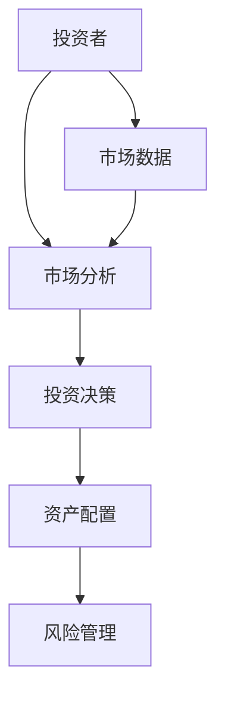
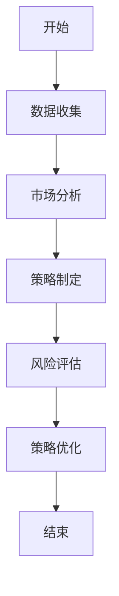
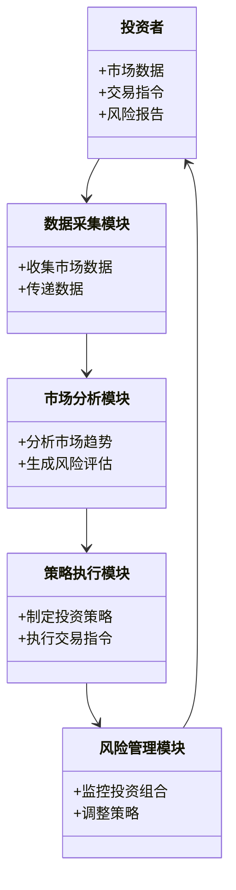
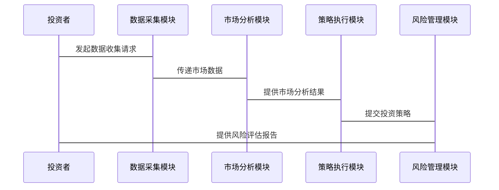

                 


# 托比亚斯·卡尔莱尔的前沿市场投资策略

> 关键词：托比亚斯·卡尔莱尔，前沿市场，投资策略，风险管理，市场分析，资产配置

> 摘要：托比亚斯·卡尔莱尔的前沿市场投资策略是一种结合市场分析、资产配置和风险管理的综合投资方法。本文详细探讨了其核心原理、算法模型、系统架构以及实际应用，帮助读者全面理解并掌握这一策略。

---

## 目录

### 第一部分: 托比亚斯·卡尔莱尔的前沿市场投资策略概述

#### 第1章: 背景介绍与核心概念

##### 1.1 问题背景与描述

###### 1.1.1 当前金融市场的发展现状
分析当前金融市场的发展趋势，强调前沿市场在投资中的重要性。

###### 1.1.2 前沿市场投资的定义与特点
解释前沿市场投资的定义，列出其主要特点，如高风险、高回报、信息不对称等。

###### 1.1.3 托比亚斯·卡尔莱尔的生平与投资理念
介绍托比亚斯·卡尔莱尔的背景，概述他的投资理念和方法。

##### 1.2 问题解决与边界

###### 1.2.1 前沿市场投资的核心目标
明确前沿市场投资的核心目标，如最大化收益、控制风险等。

###### 1.2.2 投资策略的适用范围与边界
讨论托比亚斯·卡尔莱尔策略的适用范围和边界条件，如市场波动性、投资者风险承受能力等。

###### 1.2.3 理论与实践的结合
分析理论与实践之间的关系，强调策略在实际中的应用。

##### 1.3 概念结构与核心要素

###### 1.3.1 投资策略的构成要素
列出投资策略的关键要素，如市场分析、资产配置、风险管理等。

###### 1.3.2 前沿市场的关键特征
详细描述前沿市场的关键特征，如市场规模、流动性、参与者等。

###### 1.3.3 理论框架与实际应用的关系
探讨理论框架如何指导实际投资策略的应用。

---

### 第二部分: 核心概念与联系

#### 第2章: 前沿市场投资策略的核心原理

##### 2.1 核心概念的原理分析

###### 2.1.1 市场分析与投资决策的逻辑
解释市场分析如何影响投资决策，探讨其背后的逻辑。

###### 2.1.2 前沿市场的信息不对称问题
分析前沿市场中信息不对称的现象及其对投资策略的影响。

###### 2.1.3 投资策略的动态调整机制
讨论如何根据市场变化动态调整投资策略。

##### 2.2 核心概念的属性对比

###### 2.2.1 不同市场环境下的策略对比
比较不同市场环境下托比亚斯·卡尔莱尔策略的应用差异。

###### 2.2.2 不同投资目标的策略差异
分析不同投资目标下策略的异同点。

###### 2.2.3 策略执行中的风险与收益对比
探讨风险与收益之间的权衡关系。

##### 2.3 实体关系图



---

### 第三部分: 算法原理与数学模型

#### 第3章: 投资策略的算法原理

##### 3.1 算法原理的数学模型

###### 3.1.1 风险评估模型

$$ R = \sqrt{\sum_{i=1}^{n} w_i^2 \sigma_i^2} $$

其中，$w_i$ 是资产 $i$ 的权重，$\sigma_i$ 是资产 $i$ 的标准差。

###### 3.1.2 资产配置优化

$$ \text{最大化 } \mu = \sum_{i=1}^{n} w_i r_i $$

$$ \text{约束 } \sum_{i=1}^{n} w_i = 1 $$

##### 3.2 算法流程图



---

### 第四部分: 系统分析与架构设计

#### 第4章: 投资策略的系统架构

##### 4.1 系统功能设计

###### 4.1.1 数据采集模块
负责收集市场数据，包括价格、成交量、市场指数等。

###### 4.1.2 市场分析模块
对市场数据进行分析，生成市场趋势预测和风险评估。

###### 4.1.3 策略执行模块
根据分析结果制定投资策略，执行交易指令。

###### 4.1.4 风险管理模块
实时监控投资组合的风险，调整策略以控制风险。

##### 4.2 系统架构



##### 4.3 系统接口设计

###### 4.3.1 数据接口
定义数据接口的标准，确保各模块之间数据传递的兼容性。

###### 4.3.2 交易接口
描述交易执行的接口，确保交易指令的准确执行。

##### 4.4 系统交互流程图



---

### 第五部分: 项目实战

#### 第5章: 托比亚斯·卡尔莱尔策略的项目实战

##### 5.1 环境安装

###### 5.1.1 安装Python
安装Python 3.x，确保环境配置正确。

###### 5.1.2 安装依赖库
安装必要的库，如numpy、pandas、matplotlib等。

##### 5.2 核心实现代码

###### 5.2.1 风险评估模型的实现

```python
import numpy as np

def calculateRisk(weights, cov_matrix):
    return np.sqrt(weights.T @ cov_matrix @ weights)
```

###### 5.2.2 资产配置优化的实现

```python
import numpy as np
from scipy.optimize import minimize

def optimize_portfolio(returns, weights):
    n = len(weights)
    objective = lambda w: -w.T @ returns
    constraints = [{'type': 'eq', 'fun': lambda w: sum(w) - 1}]
    result = minimize(objective, weights, method='SLSQP', constraints=constraints)
    return result.x
```

##### 5.3 案例分析

###### 5.3.1 某个市场的投资机会分析

分析某个市场的投资机会，使用托比亚斯·卡尔莱尔策略进行案例分析。

##### 5.4 项目总结

总结项目实施的经验和教训，提出改进建议。

---

### 第六部分: 最佳实践与拓展

#### 第6章: 最佳实践与拓展

##### 6.1 最佳实践

###### 6.1.1 定期回顾与调整策略
强调定期回顾投资组合并根据市场变化进行调整的重要性。

###### 6.1.2 严格控制风险
提醒读者严格控制风险，避免过度杠杆和集中投资。

##### 6.2 小结

总结全文内容，强调托比亚斯·卡尔莱尔策略的核心思想和实际应用价值。

##### 6.3 注意事项

提醒读者在实际操作中需要注意的事项，如数据的准确性、模型的适用性等。

##### 6.4 拓展阅读

推荐相关书籍和资源，供读者进一步学习。

---

## 作者：AI天才研究院 & 禅与计算机程序设计艺术

---

通过以上目录，您可以系统地学习托比亚斯·卡尔莱尔的前沿市场投资策略，从理论到实践，从算法到系统设计，逐步深入理解这一策略的核心思想和应用场景。

