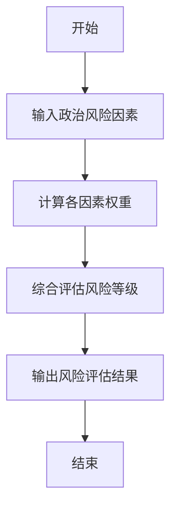
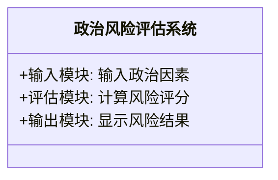
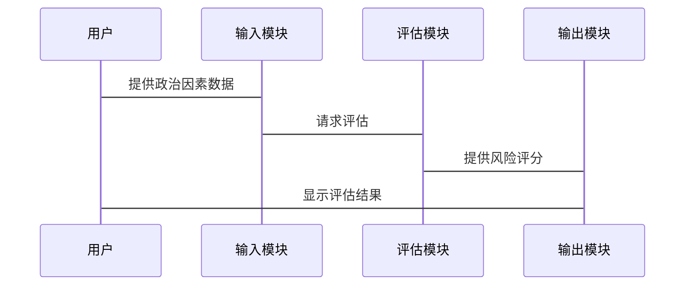

                 


# 托比亚斯·卡尔莱尔的政治风险评估模型

## 关键词：政治风险评估模型、托比亚斯·卡尔莱尔、政治风险、算法原理、系统架构设计

## 摘要：本文深入探讨了托比亚斯·卡尔莱尔提出的政治风险评估模型，从背景介绍、核心概念、算法原理、系统架构设计、项目实战到最佳实践，全面解析了该模型的理论基础和实际应用。通过详细的技术分析和案例解读，揭示了该模型在政治风险评估领域的创新点和应用价值。

---

## 第一部分：政治风险评估模型的背景与核心概念

### 第1章：政治风险评估模型的背景介绍

#### 1.1 政治风险评估的定义与问题背景

- **政治风险的定义**：政治风险是指在特定政治环境中，可能对企业或个人造成损失的不确定性因素。这些因素包括政策变化、政治动荡、法律变更等。
- **政治风险评估的重要性**：在全球化背景下，企业和投资者需要准确评估政治风险，以制定有效的战略和风险管理策略。
- **托比亚斯·卡尔莱尔模型的提出背景**：托比亚斯·卡尔莱尔是一位著名的风险评估专家，他提出的模型结合了定量分析和定性分析，旨在提高政治风险评估的准确性和可操作性。

#### 1.2 政治风险评估的核心问题

- **政治风险的不确定性**：政治风险的不可预测性使其成为风险管理中的难点。
- **政治风险的多维度特征**：政治风险涉及经济、社会、法律等多个维度，需要综合评估。
- **政治风险评估的目标与边界**：模型的目标是通过量化方法，将复杂的政治风险转化为可操作的评估结果，同时明确评估的范围和限制。

#### 1.3 托比亚斯·卡尔莱尔模型的目标与意义

- **模型的核心目标**：通过综合分析政治、经济、社会等多方面的因素，提供一个量化的方法来评估政治风险。
- **模型的创新点与优势**：卡尔莱尔模型结合了统计分析和专家判断，能够更准确地捕捉政治风险的关键因素。
- **模型的适用场景与局限性**：适用于跨国企业和投资者，但在处理极端政治事件时可能存在局限性。

### 第2章：政治风险评估模型的核心概念与联系

#### 2.1 模型的核心要素与概念结构

- **政治风险的构成要素**：包括政策变化、政治稳定性、法律环境、社会动荡等因素。
- **模型的输入变量与输出结果**：输入变量包括经济指标、社会指标、政治指标等，输出结果是政治风险评分。
- **概念之间的关系与依赖性**：各因素之间相互关联，共同影响政治风险的最终评估结果。

#### 2.2 核心概念的属性特征对比

| 概念 | 属性特征 |
|------|----------|
| 政治风险 | 不确定性、复杂性、多维性 |
| 输入变量 | 可量化的、可测量的、可比较的 |
| 输出结果 | 综合评分、风险等级、风险描述 |

#### 2.3 模型的ER实体关系图

```mermaid
er
actor: 政治风险评估师
model: 托比亚斯·卡尔莱尔模型
risk_factors: 政治风险因素
risk_assessment: 政治风险评估结果
actor --> model: 使用模型
model --> risk_factors: 输入风险因素
model --> risk_assessment: 输出评估结果
```

---

## 第二部分：政治风险评估模型的算法原理

### 第3章：政治风险评估模型的算法原理

#### 3.1 模型的算法流程



#### 3.2 模型的数学公式与实现

- **风险评分公式**：
  $$风险评分 = \sum_{i=1}^{n} w_i \cdot f_i$$
  其中，$w_i$ 是第 $i$ 个因素的权重，$f_i$ 是第 $i$ 个因素的评分。

- **权重计算方法**：
  $$权重 = \frac{f_i}{\sum_{j=1}^{n} f_j}$$

#### 3.3 模型的实现代码

```python
def calculate_political_risk(risk_factors, weights):
    risk_score = sum(w * f for w, f in zip(weights, risk_factors))
    return risk_score

# 示例输入
risk_factors = [5, 3, 8, 2]
weights = [0.4, 0.3, 0.2, 0.1]

# 计算风险评分
risk_score = calculate_political_risk(risk_factors, weights)
print("风险评分:", risk_score)
```

---

## 第三部分：系统分析与架构设计

### 第4章：系统分析与架构设计方案

#### 4.1 项目背景与目标

- **项目背景**：开发一个基于托比亚斯·卡尔莱尔模型的政治风险评估系统，帮助用户快速评估特定国家或地区的政治风险。
- **项目目标**：实现一个用户友好的政治风险评估系统，能够根据输入的政治因素，输出风险评分和风险等级。

#### 4.2 系统功能设计



#### 4.3 系统架构设计

```mermaid
graph TD
A[用户] --> B[输入模块]: 输入政治因素
B --> C[评估模块]: 计算风险评分
C --> D[输出模块]: 显示风险结果
D --> E[用户]: 输出评估结果
```

#### 4.4 系统接口设计

- **输入接口**：用户输入政治因素数据，如政策变化、政治稳定性等。
- **输出接口**：显示风险评分和风险等级。

#### 4.5 系统交互设计



---

## 第四部分：项目实战

### 第5章：项目实战与案例分析

#### 5.1 环境安装与配置

- **安装Python环境**：确保安装了Python 3.8或更高版本。
- **安装依赖库**：安装numpy、pandas等库。

#### 5.2 系统核心实现源代码

```python
import numpy as np

def calculate_political_risk(risk_factors, weights):
    risk_score = np.dot(weights, risk_factors)
    return risk_score

# 示例输入
risk_factors = np.array([5, 3, 8, 2])
weights = np.array([0.4, 0.3, 0.2, 0.1])

# 计算风险评分
risk_score = calculate_political_risk(risk_factors, weights)
print("风险评分:", risk_score)
```

#### 5.3 代码应用解读与分析

- **代码功能**：该代码实现了托比亚斯·卡尔莱尔模型的核心算法，能够根据输入的政治因素和权重，计算出风险评分。
- **代码优势**：使用numpy库进行向量运算，提高了计算效率。

#### 5.4 实际案例分析

- **案例背景**：假设一家企业计划在某个新兴市场投资，需要评估该市场的政治风险。
- **输入数据**：政策变化（5）、政治稳定性（3）、法律环境（8）、社会动荡（2）。
- **权重分配**：政策变化（0.4）、政治稳定性（0.3）、法律环境（0.2）、社会动荡（0.1）。
- **计算结果**：风险评分 = 5×0.4 + 3×0.3 + 8×0.2 + 2×0.1 = 2 + 0.9 + 1.6 + 0.2 = 4.7。

#### 5.5 项目小结

- **项目总结**：通过实际案例分析，验证了托比亚斯·卡尔莱尔模型的有效性和可操作性。
- **项目意义**：该模型能够帮助企业准确评估政治风险，制定合理的投资策略。

---

## 第五部分：最佳实践与小结

### 第6章：最佳实践与小结

#### 6.1 小结

- **模型的核心价值**：托比亚斯·卡尔莱尔模型通过量化方法，将复杂的政治风险转化为可操作的评估结果，为企业和投资者提供了重要的决策支持工具。

#### 6.2 注意事项

- **数据质量**：模型的准确性依赖于输入数据的质量，用户需要确保输入数据的准确性和完整性。
- **模型更新**：政治环境不断变化，模型需要定期更新和优化。

#### 6.3 拓展阅读

- **相关文献**：托比亚斯·卡尔莱尔的其他研究成果。
- **行业应用**：其他类似的政治风险评估模型及其应用。

---

## 作者：AI天才研究院/AI Genius Institute & 禅与计算机程序设计艺术 /Zen And The Art of Computer Programming

