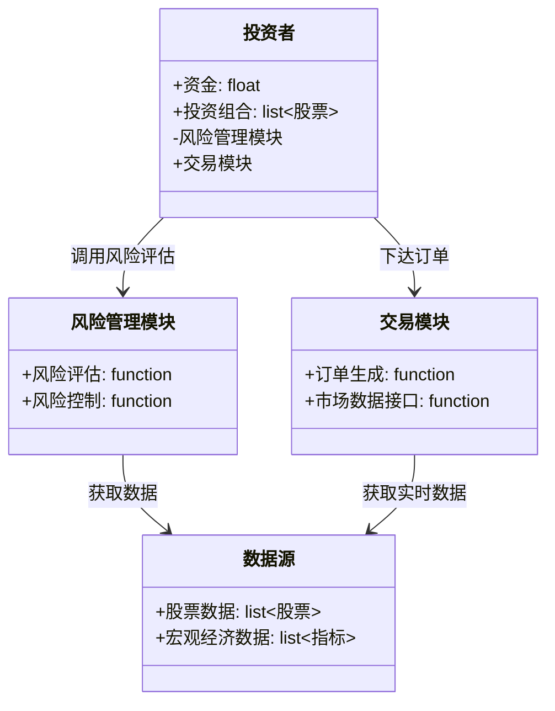

                 


# 托比亚斯·卡尔莱尔的新兴市场价值投资

## 关键词

- 新兴市场
- 价值投资
- 托比亚斯·卡尔莱尔
- 投资策略
- 量化分析

## 摘要

托比亚斯·卡尔莱尔是新兴市场价值投资领域的权威，其策略在帮助投资者发现低估值机会方面具有重要意义。本文将深入探讨新兴市场的特点、价值投资的核心理念、量化分析的方法，以及如何构建投资系统和案例分析，帮助读者掌握在新兴市场进行价值投资的策略和技巧。

---

## 第一部分：新兴市场的价值投资背景

### 第1章：新兴市场的定义与特点

#### 1.1 新兴市场的概念与范围

- **1.1.1 新兴市场的定义**  
  新兴市场是指经济快速增长、但尚未完全成熟的国家或地区。这些市场通常具有较高的增长率和较大的投资潜力。

- **1.1.2 新兴市场与发达市场的区别**  
  | 特性 | 新兴市场 | 发达市场 |
  |------|----------|----------|
  | 经济增长率 | 高 | 低 |
  | 市场流动性 | 低 | 高 |
  | 投资机会 | 多 | 少 |

- **1.1.3 新兴市场的经济特征**  
  新兴市场通常具有较高的通胀率和波动性，同时政府政策对经济的影响较大。

#### 1.2 新兴市场的投资价值

- **1.2.1 新兴市场的增长潜力**  
  新兴市场的GDP增长率通常高于发达市场，这为投资者提供了更多的增长机会。

- **1.2.2 新兴市场中的投资机会**  
  新兴市场中的企业往往估值较低，但具有较高的增长潜力，适合价值投资者。

- **1.2.3 新兴市场与全球经济的关系**  
  新兴市场是全球经济增长的重要驱动力，其表现对全球经济具有重要影响。

### 第2章：价值投资的核心理念

#### 2.1 价值投资的起源与发展

- **2.1.1 价值投资的起源**  
  价值投资起源于20世纪初，由本杰明·格雷厄姆和戴维·多德提出。

- **2.1.2 价值投资的发展历程**  
  从格雷厄姆的“烟屁股”理论到巴菲特的现代价值投资，价值投资理论不断发展。

- **2.1.3 托比亚斯·卡尔莱尔的贡献**  
  卡尔莱尔将价值投资的理念应用到新兴市场，提出了适合新兴市场的投资策略。

#### 2.2 价值投资的基本原则

- **2.2.1 质优价廉的原则**  
  投资者应选择基本面良好但估值较低的公司。

- **2.2.2 长期投资的原则**  
  价值投资强调长期持有，避免频繁交易。

- **2.2.3 风险控制的原则**  
  通过分散投资和安全边际来控制风险。

---

## 第二部分：新兴市场价值投资的核心策略

### 第3章：基本面分析与投资决策

#### 3.1 基本面分析的方法

- **3.1.1 财务报表分析**  
  分析公司的财务报表，重点关注盈利能力、成长性和财务健康状况。

- **3.1.2 行业分析**  
  研究行业的发展趋势、竞争格局和政策影响。

- **3.1.3 宏观经济分析**  
  考虑宏观经济指标（如GDP增长率、通胀率）对投资的影响。

#### 3.2 价值评估模型

- **3.2.1 市盈率模型**  
  市盈率 = 股价 / 每股净利润  
  $$ P/E = \frac{P}{E} $$

- **3.2.2 市净率模型**  
  市净率 = 股价 / 每股净资产  
  $$ P/B = \frac{P}{B} $$

- **3.2.3 现金流折现模型**  
  通过折现未来现金流来评估公司价值。

### 第4章：安全边际与风险控制

#### 4.1 安全边际的概念

- **4.1.1 安全边际的定义**  
  安全边际 = 买入价 / 真实价值  
  $$ \text{安全边际} = \frac{\text{买入价}}{\text{真实价值}} $$

- **4.1.2 安全边际的重要性**  
  通过留有安全边际，降低投资风险。

- **4.1.3 安全边际的计算方法**  
  根据公司的基本面分析，估算其内在价值，然后确定买入价格的安全边际。

#### 4.2 风险控制策略

- **4.2.1 分散投资的风险**  
  通过投资多个行业和公司来分散风险。

- **4.2.2 个股风险与市场风险的平衡**  
  在新兴市场中，个股风险和市场风险并存，需合理平衡。

- **4.2.3 定期调整投资组合**  
  根据市场变化和个人投资目标，定期调整投资组合。

---

## 第三部分：新兴市场投资的量化分析

### 第5章：量化投资模型的构建

#### 5.1 量化投资的基本原理

- **5.1.1 量化投资的定义**  
  量化投资是一种基于数学模型的投资方法，利用算法和数据分析来指导投资决策。

- **5.1.2 数据驱动的投资决策**  
  通过分析大量数据，发现投资机会和风险。

- **5.1.3 量化模型的优势与局限**  
  优势：客观、高效、可量化。局限：需要依赖数据质量和模型的有效性。

#### 5.2 量化模型的设计与实现

##### 5.2.1 数据收集与处理  
- 使用Python的pandas库进行数据清洗和处理。

##### 5.2.2 模型构建与测试  
- 使用机器学习算法，如线性回归、随机森林等，构建预测模型。

##### 5.2.3 模型的优化与调整  
- 通过回测和参数调整，优化模型的性能。

### 第6章：因子模型与风险评估

#### 6.1 因子模型的介绍

- **6.1.1 常见的因子类型**  
  常见因子包括市值因子、价值因子、动量因子等。

- **6.1.2 因子模型的构建过程**  
  1. 收集数据  
  2. 计算因子值  
  3. 构建因子组合  
  4. 测试模型性能

- **6.1.3 因子模型的应用场景**  
  用于股票筛选、投资组合优化等。

#### 6.2 风险评估模型

- **6.2.1 风险评估的定义**  
  风险评估是指通过分析投资组合的波动性来衡量其风险。

- **6.2.2 风险评估的方法**  
  1. 方差-协方差矩阵  
  2. 资本资产定价模型（CAPM）  
  3. 风险价值（VaR）方法

---

## 第四部分：系统分析与架构设计

### 第7章：系统功能设计

#### 7.1 问题场景介绍

- 投资者需要一个系统化的工具来分析新兴市场的投资机会。

#### 7.2 项目介绍

- 本项目旨在构建一个新兴市场价值投资的分析系统，帮助投资者做出科学决策。

#### 7.3 系统功能设计

##### 7.3.1 领域模型（Mermaid 类图）



---

## 第五部分：项目实战

### 第8章：新兴市场价值投资的实战案例

#### 8.1 环境安装

- 安装Python、pandas、numpy、scikit-learn等库。

#### 8.2 核心实现源代码

```python
import pandas as pd
import numpy as np
from sklearn.linear_model import LinearRegression

# 示例数据加载
data = pd.read_csv('emerging_markets.csv')

# 基本面分析
data['PE'] = data['Price'] / data['Earnings']
data['PB'] = data['Price'] / data['Book Value']

# 量化模型构建
X = data[['PE', 'PB', 'Revenue Growth']]
y = data['Return']
model = LinearRegression()
model.fit(X, y)

# 预测与评估
predictions = model.predict(X)
print('预测准确率:', model.score(X, y))
```

#### 8.3 案例分析

- **案例背景**：假设我们投资于一个新兴市场的科技公司。
- **数据分析**：分析该公司的PE、PB等指标，发现其估值较低。
- **投资决策**：基于模型预测，决定买入该股票。

#### 8.4 项目小结

- 通过实际案例，验证了新兴市场价值投资策略的有效性。

---

## 第六部分：最佳实践

### 第9章：小结与注意事项

- **小结**：新兴市场价值投资需要结合基本面分析和量化模型，才能取得长期收益。
- **注意事项**：新兴市场的波动性较大，投资者需谨慎选择投资标的，并注意风险控制。

### 第10章：拓展阅读

- 建议阅读托比亚斯·卡尔莱尔的著作，深入理解新兴市场价值投资的策略。

---

## 作者

作者：AI天才研究院/AI Genius Institute & 禅与计算机程序设计艺术 /Zen And The Art of Computer Programming

---

通过以上结构，文章详细介绍了托比亚斯·卡尔莱尔的新兴市场价值投资策略，从理论到实践，结合了技术分析和实际案例，帮助读者系统性地理解和应用这些策略。

