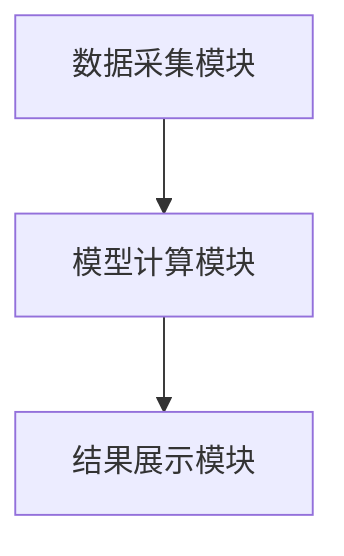

                 


# 托马斯·卡普兰的创新型价值投资方法

> 关键词：托马斯·卡普兰，价值投资，创新，算法，金融，投资策略

> 摘要：本文深入探讨了托马斯·卡普兰的创新型价值投资方法，从其核心概念、数学模型到算法实现，再到系统架构设计和项目实战，全面解析其在现代金融投资中的应用。通过详细的技术分析和实际案例，揭示了如何将创新思维与传统价值投资相结合，为投资者提供更高效的投资策略。

---

## 第一部分: 价值投资的起源与演变

### 第1章: 价值投资的基本概念

#### 1.1 价值投资的定义与核心理念
- 1.1.1 价值投资的定义
  - 价值投资是一种以基本面分析为基础的投资方法，旨在通过寻找市场价格低于其内在价值的证券进行投资。
  - 核心理念：市场短期可能 irrational，但长期会回归基本面。

#### 1.2 传统价值投资与成长投资的区别
- 1.2.1 传统价值投资的特点
  - 侧重于低市盈率、低市净率等估值指标。
- 1.2.2 成长投资的特点
  - 侧重于高成长性，关注高市盈率、高市净率等指标。

#### 1.3 托马斯·卡普兰的创新型价值投资方法
- 1.3.1 方法的核心思想
  - 结合基本面分析与创新因子，寻找具有持续竞争优势和创新能力强的公司。

---

## 第二部分: 创新型价值投资的核心概念与模型

### 第2章: 创新型价值投资的核心概念

#### 2.1 创新型价值投资的核心要素
| 核心要素 | 定义 | 重要性 |
|----------|------|--------|
| 内在价值 | 公司未来现金流的现值 | 投资决策的基础 |
| 创新能力 | 公司的技术创新、管理创新等能力 | 区别于传统价值投资的关键 |

#### 2.2 创新型价值投资的逻辑框架
```mermaid
graph TD
    A[市场价] -->|低于| B[内在价值]
    B -->|具有创新性| C[竞争优势]
    C -->|投资机会]
```

### 第3章: 创新型价值投资模型的构建

#### 3.1 模型的输入变量
- 财务指标：ROE（净资产收益率）、ROA（资产回报率）。
- 创新指标：研发支出占收入比例、专利数量。

#### 3.2 模型的输出变量
- 投资评分：基于多维度指标的综合评分。

#### 3.3 模型的数学表达
$$ \text{投资评分} = \alpha \times \text{ROE} + \beta \times \text{创新指标} $$

其中，$\alpha$ 和 $\beta$ 是根据市场环境调整的权重系数。

---

## 第三部分: 创新型价值投资的算法原理

### 第4章: 创新型价值投资算法的实现

#### 4.1 数据的获取与预处理
- 数据来源：股票历史数据、财务报表、专利数据库。
- 数据清洗：处理缺失值、异常值。

#### 4.2 模型的训练与优化
- 使用历史数据训练模型，调整权重系数 $\alpha$ 和 $\beta$。

#### 4.3 结果的输出与解释
- 输出投资评分，并根据评分进行投资决策。

### 第5章: 算法的数学模型与公式

#### 5.1 核心公式
$$ \text{投资评分} = \alpha \times \text{ROE} + \beta \times \text{创新指标} $$

#### 5.2 公式的实际应用案例
- 假设 $\alpha = 0.6$，$\beta = 0.4$，某公司ROE为15%，创新指标得分为80分，则投资评分为：
$$ 0.6 \times 15 + 0.4 \times 80 = 9 + 32 = 41 \text{分} $$

---

## 第四部分: 创新型价值投资的系统分析与架构设计

### 第6章: 系统架构设计

#### 6.1 系统功能模块划分
- 数据采集模块：负责收集股票数据、财务数据、创新数据。
- 模型计算模块：负责计算投资评分。
- 结果展示模块：以可视化方式展示评分结果。

#### 6.2 系统架构图


---

## 第五部分: 创新型价值投资的项目实战

### 第7章: 项目背景与目标

#### 7.1 项目背景
- 通过构建托马斯·卡普兰的创新型价值投资模型，筛选具有创新能力和估值优势的股票。

#### 7.2 项目目标
- 实现模型的算法，验证其在实际投资中的有效性。

### 第8章: 项目核心实现

#### 8.1 数据采集代码
```python
import pandas as pd
import requests

# 数据采集模块
def get_stock_data(ticker):
    url = f"https://api.example.com/stock_data/{ticker}"
    response = requests.get(url)
    data = response.json()
    df = pd.DataFrame(data)
    return df
```

#### 8.2 模型计算代码
```python
def calculate_investment_score(roe, innovation_score):
    alpha = 0.6
    beta = 0.4
    return alpha * roe + beta * innovation_score
```

### 第9章: 实际案例分析

#### 9.1 案例分析
- 某科技公司ROE为20%，创新指标得分为90分。
$$ \text{投资评分} = 0.6 \times 20 + 0.4 \times 90 = 12 + 36 = 48 \text{分} $$

---

## 第六部分: 最佳实践与小结

### 第10章: 最佳实践

#### 10.1 风险管理
- 设置止损点，避免市场波动带来的损失。

#### 10.2 持续学习
- 定期更新模型，适应市场变化。

### 第11章: 小结与注意事项

- 小结：托马斯·卡普兰的创新型价值投资方法通过引入创新因子，提升了传统价值投资的有效性。
- 注意事项：模型结果仅供参考，实际投资需结合市场环境和其他因素。

---

## 作者

作者：AI天才研究院/AI Genius Institute & 禅与计算机程序设计艺术 /Zen And The Art of Computer Programming

