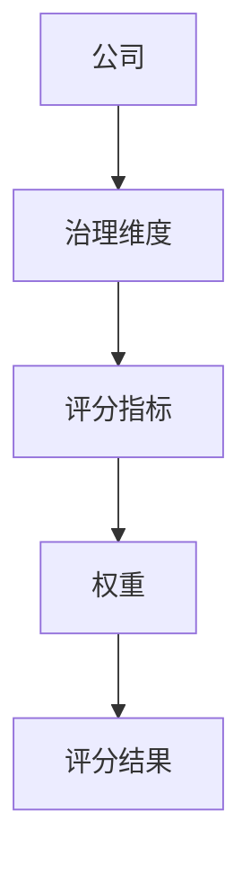
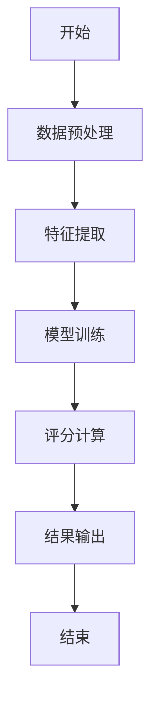
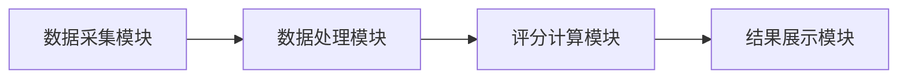
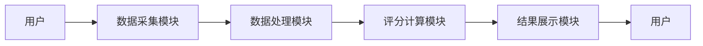

                 


# 托马斯·罗恩的公司治理评分系统

## 关键词：公司治理，评分系统，托马斯·罗恩，算法原理，系统架构

## 摘要：托马斯·罗恩的公司治理评分系统是一种创新的评估方法，通过量化分析公司治理的多个维度，提供客观的评分结果，帮助企业优化治理结构。本文详细介绍了该系统的背景、核心概念、算法原理、系统架构及实际应用，为企业的治理实践提供参考。

---

# 托马斯·罗恩的公司治理评分系统

## 1. 公司治理评分系统背景介绍

### 1.1 问题背景与定义

- **公司治理的核心问题**：公司治理涉及董事会结构、高管责任、股东权利等多个方面，传统的治理方法缺乏量化评估，难以衡量实际效果。
- **托马斯·罗恩评分系统的定义**：该系统通过量化分析公司治理的各个维度，提供客观评分，帮助企业优化治理结构。
- **系统的目标与意义**：旨在帮助企业识别治理中的不足，提升治理效率，降低风险。

### 1.2 公司治理评分系统的特点

- **核心要素**：包括董事会结构、高管责任、股东权利等。
- **评分维度与权重分配**：不同维度的重要性不同，需根据具体情况确定权重。
- **系统的适用范围与边界**：适用于各类企业，但需根据行业特点调整模型。

### 1.3 系统与传统治理方法的对比

- **传统方法的局限性**：缺乏量化评估，难以客观衡量治理效果。
- **系统的创新点**：引入量化分析和机器学习，提供更精确的评分。
- **系统的优势与劣势**：优势在于客观性和可操作性，劣势在于需要大量数据支持。

### 1.4 系统的应用领域与前景

- **应用场景**：企业内部审计、投资者决策参考、监管机构评估。
- **对企业价值的提升**：帮助企业在治理方面进行优化，提升透明度和合规性。
- **未来发展潜力与挑战**：随着技术进步，系统将更加智能化，但数据隐私和模型准确性是主要挑战。

---

## 2. 托马斯·罗恩评分模型的核心概念

### 2.1 评分模型的定义与原理

- **模型的基本原理**：通过量化分析公司治理的各个维度，计算综合评分。
- **模型的输入与输出**：输入为治理指标数据，输出为评分结果。
- **模型的数学表达式**：$$ \text{总分} = \sum (\text{指标评分} \times \text{权重}) $$

### 2.2 评分维度与权重分配

- **核心维度的定义**：包括董事会结构、高管责任、股东权利等。
- **权重计算方法**：根据各维度对公司治理的影响程度，确定权重。
- **维度之间的关系**：各维度相互关联，共同影响公司治理的整体表现。

### 2.3 模型的属性特征对比

| 属性 | 描述 |
|------|------|
| 可解释性 | 高，各维度评分清晰 |
| 鲁棒性 | 中，依赖数据质量 |
| 可扩展性 | 高，可调整权重 |

### 2.4 实体关系图（ER图）



### 2.5 本章小结

本章介绍了托马斯·罗恩评分模型的核心概念，包括定义、维度、权重分配及模型的属性特征，为后续的算法设计奠定了基础。

---

## 3. 托马斯·罗恩评分模型的算法原理

### 3.1 数据预处理

- **数据清洗与标准化**：处理缺失值和异常值，确保数据一致性。
- **数据特征提取**：从原始数据中提取有用的特征，用于模型训练。
- **数据归一化**：将数据缩放到统一范围，避免特征间的影响。

### 3.2 模型训练

- **算法选择与优化**：选择合适的机器学习算法，如随机森林或支持向量机，进行参数调优。
- **模型训练流程**：输入特征数据，训练模型，得到评分函数。
- **超参数调优**：通过网格搜索或贝叶斯优化，找到最优参数组合。

### 3.3 评分计算

- **综合评分公式**：$$ \text{评分} = \sum (\text{指标评分} \times \text{权重}) $$
- **权重分配策略**：根据各维度的重要性，动态调整权重。
- **评分结果的解释**：将评分转化为等级（如A、B、C），帮助企业理解结果。

### 3.4 算法流程图



### 3.5 Python核心代码实现

```python
def preprocess_data(data):
    # 数据清洗与标准化
    data = data.dropna()
    data = (data - data.mean()) / data.std()
    return data

def train_model(features, labels):
    # 模型训练
    from sklearn.ensemble import RandomForestRegressor
    model = RandomForestRegressor(n_estimators=100, random_state=42)
    model.fit(features, labels)
    return model

def calculate_score(weights, features, model):
    # 评分计算
    predicted_scores = model.predict(features)
    weighted_scores = predicted_scores * weights
    total_score = weighted_scores.sum()
    return total_score
```

### 3.6 本章小结

本章详细讲解了托马斯·罗恩评分模型的算法原理，包括数据预处理、模型训练和评分计算，为系统的实际应用提供了技术支撑。

---

## 4. 系统分析与架构设计方案

### 4.1 问题场景介绍

- **问题描述**：企业需要量化评估治理结构，优化管理流程。
- **项目介绍**：设计一个基于托马斯·罗恩模型的评分系统，帮助企业进行治理评估。

### 4.2 系统功能设计

- **领域模型类图**：展示系统各模块之间的关系。
- **系统架构设计**：模块化设计，包括数据采集、处理、评分计算和结果展示。

### 4.3 系统架构设计图



### 4.4 系统接口设计

- **输入接口**：接收公司治理数据。
- **输出接口**：提供评分结果和改进建议。

### 4.5 系统交互序列图



### 4.6 本章小结

本章从系统设计的角度，详细介绍了托马斯·罗恩评分系统的架构和接口设计，确保系统的可扩展性和可维护性。

---

## 5. 项目实战

### 5.1 环境安装

- **安装Python和相关库**：如scikit-learn、pandas、numpy。
- **安装可视化工具**：如Matplotlib或Seaborn。

### 5.2 系统核心实现源代码

```python
import pandas as pd
import numpy as np
from sklearn.ensemble import RandomForestRegressor

def load_data():
    # 加载数据
    data = pd.read_csv('governance_data.csv')
    return data

def preprocess(data):
    # 数据预处理
    data = data.dropna()
    data = (data - data.mean()) / data.std()
    return data

def train_model(data, target):
    # 训练模型
    features = data.drop(target, axis=1)
    model = RandomForestRegressor(n_estimators=100, random_state=42)
    model.fit(features, target)
    return model

def calculate_score(model, features, weights):
    # 计算评分
    predicted = model.predict(features)
    weighted_scores = predicted * weights
    total_score = weighted_scores.sum()
    return total_score

def main():
    data = load_data()
    processed_data = preprocess(data)
    target = processed_data['score']
    model = train_model(processed_data, target)
    weights = np.array([0.4, 0.3, 0.2, 0.1])
    final_score = calculate_score(model, processed_data.drop('score', axis=1), weights)
    print(f'最终评分：{final_score}')

if __name__ == '__main__':
    main()
```

### 5.3 实际案例分析

- **案例背景**：某公司治理数据的分析。
- **数据处理与建模**：加载数据，预处理，训练模型，计算评分。
- **评分结果与解读**：解释评分结果，提供改进建议。

### 5.4 本章小结

本章通过实际案例，详细讲解了托马斯·罗恩评分系统的实现过程，从数据加载到模型训练，再到评分计算，确保系统的实际应用价值。

---

## 6. 最佳实践与小结

### 6.1 小结

- 托马斯·罗恩的公司治理评分系统通过量化分析，帮助企业优化治理结构。
- 系统设计合理，算法科学，具有较高的实用价值。

### 6.2 注意事项

- 数据质量是关键，需确保数据的准确性和完整性。
- 模型调优需根据实际情况，选择合适的算法和参数。

### 6.3 拓展阅读

- 推荐阅读相关领域的书籍和论文，深入了解公司治理的理论与实践。

---

## 作者：AI天才研究院/AI Genius Institute & 禅与计算机程序设计艺术 /Zen And The Art of Computer Programming

---

# 结语

托马斯·罗恩的公司治理评分系统为企业提供了一种科学的治理评估方法，帮助企业识别问题，优化结构。未来，随着技术的进步，系统将更加智能化，为企业治理提供更有力的支持。

