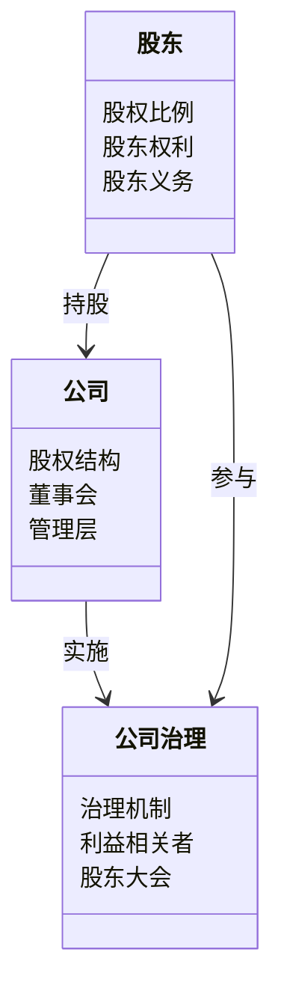
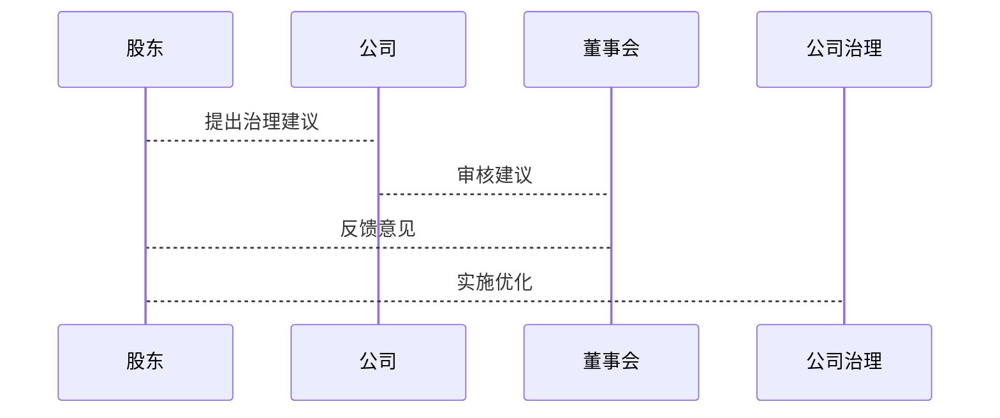

                 


# 托马斯·罗恩的股东积极主义策略

---

## 关键词：
股东积极主义, 托马斯·罗恩, 公司治理, 股东权利, 股权结构, 策略分析, 系统设计

---

## 摘要：
本文深入分析了托马斯·罗恩的股东积极主义策略，探讨其在现代公司治理中的应用与影响。通过背景介绍、核心概念、算法原理、系统架构设计和项目实战等多维度分析，揭示了罗恩策略的独特性及其在股东价值最大化中的实践价值。文章结合理论与实践，为读者提供了全面的理解和应用指南。

---

## 第三部分: 罗恩策略的算法原理

## 第4章: 罗恩策略的系统分析与架构设计

### 4.1 系统分析与设计概述
#### 4.1.1 问题场景与需求分析
- 股东积极主义的目标是通过优化公司治理结构和股东权利实现股东价值最大化。
- 问题场景包括股东权益受损、公司治理效率低下、股东与管理层利益冲突等。

#### 4.1.2 项目介绍与目标设定
- 项目目标：通过系统化方法优化股东积极主义策略的实施过程。
- 项目范围：涵盖公司治理、股东权利、管理层激励等多个方面。

### 4.2 系统功能设计
#### 4.2.1 领域模型设计


#### 4.2.2 系统架构设计


#### 4.2.3 系统接口设计
- API端点：
  - `/api/company-analysis`：公司治理分析接口
  - `/api/shareholder-rights`：股东权利查询接口
  - `/api/influence-strategy`：影响策略生成接口

#### 4.2.4 系统交互设计


### 4.3 系统实现与优化
#### 4.3.1 系统实现的关键点
- 数据采集：公司治理数据的获取与处理
- 算法实现：股东价值评估模型的代码实现
- 系统优化：提高系统运行效率与用户体验

#### 4.3.2 系统优化建议
- 数据库优化：使用索引提升查询效率
- 算法优化：改进股东价值评估模型的计算速度
- 系统扩展：支持多平台部署与数据可视化

---

## 第5章: 罗恩策略的项目实战

### 5.1 项目实战概述
#### 5.1.1 项目背景与目标
- 项目背景：某中型制造企业治理结构优化
- 项目目标：通过罗恩策略提升股东价值

### 5.2 项目环境配置
#### 5.2.1 系统环境
- 操作系统：Linux/Windows/MacOS
- 开发工具：Python 3.8+, Jupyter Notebook, Git
- 数据库：MySQL/PostgreSQL

#### 5.2.2 依赖库安装
```bash
pip install numpy pandas matplotlib
```

### 5.3 核心代码实现
#### 5.3.1 股东价值评估模型实现
```python
import numpy as np
import pandas as pd

def calculate_shareholder_value(enterprise_value, num_shareholders):
    return enterprise_value / num_shareholders

# 示例数据
enterprise_value = 100000000  # 企业价值，单位：元
num_shareholders = 10000     # 股东数量
shareholder_value = calculate_shareholder_value(enterprise_value, num_shareholders)
print(f"股东价值：{shareholder_value}元/股")
```

#### 5.3.2 系统交互实现
```python
from flask import Flask, jsonify

app = Flask(__name__)

@app.route('/api/shareholder-rights', methods=['GET'])
def get_shareholder_rights():
    return jsonify({
        'status': 'success',
        'data': {
            'right1': '投票权',
            'right2': '分红权',
            'right3': '监督权'
        }
    })

if __name__ == '__main__':
    app.run(debug=True)
```

### 5.4 实际案例分析与解读
#### 5.4.1 案例背景
- 某公司股东通过积极主义策略成功推动管理层改革，提升了公司业绩。

#### 5.4.2 案例分析
- 数据分析：股东权益提升的具体表现
- 模型应用：评估模型在实际中的应用效果
- 结果解读：策略实施后的长期影响

### 5.5 项目小结
#### 5.5.1 实施效果
- 股东价值显著提升
- 公司治理效率提高
- 股东与管理层关系优化

#### 5.5.2 经验总结
- 罗恩策略的有效性
- 系统设计的合理性
- 模型计算的准确性

---

## 第6章: 罗恩策略的最佳实践与总结

### 6.1 最佳实践
#### 6.1.1 策略实施的注意事项
- 确保股东权益合法合规
- 优化沟通与协商机制
- 定期评估策略效果

#### 6.1.2 系统设计的优化建议
- 提升数据处理效率
- 改进算法模型的准确性
- 优化用户体验

### 6.2 小结与展望
- 本文全面分析了托马斯·罗恩的股东积极主义策略，从理论到实践进行了详细探讨。
- 罗恩策略在现代公司治理中的应用具有重要的现实意义。
- 未来研究可以进一步探讨策略在不同行业中的适用性。

---

## 第7章: 总结与展望

### 7.1 总结
- 托马斯·罗恩的股东积极主义策略为股东价值最大化提供了新的思路。
- 通过系统化的方法和优化的算法模型，可以显著提升策略实施效果。
- 本文的研究为公司治理领域提供了重要的理论和实践参考。

### 7.2 展望
- 进一步研究罗恩策略在跨国公司中的应用
- 探讨策略在新兴行业的适用性
- 开发更智能化的股东积极主义实施系统

---

## 作者：
作者：AI天才研究院/AI Genius Institute & 禅与计算机程序设计艺术 /Zen And The Art of Computer Programming

---

通过本文的系统分析与详细讲解，读者可以全面理解托马斯·罗恩的股东积极主义策略，并在实际应用中灵活运用这些策略，实现股东价值的最大化。

