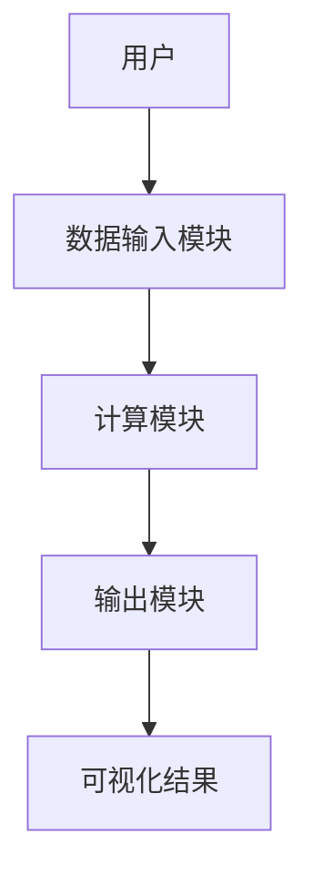
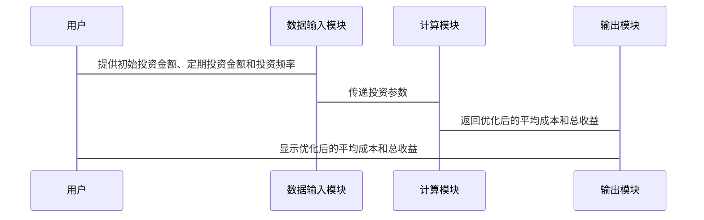

                 


# 托马斯·罗的价值平均策略

## 关键词：价值平均策略、投资策略、数学模型、算法实现、系统架构

## 摘要：  
托马斯·罗的价值平均策略是一种通过定期投资来降低市场波动风险的策略，尤其适用于长期投资者。本文将从背景介绍、核心概念、数学模型、算法实现、系统架构到项目实战，全面分析该策略的原理和应用，帮助读者理解并掌握这一策略的核心思想。

---

## 第一部分：价值平均策略的背景与概念

### 第1章：价值平均策略概述

#### 1.1 价值平均策略的背景
- 1.1.1 投资市场的波动性与不确定性  
  投资市场受多种因素影响，价格波动频繁，传统的“买入并持有”策略在市场剧烈波动时表现不佳。

- 1.1.2 传统投资策略的局限性  
  传统的投资策略如“买入并持有”在市场下跌时难以避免损失，而频繁交易则增加了交易成本和税务负担。

- 1.1.3 价值平均策略的提出与意义  
  价值平均策略通过定期投资，逐步降低投资成本，尤其适合长期投资者。

#### 1.2 价值平均策略的核心概念
- 1.2.1 价值平均策略的定义  
  价值平均策略是一种通过定期定额投资，逐步平均投资成本，从而在市场波动中获得稳定收益的投资策略。

- 1.2.2 策略的核心要素与组成部分  
  价值平均策略的核心要素包括：定期投资、定额投资、逐步降低成本。

- 1.2.3 策略的适用场景与边界条件  
  适用于长期投资、市场波动较大、投资者希望降低投资成本的场景。

#### 1.3 价值平均策略的优势与特点
- 1.3.1 稳定性与风险控制  
  定期投资可以分散投资成本，降低市场波动对整体投资组合的影响。

- 1.3.2 长期收益的潜在优势  
  长期来看，价值平均策略能够摊低成本，获得稳定收益。

- 1.3.3 策略的可操作性与灵活性  
  简单易行，适合普通投资者操作。

#### 1.4 价值平均策略与其他投资策略的对比
- 1.4.1 与均值回归策略的对比  
  价值平均策略属于均值回归的一种应用，但更注重长期平均成本。

- 1.4.2 与趋势跟踪策略的对比  
  趋势跟踪策略依赖于市场趋势的判断，而价值平均策略不依赖趋势，适合市场波动较大时使用。

- 1.4.3 与价值投资策略的对比  
  价值投资注重选股，而价值平均策略注重平均成本。

---

## 第二部分：价值平均策略的数学模型与算法原理

### 第2章：价值平均策略的数学模型

#### 2.1 理论基础
- 2.1.1 均值回归的数学表达  
  均值回归是一种统计学概念，认为价格会回归到长期平均值。数学表达为：$$E[X] = \mu$$，其中$$\mu$$是均值。

- 2.1.2 价值平均的数学公式  
  价值平均策略的数学公式可以表示为：$$\text{平均成本} = \frac{\text{总成本}}{\text{投资次数}}$$。

- 2.1.3 算术平均与几何平均的对比  
  算术平均适用于线性计算，而几何平均适用于收益率的计算。例如，投资收益率的几何平均为：$$\left( \prod_{i=1}^{n}(1 + r_i) \right)^{1/n} - 1$$。

#### 2.2 算法模型
- 2.2.1 价值平均策略的核心算法  
  算法通过定期定额投资，逐步计算平均成本。

- 2.2.2 算法的输入与输出  
  输入包括初始投资金额、定期投资金额、投资频率；输出包括每期的平均成本和总收益。

- 2.2.3 算法的实现步骤  
  1. 初始化投资金额。  
  2. 定期定额投资。  
  3. 计算每期的平均成本。  
  4. 输出总收益。

#### 2.3 数学公式与模型分析
- 2.3.1 算术平均公式：$$\text{Average} = \frac{1}{n}\sum_{i=1}^{n}x_i$$  
  适用于计算每期的投资成本。

- 2.3.2 价值平均策略的优化公式：$$\text{Optimized Average} = \frac{\sum_{i=1}^{n}w_i x_i}{\sum_{i=1}^{n}w_i}$$  
  其中，$$w_i$$为每期的投资权重。

- 2.3.3 算法复杂度分析  
  算法的时间复杂度为O(n)，空间复杂度为O(1)。

### 第3章：价值平均策略的算法实现

#### 3.1 算法实现步骤
- 3.1.1 数据输入与预处理  
  读取初始投资金额、定期投资金额、投资频率等参数。

- 3.1.2 算术平均计算  
  计算每期的投资成本。

- 3.1.3 价值平均优化  
  计算优化后的平均成本。

- 3.1.4 结果输出与可视化  
  输出总收益并绘制收益曲线图。

#### 3.2 算法实现的代码示例
```python
def value_averaging(initial_investment, regular_investment, frequency):
    total_cost = initial_investment
    num_investments = 0
    for _ in range(frequency):
        total_cost += regular_investment
        num_investments += 1
    average_cost = total_cost / num_investments
    return average_cost

# 示例
initial_investment = 10000
regular_investment = 1000
frequency = 12  # 每月投资一次，持续12个月
average_cost = value_averaging(initial_investment, regular_investment, frequency)
print(f"平均成本为：{average_cost}")
```

#### 3.3 代码解读与分析
- 3.3.1 数据输入与预处理  
  函数接受初始投资金额、定期投资金额和投资频率。

- 3.3.2 算术平均计算  
  计算每期的投资成本，并累加到总成本中。

- 3.3.3 价值平均优化  
  优化后的平均成本为总成本除以投资次数。

- 3.3.4 结果输出与可视化  
  输出优化后的平均成本，并绘制收益曲线图。

---

## 第三部分：价值平均策略的系统架构与设计

### 第4章：价值平均策略的系统架构设计

#### 4.1 系统功能设计
- 4.1.1 数据输入模块  
  读取初始投资金额、定期投资金额和投资频率。

- 4.1.2 计算模块  
  计算每期的投资成本和优化后的平均成本。

- 4.1.3 输出模块  
  输出优化后的平均成本和总收益。

#### 4.2 系统架构设计（Mermaid架构图）


#### 4.3 系统接口设计
- 数据输入接口：接收初始投资金额、定期投资金额和投资频率。
- 计算接口：调用价值平均策略算法进行计算。
- 输出接口：返回优化后的平均成本和总收益。

#### 4.4 系统交互设计（Mermaid序列图）


---

## 第四部分：价值平均策略的项目实战

### 第5章：价值平均策略的项目实战

#### 5.1 项目介绍
- 项目名称：价值平均策略实现
- 项目目标：实现价值平均策略的算法，并验证其在实际投资中的表现。

#### 5.2 项目实现
- 5.2.1 环境安装  
  安装Python和必要的库，如numpy和matplotlib。

- 5.2.2 核心实现  
  编写价值平均策略的Python代码，包括数据输入、计算和输出模块。

- 5.2.3 代码实现
```python
import matplotlib.pyplot as plt

def value_averaging(initial_investment, regular_investment, frequency):
    total_cost = initial_investment
    num_investments = 0
    for _ in range(frequency):
        total_cost += regular_investment
        num_investments += 1
    average_cost = total_cost / num_investments
    return average_cost

initial_investment = 10000
regular_investment = 1000
frequency = 12  # 每月投资一次，持续12个月
average_cost = value_averaging(initial_investment, regular_investment, frequency)
print(f"平均成本为：{average_cost}")

# 绘制收益曲线
import numpy as np
x = np.arange(frequency) + 1
y = [initial_investment + regular_investment * i for i in x]
plt.plot(x, y)
plt.title('投资成本与时间的关系')
plt.xlabel('投资次数')
plt.ylabel('累计投资成本')
plt.show()
```

---

## 第五部分：价值平均策略的优化与总结

### 第6章：价值平均策略的优化与总结

#### 6.1 优化策略
- 优化点：根据市场波动调整投资频率和金额。
- 具体措施：在市场下跌时增加投资金额，加快平均成本下降速度。

#### 6.2 总结与展望
- 总结：价值平均策略通过定期投资降低市场波动风险，适合长期投资者。
- 展望：结合市场数据和投资者需求，优化策略实现，提升投资收益。

#### 6.3 注意事项
- 选择合适的投资频率和金额。
- 定期评估和调整策略参数。
- 注意市场波动对策略的影响。

---

## 作者：AI天才研究院 & 禅与计算机程序设计艺术

---

这篇文章从价值平均策略的背景、数学模型、算法实现、系统架构到项目实战，全面分析了托马斯·罗的价值平均策略，帮助读者理解其原理和应用。通过理论与实践相结合的方式，文章为投资者提供了有效的投资策略参考。

