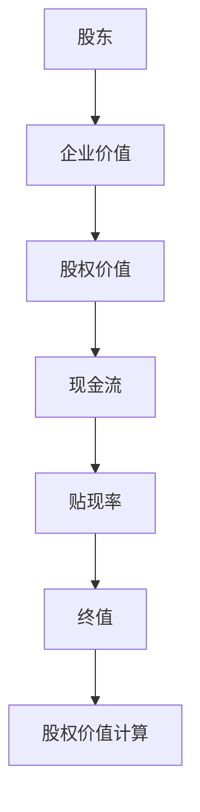
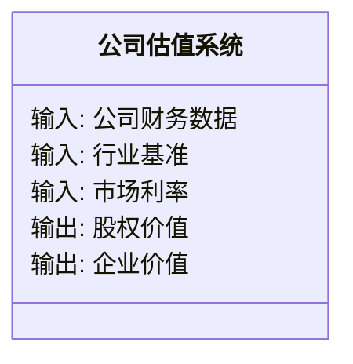
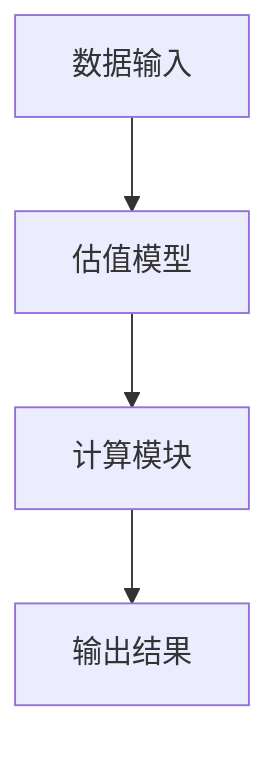
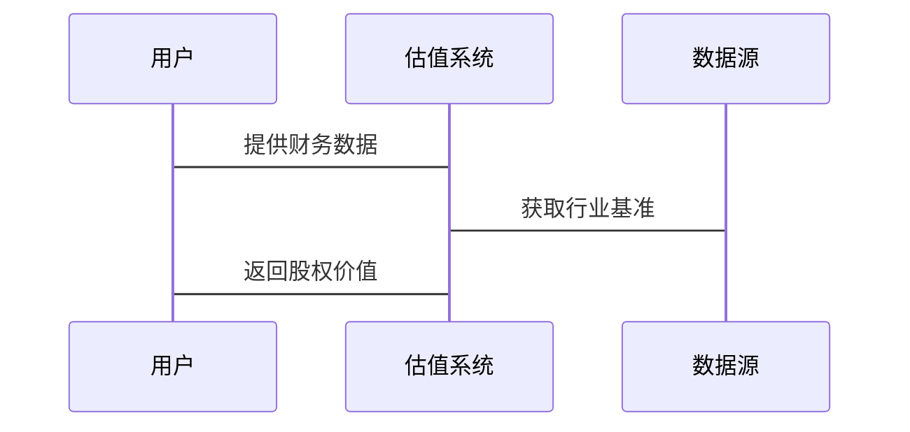

                 


# 托马斯罗的公司估值技巧

## 关键词：公司估值、DCF模型、可比公司法、WACC、股权价值

## 摘要：  
公司估值是企业管理和投资决策中的核心技能，涉及多种方法和复杂计算。本文通过详细讲解托马斯罗的公司估值技巧，从基本概念到数学模型，从系统设计到实际案例，帮助读者掌握公司估值的核心方法和实践应用。

---

## 第1章: 公司估值的基本概念与背景

### 1.1 什么是公司估值
#### 1.1.1 公司估值的定义与核心要素
公司估值是确定公司股权或整体价值的过程，核心要素包括现金流、贴现率、可比公司数据等。

#### 1.1.2 公司估值的背景与重要性
公司估值在企业融资、并购、上市等场景中至关重要，是投资决策的基础。

#### 1.1.3 公司估值的常见应用场景
- 企业融资
- 并购交易
- 股票发行定价
- 投资决策

### 1.2 公司估值的核心问题与边界
#### 1.2.1 公司估值的核心问题分析
- 如何准确预测现金流？
- 如何确定合理的贴现率？
- 如何选择合适的估值方法？

#### 1.2.2 估值的边界与外延
- 估值范围：股权价值 vs 企业价值
- 估值假设：稳定增长 vs 非线性增长

#### 1.2.3 公司估值的关键假设与限制
- 税率假设
- 永续增长率假设
- 无风险利率假设

### 1.3 公司估值的主要方法与分类
#### 1.3.1 市盈率法与市净率法
- 市盈率法：EV/EBITDA、P/E
- 市净率法：P/B

#### 1.3.2 股权自由现金流模型
- FCFF（自由现金流）
- WACC（加权平均资本成本）

#### 1.3.3 重置成本法与贴现现金流法
- 重置成本法：资产重置价值
- 贴现现金流法：DCF模型

#### 1.3.4 企业价值倍数与可比公司法
- EV/Sales
- 可比公司法：交易案例分析

---

## 第2章: 公司估值的核心概念与联系

### 2.1 公司估值的核心概念原理
#### 2.1.1 股权价值与企业价值的关系
$$ 股权价值 = 企业价值 - 债务 - 优先股 $$

#### 2.1.2 现金流贴现模型的数学基础
$$ V = \sum_{t=1}^{n} \frac{CF_t}{(1 + r)^t} + \frac{TV}{(1 + r)^n} $$

#### 2.1.3 股东权益与债务的分离定价
- 股东权益：剩余索取权
- 债务：优先偿还权

### 2.2 核心概念属性对比表
| 比较维度       | 股权价值       | 企业价值         |
|----------------|----------------|------------------|
| 计算基础       | 自由现金流     | EBITDA           |
| 适用场景       | 股权投资者     | 企业整体估值     |
| 计算公式       | DCF模型       | WACC + FCFF     |

### 2.3 实体关系图（Mermaid流程图）


---

## 第3章: 公司估值的数学模型与公式

### 3.1 现金流贴现模型（DCF）
#### 3.1.1 DCF模型的基本公式
$$ V = \sum_{t=1}^{n} \frac{CF_t}{(1 + r)^t} + \frac{TV}{(1 + r)^n} $$

#### 3.1.2 自由现金流的计算公式
$$ FCFF = EBIT(1 - 税率) + 折旧 - 资本支出 $$

### 3.2 股权价值与企业价值的关系
#### 3.2.1 企业价值公式
$$ EV = 债务 + 优先股 + 股权价值 $$

### 3.3 贴现率的计算
#### 3.3.1 WACC计算公式
$$ WACC = (D/E) \times (r_d \times (1 - 税率)) + r_e \times E $$

### 3.4 实例分析
#### 3.4.1 某公司DCF模型应用实例
- 假设公司未来5年现金流分别为100、120、150、180、200万元，贴现率为8%。
- 计算终值：$$ TV = \frac{200}{(1 + 0.08)^5} \approx 124.33万元 $$
- 现金流现值：$$ PV = \sum_{t=1}^{5} \frac{CF_t}{(1 + 0.08)^t} \approx 456.78万元 $$
- 总价值：$$ V = PV + TV \approx 581.11万元 $$

#### 3.4.2 可比公司法的实际应用
- 可比公司平均EV/EBITDA倍数为8.5倍。
- 目标公司EBITDA为500万元。
- 估值：$$ EV = 8.5 \times 500 = 4250万元 $$

---

## 第4章: 公司估值的系统分析与架构设计

### 4.1 问题场景介绍
#### 4.1.1 公司估值的常见问题
- 现金流预测难度大
- 贴现率选择复杂
- 数据获取困难

### 4.2 系统功能设计
#### 4.2.1 领域模型（Mermaid类图）


### 4.3 系统架构设计
#### 4.3.1 系统架构图（Mermaid架构图）


### 4.4 系统接口设计
#### 4.4.1 输入接口
- 财务数据接口
- 行业基准接口
- 市场利率接口

#### 4.4.2 输出接口
- 股权价值接口
- 企业价值接口

### 4.5 系统交互设计（Mermaid序列图）


---

## 第5章: 项目实战与案例分析

### 5.1 环境安装与准备
- 数据收集工具：Excel、Python（pandas）
- 估值模型：DCF、可比公司法

### 5.2 核心实现源代码
```python
import numpy as np

def calculate_dcf(cash_flows, discount_rate, terminal_value):
    present_value = 0
    for t in range(len(cash_flows)):
        present_value += cash_flows[t] / (1 + discount_rate) ** t
    total_value = present_value + terminal_value / (1 + discount_rate) ** len(cash_flows)
    return total_value

# 示例数据
cash_flows = [100, 120, 150, 180, 200]
discount_rate = 0.08
terminal_value = 200 / (1.08)**5

# 计算DCF价值
dcf_value = calculate_dcf(cash_flows, discount_rate, terminal_value)
print(f"DCF估值：{dcf_value:.2f}万元")
```

### 5.3 案例分析
- 某公司DCF模型：$$ V = 581.11万元 $$
- 可比公司法：$$ EV = 4250万元 $$

### 5.4 项目小结
- 选择合适的方法和数据是关键
- 结合多方法验证结果

---

## 结语

公司估值是一项复杂但关键的技能，需要结合数学模型、行业数据和实际经验。通过系统化的分析和实践，托马斯罗的技巧可以帮助投资者和企业做出更明智的决策。

---

## 作者：AI天才研究院/AI Genius Institute & 禅与计算机程序设计艺术 /Zen And The Art of Computer Programming

