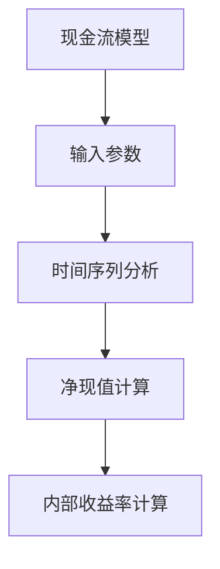

                 


# 托马斯罗的现金流投资法

## 关键词：现金流投资法、净现值（NPV）、内部收益率（IRR）、股票投资、债券投资、房地产投资

## 摘要：托马斯罗的现金流投资法是一种基于现金流预测和分析的投资策略，旨在通过准确评估投资项目或资产的未来现金流，来优化投资决策和实现最大化的投资回报。本文将详细探讨现金流投资法的理论基础、数学模型、系统架构以及在不同资产类别中的应用，通过实际案例和代码实现，帮助读者掌握这一高效的投资方法。

---

# 第1章: 现金流投资法的背景与核心概念

## 1.1 现金流投资法的背景介绍

### 1.1.1 传统投资方法的局限性

传统的投资方法，如市盈率法和市净率法，主要依赖于当前的市场价格和财务指标来评估资产的价值。然而，这些方法存在以下问题：

- **忽视未来现金流**：传统方法通常只关注当前的市场价或财务指标，而没有充分考虑未来现金流的情况。
- **缺乏时间价值考虑**：现金流的时间分布没有被充分考虑，导致评估结果可能不准确。
- **风险因素未充分量化**：传统方法往往无法量化投资的风险因素，难以应对市场的波动性。

### 1.1.2 现金流投资法的提出背景

为了克服传统方法的局限性，托马斯罗提出了现金流投资法。这种方法以现金流为核心，通过预测未来现金流并结合其时间价值，对投资项目或资产进行更准确的评估。

### 1.1.3 现金流投资法的核心目标

现金流投资法的核心目标是通过预测和评估未来现金流，帮助投资者做出更科学的投资决策，从而实现资产的最优配置和最大化的投资回报。

## 1.2 现金流投资法的核心概念

### 1.2.1 现金流的定义与分类

现金流是指企业在一定时期内收到或支付的现金和现金等价物。根据其来源和用途，现金流可以分为以下三类：

| 类别         | 定义                                                         |
|--------------|--------------------------------------------------------------|
| 经营活动现金流 | 企业日常经营活动中产生的现金流                             |
| 投资活动现金流 | 与投资相关的现金流                                         |
| 筹资活动现金流 | 与企业融资活动相关的现金流                               |

### 1.2.2 现金流的时间价值

现金流的时间价值是指相同金额的现金流在不同时间点的价值不同。这是由于资金的机会成本和时间价值的存在。例如，今天收到的100元与一年后收到的100元价值不同。

### 1.2.3 现金流投资法的基本原理

现金流投资法的基本原理是通过预测投资项目或资产的未来现金流，并将其折现为现值，从而评估其内在价值。如果内在价值高于当前市场价格，则该资产具有投资价值。

## 1.3 现金流投资法与传统投资方法的对比

### 1.3.1 传统投资方法的优缺点

- **优点**：简单易懂，易于计算。
- **缺点**：忽视未来现金流的时间价值，无法准确评估投资风险。

### 1.3.2 现金流投资法的独特优势

- **优点**：考虑了未来现金流的时间价值，能够准确评估投资风险和收益。
- **缺点**：需要较高的预测精度，对现金流预测的准确性要求较高。

### 1.3.3 两种方法的适用场景

- **传统方法**：适用于对当前市场价敏感，且未来现金流不确定的短期投资。
- **现金流投资法**：适用于长期投资，尤其是那些未来现金流可以合理预测的项目。

## 1.4 现金流投资法的数学模型与公式

### 1.4.1 净现值（NPV）公式

净现值（Net Present Value，NPV）是指将未来现金流按适当的折现率折现到现值后，与初始投资成本进行比较，以确定投资项目是否可行的指标。

$$ NPV = \sum_{t=1}^{n} \frac{CF_t}{(1+r)^t} - Initial Investment $$

其中：
- \( CF_t \) 是第 \( t \) 期的现金流。
- \( r \) 是折现率。
- \( n \) 是现金流的期限。

### 1.4.2 内部收益率（IRR）公式

内部收益率（Internal Rate of Return，IRR）是指使得净现值为零的折现率。

$$ IRR = r \text{ 使得 } NPV = 0 $$

### 1.4.3 现金流投资法的优缺点

| 优点                  | 缺点                  |
|-----------------------|-----------------------|
| 考虑时间价值           | 需要准确预测现金流     |
| 能够量化投资风险       | 对预测准确性要求较高   |

---

# 第2章: 现金流的计算与模型构建

## 2.1 现金流的计算方法

### 2.1.1 现金流入与流出的计算

现金流入是指企业收到的现金，如销售收入；现金流出是指企业支付的现金，如采购成本。

### 2.1.2 现金流的时间序列分析

时间序列分析是通过对历史现金流数据进行分析，预测未来的现金流。常用的方法包括移动平均法和指数平滑法。

### 2.1.3 现金流的净现值计算

净现值（NPV）是通过对未来现金流进行折现，计算其现值，然后减去初始投资成本。

## 2.2 现金流模型的构建

### 2.2.1 现金流模型的基本框架

现金流模型的基本框架包括以下几个步骤：

1. **确定现金流的时间序列**。
2. **选择合适的折现率**。
3. **计算净现值（NPV）和内部收益率（IRR）**。
4. **评估项目的可行性和风险**。

### 2.2.2 现金流模型的输入参数

- **现金流的时间序列**：包括各期的现金流数值。
- **折现率**：通常基于项目的风险和市场利率确定。
- **项目期限**：项目的预计持续时间。

### 2.2.3 现金流模型的输出结果

- **净现值（NPV）**：项目的净收益现值。
- **内部收益率（IRR）**：项目的内部收益率。
- **回收期**：项目回收初始投资的时间。

### 2.2.4 现金流模型的优化与调整

模型优化可以通过调整折现率和现金流预测模型来实现。例如，使用多元回归模型预测现金流，可以提高预测的准确性。

### 2.2.5 现金流模型的系统架构



## 2.3 现金流模型的数学公式与实现

### 2.3.1 净现值的计算公式

$$ NPV = \sum_{t=1}^{n} \frac{CF_t}{(1+r)^t} - Initial Investment $$

### 2.3.2 内部收益率的计算公式

$$ IRR = r \text{ 使得 } NPV = 0 $$

### 2.3.3 现金流预测的实现

以下是使用Python进行现金流预测的代码示例：

```python
import numpy as np
import pandas as pd
from statsmodels.tsa.holtwinters import ExponentialSmoothing

# 假设我们有一个现金流的时间序列数据
data = [100, 120, 130, 150, 160, 180, 200]

# 使用指数平滑法预测下一个时期的现金流
model = ExponentialSmoothing(data, trend='add', seasonal=None)
model_fit = model.fit(smooth_factor=0.8)

# 预测下一个时期的现金流
forecast = model_fit.forecast(1)
print("预测的现金流为：", forecast[0])
```

---

# 第3章: 现金流投资法在不同资产类别中的应用

## 3.1 现金流投资法在股票投资中的应用

### 3.1.1 股票现金流模型

股票现金流模型通过预测未来股息现金流，评估股票的内在价值。

### 3.1.2 股票现金流的预测与分析

使用现金流模型预测股票的未来股息现金流，并计算其净现值，以评估股票的内在价值。

### 3.1.3 股票现金流投资法的实际案例

假设某股票的当前股价为100元，预测未来5年的股息现金流分别为10元、12元、14元、16元和18元，折现率为8%。

计算净现值：

$$ NPV = \frac{10}{1.08} + \frac{12}{1.08^2} + \frac{14}{1.08^3} + \frac{16}{1.08^4} + \frac{18}{1.08^5} - 100 $$

计算结果为正值，说明该股票具有投资价值。

## 3.2 现金流投资法在债券投资中的应用

### 3.2.1 债券现金流的计算

债券现金流主要包括利息支付和本金偿还。现金流的计算需要考虑债券的面值、票面利率和期限。

### 3.2.2 债券现金流模型的构建

构建债券现金流模型，预测债券的未来现金流，并计算其净现值，以评估债券的内在价值。

### 3.2.3 债券现金流投资法的实际案例

假设某债券的面值为1000元，票面利率为5%，期限为5年，折现率为6%。

计算净现值：

$$ NPV = \frac{50}{1.06} + \frac{50}{1.06^2} + \frac{50}{1.06^3} + \frac{50}{1.06^4} + \frac{50 + 1000}{1.06^5} - 1000 $$

计算结果为正值，说明该债券具有投资价值。

## 3.3 现金流投资法在房地产投资中的应用

### 3.3.1 房地产现金流模型

房地产现金流模型通过预测未来租金收入和支出，评估房地产的内在价值。

### 3.3.2 房地产现金流的预测与分析

使用现金流模型预测房地产的未来租金现金流，并计算其净现值，以评估房地产的内在价值。

### 3.3.3 房地产现金流投资法的实际案例

假设某房地产的当前市场价格为1000万元，预测未来5年的净现金流分别为50万元、60万元、70万元、80万元和90万元，折现率为7%。

计算净现值：

$$ NPV = \frac{50}{1.07} + \frac{60}{1.07^2} + \frac{70}{1.07^3} + \frac{80}{1.07^4} + \frac{90}{1.07^5} - 1000 $$

计算结果为正值，说明该房地产具有投资价值。

---

# 第4章: 现金流投资法的风险管理与优化

## 4.1 现金流投资法中的风险管理

### 4.1.1 现金流波动性风险

现金流的波动性可能导致投资价值的评估误差。

### 4.1.2 风险对冲策略

通过多元化投资和风险对冲，降低现金流波动性带来的风险。

## 4.2 现金流投资法的优化与改进

### 4.2.1 现金流预测模型的优化

使用更先进的预测模型，如机器学习算法，提高现金流预测的准确性。

### 4.2.2 折现率的调整

根据市场变化和项目风险，动态调整折现率，以更准确地评估投资价值。

## 4.3 现金流投资法的系统优化

### 4.3.1 系统架构的优化

通过引入大数据和人工智能技术，优化现金流预测和投资决策系统。

### 4.3.2 系统交互的优化

设计更人性化的系统界面，提高用户体验和投资效率。

---

# 第5章: 现金流投资法的项目实战

## 5.1 现金流预测与投资组合管理

### 5.1.1 项目背景

通过现金流预测和投资组合管理，优化投资组合的风险和收益。

### 5.1.2 项目实施

使用现金流模型预测多个项目的未来现金流，并计算投资组合的净现值和内部收益率。

### 5.1.3 项目成果

实现投资组合的最优配置，提高投资回报率。

## 5.2 现金流投资法的实际案例分析

### 5.2.1 案例背景

某企业计划投资一个新项目，需评估其未来现金流。

### 5.2.2 案例分析

使用现金流投资法评估项目的净现值和内部收益率，判断其投资价值。

### 5.2.3 案例结果

项目具有正的净现值和较高的内部收益率，值得投资。

## 5.3 现金流投资法的代码实现

### 5.3.1 环境安装

安装必要的Python库，如numpy、pandas、statsmodels。

### 5.3.2 核心代码实现

```python
import numpy as np
import pandas as pd
from statsmodels.tsa.holtwinters import ExponentialSmoothing

# 假设我们有一个现金流的时间序列数据
data = [100, 120, 130, 150, 160, 180, 200]

# 使用指数平滑法预测下一个时期的现金流
model = ExponentialSmoothing(data, trend='add', seasonal=None)
model_fit = model.fit(smooth_factor=0.8)

# 预测下一个时期的现金流
forecast = model_fit.forecast(1)
print("预测的现金流为：", forecast[0])
```

### 5.3.3 代码解读与分析

上述代码使用指数平滑法预测现金流，预测结果为下一个时期的现金流。

---

# 第6章: 现金流投资法的最佳实践与总结

## 6.1 现金流投资法的最佳实践

### 6.1.1 现金流预测的准确性

现金流预测的准确性是现金流投资法的关键，应尽可能使用先进的预测模型。

### 6.1.2 折现率的合理选择

折现率应根据项目的特

